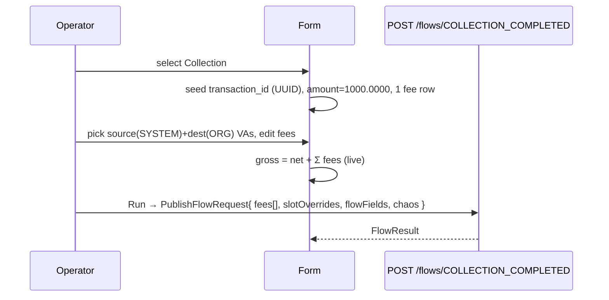

# Task 005 - Frontend: Collection single-flow form with dynamic fees

## Functional Requirements
- Add **Collection** to the Single Flow Run radio and render its catalog-driven form,
  including a **dynamic fee list** (`FieldKind.FEE_LIST`): add/remove fee rows, each row =
  amount + a **SYSTEM** fee-revenue VA picker (with autogen `fee_code`, fixed `fee_type`).
- Show the computed **gross = net + Σ fee amounts** (read-only) next to the net `amount`.
- Render the new `COUNTRY` and `ULID`-autogen fields generically (Collection itself uses
  ULID `merchant_ref_id`; `COUNTRY` lands in the disbursement forms of task 006 but the
  renderer is shared here).
- Assemble and submit the existing `PublishFlowRequest` (now with typed `fees[]`) to
  `POST /flows/COLLECTION_COMPLETED`; all existing chaos strategies (incl. N-Times) apply
  unchanged. See
  [ADR-019](../../decisions/019-dynamic-fee-lines-and-catalog-descriptor-extensions.md).

## Acceptance Criteria
- [ ] Collection appears in the radio (label "Collection"); selecting it renders required
      fields shown + advanced collapsed (the established Phase 011 pattern).
- [ ] The fee list starts with one row, supports add/remove, and each row validates
      amount + a SYSTEM VA selection; `fee_code` is autogenerated per row and `fee_type`
      is fixed (`PLATFORM_FEE`), both editable in advanced if surfaced.
- [ ] A read-only **Gross** shows `net + Σ fee.amount`, recomputed live; `net` (the
      `amount` field, labeled "Net Amount") defaults `1000.0000`.
- [ ] `source_va_id` picker lists SYSTEM VAs (float), `destination_va_id` lists
      ORGANIZATION VAs; `currency` infers from the source/selected VA.
- [ ] The submitted `PublishFlowRequest` carries `fees: [{feeType, amount, feeCode,
      destinationVaId}]`, `slotOverrides.source/.destination`, and the assembled
      flowFields; `provider_id`/`provider_reference_id`/`merchant_ref_id` are present
      (autogen/ULID) so a default run succeeds.
- [ ] Chaos panel (incl. N-Times) renders and submits exactly as for the Phase 011 flows;
      the `FlowResult`/N-Times handling is unchanged.

## Technical Design
Extend the catalog-driven renderer (`transaction-type-form.tsx`) with two new kinds and a
typed-`fees` assembly path; everything else reuses Phase 011/013 machinery.

### Field → control additions
| `kind` | control | behavior |
|---|---|---|
| `FEE_LIST` | repeatable fee-row sub-form | rows → `request.fees[]`; per row: AMOUNT + SYSTEM VA picker + autogen `fee_code`; live gross |
| `COUNTRY` | Select sourced from supported countries | options via `listSupportedCountries`; seed `defaultValue` (`GH`) |
| `AutogenRule.ULID` | text + regenerate | seed via a browser ULID util; regenerate reseeds |

### Submit assembly delta
- `FEE_LIST` → the typed top-level `fees` array on `PublishFlowRequest` (not `flowFields`).
- Gross is **derived for display**; the builder recomputes server-side, so the form may
  send `amount` (= net) and `fees`, and need not send gross (document the canonical path).
- VA pickers and inference unchanged from Phase 011.

## Implementation Notes
- `features/chaos/transaction-type-form.tsx`: add `FEE_LIST`/`COUNTRY`/`ULID` rendering;
  route `FEE_LIST` to a new `fees` bucket in `AssembledFlow`. New
  `features/chaos/fee-list-field.tsx` (rows + add/remove + gross) and
  `features/chaos/country-select.tsx`.
- `lib/api.ts`: extend `PublishFlowRequest` with `fees?: FeeInput[]`; add `FeeInput` type
  and `FieldKind` `FEE_LIST`/`COUNTRY`, `AutogenRule` `ULID`; add `listSupportedCountries`
  if not already present (Phase 010). Add a small ULID generator util (or reuse an
  existing one) for client-side seeds.
- Keep numeric formatting consistent (`1000.0000`, decimal strings, no precision loss).
- Reuse shadcn primitives (Button, Input, Select, Card, Badge) and the existing
  collapse/advanced pattern.

## Non-Functional Requirements
- Fee math is synchronous/local; no precision loss (decimal strings through submit).
- VA pickers handle large/empty lists (search + manual fallback).

## Dependencies
- **Tasks 001 + 002** (corrected collection contract + descriptors incl. `FEE_LIST`).
- Existing `listVirtualAccounts`/`runFlow`/chaos panel; Phase 010 supported-countries API.

## Risks & Mitigations
- **Fees routed to `flowFields`** (would be dropped) → route to the typed top-level
  `fees`; an MSW test asserts the assembled payload shape.
- **Gross drift vs server** → server is canonical; the form sends net + fees and shows
  gross for guidance; a test asserts gross display = net + Σ.
- **Empty SYSTEM fee-VA list** → row falls back to manual entry; never blocks a run.

## Testing Strategy
MSW + Testing Library: Collection renders; fee rows add/remove; gross recomputes; VA
pickers filter by kind; currency infers; submit payload carries typed `fees[]` +
slotOverrides; chaos + N-Times paths unchanged. Folds into Phase 006 frontend suite.

## Deployment Strategy
Frontend-only, no flag. Ships after tasks 001+002. Auth + target-cluster label unchanged.
