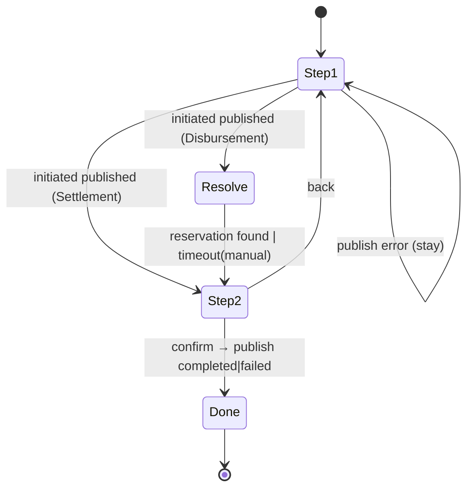

# Task 006 - Frontend: Settlement & Disbursement interactive lifecycle wizard

## Functional Requirements
- Add **Settlement** and **Disbursement** to the radio (labels from
  `FlowLifecycle.label`); render an **Outcome** selector — **Succeed**, **Fail**,
  **Random**.
- For **Succeed/Fail**, drive an interactive **two-step wizard**:
  - **Step 1:** the `initiated` form (+ chaos panel) → publish via
    `POST /flows/{initiatedType}`; hold submitted values + the minted
    `transaction_id`/`settlement_request_id`.
  - **Step 2:** render **both** forms — initiated values **read-only** above the
    **editable, prepopulated** completed/failed form (+ its own chaos panel) — operator
    **confirms** → publish via `POST /flows/{completedType|failedType}`.
- Carry initiated values into step 2 per the `FlowLifecycle.carryOver` map; keep them
  **overridable**.
- For **Disbursement**, between steps **poll** the reservation read-proxy for
  `reservation_id` (timeout → manual-entry field). Settlement skips this.
- **Random** is delegated to task 007 (unattended). N-Times does **not** apply to
  Succeed/Fail. See
  [ADR-017](../../decisions/017-lifecycle-transaction-flows-and-outcome-orchestration.md)
  and [ADR-018](../../decisions/018-reservation-id-via-ledger-read-proxy-poll.md).

## Acceptance Criteria
- [ ] Selecting Settlement/Disbursement shows the Outcome selector (default Succeed) and
      the step-1 `initiated` form (catalog-driven, required shown/advanced collapsed).
- [ ] Step 1 Run publishes the initiated event and advances to step 2 only on success;
      a publish error keeps the operator on step 1 with the error shown.
- [ ] Step 2 shows the initiated summary **read-only** and the prepopulated
      completed/failed form (chosen by the Outcome) with carry-over applied per the map;
      a back control returns to step 1.
- [ ] Carry-over fields are prefilled and editable; a manual edit is not clobbered by
      re-derivation.
- [ ] Disbursement step 2: `reservation_id` is fetched by polling
      `GET /ledger/accounts/{orgVaId}/reservations?transactionRef={transaction_id}`;
      while polling, the field shows a loading state; on success it prefills; on timeout it
      becomes an editable manual field with a hint.
- [ ] Each step submits its own chaos options (per-event chaos); the destructive-strategy
      confirmation still applies per publish.
- [ ] Settlement completed sends the reconciled `settlement_va_id` destination (task 001).
- [ ] N-Times is hidden/disabled for Succeed/Fail outcomes.

## Technical Design
A new wizard host wraps the existing descriptor renderer; the renderer is reused verbatim
for each phase's form. State holds `step`, `outcome`, the published initiated values, and
the reservation poll status.

### Reservation poll (Disbursement, step 1→2)
React-query polling (bounded `refetchInterval`, total timeout) of the proxy; `accountId` =
the org VA picked on step 1, `transactionRef` = the minted `transaction_id`. Stop on first
hit or timeout. Expose `{ status: 'polling'|'found'|'timeout', reservationId }` to the
step-2 form.

### Carry-over
Apply `FlowLifecycle.carryOver(fromField → toField)` from the held step-1 values into the
step-2 form's initial values; mark them as inferred (so manual edits win), reusing the
Phase 011 `edited` set mechanism.

## Implementation Notes
- `features/chaos/single-flow-page.tsx`: when the selected catalog entry has a
  `lifecycle`, render the new `lifecycle-wizard.tsx` instead of the single form.
- New `features/chaos/lifecycle-wizard.tsx` (step machine, outcome selector, both-forms
  step 2), `features/chaos/outcome-selector.tsx`, `features/chaos/reservation-field.tsx`
  (poll + loading + manual fallback). Reuse `transaction-type-form.tsx` for each phase
  form (read-only mode for the step-1 summary).
- `lib/api.ts`: add `getAccountReservations(token, accountId, transactionRef)`; add the
  `FlowLifecycle`/`CarryOver` types on `FlowCatalogEntry`.
- Per-event chaos: each form instance owns a `ChaosFormState` + panel; submit assembles a
  `PublishFlowRequest` per phase (unchanged contract).
- Hide N-Times in the chaos panel when the host is an interactive lifecycle outcome.

## Non-Functional Requirements
- Poll is bounded (interval + timeout) and cancelled on unmount/step change; no busy loop.
- Inference/carry-over is synchronous/local; instant on step transition.
- Numeric precision preserved across carry-over (decimal strings).

## Dependencies
- **Tasks 001 + 002** (lifecycle flow types/descriptors/`FlowLifecycle`) and **Task 003**
  (reservation read-proxy). Existing chaos panel + descriptor renderer (Phase 011).

## Risks & Mitigations
- **Reservation never arrives** → timeout → manual entry (ledger ignores the value
  anyway); covered by an MSW timeout test.
- **Carry-over clobbering edits** → `edited` set guards; test edits then re-derives.
- **Operator abandons step 2** → acceptable (orphaned ledger reservation); the wizard does
  not auto-retract.
- **Wrong settlement destination field** → relies on task 001's `settlement_va_id` fix; an
  MSW test asserts the submitted key.

## Testing Strategy
MSW + Testing Library: outcome selector; step-1 publish advances only on success; step-2
renders both forms with carry-over; disbursement reservation poll found/timeout/manual;
per-event chaos panels; settlement completed sends `settlement_va_id`; N-Times hidden for
Succeed/Fail. Folds into Phase 006 frontend suite.

## Deployment Strategy
Frontend-only, no flag. Ships after tasks 001+002+003. Auth + target-cluster label
unchanged.
