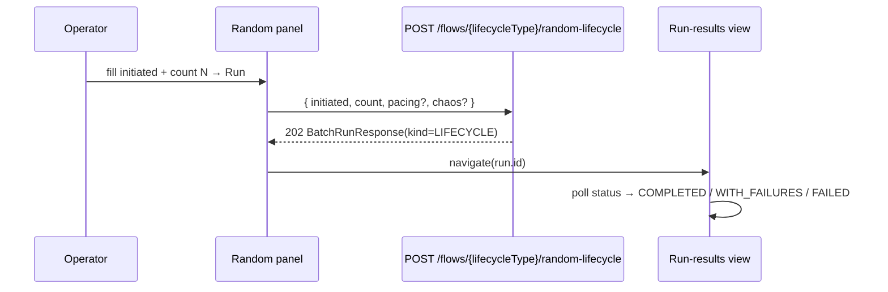

# Task 007 - Frontend: RANDOM bulk lifecycle & run handoff

## Functional Requirements
- For the **Random** outcome on Settlement/Disbursement, render an unattended path: an
  optional **count N** (N-Times) and submit to
  `POST /flows/{lifecycleType}/random-lifecycle`, then hand off to the existing
  **run-results** view (the same view CSV batches and async N-Times use).
- Make clear in copy that Random is **unattended** (system decides Succeed/Fail per
  lifecycle, both events auto-published) and that **N-Times applies only to Random**. See
  [ADR-017](../../decisions/017-lifecycle-transaction-flows-and-outcome-orchestration.md).

## Acceptance Criteria
- [ ] Selecting **Random** replaces the two-step wizard with a single panel: the
      `initiated` form (defaults/inference as usual) + a **count** input (1..cap) + a
      high-volume confirmation.
- [ ] Submitting calls `POST /flows/{lifecycleType}/random-lifecycle` with the initiated
      intent + `count` (+ optional pacing/chaos) and receives a `202` `BatchRunResponse`.
- [ ] On success the UI navigates to the run-results/batch detail page for the returned
      run id (reusing the Phase 013 handoff), where progress polls to a terminal status.
- [ ] The run appears in the batches/runs list with `kind = LIFECYCLE`, its count, and
      pacing/mode columns populated (reusing the existing run list).
- [ ] `count` respects the backend cap (reject/disable beyond `ChaosLimits`); a
      confirmation dialog appears for large counts.
- [ ] Random is the **only** outcome offering count/N-Times; Succeed/Fail (task 006) do
      not.

## Technical Design
Reuse the N-Times async handoff pattern: submit → `202` run handle → navigate to the run
detail view; the run polls via the existing run endpoints.

## Implementation Notes
- `features/chaos/lifecycle-wizard.tsx` (or `single-flow-page.tsx`): branch on
  `outcome === 'RANDOM'` to render the count panel instead of the two-step wizard; reuse
  the existing high-volume confirmation + run-navigation helpers from the N-Times path.
- `lib/api.ts`: add `runRandomLifecycle(token, lifecycleType, body)` →
  `BatchRunResponse` (202); reuse `BatchRunResponse`/`RunKind` types (add `LIFECYCLE`).
- The run list/detail pages already render `kind`/`pacing`/`mode`; ensure `LIFECYCLE`
  displays sensibly (label, count). No new run view.
- Count cap mirrors `CHAOS_LIMITS` (frontend) + server validation.

## Non-Functional Requirements
- No long-lived request on the client — fire-and-poll via the run view (async).
- Confirmation gating for large counts (reuse N-Times copy/threshold).

## Dependencies
- **Task 004** (the `random-lifecycle` endpoint + `RunKind.LIFECYCLE` + run tracking) and
  **Task 002** (lifecycle catalog). Reuses the Phase 013 run-results UI + handoff.

## Risks & Mitigations
- **Confusing N-Times-vs-outcome** → copy distinguishes "Random = unattended, N distinct
  lifecycles" from per-event chaos; N-Times input only under Random.
- **Run kind not rendered** → extend the run list/detail mapping for `LIFECYCLE`; a test
  asserts display.
- **Oversize count** → disabled/clamped client-side + server `400`.

## Testing Strategy
MSW + Testing Library: Random panel shows count + confirmation; submit posts to
`random-lifecycle` and navigates to the run view on `202`; the run list shows the
`LIFECYCLE` run; count cap enforced. Folds into Phase 006 frontend suite.

## Deployment Strategy
Frontend-only, no flag. Ships after tasks 002+004. Auth + target-cluster label unchanged.
