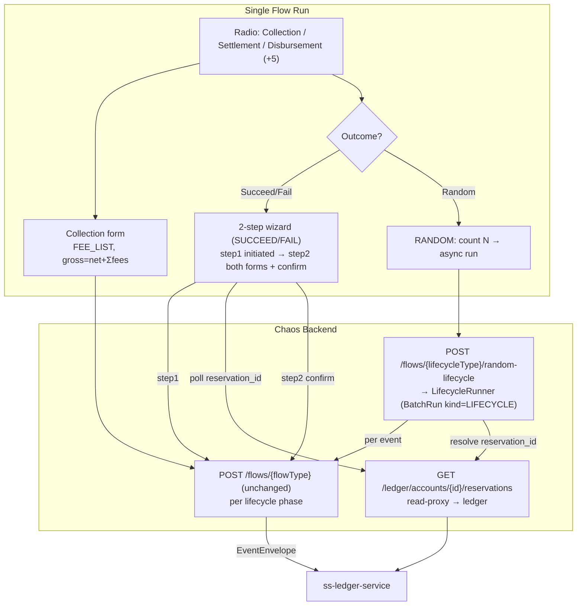

# Phase 14 - Collection, Settlement & Disbursement Flows

## Summary
Adds the three transaction types Phase 011 deferred — **Collection**, **Settlement**,
and **Disbursement** — to the Single Flow Run console. Collection is a single
`collection.completed` event with a **dynamic fee form**. Settlement and Disbursement
are **multi-step lifecycles** (`initiated` → `completed` | `failed`) driven by an
operator-chosen **outcome**: **SUCCEED**/**FAIL** run as an interactive **two-step
wizard** (confirm the prepopulated second form before publishing), while **RANDOM** runs
**unattended** on the backend and is **N-Times-capable** (fire N distinct random
lifecycles, run-tracked). The phase also **corrects the Collection/Disbursement inbound
models to the authoritative ledger contract**, adds the missing
`DISBURSEMENT_INITIATED`/`DISBURSEMENT_FAILED` flows, and sources the
disbursement `reservation_id` from a thin ledger read-proxy. Backed by
[ADR-017](../../decisions/017-lifecycle-transaction-flows-and-outcome-orchestration.md),
[ADR-018](../../decisions/018-reservation-id-via-ledger-read-proxy-poll.md), and
[ADR-019](../../decisions/019-dynamic-fee-lines-and-catalog-descriptor-extensions.md).

## Motivation
Idea `007_collection_settlement_disbursement_flow.md` completes the Single Flow Run
surface: the five "simple" flows shipped in Phase 011, and the three richer ones were
deferred behind a catalog flag precisely so they could re-enter without UI rework. Two
of them are not single events — they are lifecycles the ledger consumes as a sequence,
with money reserved on `initiated` and captured/released on `completed`/`failed`. Until
now the chaos machine had **wrong, hand-guessed** Collection/Disbursement models (and no
disbursement initiated/failed at all), so it could not actually drive these flows
correctly. With the authoritative payload samples and verified ledger source in hand,
this phase makes the harness emit the real contracts and gives the operator a faithful
way to drive — and deliberately break — the full lifecycle.

## User-Facing Changes
- **Single Flow Run radio** gains **Collection**, **Settlement**, **Disbursement**
  (now eight transaction types). Selection is still driven by the catalog's
  `runnerVisible` flag.
- **Collection:** one form with required `transaction_id` (autogen), source VA
  (SYSTEM float), destination VA (ORGANIZATION), `amount` (net, default `1000.0000`),
  and a **dynamic fee list** (add/remove rows; each row = amount + SYSTEM fee-revenue
  VA, with autogen `fee_code` and fixed `fee_type`). Advanced/inferred: provider ids,
  currency, `commission_split_id`, `completed_at`, `merchant_ref_id`. The UI shows the
  computed **gross = net + Σ fees**. All existing chaos strategies (incl. N-Times) apply.
- **Settlement / Disbursement:** an **Outcome** selector — **Succeed**, **Fail**,
  **Random**.
  - **Succeed/Fail:** a two-step wizard. Step 1 = the `initiated` form (+ chaos) → Run.
    Step 2 renders **both** forms — the initiated values **read-only** above the
    editable, **prepopulated** completed/failed form (+ its own chaos) — operator
    **confirms** → publish. For Disbursement, step 2's `reservation_id` is fetched by
    **polling** the ledger (timeout → manual entry).
  - **Random:** unattended. Optionally set **count N** (N-Times) → one async
    **run** that fires N distinct random lifecycles; hands off to the existing
    run-results view.
- **API (additive):**
  - `POST /api/v0/flows/{flowType}` unchanged — used per lifecycle phase.
  - `GET /api/v0/flows/catalog` entries gain `lifecycle` metadata + new field-descriptor
    kinds/rules.
  - `POST /api/v0/flows/{lifecycleType}/random-lifecycle` → `202` run handle (RANDOM).
  - `GET /api/v0/ledger/accounts/{accountId}/reservations?transactionRef=…` → reservation
    read-proxy.
  - `PublishFlowRequest` gains an optional `fees[]`.

## Architecture Impact
Touches `com.softspark.chaos.flow` (new flow types + builders + the corrected models +
catalog `FlowLifecycle` + descriptor kinds + the RANDOM lifecycle runner),
`com.softspark.chaos.ledgerproxy` (reservations read-proxy, reusing the Phase 012
pattern), and reuses `com.softspark.chaos.batch` (`BatchRunner`/`BatchRun`) behind a new
`RunKind.LIFECYCLE`. One additive Flyway migration (the `LIFECYCLE` run kind / any
lifecycle run columns). On the frontend, the `features/chaos` module gains the lifecycle
wizard, outcome selector, fee-list + country fields, and the reservation poller. **No new
inbound Kafka surface** (reservation id comes via HTTP read-proxy, not a consumer —
[ADR-018](../../decisions/018-reservation-id-via-ledger-read-proxy-poll.md)). See
[ADR-017](../../decisions/017-lifecycle-transaction-flows-and-outcome-orchestration.md)
and [ADR-019](../../decisions/019-dynamic-fee-lines-and-catalog-descriptor-extensions.md).



Lifecycle identity & carry-over (what is held vs minted):

```mermaid
flowchart LR
  init["initiated<br/>mint transaction_id (UUID)<br/>pick org VA, principal, subtype"] -->|carry transaction_id,<br/>principal, VA, subtype| sec["completed | failed"]
  init -.->|ledger creates reservation<br/>keyed by transaction_id| res[("ledger reservation")]
  rp["read-proxy poll<br/>?transactionRef=transaction_id"] --> res
  sec -->|reservation_id (real via poll,<br/>else manual/placeholder)| out["published 2nd event"]
```

## Edge Cases
- **Inbound-contract correction.** The old chaos Collection/Disbursement payloads were
  wrong and are simply replaced; the derived legacy
  `requiredFields`/`optionalFields`/`csvColumns` now reflect the corrected fields (CSV
  templates follow automatically). No migration concern.
- **Settlement destination field name** is `settlement_va_id` (**confirmed**); the chaos
  builder + sample doc currently use `destination_va_id` and are corrected
  ([ADR-019](../../decisions/019-dynamic-fee-lines-and-catalog-descriptor-extensions.md)).
- **Unconfigured slot drops the picked VA** (the Phase 011 trap) — task 001 seeds the
  missing org slots: `COLLECTION_COMPLETED.destination`, `DISBURSEMENT_COMPLETED.source`,
  `DISBURSEMENT_COMPLETED.destination`, `SETTLEMENT_COMPLETED.source`.
- **Single-VA forms route to `flowFields`, not slots.** Settlement/disbursement
  `initiated`/`failed` read `virtual_account_id` from `flowFields`; their `VA_REF`
  descriptors carry `slotName = null` so the assembled value lands in `flowFields[name]`.
- **`reservation_id` not found before timeout** — interactive: show manual entry;
  unattended: autogen placeholder (ledger ignores it; record the fallback).
- **Abandoned interactive lifecycle** (initiated published, step 2 dropped) leaves an
  orphaned ledger reservation — acceptable/observable for a chaos harness.
- **Fee sum vs initiated fee total (disbursement).** The idea wants step-2 fees to
  validate against the initiated `fee_amount` total, **overridable** to test failures —
  a soft warning, not a hard block.
- **gross/net invariant (collection).** `gross_amount = net_amount + Σ fee.amount`;
  both are emitted. An operator can break it (unbalanced chaos already exists).
- **RANDOM count caps** reuse `ChaosLimits` (count ceilings, sync/async guards);
  `count = 1` is a run of one.
- **Cross-border subtype** makes `destination_country`/`corridor`/`applied_fx_rate`
  required on completed; defaults target `DOMESTIC`.
- **N-Times does not apply to interactive outcomes** — only RANDOM.

## Testing Strategy
- **Backend unit:** corrected builders emit the exact ledger field set (collection,
  disbursement initiated/completed/failed, settlement reconciled); `fees[]` →
  `TransactionFeeLine` incl. `fee_code`; collection `gross = net + Σfees`; catalog
  descriptors per flow (kinds/required/advanced/autogen/inference/accountKind/slotName,
  `FEE_LIST`/`COUNTRY`/`ULID`/derived corridor); `FlowLifecycle` grouping + carry-over;
  exactly Collection + the two lifecycle-initiated entries become `runnerVisible`;
  derived legacy lists still match.
- **Backend bootstrap/slot:** a slot row exists for every `VA_REF.slotName` of each new
  runner flow (catches the missing org slots).
- **Backend integration (Testcontainers Kafka):** publish each phase with required-only
  inputs + `slotOverrides`/`flowFields` and assert envelope correctness; a full
  interactive lifecycle (initiated→completed and initiated→failed) shares one
  `transaction_id`; the RANDOM runner produces N distinct lifecycles, run-tracked, with
  per-event chaos; reservation read-proxy returns the ledger reservation filtered by
  `transactionRef` (WireMock/stub ledger), incl. the timeout path.
- **Frontend (MSW):** Collection fee-list add/remove + computed gross; the wizard's
  two steps with both forms on step 2 + carry-over + confirm; reservation poll
  found/timeout/manual; RANDOM count → async run handoff; per-event chaos panels;
  assembled payloads match the contracts.
- Folds into the Phase 006 suites; Phase 011's five flows and the CSV/N-Times paths are
  regression-checked as unaffected.

## Deployment Strategy
One additive Flyway migration (the `LIFECYCLE` run kind / columns, nullable/defaulted),
additive endpoints, and additive catalog fields — no feature flag. The
Collection/Disbursement payloads are corrected in place (the old shapes were wrong); CSV
columns update automatically and no migration is needed. Auth and the target-cluster
safety label are inherited from the existing runner. The reservation read-proxy depends on the ledger exposing
`GET /api/v0/accounts/{accountId}/reservations` — confirm the path/params before
release. Ships as a normal backend + frontend deploy; RANDOM caps default conservatively
via `chaos.limits.*`.

## Tasks
- [001 - Inbound contract alignment: lifecycle event models, builders & fee lines (backend)](./001-inbound-contract-alignment-and-lifecycle-models.md) — correct collection/disbursement models, add disbursement initiated/failed + flow types, reconcile settlement, shared `TransactionFeeLine` + `PublishFlowRequest.fees`, slot seeding.
- [002 - Catalog descriptors, lifecycle metadata & new field kinds (backend)](./002-catalog-descriptors-and-lifecycle-metadata.md) — `runnerVisible` + rich descriptors for the new flows; `FEE_LIST`/`COUNTRY`/`ULID`/derived corridor/`authorised_principal`/`VA_REF`→`flowFields`; `FlowLifecycle` grouping + carry-over.
- [003 - Reservation read-proxy & lookup service (backend)](./003-reservation-read-proxy-and-lookup.md) — `GET /ledger/accounts/{id}/reservations` proxy + `ReservationLookup` (poll-until-present-or-timeout) shared by both paths.
- [004 - RANDOM unattended lifecycle runner with N-Times (backend)](./004-random-lifecycle-runner.md) — server-side lifecycle execution, random outcome, per-event chaos, reuse `BatchRun`/`RunKind.LIFECYCLE`; dedicated endpoint.
- [005 - Frontend: Collection single-flow form with dynamic fees](./005-frontend-collection-form.md) — fee-list field, computed gross, country/fee VA pickers, existing chaos incl. N-Times.
- [006 - Frontend: Settlement & Disbursement interactive lifecycle wizard](./006-frontend-lifecycle-wizard.md) — outcome selector, two-step wizard (both forms on step 2), carry-over, reservation poll w/ timeout→manual, per-event chaos.
- [007 - Frontend: RANDOM bulk lifecycle & run handoff](./007-frontend-random-lifecycle-and-run-handoff.md) — RANDOM count → `random-lifecycle` endpoint → run-results integration; confirmation copy.

## Parallel Tasks
- **001 is the unblocker** — the corrected models/builders + flow types + `fees[]` + slot
  seeding underpin everything. Do the **model/builder correction + slot seeding first**
  (correctness-critical), descriptor work (002) alongside.
- **002 depends on 001** (it describes the corrected fields) and unblocks all frontend
  tasks (the descriptor contract they render).
- **003 is independent** of 001/002 (a self-contained read-proxy) and can proceed in
  parallel; it unblocks the disbursement reservation step in 006 and the runner in 004.
- **004 depends on 001 (+ 003 for disbursement reservation)** and unblocks 007.
- **005 depends on 001+002.** **006 depends on 001+002+003.** **007 depends on 002+004.**
- Dependency chain: `001 ─→ 002 ─→ (005 ‖ 006 ‖ 007)`, with `003 ─→ (006, 004)` and
  `004 ─→ 007`. 003 can start immediately in parallel with 001/002.
