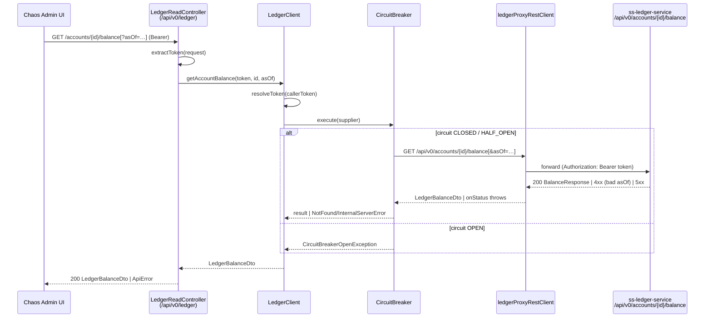

# Task 001 - As-of balance passthrough + balance DTO contract alignment (backend)

## Functional Requirements

- Extend `GET /api/v0/ledger/accounts/{id}/balance` on `LedgerReadController` to accept an
  **optional** `asOf` query param (ISO-8601 date-time, bound as `java.time.LocalDateTime`) and
  forward it to the ledger's `GET /api/v0/accounts/{accountId}/balance?asOf=…` when present; omit it
  when absent (current-balance behavior unchanged) — [ADR-020](../../decisions/020-as-of-balance-via-ledger-read-proxy.md).
- **Align `LedgerBalanceDto` to the ledger's actual `BalanceResponse` contract** (verified camelCase
  in `ss-ledger-service`): remove the incorrect `@JsonNaming(SnakeCaseStrategy)`, rename `updatedAt`
  → `balanceAsOf`, and add `lastEntrySequence`. This also fixes the currently-null `accountId`.
- Forward `asOf` **verbatim** (no chaos-side validation of the not-future rule or zone conversion) —
  the ledger is authoritative. A ledger `400` (e.g. future-dated `asOf`) surfaces through the
  existing `4xx → NotFoundException` proxy path; a ledger/circuit failure surfaces as the standard
  `InternalServerErrorException`.
- Require a verified AUTH SERVICE token and forward the bearer token, identical to every other
  `/api/v0/ledger/**` read.

## Acceptance Criteria

- [ ] `GET /api/v0/ledger/accounts/{id}/balance` (no `asOf`) returns `200` with a body containing
      `accountId`, `available`, `total`, `pending`, `reserved`, `currency`, `balanceAsOf`,
      `lastEntrySequence` — and `accountId` + `balanceAsOf` are now **non-null** (regression fix).
- [ ] `GET /api/v0/ledger/accounts/{id}/balance?asOf=2026-06-01T12:00:00` forwards
      `asOf=2026-06-01T12:00:00` as a query param to the ledger; when `asOf` is absent the param is
      omitted from the downstream request.
- [ ] `asOf` binds as `LocalDateTime` (zoneless) — **not** `Instant`; no UTC conversion is applied
      to the value sent downstream.
- [ ] A ledger `400` for an invalid/future `asOf` is surfaced as the standard chaos `ApiError`
      (NotFoundException path), **not** a `500`.
- [ ] Ledger down / circuit open → the same "ledger temporarily unavailable"
      `InternalServerErrorException` as other proxied reads.
- [ ] `LedgerBalanceDto` no longer carries `@JsonNaming(SnakeCaseStrategy)`; a captured camelCase
      ledger sample deserializes with all eight fields populated.
- [ ] Swagger lists the (unchanged) route with the new optional `asOf` param under the **Ledger
      Proxy** tag with `bearerAuth`. No new RestClient bean, circuit breaker, or package.

## Technical Design

Target **Java 25 / Spring Boot 4** ([ADR-001](../../decisions/001-target-java-25-and-spring-boot-4.md)).
DTOs are `record`s (no Lombok; `record-builder` where a builder is used). All changes are **additive
within the existing `com.softspark.chaos.ledgerproxy` package**.

### Request flow



### DTO alignment (camelCase, mirror the ledger `BalanceResponse`)

```java
// com.softspark.chaos.ledgerproxy.dto.LedgerBalanceDto  (REVISED)
@RecordBuilder
@JsonIgnoreProperties(ignoreUnknown = true)   // NOTE: @JsonNaming(SnakeCaseStrategy) REMOVED
public record LedgerBalanceDto(
    String accountId,            // was silently null under snake-case mapping — now binds
    BigDecimal available,
    BigDecimal total,
    BigDecimal pending,
    BigDecimal reserved,
    String currency,
    long lastEntrySequence,      // NEW — ledger BalanceResponse.lastEntrySequence
    LocalDateTime balanceAsOf) {} // RENAMED from updatedAt — ledger BalanceResponse.balanceAsOf
```

> The ledger's REST DTOs serialize **camelCase** (only its Kafka event payloads use
> `@JsonNaming(SnakeCase)`). The single-word buckets bound under either convention, masking the
> drift; `accountId`/`balanceAsOf` did not. `balanceAsOf` is a `LocalDateTime` (zoneless) matching
> the ledger; Jackson serializes it as an ISO-8601 string, which the frontend type already expects.

### Controller handler (modify existing `getAccountBalance`)

```java
@GetMapping("/accounts/{id}/balance")
@Operation(summary = "Get account balance (optionally as-of a point in time)",
           security = @SecurityRequirement(name = "bearerAuth"))
public ResponseEntity<LedgerBalanceDto> getAccountBalance(
    @PathVariable String id,
    @RequestParam(required = false)
    @DateTimeFormat(iso = DateTimeFormat.ISO.DATE_TIME) LocalDateTime asOf,
    HttpServletRequest request) {
  var token = extractToken(request);
  try {
    return ResponseEntity.ok(ledgerClient.getAccountBalance(token, id, asOf));
  } catch (CircuitBreakerOpenException e) {
    throw new InternalServerErrorException("Ledger service temporarily unavailable");
  }
}
```

### Client method (modify existing `LedgerClient.getAccountBalance`)

```java
public LedgerBalanceDto getAccountBalance(
    String callerToken, String accountId, @Nullable LocalDateTime asOf) {
  var token = resolveToken(callerToken);
  return circuitBreaker.execute(() ->
      restClient.get()
          .uri(uriBuilder -> {
            var b = uriBuilder.path("/api/v0/accounts/{id}/balance");
            if (asOf != null) {
              b = b.queryParam("asOf", asOf);  // ISO-8601 LocalDateTime, e.g. 2026-06-01T12:00:00
            }
            return b.build(accountId);
          })
          .header("Authorization", "Bearer " + token)
          .retrieve()
          .onStatus(HttpStatusCode::is4xxClientError, (req, resp) -> {
            throw new NotFoundException("Ledger returned: " + resp.getStatusCode().value());
          })
          .onStatus(HttpStatusCode::is5xxServerError, (req, resp) -> {
            throw new InternalServerErrorException("Ledger error: " + resp.getStatusCode().value());
          })
          .body(LedgerBalanceDto.class));
}
```

## Implementation Notes

Files to modify:
- `chaos-machine/src/main/java/com/softspark/chaos/ledgerproxy/dto/LedgerBalanceDto.java` — drop
  `@JsonNaming`, rename `updatedAt` → `balanceAsOf` (`LocalDateTime`), add `lastEntrySequence`
  (`long`); update the Javadoc.
- `chaos-machine/src/main/java/com/softspark/chaos/ledgerproxy/LedgerReadController.java` — add the
  optional `@RequestParam @DateTimeFormat(...) LocalDateTime asOf` to `getAccountBalance` and pass it
  through. Reuse `extractToken`.
- `chaos-machine/src/main/java/com/softspark/chaos/ledgerproxy/LedgerClient.java` — add the
  `@Nullable LocalDateTime asOf` parameter to `getAccountBalance`, conditionally appending the
  `asOf` query param. Reuse the injected `circuitBreaker`, `restClient`, `resolveToken`.

Notes:
- `LocalDateTime` binds via `@DateTimeFormat(iso = DATE_TIME)`; Spring's default `URI` rendering of a
  `LocalDateTime` query value is ISO-8601 (`2026-06-01T12:00:00`), which matches the ledger's
  `@DateTimeFormat(iso = DATE_TIME)` binding. Verify no offset/`Z` suffix is appended.
- **Do not** add chaos-side `asOf` validation (not-future, etc.) — the ledger's `@ValidAsOf` is
  authoritative; forward its `400` ([ADR-020](../../decisions/020-as-of-balance-via-ledger-read-proxy.md)).
- No `application.yml`, build, or dependency changes — reuses `ledger.*` config and the
  `ledgerProxyRestClient` bean.

## Non-Functional Requirements

- **Resilience:** inherits the proxy's connect/read timeouts (5s/30s) and circuit breaker
  (5 failures → open 30s → half-open). A slow ledger never hangs the chaos app.
- **Security:** bearer token required and forwarded; the existing logging interceptor redacts auth.
- **Correctness:** monetary buckets remain `BigDecimal`; no float parsing. (Amounts continue to
  serialize as JSON numbers, matching the existing panel; revisit string-encoding only if precision
  becomes an issue — out of scope here.)

## Dependencies

- `ss-ledger-service` `BalanceController` `GET /api/v0/accounts/{accountId}/balance?asOf=…` (exists,
  verified) — read-only, no coordination.
- Existing `ledgerproxy` machinery from
  [Phase 004 / task 002](../004-gateway-auth-ledger-proxy/002-ledger-read-proxy.md).
- **Blocks** Task 004 (frontend detail page) for true end-to-end; Task 004 can build against an MSW
  fixture of the revised `LedgerBalanceDto` in parallel.

## Risks & Mitigations

- **JSON naming drift** (the whole reason `accountId`/`balanceAsOf` were null): mitigated by a
  deserialization test pinned to a **captured camelCase `BalanceResponse` sample**, asserting all
  eight fields populate. If a future ledger build flips to snake-case, the test fails loudly.
- **`LocalDateTime` query rendering**: a test asserts the outgoing request carries
  `asOf=2026-06-01T12:00:00` with no zone suffix (MockRestServiceServer/WireMock request matcher).
- **Removing `@JsonNaming` regresses a hidden consumer**: none exists — only single-word buckets ever
  bound; covered by the existing balance-panel and the new deserialization test.

## Testing Strategy

- **Unit (Mockito + AssertJ):** `LedgerReadController` — mocks `LedgerClient`, asserts `asOf` is
  forwarded when present and `null` when absent, returns `200` with the DTO, maps
  `CircuitBreakerOpenException → InternalServerErrorException`.
- **Client test (MockRestServiceServer / WireMock):** asserts `getAccountBalance` issues
  `GET /api/v0/accounts/{id}/balance` with the `asOf` query param present vs omitted, forwards the
  bearer token, and translates `4xx`/`5xx`.
- **DTO deserialization test:** captured camelCase `BalanceResponse` JSON → `LedgerBalanceDto` with
  `accountId`, `balanceAsOf`, `lastEntrySequence`, and all four buckets populated.
- **Integration (`@SpringBootTest` + WireMock ledger stub):** round-trip including the
  `400`-on-bad-`asOf` passthrough.
- Fold into the Phase 006 backend suites.

## Deployment Strategy

Additive/corrective, read-only, no migration, no Kafka, no feature flag. The `asOf` param is inert
until Task 004 sends it; the DTO fix is backward-compatible (adds/renames fields the frontend already
expects). Normal backend deploy; auth and target-cluster safety inherited.
