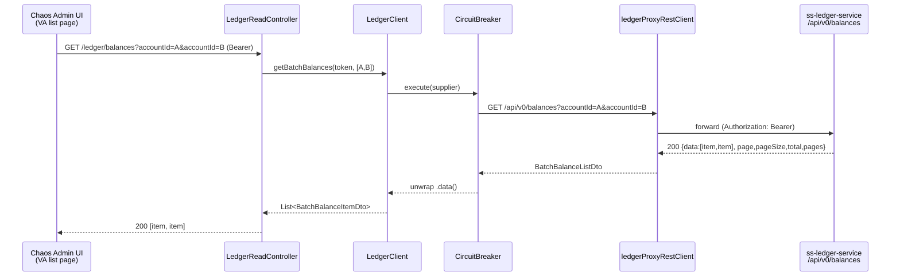

# Task 002 - Batch-balance read proxy (backend)

## Functional Requirements

- Expose `GET /api/v0/ledger/balances` on `LedgerReadController` that read-proxies the ledger's
  batch-balance endpoint `GET /api/v0/balances?accountId=<uuid>&accountId=<uuid>…`, returning one
  balance item per requested account id — [ADR-021](../../decisions/021-batch-balance-read-proxy-for-list-column.md).
- Accept a **repeated** `accountId` query param (`List<String>`), forward the ids verbatim to the
  ledger, and return the ledger's per-account items as a **flat list** (`List<BatchBalanceItemDto>`),
  unwrapping the ledger's paged `ApiResponse` envelope (`{data, page, pageSize, total, pages}`).
- Preserve the ledger's **per-item status** (`FOUND` / `NOT_FOUND` / `FORBIDDEN`) so the frontend can
  render a balance, `—`, or a restricted indicator per row.
- Run through the **existing** ledger read-proxy machinery (`ledgerProxyRestClient`, bearer-token
  forwarding, `CircuitBreaker`, `4xx → NotFoundException` / `5xx → InternalServerErrorException`).
- Require a verified AUTH SERVICE token.

## Acceptance Criteria

- [ ] `GET /api/v0/ledger/balances?accountId=A&accountId=B` returns `200` with a list of two items,
      each `{accountId, status, currency, availableBalance, pendingBalance, reservedBalance,
      totalBalance, lastEntrySequence, balanceAsOf}`.
- [ ] The repeated `accountId` params are forwarded verbatim to the ledger's `accountId` repeated
      param; the ledger's `data[]` envelope is unwrapped to a flat list in the chaos response.
- [ ] An item the ledger marks `NOT_FOUND` or `FORBIDDEN` is returned with that `status` and null
      balance fields (no error raised for the call as a whole).
- [ ] Empty / missing `accountId` → either a `400` (no ids) or an empty list, matching the ledger's
      contract for the empty case (forward, don't invent).
- [ ] Ledger `4xx` (e.g. > cap ids) → `ApiError` (NotFoundException path); ledger down / circuit open
      → `InternalServerErrorException`.
- [ ] No request without a valid bearer token reaches the ledger.
- [ ] Swagger lists `GET /api/v0/ledger/balances` under the **Ledger Proxy** tag with `bearerAuth`.
      No new RestClient bean, circuit breaker, or package.

## Technical Design

Target **Java 25 / Spring Boot 4**. New DTOs are `record`s in the existing
`com.softspark.chaos.ledgerproxy.dto` package; the handler and client method are additive within
`LedgerReadController` / `LedgerClient`.

### Request flow



### DTOs (camelCase, mirror the ledger)

```java
// com.softspark.chaos.ledgerproxy.dto.BatchBalanceItemDto
@JsonIgnoreProperties(ignoreUnknown = true)
public record BatchBalanceItemDto(
    String accountId,
    String status,                 // "FOUND" | "NOT_FOUND" | "FORBIDDEN" (string — transparent)
    @Nullable String currency,
    @Nullable BigDecimal availableBalance,
    @Nullable BigDecimal pendingBalance,
    @Nullable BigDecimal reservedBalance,
    @Nullable BigDecimal totalBalance,
    @Nullable Long lastEntrySequence,
    @Nullable LocalDateTime balanceAsOf) {}

// com.softspark.chaos.ledgerproxy.dto.BatchBalanceListDto  (internal envelope for deserialization)
@JsonIgnoreProperties(ignoreUnknown = true)
public record BatchBalanceListDto(
    List<BatchBalanceItemDto> data,
    int page, int pageSize, long total, int pages) {}
```

> The ledger's `BatchBalanceItemDto` uses the `*Balance`-suffixed bucket names
> (`availableBalance`/…/`totalBalance`), distinct from the single-account `BalanceResponse`
> (`available`/…/`total`) in Task 001 — keep them separate, do not unify. `NOT_FOUND`/`FORBIDDEN`
> items have null balance fields. The ledger also returns an `X-DUPLICATE-IDS` response header
> (count of server-side de-duped ids); the chaos proxy ignores it (the frontend de-dupes ids before
> calling). `status` is carried as a `String` to stay transparent (no chaos-side enum).

### Controller handler (added to `LedgerReadController`)

```java
@GetMapping("/balances")
@Operation(summary = "Batch account balances (read-through to the ledger)",
           security = @SecurityRequirement(name = "bearerAuth"))
public ResponseEntity<List<BatchBalanceItemDto>> getBatchBalances(
    @RequestParam("accountId") List<String> accountIds,
    HttpServletRequest request) {
  var token = extractToken(request);
  try {
    return ResponseEntity.ok(ledgerClient.getBatchBalances(token, accountIds));
  } catch (CircuitBreakerOpenException e) {
    throw new InternalServerErrorException("Ledger service temporarily unavailable");
  }
}
```

### Client method (added to `LedgerClient`)

```java
public List<BatchBalanceItemDto> getBatchBalances(String callerToken, List<String> accountIds) {
  var token = resolveToken(callerToken);
  return circuitBreaker.execute(() -> {
    var body = restClient.get()
        .uri(uriBuilder -> {
          var b = uriBuilder.path("/api/v0/balances");
          for (var id : accountIds) {
            b = b.queryParam("accountId", id);
          }
          return b.build();
        })
        .header("Authorization", "Bearer " + token)
        .retrieve()
        .onStatus(HttpStatusCode::is4xxClientError, (req, resp) -> {
          throw new NotFoundException("Ledger returned: " + resp.getStatusCode().value());
        })
        .onStatus(HttpStatusCode::is5xxServerError, (req, resp) -> {
          throw new InternalServerErrorException("Ledger error: " + resp.getStatusCode().value());
        })
        .body(BatchBalanceListDto.class);
    return body == null || body.data() == null ? List.of() : body.data();
  });
}
```

## Implementation Notes

Files to create:
- `chaos-machine/src/main/java/com/softspark/chaos/ledgerproxy/dto/BatchBalanceItemDto.java`
- `chaos-machine/src/main/java/com/softspark/chaos/ledgerproxy/dto/BatchBalanceListDto.java`

Files to modify:
- `chaos-machine/src/main/java/com/softspark/chaos/ledgerproxy/LedgerReadController.java` — add the
  `@GetMapping("/balances")` handler (reuse `extractToken`).
- `chaos-machine/src/main/java/com/softspark/chaos/ledgerproxy/LedgerClient.java` — add
  `getBatchBalances(...)`, reusing `circuitBreaker`, `restClient`, `resolveToken`.

Notes:
- The repeated `accountId` param: bind with `@RequestParam("accountId") List<String>` and forward by
  appending one `queryParam("accountId", id)` per id (Spring renders repeated params).
- The frontend sends **≤ perPage (20)** ids per call — well under the ledger's batch cap (default
  100, `ledger.query.batch-balance.max-size`). If a caller exceeds the cap the ledger returns `400`
  (forwarded); chunking is a frontend concern (Task 005), not a backend loop here.
- No `application.yml`, build, or dependency changes.

## Non-Functional Requirements

- **Resilience:** inherits proxy timeouts + circuit breaker. One batch read per page bounds ledger
  load even under chaos.
- **Security:** bearer required and forwarded; logging interceptor redacts auth.
- **Payload:** one item per id, ≤ page size — small, bounded.

## Dependencies

- `ss-ledger-service` `BalanceController` `GET /api/v0/balances` (exists, verified).
- Existing `ledgerproxy` machinery (Phase 004).
- **Blocks** Task 005 (frontend list column) for true end-to-end; Task 005 can build against an MSW
  fixture in parallel.

## Risks & Mitigations

- **Envelope vs flat list:** the proxy unwraps `data[]`; a deserialization test pins the ledger's
  `{data,page,pageSize,total,pages}` envelope → flat `List<BatchBalanceItemDto>`.
- **Bucket-name divergence** from the single-account DTO (`availableBalance` vs `available`):
  documented; a deserialization test on a captured `BatchBalanceItemDto` sample (incl. a
  `NOT_FOUND` item with null buckets) guards it.
- **JSON naming** (camelCase): same posture as Task 001 — contract test on a captured sample.

## Testing Strategy

- **Unit (Mockito):** `LedgerReadController.getBatchBalances` — mocks client, asserts ids forwarded,
  `200` with the list, circuit-open → `InternalServerErrorException`.
- **Client test (MockRestServiceServer / WireMock):** asserts the request carries repeated
  `accountId` params, forwards the token, unwraps `data[]`, and translates `4xx`/`5xx`.
- **DTO deserialization test:** captured `BatchBalanceListResponse` sample (mix of `FOUND` +
  `NOT_FOUND`/`FORBIDDEN`) → `BatchBalanceListDto` → flat items, null buckets preserved.
- **Integration (`@SpringBootTest` + WireMock):** round-trip, including a `400`-on-too-many-ids
  passthrough.
- Fold into the Phase 006 backend suites.

## Deployment Strategy

Additive, read-only, no migration, no Kafka, no feature flag. Inert until Task 005 calls it. Normal
backend deploy; auth and target-cluster safety inherited.
