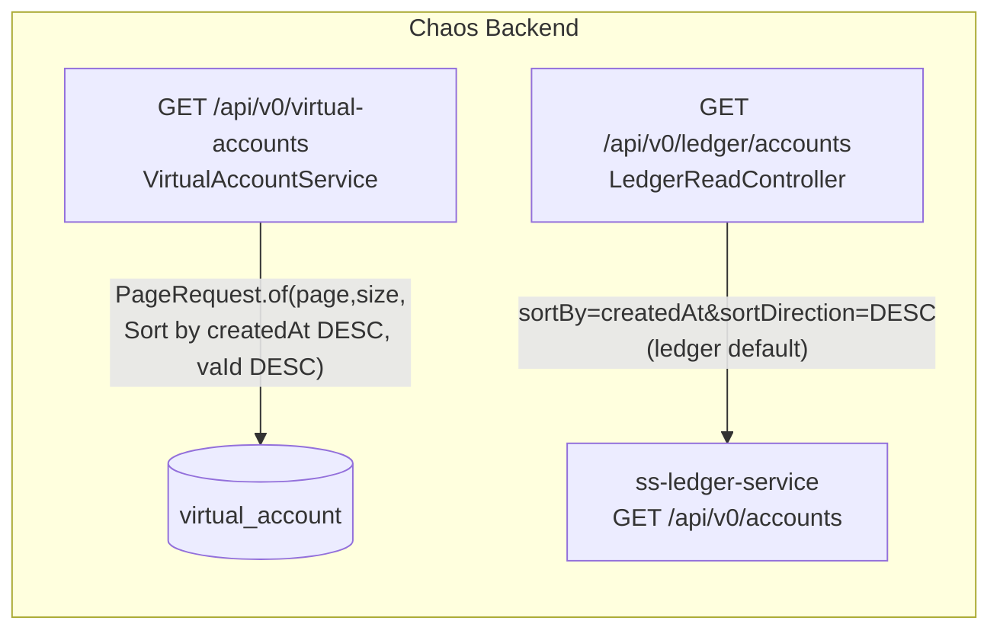

# Task 003 - Unify virtual-account list ordering (backend)

## Functional Requirements

- The two VA list views must present rows in the **same, deterministic sort order** so an operator
  sees a consistent ordering whether on the **Chaos Machine** tab (`GET /api/v0/virtual-accounts`)
  or the **Ledger** tab (`GET /api/v0/ledger/accounts`) — idea `008_balance_display.md`: "the views
  should have the same sort order."
- Adopt **`createdAt` descending (newest first)** as the shared default order, matching the ledger
  list's existing default (`sortBy=createdAt`, `sortDirection=DESC`).
- Apply this order to the chaos `GET /api/v0/virtual-accounts` listing, which today uses an
  **unspecified** order (`PageRequest.of(page, size)` with no `Sort` → database/insertion order).
- Keep the order stable across **all** filter branches of the chaos list (search, ownershipType,
  organizationId, currency, status, and the unfiltered `findAll`).

## Acceptance Criteria

- [ ] `GET /api/v0/virtual-accounts` returns rows ordered by `createdAt` **DESC** (newest first) for
      every filter branch, including search and `findAll`.
- [ ] Ties on `createdAt` resolve deterministically by a stable secondary key (`vaId`) so paging
      never duplicates or skips a row.
- [ ] The Ledger tab proxy (`GET /api/v0/ledger/accounts`) continues to default to
      `createdAt`/`DESC`; if the chaos endpoint forwards `sortBy`/`sortDirection` they remain
      consistent with the chaos default. (No behavior change required if the default already holds —
      verify and document.)
- [ ] No change to the response DTO shape, pagination contract, or filter params.

## Technical Design

Target **Java 25 / Spring Boot 4**. Pure ordering change in the existing
`com.softspark.chaos.account` service layer; no schema, DTO, or API-surface change.



Build the `Pageable` with an explicit sort:

```java
// VirtualAccountService.listVirtualAccounts(...)
var sort = Sort.by(Sort.Order.desc("createdAt"), Sort.Order.desc("vaId"));
Pageable pageable = PageRequest.of(pageNum, pageSize, sort);
// ... existing filter-branch repository calls now all receive the sorted pageable
```

`createdAt` is inherited from `AuditableEntity` and maps to a real column, so it is a valid
`Sort` property on every `virtual_account` query. The secondary `vaId` (the `@Id`) guarantees a
total order for stable keyset paging.

## Implementation Notes

Files to modify:
- `chaos-machine/src/main/java/com/softspark/chaos/account/service/VirtualAccountService.java` —
  construct the `Pageable` with `Sort.by(Order.desc("createdAt"), Order.desc("vaId"))` and pass it
  to every repository branch (`searchByNameOrId`, `findByOwnershipType`, `findByOrganizationId`,
  `findByCurrency`, `findByStatus`, `findAll`).

Notes:
- Confirm the repository methods accept `Pageable` (they do — they already take it); the `Sort`
  rides inside the `Pageable`, so no repository signature changes.
- Verify the entity property name is `createdAt` (JPA property, not the `created_at` column) for the
  `Sort` expression.
- For the Ledger tab: confirm `LedgerReadController`'s `/accounts` handler defaults (or forwards) to
  `sortBy=createdAt&sortDirection=DESC`. If it already omits them and relies on the ledger default
  (`createdAt`/`DESC`), no change is needed — **document the verification** either way.
- No `application.yml`, build, or dependency changes.

## Non-Functional Requirements

- **Performance:** sorting by `createdAt` should be backed by an index for large registries; if
  absent, note a follow-up index migration (out of scope unless profiling shows a problem at current
  data sizes).
- **Determinism:** the secondary `vaId` key prevents page drift under concurrent inserts (chaos VA
  creation during a poll window).

## Dependencies

- None blocking. Independent of Tasks 001/002. **Feeds** Task 005 (the list column relies on a
  consistent row order across both tabs).

## Risks & Mitigations

- **Ordering mismatch persists** if the Ledger tab is sorted differently in practice: covered by a
  test asserting both list endpoints return `createdAt`-DESC order for the same dataset.
- **Missing index → slow sort** at scale: flagged; revisit with a migration if needed.

## Testing Strategy

- **Unit/slice (`@DataJpaTest` or service test):** seed VAs with varied `createdAt`, assert
  `listVirtualAccounts` returns newest-first and that paging across a `createdAt` tie is stable
  (secondary `vaId`).
- **Controller/integration:** assert `GET /api/v0/virtual-accounts` and
  `GET /api/v0/ledger/accounts` (WireMock ledger) yield the same ordering for an equivalent dataset.
- Fold into the Phase 006 backend suites.

## Deployment Strategy

Additive behavior change, no migration (unless an index follow-up is taken), no Kafka, no flag.
Normal backend deploy. Purely affects row order; safe and backward-compatible.
