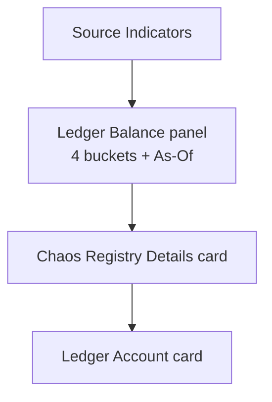

# Task 004 - VA detail: balance in sub-header, all buckets, reorder, "Balance As Of" picker (frontend)

## Functional Requirements

On the **virtual-account detail page**
(`chaos-admin/src/features/virtual-accounts/virtual-account-detail-page.tsx`):

1. **Sub-header shows the available balance** so it is visible across **all tabs** (the page header
   persists above the Overview/Transactions tabs). Change the header `description` from
   `"{ownershipType} · {currency}"` to `"{ownershipType} · {currency} · {available balance}"`
   (e.g. `Organization · GHS · GHS 1,250.00`).
2. **Move the "Ledger Balance" panel above "Chaos Registry Details."** New Overview order:
   Source Indicators → **Ledger Balance** → Chaos Registry Details → Ledger Account.
3. **Show all four buckets** in the Ledger Balance panel — **Total, Available, Reserved, Pending**
   (currently only Total + Available + Currency are rendered).
4. Add a **"Balance As Of"** datetime picker to the Ledger Balance panel. Selecting a datetime
   refetches the balance with `?asOf=…` and renders the point-in-time buckets; clearing it returns
   to the current balance. Show the effective `balanceAsOf` returned by the ledger.

## Acceptance Criteria

- [ ] The page sub-header reads `{Ownership} · {Currency} · {Available}` and stays visible on both
      the Overview and Transactions tabs.
- [ ] When the account has no ledger balance (not in ledger / `hasLedger === false`), the sub-header
      degrades to `{Ownership} · {Currency}` (no dangling separator) and the panel shows an
      unavailable state — no crash.
- [ ] The Ledger Balance panel renders **Total, Available, Reserved, Pending** (four labelled
      amounts, each `formatMoney(value, currency)`), plus the currency and the effective
      `balanceAsOf`.
- [ ] In the Overview tab the Ledger Balance panel appears **above** the "Chaos Registry Details"
      card.
- [ ] A "Balance As Of" control lets the operator pick a date-time; choosing one refetches with
      `asOf` and updates only the panel's buckets (the sub-header keeps showing **current**
      available). Clearing it reverts to current balance.
- [ ] A future-dated pick surfaces the ledger's `400` as a graceful inline error in the panel (the
      ledger rejects future `asOf`), not a white-screen; a brief client-side guard may disable
      obviously-future selections.
- [ ] Loading and error states render in the panel without removing the rest of the Overview tab.

## Technical Design

React 19 + Vite + react-query 5 + Tailwind + shadcn/ui ([ADR-005](../../decisions/005-react-vite-shadcn-frontend.md)).
Reuses the existing `BalancePanel` component and the `["ledger-balance", …]` query.

### Header vs panel balance — two query keys, one cache

The sub-header should always show the **current** available balance (a stable, cross-tab fact),
while the panel supports point-in-time exploration. Drive them with distinct query keys so an `asOf`
selection moves only the panel:

```ts
// page-level (header): current balance — key WITHOUT asOf
const currentBalanceQuery = useQuery({
  queryKey: ["ledger-balance", vaId],
  queryFn: () => getLedgerAccountBalances(token!, vaId!),   // asOf omitted
  enabled: Boolean(vaId) && hasLedger,
  retry: false,
});

// panel: current when asOf is null (SAME key → shared cache), PIT when set
const [asOf, setAsOf] = useState<string | null>(null);
const panelBalanceQuery = useQuery({
  queryKey: asOf ? ["ledger-balance", vaId, asOf] : ["ledger-balance", vaId],
  queryFn: () => getLedgerAccountBalances(token!, vaId!, asOf ?? undefined),
  enabled: Boolean(vaId) && hasLedger,
  retry: false,
});
```

When `asOf` is null the panel and header share the same cache entry (no double-fetch); when set, the
panel diverges and the header stays current.

### Sub-header composition (PageHeader description)

```tsx
const available = currentBalanceQuery.data
  ? formatMoney(currentBalanceQuery.data.available, currentBalanceQuery.data.currency)
  : null;
const description = [ownershipType, currency, available].filter(Boolean).join(" · ");
// → "Organization · GHS · GHS 1,250.00"  (or "Organization · GHS" when no ledger balance)
```

### Panel layout (four buckets + As-Of)

```tsx
<div className="rounded-lg border border-border bg-card p-4">
  <div className="mb-3 flex items-center justify-between">
    <p className="text-xs font-semibold">Ledger Balance</p>
    <BalanceAsOfPicker value={asOf} onChange={setAsOf} max={/* now */} />
  </div>
  <div className="grid grid-cols-2 gap-4 md:grid-cols-4">
    <Bucket label="Total"     value={b.total}     currency={b.currency} />
    <Bucket label="Available" value={b.available} currency={b.currency} />
    <Bucket label="Reserved"  value={b.reserved}  currency={b.currency} />
    <Bucket label="Pending"   value={b.pending}   currency={b.currency} />
  </div>
  {b.balanceAsOf && (
    <p className="mt-2 text-[10px] text-muted-foreground">Balance as of {formatDateTime(b.balanceAsOf)}</p>
  )}
</div>
```

### Overview ordering



## Implementation Notes

Files to modify:
- `chaos-admin/src/features/virtual-accounts/virtual-account-detail-page.tsx`
  - Lift a current-balance query to the page so the `PageHeader` `description` can include available
    balance; compose the description with `.filter(Boolean).join(" · ")`.
  - Reorder the Overview sections so `BalancePanel` renders **before** the "Chaos Registry Details"
    `DetailCard`.
  - Extend `BalancePanel`: render four buckets (Total/Available/Reserved/Pending), add the
    `BalanceAsOfPicker`, and key its query on `asOf`.
- `chaos-admin/src/lib/api.ts`
  - `getLedgerAccountBalances(token, vaId, asOf?: string)` — append `?asOf=<value>` when provided.
    Send the operator's wall-clock as an ISO local date-time **without** a `Z`/offset (the ledger
    binds `LocalDateTime`); e.g. `2026-06-01T12:00:00`. Do **not** call `.toISOString()` (that emits
    UTC `Z`).
  - Update the `LedgerBalanceDto` type: keep `balanceAsOf: string | null` (already present), add
    `lastEntrySequence: number`. (The backend rename in Task 001 makes `balanceAsOf` populate; the
    type already anticipated it.)

New (small) component:
- `chaos-admin/src/features/virtual-accounts/balance-as-of-picker.tsx` — a labelled "Balance As Of"
  datetime input (shadcn input or a date-time control already used elsewhere; reuse the
  trial-balance date-input pattern from `features/trial-balance` for consistency), constrained to
  `max = now`, emitting a zoneless ISO local date-time string or `null` when cleared.

Notes:
- **Zone handling:** the ledger interprets `asOf` as wall-clock in its own zone and rejects future
  values. Emit a naive local date-time string (no `Z`); document that the cutoff is the ledger's
  local time. Mirror, but do not reuse, the trial-balance date handling (that feature uses UTC
  `Instant`; balance as-of is `LocalDateTime` per [ADR-020](../../decisions/020-as-of-balance-via-ledger-read-proxy.md)).
- Amounts stay numbers via `formatMoney` (existing behavior); no string-encoding change.

## Non-Functional Requirements

- **Resilience:** panel and header degrade independently; a balance fetch error never blanks the
  Overview tab or the metadata cards.
- **Performance:** shared query key avoids a duplicate current-balance fetch; PIT fetches are
  on-demand (only when the operator picks a date).
- **A11y:** the As-Of control is labelled "Balance As Of"; amounts use `tabular-nums`.

## Dependencies

- **Task 001** (backend `asOf` passthrough + DTO alignment) for live data and a populated
  `balanceAsOf`. Buildable in parallel against an MSW fixture of the revised `LedgerBalanceDto`
  (incl. `lastEntrySequence`, non-null `balanceAsOf`).
- Existing `formatMoney`, `PageHeader`, `DetailCard`, `BalancePanel`.

## Risks & Mitigations

- **Accidental UTC conversion** of `asOf` (`.toISOString()`) silently shifting the cutoff: explicit
  note + a unit test asserting the request carries a zoneless `asOf` string.
- **Header double-fetch / flicker:** the two-key scheme (shared when `asOf` null) prevents it; a
  test asserts a single network call when no `asOf` is selected.
- **No-ledger accounts:** guard `hasLedger`; sub-header and panel both have explicit unavailable
  states.

## Testing Strategy

- **Component tests (MSW):** sub-header shows `Ownership · Currency · Available`; panel renders all
  four buckets; panel sits above "Chaos Registry Details"; picking an `asOf` issues a request with a
  zoneless `asOf` and updates only the panel; clearing reverts; future-date → graceful error;
  no-ledger → degraded header + unavailable panel; loading/error states.
- Fold into the Phase 006 frontend suite.

## Deployment Strategy

Frontend-only, additive. Degrades to current-balance display if the backend `asOf` param is not yet
deployed (the ledger ignores an unknown param? — no: it binds `LocalDateTime`; if Task 001 is
undeployed the chaos endpoint simply ignores `asOf` and returns current balance, so the panel still
works, only PIT is inert). Ships independently; normal frontend deploy.
