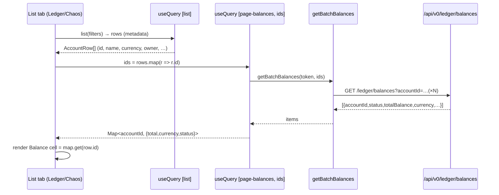

# Task 005 - VA list views: total-balance column (frontend)

## Functional Requirements

On the **virtual-accounts list page**
(`chaos-admin/src/features/virtual-accounts/virtual-accounts-page.tsx`), for **both** list tabs
(**Ledger** and **Chaos Machine**), which share one table:

1. Add a **Balance** column showing each row's **total** balance.
2. Position the column **between Currency and Owner**. New header order:
   `Name · Category · Currency · Balance · Owner · Status · Date created`.
3. Both tabs render rows in the **same sort order** (consumes Task 003's backend ordering).
4. Populate the column with **one batch-balance call per page** via the new
   `GET /api/v0/ledger/balances` proxy ([ADR-021](../../decisions/021-batch-balance-read-proxy-for-list-column.md)),
   keyed by the visible rows' account ids, merged client-side into the unified `AccountRow` model.

## Acceptance Criteria

- [ ] The shared table shows a **Balance** column between **Currency** and **Owner** on both tabs.
- [ ] Each cell shows `formatMoney(totalBalance, currency)` for the row, right-aligned with
      `tabular-nums`.
- [ ] Balances load via a **single** `GET /api/v0/ledger/balances?accountId=…&accountId=…` call for
      the page's ids (not one call per row).
- [ ] A row whose id the ledger returns as `NOT_FOUND` or `FORBIDDEN` (e.g. a just-requested chaos VA
      still within the post-create poll window) renders `—`, not an error.
- [ ] While balances are loading the cell shows a skeleton/placeholder; the rest of the row
      (metadata) renders immediately.
- [ ] If the batch call fails (ledger down / circuit open) the Balance cells show `—` (or a subtle
      retry affordance) while the table itself still renders metadata — the page does not white-screen.
- [ ] Both tabs present rows newest-first (matching Task 003); switching tabs keeps a consistent
      ordering.
- [ ] The auto-poll on the Chaos tab (post-create 30s window) re-runs the batch-balance call so a new
      VA's balance fills in once the ledger has it.

## Technical Design

React 19 + react-query 5. The list query stays unchanged (metadata-only); a **second** query fetches
balances for the page's ids and merges by `accountId`.



### Data layer additions (`chaos-admin/src/lib/api.ts`)

```ts
export type BatchBalanceItem = {
  accountId: string;
  status: "FOUND" | "NOT_FOUND" | "FORBIDDEN" | string;
  currency: string | null;
  availableBalance: number | null;
  pendingBalance: number | null;
  reservedBalance: number | null;
  totalBalance: number | null;
  lastEntrySequence: number | null;
  balanceAsOf: string | null;
};

export function getBatchBalances(token: string, accountIds: string[]): Promise<BatchBalanceItem[]> {
  // GET /ledger/balances?accountId=A&accountId=B…  (de-dupe ids first; chunk if > 100)
}
```

### Per-page balances query (in each list tab)

```ts
const ids = useMemo(() => Array.from(new Set(rows.map(r => r.id))).filter(Boolean), [rows]);
const balancesQuery = useQuery({
  queryKey: ["page-balances", ids],
  queryFn: () => getBatchBalances(token!, ids),
  enabled: ids.length > 0,
  refetchInterval: () => (Date.now() < pollUntil ? 3000 : false), // Chaos tab: track new-VA window
});
const balanceById = useMemo(() => {
  const m = new Map<string, BatchBalanceItem>();
  (balancesQuery.data ?? []).forEach(it => m.set(it.accountId, it));
  return m;
}, [balancesQuery.data]);
```

### Table column (shared header + row)

```tsx
// header (between Currency and Owner)
<TH>Currency</TH>
<TH className="text-right">Balance</TH>
<TH>Owner</TH>

// cell
<TD className="text-right tabular-nums">
  {(() => {
    const bal = balanceById.get(row.id);
    return bal && bal.status === "FOUND" && bal.totalBalance != null
      ? formatMoney(bal.totalBalance, bal.currency ?? row.currency ?? "GHS")
      : balancesQuery.isLoading ? <Skeleton/> : "—";
  })()}
</TD>
```

## Implementation Notes

Files to modify:
- `chaos-admin/src/features/virtual-accounts/virtual-accounts-page.tsx`
  - Add the **Balance** `<TH>` between Currency and Owner in the shared header (around the existing
    header row), and the matching `<TD>` in the shared row renderer.
  - In each tab (`LedgerAccountsTab`, `ChaosAccountsTab`), add the `["page-balances", ids]` query and
    the `balanceById` map; wire the Chaos tab's `refetchInterval` to the existing `pollUntil` window.
- `chaos-admin/src/lib/api.ts`
  - Add `BatchBalanceItem` type and `getBatchBalances(token, accountIds)` calling
    `GET /ledger/balances` with repeated `accountId` params; de-dupe ids; **chunk** into ≤100-id
    requests only if a page ever exceeds the ledger cap (current `perPage = 20`, so a single request).

Notes:
- A chaos VA's `vaId` **is** its ledger account id (the ledger owns VAs,
  [ADR-011](../../decisions/011-ledger-owned-virtual-accounts-via-kafka-consumer.md)), so the same
  `getBatchBalances(rows.map(r => r.id))` works for both tabs.
- The Balance column is **current** total only (no `asOf`) — point-in-time stays on the detail page
  ([ADR-020](../../decisions/020-as-of-balance-via-ledger-read-proxy.md)).
- Column count change: verify any `colSpan` used by empty/loading rows in the shared table is bumped
  to include the new column.

## Non-Functional Requirements

- **Performance:** exactly one batch request per rendered page; balances merged in memory. No N+1.
- **Resilience:** metadata renders independently of balances; balance failures degrade to `—`.
- **Consistency:** a row's metadata and balance are two reads (eventual visual consistency) —
  acceptable for an ops console; the poll window reconciles new VAs.

## Dependencies

- **Task 002** (backend `GET /api/v0/ledger/balances`) for live data; buildable in parallel against
  an MSW fixture of `BatchBalanceItem[]` (incl. a `NOT_FOUND` row).
- **Task 003** (unified backend ordering) so "same sort order" holds across tabs without client-side
  re-sorting.
- Existing `formatMoney`, the shared table primitives, and the `AccountRow` model.

## Risks & Mitigations

- **Stale/missing balance for new VAs:** handled by the `NOT_FOUND → —` rule plus the existing
  post-create poll re-running the batch query.
- **Page size > ledger cap:** current `perPage = 20` is safe; `getBatchBalances` chunks defensively
  if ids exceed 100.
- **Column-span/layout regressions** from the added column: covered by a render test asserting header
  order `… Currency, Balance, Owner …` and correct empty/loading colSpan.

## Testing Strategy

- **Component tests (MSW):** Balance column appears between Currency and Owner on both tabs; a single
  batch call covers the page; `FOUND` rows show formatted totals; `NOT_FOUND`/`FORBIDDEN` show `—`;
  loading shows skeletons; batch failure degrades cells to `—` without blanking the table; the Chaos
  tab re-fetches balances within the poll window; both tabs render newest-first.
- Fold into the Phase 006 frontend suite.

## Deployment Strategy

Frontend-only, additive. The column is empty (`—`) and harmless if Task 002's endpoint is not yet
deployed (the batch call 404s → cells degrade). Ships independently; normal frontend deploy.
