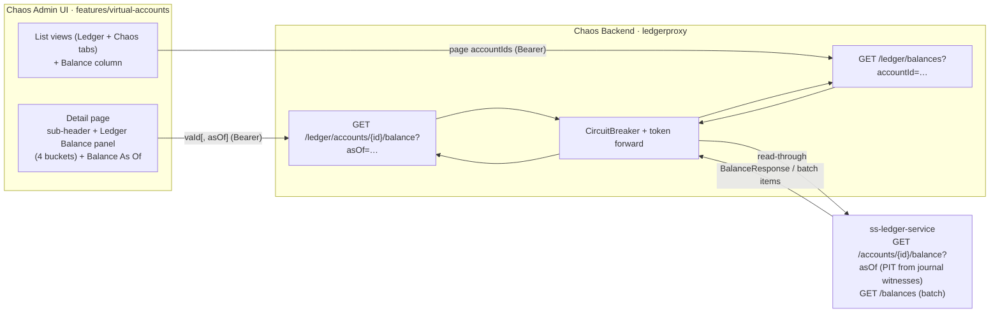

# Phase 15 - Virtual Account Balance Display

## Summary

Surfaces **ledger balances** prominently in the chaos admin's virtual-account views. On the **VA
detail page**: the sub-header gains the available balance (so it stays visible across all tabs), the
**Ledger Balance** panel moves above "Chaos Registry Details" and shows **all four buckets** (Total,
Available, Reserved, Pending), and a **"Balance As Of"** datetime picker enables point-in-time (PIT)
balance views. On the **VA list views** (both the Ledger and Chaos Machine tabs): a **Total balance**
column is added between Currency and Owner, and both views are given a **consistent sort order**.

All balance data is computed authoritatively by `ss-ledger-service` and reached through the existing
ledger read-proxy. The ledger already supports PIT (`GET /api/v0/accounts/{id}/balance?asOf=…`,
reconstructed from journal-line running-balance witnesses) and a batch lookup
(`GET /api/v0/balances?accountId=…`), so this phase is a thin gateway extension + UI work — no new
tables, no Kafka, no chaos-side computation
([ADR-020](../../decisions/020-as-of-balance-via-ledger-read-proxy.md),
[ADR-021](../../decisions/021-batch-balance-read-proxy-for-list-column.md)).

## Motivation

Idea `008_balance_display.md` asks operators to see balances where they make decisions: a VA's
balance should be glanceable from its detail header (across every tab), broken out by bucket, and
queryable at a past instant; and the list views should show a balance column so accounts can be
scanned by funds. During chaos runs, the question "what is this account's balance now — and what was
it just before that malformed burst?" is exactly what the harness exists to answer. The ledger
already does the math; the chaos console just needs to surface it without leaving the single-gateway
topology ([ADR-003](../../decisions/003-backend-as-single-api-gateway.md)).

A useful side effect: the work **fixes a latent contract bug** — the existing `LedgerBalanceDto`'s
snake-case mapping left `accountId` and the balance timestamp silently null against the ledger's
camelCase REST contract.

## User-Facing Changes

**VA detail page:**
- Sub-header: `Ownership · Currency` → `Ownership · Currency · Available Balance` (persists across
  the Overview and Transactions tabs).
- Overview order: Source Indicators → **Ledger Balance** → Chaos Registry Details → Ledger Account.
- Ledger Balance panel shows **Total, Available, Reserved, Pending** (was Total + Available only),
  plus the effective `balanceAsOf`.
- New **"Balance As Of"** datetime picker drives a PIT balance view; clearing it returns to current.

**VA list views (both tabs):**
- New **Balance** (total) column between **Currency** and **Owner**.
- Both views render rows in the **same order** (newest-first by `createdAt`).

**API (additive, all under the existing Ledger Proxy tag):**
- `GET /api/v0/ledger/accounts/{id}/balance` gains an optional `asOf` param.
- New `GET /api/v0/ledger/balances?accountId=…` batch-balance read-proxy.
- `GET /api/v0/virtual-accounts` now returns a deterministic `createdAt`-DESC order.

## Architecture Impact

No new tables, no Kafka surface, no new persistence, no new package. All backend changes are
**additive within `com.softspark.chaos.ledgerproxy`** (plus a one-line ordering change in
`com.softspark.chaos.account`), reusing the configured `ledgerProxyRestClient`, per-request bearer
token forwarding, the `CircuitBreaker`, and the standard `4xx/5xx` translation — the same machinery
Phase 012 reused ([ADR-015](../../decisions/015-trial-balance-via-ledger-read-proxy.md)). The chaos
machine computes and stores nothing; it stays a transparent read-through gateway
([ADR-003](../../decisions/003-backend-as-single-api-gateway.md)). The frontend extends the existing
`features/virtual-accounts` detail and list components.

## Edge Cases

- **No ledger balance** (SYSTEM account not in ledger, or `hasLedger === false`): sub-header degrades
  to `Ownership · Currency` (no dangling separator); panel/cell show an unavailable state, never a
  crash.
- **Future-dated `asOf`:** the ledger's `@ValidAsOf` rejects it with `400`; the proxy forwards it
  (NotFoundException path) and the panel shows a graceful inline error. A light client-side guard may
  disable obviously-future picks.
- **Zone semantics:** `asOf` is a **zoneless `LocalDateTime`** interpreted in the **ledger's** zone
  (not UTC) — distinct from trial-balance's `Instant`. The frontend must send a naive ISO local
  date-time (no `Z`); documented + tested
  ([ADR-020](../../decisions/020-as-of-balance-via-ledger-read-proxy.md)).
- **Pre-genesis `asOf`:** the ledger returns a zero snapshot (account had no postings yet) — rendered
  as zeros, not an error.
- **Batch per-item `NOT_FOUND`/`FORBIDDEN`:** e.g. a freshly-requested chaos VA still within its
  post-create poll window → the Balance cell shows `—`; the poll reconciles it once the ledger has
  the account.
- **Ledger down / circuit open:** detail panel and list cells degrade (error state / `—`) while the
  surrounding metadata still renders — chaos-induced ledger stress must not white-screen the views.
- **Page size vs batch cap:** `perPage = 20` is well under the ledger's 100-id batch cap; the
  frontend chunks defensively only if ids exceed the cap.
- **JSON naming drift:** the ledger's REST DTOs are camelCase; the existing balance DTO's snake-case
  mapping is corrected (Task 001). Pinned by a captured-sample deserialization test.
- **Precision:** balance buckets stay `BigDecimal` server-side / numbers client-side via
  `formatMoney` (existing behavior); string-encoding is out of scope unless precision bites.

## Testing Strategy

- **Backend:** controller + client unit tests (param forwarding incl. `asOf` present/absent and
  repeated `accountId`; circuit-open → `InternalServerErrorException`); DTO deserialization tests on
  **captured camelCase ledger samples** for `BalanceResponse` (eight fields incl. `accountId`/
  `balanceAsOf`/`lastEntrySequence`) and `BatchBalanceListResponse` (mixed FOUND/NOT_FOUND);
  `@DataJpaTest`/service test for the `createdAt`-DESC ordering with stable tie-break; `@SpringBootTest`
  + WireMock round-trips including the `400`-on-bad-`asOf` and too-many-ids passthroughs.
- **Frontend (MSW):** sub-header balance + cross-tab persistence; four-bucket panel above "Chaos
  Registry Details"; As-Of pick → zoneless request, panel-only update, clear-revert, future-date
  error; list Balance column placement, single batch call per page, FOUND/NOT_FOUND/loading/failure
  cell states, both-tabs-same-order, poll-window refetch.
- Folds into the Phase 006 backend and frontend suites.

## Deployment Strategy

Additive, read-only, no migration, no Kafka, no feature flag. Backend and frontend ship
independently: the new params/endpoint are inert until the UI calls them, and the UI degrades to
current-balance / `—` if the backend pieces aren't deployed yet. The `LedgerBalanceDto` change is a
corrective alignment (adds/renames fields the frontend type already anticipates). Auth and
target-cluster safety are inherited from the existing proxy and shell.

## Tasks

- [001 - As-of balance passthrough + balance DTO alignment (backend)](./001-as-of-balance-passthrough-and-dto-alignment.md)
  — add optional `asOf` to `GET /ledger/accounts/{id}/balance`; align `LedgerBalanceDto` to the
  ledger's camelCase contract (`balanceAsOf`, `lastEntrySequence`, fix `accountId`).
- [002 - Batch-balance read proxy (backend)](./002-batch-balance-read-proxy.md)
  — new `GET /ledger/balances?accountId=…` proxying the ledger batch endpoint; flat list of per-item
  balances with FOUND/NOT_FOUND/FORBIDDEN status.
- [003 - Unify virtual-account list ordering (backend)](./003-unify-virtual-account-list-ordering.md)
  — `GET /virtual-accounts` returns deterministic `createdAt`-DESC (matching the Ledger tab) for a
  consistent order across both list views.
- [004 - VA detail: balance sub-header, all buckets, reorder, As-Of picker (frontend)](./004-va-detail-balance-panel-and-as-of-picker.md)
  — sub-header available balance; Ledger Balance panel moved up, four buckets; "Balance As Of"
  datetime picker.
- [005 - VA list views: total-balance column (frontend)](./005-va-list-total-balance-column.md)
  — Balance column between Currency and Owner on both tabs, fed by one batch call per page.

## Parallel Tasks

- **Backend 001, 002, 003 are mutually independent** — three parallel tracks.
- **Frontend 004 depends on 001**; **frontend 005 depends on 002 + 003.** Both frontend tasks can be
  built against **MSW fixtures** in parallel with the backend and wired to live endpoints once their
  backend deps land.
- Dependency chain: `001 ─(live)→ 004`; `002 ─(live)→ 005`; `003 ─(same order)→ 005`. No task blocks
  another within its own layer.
