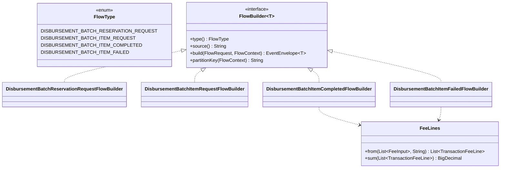

# Task 001 - Batch event models, builders, flow types & topics (backend)

## Functional Requirements
- Add the four batch-disbursement **`FlowType`s** and, for each, a chaos `v1` event-data
  model + a `FlowBuilder` that emits an `EventEnvelope<T>` matching the **authoritative
  `ss-ledger-service` contract** (verified source + `bin/kafka-payload-samples.md`):
  - `DISBURSEMENT_BATCH_RESERVATION_REQUEST` → topic `disbursement.batch.initiated`,
    `data.operation = BATCH_RESERVATION_REQUEST`.
  - `DISBURSEMENT_BATCH_ITEM_REQUEST` → topic `disbursement.batch.initiated`,
    `data.operation = BATCH_ITEM_REQUEST`.
  - `DISBURSEMENT_BATCH_ITEM_COMPLETED` → topic `disbursement.batch.item.completed`.
  - `DISBURSEMENT_BATCH_ITEM_FAILED` → topic `disbursement.batch.item.failed`.
- Reuse the shared `flow/model/v1/TransactionFeeLine` + `flow/builder/FeeLines` helper for
  the `fees[]` on the two item terminal events, and the existing `authorised_principal`
  assembly for the reservation.
- Emit the **structured ledger idempotency keys** (not the default `event-type:eventId`)
  and the correct per-phase `transactionReference`.
- Seed the missing **org/system slots** so the runner's VA pickers route through
  `slotOverrides`.

## Acceptance Criteria
- [ ] `FlowType` contains `DISBURSEMENT_BATCH_RESERVATION_REQUEST`,
      `DISBURSEMENT_BATCH_ITEM_REQUEST`, `DISBURSEMENT_BATCH_ITEM_COMPLETED`,
      `DISBURSEMENT_BATCH_ITEM_FAILED` (existing disbursement/settlement/collection types
      unchanged).
- [ ] `DisbursementBatchReservationRequestEventData` fields exactly: `operation`
      (const `BATCH_RESERVATION_REQUEST`), `batch_id`, `batch_correlation_id`, `merchant_id`,
      `source_va_id`, `destination_va_id`, `currency`, `total_principal_amount`, `total_fees`,
      `total_amount`, `item_count` (int), `disbursement_subtype`, `callback_url` (nullable),
      `merchant_batch_ref`, `correlation_id`, `requested_at`, `authorised_principal`
      (`{user_id, key_fingerprint}`).
- [ ] `DisbursementBatchItemRequestEventData` fields exactly: `operation` (const
      `BATCH_ITEM_REQUEST`), `batch_id`, `batch_correlation_id`, `item_id`, `item_sequence`
      (int), `merchant_item_ref`, `merchant_id`, `virtual_account_id`, `principal_amount`,
      `currency`, `credit_provider_id`, `credit_account_id`, `disbursement_subtype`,
      `source_country` (nullable), `destination_country` (nullable), `corridor` (nullable),
      `fx_quote_reference` (nullable), `item_fee`, `correlation_id`, `requested_at`.
- [ ] `DisbursementBatchItemCompletedEventData` fields exactly: `batch_id`, `item_id`,
      `item_sequence`, `virtual_account_id`, `reservation_id`, `disbursement_subtype`,
      `provider_id`, `provider_reference_id`, `principal_amount`, `currency`, `fees[]`,
      `recipient_reference` (nullable), `destination_country` (nullable), `corridor`
      (nullable), `applied_fx_rate` (nullable), `completed_at`, `merchant_item_ref`.
- [ ] `DisbursementBatchItemFailedEventData` fields exactly: `batch_id`, `item_id`,
      `item_sequence`, `virtual_account_id`, `reservation_id`, `disbursement_subtype`,
      `provider_id`, `provider_reference_id` (nullable), `principal_amount`, `currency`,
      `fees[]`, `failure_reason`, `failure_code`, `failed_at`, `merchant_item_ref`.
- [ ] The reservation builder computes/asserts `total_amount = total_principal_amount +
      total_fees` for a default run, and assembles `authorised_principal` from
      `authorised_user_id`/`authorised_key_fingerprint` flowFields with defaults.
- [ ] Item terminal builders populate `fees[]` from `request.fees()` via `FeeLines.from(...,
      "PLATFORM")` (autogen `fee_code` when blank); the completed builder's principal + Σfees
      is the gross the ledger captures.
- [ ] Each builder sets the **structured idempotency key**: reservation →
      `disbursement-batch-initiated:{batch_id}`; item.request →
      `disbursement-batch-initiated:{batch_id}:{item_id}`; item.completed →
      `disbursement-batch-item-completed:{batch_id}:{item_id}`; item.failed →
      `disbursement-batch-item-failed:{batch_id}:{item_id}`.
- [ ] `transactionReference` = `batch_id` (reservation) / `item_id` (the three item events);
      never blank for a default run. `source()` = `payment-service` for all four.
- [ ] The two `disbursement.batch.initiated` builders set the correct `operation` value and
      both resolve to topic `disbursement.batch.initiated` via `TopicCatalog`; the terminal
      builders resolve `disbursement.batch.item.completed` / `disbursement.batch.item.failed`.
- [ ] `chaos-bootstrap.yml` seeds the slots: `DISBURSEMENT_BATCH_RESERVATION_REQUEST.source`
      (org, no role), `DISBURSEMENT_BATCH_RESERVATION_REQUEST.destination` (`PLATFORM_FLOAT`),
      `DISBURSEMENT_BATCH_ITEM_COMPLETED.source` (org), `DISBURSEMENT_BATCH_ITEM_COMPLETED.destination`
      (`PLATFORM_FLOAT`), and the item terminal **fee** VA slots resolve to SYSTEM fee-revenue
      roles (via `FEE_LIST` row VA pickers, not fixed slots).
- [ ] Each builder is registered in `FlowBuilderRegistry` and resolvable for its `FlowType`.

## Technical Design
Target **Java 25 / Spring Boot 4** ([ADR-001](../../decisions/001-target-java-25-and-spring-boot-4.md)),
`record-builder`, no Lombok. See
[ADR-022](../../decisions/022-batch-disbursement-fan-out-flow-and-dual-mode-orchestration.md).

### Field tables (authoritative — `req` = required by the ledger)

**`disbursement.batch.initiated` / `BATCH_RESERVATION_REQUEST`** — source `payment-service`,
key `source_va_id`/`batch_id` (preserve partition convention). `transactionReference =
batch_id`.

| wire | source in builder | req |
|---|---|---|
| `operation` | const `BATCH_RESERVATION_REQUEST` | ✓ |
| `batch_id` | flowFields (UUID autogen) | ✓ |
| `batch_correlation_id` | flowFields (UUID autogen) | ✓ |
| `merchant_id` | flowFields (inferred org from source VA) | ✓ |
| `source_va_id` | slot `source` (org) | ✓ |
| `destination_va_id` | slot `destination` (`PLATFORM_FLOAT`) | ✓ |
| `currency` | top-level/inferred | ✓ |
| `total_principal_amount` | `request.amount`/flowFields (default `1000.0000`) | ✓ |
| `total_fees` | flowFields (default `10`) | ✓ |
| `total_amount` | computed `principal + fees` | ✓ |
| `item_count` | flowFields INTEGER (N) | ✓ |
| `disbursement_subtype` | flowFields SELECT (`DOMESTIC`) | ✓ |
| `callback_url` | flowFields | — |
| `merchant_batch_ref` | flowFields (ULID/`BATCH-REF-…` default) | ✓ |
| `correlation_id` | top-level/autogen | ✓ |
| `requested_at` | `getTimestampOrNow` | ✓ |
| `authorised_principal` | `{user_id, key_fingerprint}` defaults | ✓ |

**`disbursement.batch.initiated` / `BATCH_ITEM_REQUEST`** — inert at the ledger.
`transactionReference = item_id`.

| wire | source | req |
|---|---|---|
| `operation` | const `BATCH_ITEM_REQUEST` | ✓ |
| `batch_id` | carry-over | ✓ |
| `batch_correlation_id` | carry-over | ✓ |
| `item_id` | flowFields (UUID autogen, per item) | ✓ |
| `item_sequence` | runner/wizard index (1-based) | ✓ |
| `merchant_item_ref` | flowFields (ULID/`ITEM-REF-…`) | ✓ |
| `merchant_id` | carry-over | ✓ |
| `virtual_account_id` | carry-over (batch source VA) | ✓ |
| `principal_amount` | split / flowFields | ✓ |
| `currency` | carry-over | ✓ |
| `credit_provider_id` | flowFields | ✓ |
| `credit_account_id` | flowFields | ✓ |
| `disbursement_subtype` | carry-over | ✓ |
| `source_country` | flowFields COUNTRY (`GH`) | — (✓ cross-border) |
| `destination_country` | flowFields COUNTRY (`GH`) | — (✓ cross-border) |
| `corridor` | derived `src-dst` | — (✓ cross-border) |
| `fx_quote_reference` | flowFields | — |
| `item_fee` | split / flowFields | ✓ |
| `correlation_id` | carry-over | ✓ |
| `requested_at` | `getTimestampOrNow` | ✓ |

**`disbursement.batch.item.completed`** — source `payment-service`, key
`item_id`/`virtual_account_id`. `transactionReference = item_id`.

| wire | source | req |
|---|---|---|
| `batch_id` | carry-over | ✓ |
| `item_id` | carry-over (same as item.request) | ✓ |
| `item_sequence` | carry-over | ✓ |
| `virtual_account_id` | carry-over (batch source VA) | ✓ |
| `reservation_id` | poll/manual/placeholder ([ADR-023](../../decisions/023-batch-reservation-id-and-progress-via-batch-summary-read-proxy.md)) | ✓ |
| `disbursement_subtype` | carry-over | ✓ |
| `provider_id` | flowFields | ✓ |
| `provider_reference_id` | flowFields (autogen) | ✓ |
| `principal_amount` | carry-over (item split) | ✓ |
| `currency` | carry-over | ✓ |
| `fees[]` | `request.fees` → `TransactionFeeLine` | ✓ (may be empty) |
| `recipient_reference` | flowFields | — |
| `destination_country`/`corridor`/`applied_fx_rate` | flowFields (cross-border) | — |
| `completed_at` | `getTimestampOrNow` | ✓ |
| `merchant_item_ref` | carry-over | ✓ |

**`disbursement.batch.item.failed`** — same as completed minus the journal fields, plus:

| wire | source | req |
|---|---|---|
| `provider_reference_id` | flowFields | — (nullable) |
| `failure_reason` | flowFields (default) | ✓ |
| `failure_code` | flowFields SELECT (`RECIPIENT_INVALID` default) | ✓ |
| `failed_at` | `getTimestampOrNow` | ✓ |

`failure_code` ∈ { `PROVIDER_REJECTED`, `PROVIDER_TIMEOUT`, `RECIPIENT_INVALID`,
`VALIDATION_FAILED`, `PROVIDER_UNAVAILABLE`, `RESERVATION_MISSING`, `SUBTYPE_UNSUPPORTED` }.

## Implementation Notes
- `flow/model/FlowType.java`: add the four values.
- `flow/model/v1/`: add `DisbursementBatchReservationRequestEventData`,
  `DisbursementBatchItemRequestEventData`, `DisbursementBatchItemCompletedEventData`,
  `DisbursementBatchItemFailedEventData`. Keep `@JsonNaming(SnakeCaseStrategy.class)` +
  `@RecordBuilder` (use the generated builder; never positional `new`). `authorised_principal`
  is a `Map<String, Object>` on the wire (free-form per the ledger); assemble `{user_id,
  key_fingerprint}`. `operation` is a plain `String` constant per builder. `item_count` and
  `item_sequence` are `int`; amounts are `BigDecimal`.
- `flow/builder/`: add `DisbursementBatchReservationRequestFlowBuilder`,
  `DisbursementBatchItemRequestFlowBuilder`, `DisbursementBatchItemCompletedFlowBuilder`,
  `DisbursementBatchItemFailedFlowBuilder`. Reuse `FeeLines.from(request.fees(), "PLATFORM")`
  for terminal `fees[]`. Override the envelope **idempotency key** to the structured form
  (the builder has `batch_id`/`item_id` in scope) instead of the default
  `"<event-type>:<eventId>"`.
- `kafka/TopicCatalog.java`: ensure topic names `disbursement.batch.initiated`,
  `disbursement.batch.item.completed`, `disbursement.batch.item.failed` are present (add if
  missing); both initiated builders map to the shared topic.
- `flow/builder/FlowBuilderRegistry`: register the four builders.
- `chaos-bootstrap.yml` (`chaos.bootstrap.flow-slots`): add the slot rows above. The
  `ChartOfAccountsBootstrap` upserts idempotently — no migration.
- Avoid reserved-keyword identifiers (use `line`/`row`, never `record`).
- No new I/O in builders; they stay pure/in-memory.

## Non-Functional Requirements
- Builders pure/in-memory; decimal precision preserved (`BigDecimal`, `1000.0000` formatting,
  no scientific notation). Wire stays snake_case via `@JsonNaming`; enums serialize by name.

## Dependencies
- The verified ledger contract (recon) + `bin/kafka-payload-samples.md`
  (`disbursement.batch.*`).
- Phase 011/014 catalog/builder machinery; `SlotResolver`, `FlowFields`,
  `FlowBuilderRegistry`, `FeeLines`, `TransactionFeeLine`.
- Consumed by tasks 002 (descriptors), 003 (reservation lookup keyed by `batch_id`), 004
  (runner), 005/006 (frontend).

## Risks & Mitigations
- **Wrong reuse of the single-disbursement family** → golden builder tests pin the new field
  sets + topics + `operation`; a test asserts the four are distinct from
  `DISBURSEMENT_INITIATED/COMPLETED/FAILED`.
- **Default idempotency key would defeat ledger dedupe** → a builder test asserts the
  structured key per phase. ([ADR-022](../../decisions/022-batch-disbursement-fan-out-flow-and-dual-mode-orchestration.md).)
- **`total_amount` drift** (ledger requires exact `principal + fees`) → builder computes it;
  a test asserts the equality and that an unbalanced override is still *sendable*.
- **Unconfigured slot drops the VA** (the Phase 011 trap) → a bootstrap/slot test asserts a
  row for every `VA_REF.slotName` of each new flow (covered in task 002's catalog test).

## Testing Strategy
JUnit 5 + AssertJ unit tests per builder asserting the exact emitted envelope/payload fields,
topic, `operation`, structured idempotency key, and `transactionReference`; fee-list mapping
incl. `fee_code`; reservation `total_amount = principal + fees`; `authorised_principal` shape.
A parameterized "required-only inputs → valid envelope" test per phase. Integration
(Testcontainers Kafka, Phase 003 harness): publish each phase, assert payload validates and
slots resolve non-empty.

## Deployment Strategy
Additive; new flow types/builders/models + one config edit (`chaos-bootstrap.yml`), no
migration in this task. Ships with task 002.
