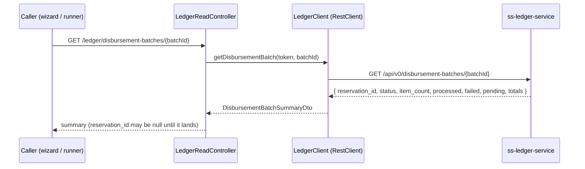

# Task 003 - Batch reservation & progress read-proxy (backend)

## Functional Requirements
- Expose a read-through proxy of the ledger's batch-summary endpoint so the chaos machine can
  fetch the BATCH `reservation_id` the ledger created (keyed by `batch_id`) **and** the live
  batch status + counters.
- Provide a `BatchReservationLookup` service that **polls until the reservation id is present
  or a timeout elapses**, reusable by the interactive wizard (via HTTP) and the automatic
  runner (in-process).
- Add no new tables, no Kafka, no persistence — reuse the existing `ledgerproxy` read-through
  (timeouts/retries/circuit breaker). See
  [ADR-023](../../decisions/023-batch-reservation-id-and-progress-via-batch-summary-read-proxy.md).

## Acceptance Criteria
- [ ] `GET /api/v0/ledger/disbursement-batches/{batchId}` returns a
      `DisbursementBatchSummaryDto` via the existing `LedgerReadController` + `LedgerClient`,
      proxying the ledger's `GET /api/v0/disbursement-batches/{batchId}`.
- [ ] `DisbursementBatchSummaryDto` carries at least: `batchId`, `reservationId` (nullable
      until the reservation lands), `status`
      (`INITIATED|IN_PROGRESS|COMPLETED|FAILED|PARTIALLY_COMPLETED`), `currency`, `itemCount`,
      `processedCount`, `failedCount`, `pendingCount`, `totalPrincipalAmount`, `totalFees`,
      `totalAmount`, `amountCaptured` (nullable), `amountReleased` (nullable), `createdAt` —
      mapped to the chaos response/`ApiError` conventions.
- [ ] `BatchReservationLookup.find(callerToken, batchId, timeout)` returns the resolved
      `reservation_id` (when the summary reports one) or empty on timeout, polling on the
      bounded `chaos.ledger.reservation.poll.*` interval.
- [ ] `BatchReservationLookup.summary(callerToken, batchId)` returns the latest
      `DisbursementBatchSummaryDto` (single read) for progress display/finalize stamping.
- [ ] The proxy degrades gracefully (ledger slow/unreachable → mapped error, no harness
      crash), consistent with the other ledger reads; auth inherited.
- [ ] The exact ledger path, params, and response shape are **confirmed against the ledger**
      and documented in the `LedgerClient` method (adjustable in one place); the documented
      **fallback** is the ADR-018 account-reservations path filtered by `disbursementBatchId`.

## Technical Design
Mirror the trial-balance / single-reservation proxies
([ADR-015](../../decisions/015-trial-balance-via-ledger-read-proxy.md),
[ADR-018](../../decisions/018-reservation-id-via-ledger-read-proxy-poll.md)): a thin
controller method + a `LedgerClient` call + a response record; no service-side state.



`BatchReservationLookup.find` wraps the same call in a poll loop:
```
find(token, batchId, timeout):
  deadline = now + timeout
  loop:
    summary = ledgerClient.getDisbursementBatch(token, batchId)
    if summary.reservationId present: return it
    if now >= deadline: return empty
    sleep(pollIntervalMs)   // interrupt-aware
```

## Implementation Notes
- `ledgerproxy/LedgerClient.java`: add `getDisbursementBatch(callerToken, batchId)` returning
  the summary record; reuse the existing `RestClient`/resilience config — no new client.
- `ledgerproxy/dto/DisbursementBatchSummaryDto.java`: new record (snake_case mapped to the
  ledger; serialized to the chaos convention).
- `ledgerproxy/LedgerReadController.java`: add the `GET
  /ledger/disbursement-batches/{batchId}` method.
- `ledgerproxy/BatchReservationLookup.java`: new service; reuse the
  `chaos.ledger.reservation.poll.interval-ms` / `.timeout-ms` config that
  `ReservationLookup` already reads. Poll sleeps are interrupt-aware (restore flag + stop),
  matching `BatchRunner`/`ReservationLookup`.
- Keep the ADR-018 `ReservationLookup` (single-flow, account-reservations) intact; this is a
  sibling service for the batch keying.

## Non-Functional Requirements
- Bounded poll (interval + total timeout) so a never-arriving reservation cannot hang a
  request/worker. Read-only, idempotent, safe to retry. No write surface.

## Dependencies
- Existing `ledgerproxy` machinery (Phase 004/012/014). Independent of tasks 001/002 — can
  start immediately. Consumed by task 004 (runner, in-process) and tasks 005/006 (wizard +
  run-results, via HTTP).

## Risks & Mitigations
- **Ledger contract mismatch** (path/params/shape) → isolate in one `LedgerClient` method;
  confirm before implementing; a WireMock test pins the request/response; account-reservations
  fallback documented.
- **Reservation never appears** (batch rejected — insufficient funds / non-ORG VA) → bounded
  timeout → empty; callers fall back (manual entry / placeholder) and the summary `status`
  surfaces the rejection.
- **Polling load** → conservative interval + cap; single in-flight poll per lookup.

## Testing Strategy
JUnit 5 + WireMock (or a stub `RestClient`): proxy returns the mapped summary;
`BatchReservationLookup.find` returns the id when present, empty on timeout, and handles
ledger errors gracefully; interrupt during poll stops cleanly. A WebMvc slice test on the
proxy endpoint (auth + shape). Folds into Phase 006 integration.

## Deployment Strategy
Additive read-only endpoint, no flag/migration. Gated on the ledger exposing `GET
/api/v0/disbursement-batches/{batchId}` — confirm before release.
