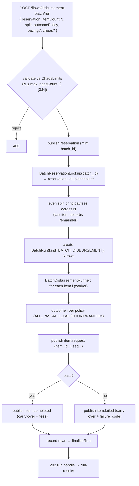

# Task 004 - Unattended batch-disbursement runner & endpoint (automatic mode, backend)

## Functional Requirements
- Execute a whole batch disbursement **unattended** on the backend: publish the reservation,
  resolve `reservation_id`, **split** principal/fees evenly across N items, decide each item's
  outcome by an **outcome policy**, and publish per item `item.request` then `item.completed |
  item.failed`.
- Support the idea's outcome controls: **all pass**, **all fail**, **exactly K pass** (the
  rest fail), or **random** (system decides per item).
- Track the run with the Phase 003/013 async runner behind a new
  `RunKind.BATCH_DISBURSEMENT`; each item is a `BatchRow` (a request+terminal unit); status
  rolls up exactly as N-Times/CSV/lifecycle runs.
- Apply **per-event chaos** when supplied; optional pacing. See
  [ADR-022](../../decisions/022-batch-disbursement-fan-out-flow-and-dual-mode-orchestration.md).

## Acceptance Criteria
- [ ] `POST /api/v0/flows/disbursement-batch/run` accepts a `BatchDisbursementRunRequest`
      (reservation intent + `itemCount = N` + split mode + `BatchOutcomePolicy` + optional
      pacing/chaos) and returns `202` with a `BatchRunResponse` run handle.
- [ ] `RunKind` gains `BATCH_DISBURSEMENT`; a `BatchRun(kind=BATCH_DISBURSEMENT)` tracks the
      run with `total = N`; per-item rows record `PUBLISHED`/`FAILED`; status rolls up via the
      existing `finalizeRun` (`COMPLETED`/`COMPLETED_WITH_FAILURES`/`FAILED`).
- [ ] The run publishes **exactly one** reservation and **exactly N** items; each item carries
      a distinct `item_id` and a 1-based `item_sequence`; all share `batch_id`,
      `batch_correlation_id`, `reservation_id`, and one `correlation_id`.
- [ ] **Even split** with remainder absorption: per-item `principal_amount =
      total_principal/N` and `item_fee = total_fees/N` at the currency scale, the **last** item
      absorbing the remainder so `Σ principal == total_principal` and `Σ fee == total_fees`
      exactly (and `Σ (principal+fee) == total_amount`).
- [ ] `BatchOutcomePolicy(mode, passCount?, seed?)` is honoured: `ALL_PASS`/`ALL_FAIL` →
      every item completes/fails; `COUNT` → exactly `passCount` items complete (the first
      `passCount` by sequence), the rest fail; `RANDOM` → per-item outcome from `OutcomeDecider`
      (seed + index), with `passCount` an optional target when present. `passCount` validated
      into `[0, N]`.
- [ ] `reservation_id` resolved via `BatchReservationLookup` (task 003) keyed by `batch_id`;
      on timeout an autogen placeholder is used and the fallback recorded.
- [ ] `N` validated against `ChaosLimits.maxBatchItems`; over-cap → `400`. Automatic runs are
      ASYNC-only.
- [ ] The plain `POST /flows/{type}`, the N-Times endpoint, and the random-lifecycle endpoint
      are unaffected; the run is listable/pollable via the existing `GET /batches`/`{id}`/`{id}/rows`.

## Technical Design
Target Java 25 / Spring Boot 4; virtual-thread workers (reuse `BatchRunner`).

A `BatchDisbursementRunner` (in `com.softspark.chaos.flow`) orchestrates one batch:
mint the reservation `FlowRequest` (autogen `batch_id`/`batch_correlation_id`), publish via
`FlowEngine`, resolve the reservation, compute the split, then for each item build the
`item.request` + terminal `FlowRequest`s from the carry-over map and publish them. A
`BatchDisbursementRunService` (mirrors `LifecycleRunService`) creates the `BatchRun` + N rows
and submits to `BatchRunner`. Outcome decisions reuse the existing `OutcomeDecider` (seed +
index → resume-safe; no `Math.random()`); `COUNT`/`ALL_*` are pure functions of index.

**Runner wiring on `BatchRunner`** — add an `executeBatchDisbursement(...)` entry (or
generalize the existing `executeLifecycle`) that runs each row as a **request+terminal**
unit: row `PUBLISHED` iff both publishes succeed, else `FAILED`; best-effort continue across
the N (mirrors batch). The single reservation publish happens once **before** the row loop
(in the run service), not per row. Pacing reuses `PacingPlan` (BURST = concurrent fan-out;
LINEAR/RANDOM = sequential paced). Per-event chaos labels follow a
`"BATCH_DISB:<batchId-short>:<i>/<N>:<phase>"` convention.

## Implementation Notes
- `batch/enumeration/RunKind.java`: add `BATCH_DISBURSEMENT`.
- `flow/dto/BatchDisbursementRunRequest.java`: reservation `PublishFlowRequest` (or its
  fields) + `itemCount`, `splitMode` (default `EVEN`), `BatchOutcomePolicy`, optional
  `NTimesOptions`-style pacing, optional `ChaosOptions`, optional item template fields
  (provider, credit account, subtype, countries).
- `flow/dto/BatchOutcomePolicy.java` + `Mode` enum (`ALL_PASS`, `ALL_FAIL`, `COUNT`,
  `RANDOM`).
- `flow/BatchSplit.java`: pure helper computing the per-item `BigDecimal` principal/fee with
  remainder absorption at a given scale; unit-tested independently.
- `flow/BatchDisbursementRunner.java` + `flow/BatchDisbursementRunService.java`: mirror
  `LifecycleRunner`/`LifecycleRunService`. Reuse `BatchDisbursementGroup.reservationToItem` /
  `itemRequestToTerminal` carry-over (task 002) to assemble item requests. Reuse
  `BatchReservationLookup` (task 003) in-process; placeholder via `base.Ids` UUID.
- `flow/controller/FlowController.java`: add the `disbursement-batch/run` route (ASYNC → `202`
  run handle).
- `batch/service/BatchRunner.java`: add `executeBatchDisbursement(...)` (or generalize
  `executeLifecycle`) for the request+terminal row unit.
- **Flyway `V11`**: `RunKind` persists as a string, so the new value needs no DDL; add
  nullable `external_batch_id` + `reservation_id` columns to `batch_run` so the run-results UI
  can deep-link to the ledger batch summary (task 006). Backward-compatible.
- Interrupt-aware sleeps; no `Math.random()`/wallclock in resume-relevant paths.

## Non-Functional Requirements
- Bounded concurrency/backpressure (reuse `chaos.batch.workers` + semaphore); the harness
  stays healthy while stressing the ledger. Reservation poll is bounded (task 003 timeout) so
  a worker never hangs. Correlation-id propagation into every published event.

## Dependencies
- **Task 001** (batch flow types/builders), **Task 002** (`BatchDisbursementGroup`
  carry-over + descriptors), **Task 003** (batch reservation lookup). Reuses Phase 013/003
  batch infra (`BatchRunner`, `BatchRun`/`BatchRow`, `PacingPlan`, `OutcomeDecider`).
- Consumed by task 006 (frontend automatic mode + run handoff).

## Risks & Mitigations
- **Request+terminal row semantics** (partial: request ok, terminal fails) → define row
  status rules explicitly + test; best-effort continue across the N.
- **Split rounding** leaving `Σ items ≠ totals` → `BatchSplit` absorbs the remainder in the
  last item; a property test asserts the sums for varied N/amounts/scales.
- **`processed + failed > item_count` throws at the ledger** → the runner publishes exactly N
  terminals; a test asserts N reservation+items and never N+1.
- **Reservation timeout in bulk** → placeholder fallback, recorded; the ledger keys off
  `batch_id` so the run still completes; the finalize-time summary read records the ledger's
  terminal status.
- **Caps** → reuse/extend `ChaosLimits` (`maxBatchItems`); reject oversize N / out-of-range
  `passCount` with `400`.

## Testing Strategy
Unit: `BatchSplit` sums back to totals across N/scales; `BatchOutcomePolicy` → expected
pass/fail pattern (incl. deterministic `RANDOM` by seed); `BatchDisbursementRunner` produces
one reservation + N items with shared `batch_id`/`reservation_id` and distinct `item_id`s;
placeholder fallback on reservation timeout. Integration (Testcontainers Kafka): a run of N
yields 1 + N×(request + terminal) publishes, run-tracked to a terminal status; reservation
resolved via a stub ledger; cap rejection → `400`. Folds into Phase 006.

## Deployment Strategy
Additive endpoint + one nullable/defaulted migration (`V11`) + new run kind; no feature flag.
Caps tunable via `chaos.limits.*`. Ships after tasks 001–003.
