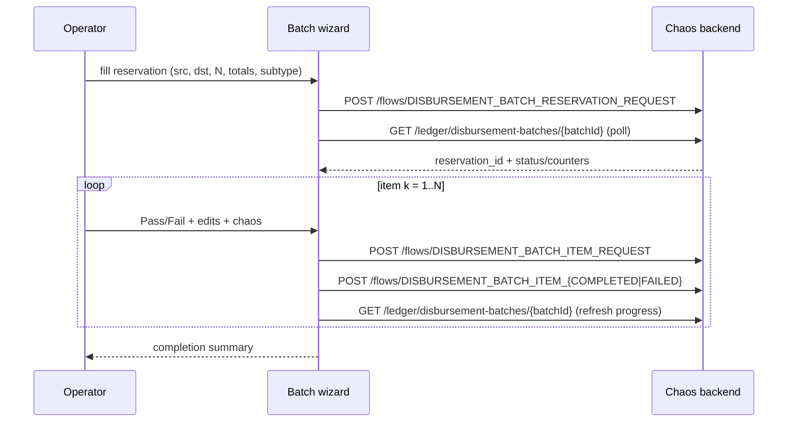

# Task 005 - Frontend: batch reservation form + interactive per-item wizard (manual mode)

## Functional Requirements
- Add **Batch Disbursement** to the Single Flow Run radio (driven by the catalog
  `runnerVisible` reservation entry + `batchGroup != null`).
- Render the **reservation form** (step 1) from the catalog descriptors: source VA
  (ORGANIZATION), destination VA (SYSTEM float), `item_count N`, `total_principal_amount`,
  `total_fees`, auto-computed `total_amount`, subtype, advanced/inferred fields, plus a chaos
  panel.
- After publishing the reservation, **poll for `reservation_id`** (batch-summary proxy) with
  a manual-entry fallback on timeout, then drive an interactive **per-item wizard**: cycle
  through N item forms, each with a **Pass / Fail** toggle, even-split prefill + carry-over,
  full editability, and its own chaos panel; on confirm publish `item.request` then
  `item.completed | item.failed`.
- Show a **progress panel** (item *k of N*, client running totals, and the ledger's live
  batch status/counters from the read-proxy).

## Acceptance Criteria
- [ ] The radio lists "Batch Disbursement"; selecting it shows the reservation form, not the
      generic single-flow form.
- [ ] `total_amount` is computed live as `total_principal_amount + total_fees` and shown
      read-only; the form shows the **even-split preview** (per-item principal/fee for the
      entered N, last item absorbing the remainder).
- [ ] Submitting step 1 calls `POST /flows/DISBURSEMENT_BATCH_RESERVATION_REQUEST` (chaos
      applied) and, on success, begins reservation polling via
      `getDisbursementBatch(batchId)`; the resolved `reservation_id` is captured for all items.
      On timeout, a manual-entry field appears (operator pastes the id).
- [ ] The wizard cycles exactly N items: each item form is prepopulated (split + carry-over),
      has a **Pass/Fail** toggle (Fail reveals `failure_reason`/`failure_code`), is editable,
      and carries its own chaos panel.
- [ ] Confirming an item publishes `POST /flows/DISBURSEMENT_BATCH_ITEM_REQUEST` then `POST
      /flows/DISBURSEMENT_BATCH_ITEM_COMPLETED` (Pass) or `.../DISBURSEMENT_BATCH_ITEM_FAILED`
      (Fail), with the carried `batch_id`/`batch_correlation_id`/`reservation_id`,
      per-item `item_id` (autogen) + 1-based `item_sequence`.
- [ ] The progress panel updates after each item from the read-proxy (status, processed/
      failed/pending) and the client shows item *k of N* + a completion summary at the end.
- [ ] Editing an item to break the amount invariant (e.g. principal+fee that won't sum to the
      reserved total) is allowed (chaos) and surfaced as a soft warning, not a hard block.

## Technical Design
A new `features/chaos/batch-disbursement-wizard.tsx`, launched from `single-flow-page.tsx`
when the selected catalog entry has `batchGroup != null` (sibling to the `lifecycle != null`
→ `lifecycle-wizard.tsx` branch). Reuses `transaction-type-form.tsx` (catalog-driven form),
`fee-list-field.tsx`, `country-select.tsx`, `chaos-options-panel.tsx`, and the VA pickers.

## Implementation Notes
- `chaos-admin/src/features/chaos/batch-disbursement-wizard.tsx`: new component (reservation
  step → poll → per-item loop → summary). Hold batch state (batch_id, batch_correlation_id,
  reservation_id, carried VAs/currency/subtype, split table) in component state.
- `chaos-admin/src/features/chaos/single-flow-page.tsx`: branch to the batch wizard when
  `entry.batchGroup` is set.
- `chaos-admin/src/lib/api.ts`: add `BatchDisbursementGroup` + `INTEGER` to the descriptor
  types; add `getDisbursementBatch(token, batchId): Promise<DisbursementBatchSummary>` and the
  `DisbursementBatchSummary` type. Reuse `runFlow(...)` for each phase publish.
- Compute the even split client-side (mirror the backend `BatchSplit`: divide at currency
  scale, last item absorbs remainder) for the preview/prefill; the backend is authoritative
  for the automatic path.
- Reuse `INTEGER` renderer (number input, min 1, max from a config/derived cap) for
  `item_count`.

## Non-Functional Requirements
- Poll interval/timeout mirror the backend config; the UI never hangs (timeout → manual
  entry). Each publish surfaces its result (event id/topic/status). Accessible form controls;
  large-N (e.g. 50) cycling stays responsive.

## Dependencies
- **Tasks 001 + 002** (flow types + catalog/`batchGroup` descriptors), **Task 003** (batch
  read-proxy for reservation_id + progress). Reuses the existing catalog-driven form + chaos
  panel + VA pickers.

## Risks & Mitigations
- **Operator abandons mid-batch** → state is local; a clear "X of N published; batch
  IN_PROGRESS on the ledger" banner; no server cleanup needed (observable condition).
- **Reservation never resolves** → manual-entry fallback; items can still publish (ledger
  ignores `reservation_id`).
- **Large N tedium** → offer a "switch to Automatic" affordance handing the current
  reservation inputs to task 006's mode.

## Testing Strategy
Frontend (Vitest + Testing Library + MSW): reservation form computes `total_amount` +
even-split preview; submit → reservation poll found/timeout/manual; the wizard cycles N items
with per-item Pass/Fail + carry-over + chaos and POSTs the right events in order; progress
panel renders ledger counters; assembled payloads match the contracts. Folds into Phase 006.

## Deployment Strategy
Additive UI behind the existing Single Flow Run page; no flag. Ships with the backend tasks.
