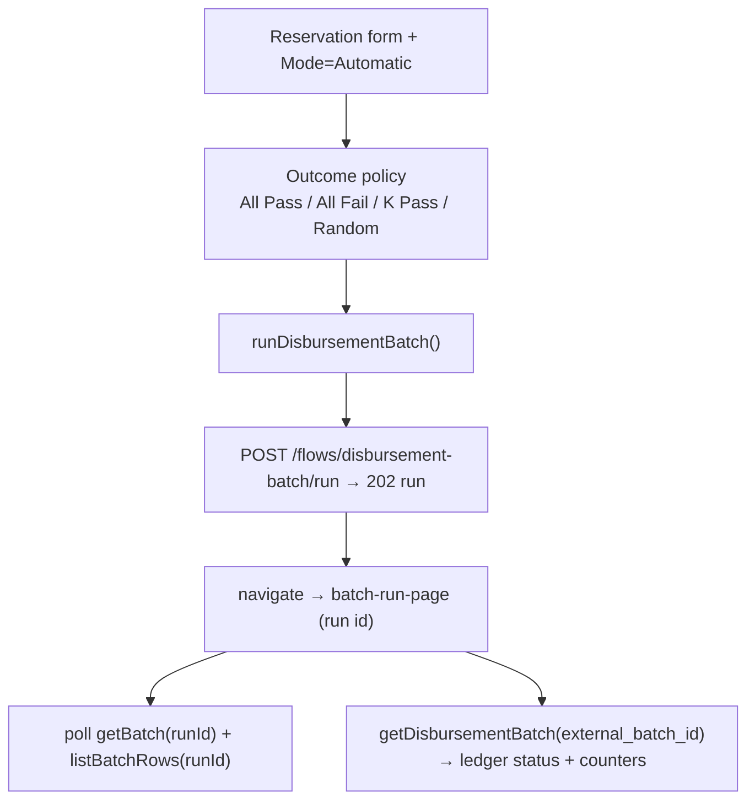

# Task 006 - Frontend: automatic mode (split + outcome policy) + run handoff

## Functional Requirements
- Add a **Mode** selector to the batch reservation form — **Manual** (task 005) vs
  **Automatic**.
- In Automatic mode, let the operator pick an **outcome policy** — **All Pass**, **All
  Fail**, **K Pass** (set how many pass; the rest fail), or **Random** — over the
  even-split preview, with optional pacing/chaos.
- Submit the whole batch as one **async run** via `POST /flows/disbursement-batch/run`, then
  **hand off** to the existing run-results view, which also surfaces the **ledger batch
  summary** (status + counters) for the run.

## Acceptance Criteria
- [ ] The reservation form shows a Manual/Automatic toggle; Automatic reveals the outcome
      policy controls and hides the per-item wizard.
- [ ] Outcome policy UI: radio `All Pass | All Fail | K Pass | Random`; `K Pass` reveals a
      `passCount` integer input constrained to `[0, N]`; `Random` optionally accepts a target
      pass-count; an even-split preview shows per-item principal/fee.
- [ ] Submitting Automatic calls `runDisbursementBatch(token, body)` →
      `POST /flows/disbursement-batch/run` with the reservation intent, `itemCount`,
      `splitMode`, `outcomePolicy`, optional pacing + chaos; on `202` it navigates to the
      run-results page for the returned run id.
- [ ] The run-results page (reused `batch-run-page.tsx`) polls the run to terminal and shows
      rows; for a `BATCH_DISBURSEMENT` run it additionally fetches and displays the **ledger
      batch summary** (status `INITIATED…PARTIALLY_COMPLETED`, processed/failed/pending,
      amounts) via the read-proxy using the run's stored `external_batch_id`.
- [ ] Over-cap N or out-of-range `passCount` surface the backend `400` as a field error.

## Technical Design
Extends task 005's reservation form with a mode toggle; Automatic submits to the runner
endpoint instead of driving the client wizard. Run-results reuse is additive — a batch
summary panel renders only when the run kind is `BATCH_DISBURSEMENT` and an
`external_batch_id` is present.

## Implementation Notes
- `chaos-admin/src/lib/api.ts`: add `BatchOutcomeMode = "ALL_PASS" | "ALL_FAIL" | "COUNT" |
  "RANDOM"`, `BatchOutcomePolicy`, `BatchDisbursementRunRequest`, and
  `runDisbursementBatch(token, body): Promise<BatchRunResponse>` → `POST
  /flows/disbursement-batch/run`. Add `RunKind` value `"BATCH_DISBURSEMENT"` and
  `external_batch_id`/`reservation_id` to `BatchRunResponse`.
- `chaos-admin/src/features/chaos/batch-disbursement-wizard.tsx` (from task 005): add the
  Mode toggle + outcome-policy panel; Automatic path calls `runDisbursementBatch` and
  navigates to run-results.
- `chaos-admin/src/features/chaos/batch-run-page.tsx`: when `run.kind === "BATCH_DISBURSEMENT"`
  and `run.externalBatchId`, render a **Ledger Batch** summary panel polling
  `getDisbursementBatch`.
- Reuse the `INTEGER` renderer for `passCount`; reuse `chaos-options-panel.tsx` for run-level
  chaos.

## Non-Functional Requirements
- The async submission returns quickly (`202`); the heavy work is server-side (task 004). The
  run-results polling stops at terminal (`isBatchTerminal`). The ledger summary panel polls on
  the same bounded cadence and degrades gracefully if the proxy errors.

## Dependencies
- **Task 002** (catalog/`batchGroup` for the reservation form), **Task 003** (batch summary
  proxy for run-results), **Task 004** (the `disbursement-batch/run` endpoint + run handle +
  `external_batch_id`). Builds on task 005's form component.

## Risks & Mitigations
- **Run-vs-batch mental model** (one run row = one item, one run = one ledger batch) →
  run-results copy clarifies; the Ledger Batch panel shows the authoritative batch state
  distinct from the chaos publish tallies.
- **`external_batch_id` missing** (older run / placeholder) → the summary panel is omitted,
  not errored.

## Testing Strategy
Frontend (Vitest + Testing Library + MSW): Mode toggle switches between wizard and automatic;
outcome-policy controls validate `passCount ∈ [0,N]`; Automatic submit posts the right body and
navigates to run-results; run-results renders the ledger batch summary for a
`BATCH_DISBURSEMENT` run; backend `400`s surface as field errors. Folds into Phase 006.

## Deployment Strategy
Additive UI; no flag. Ships with task 004.
