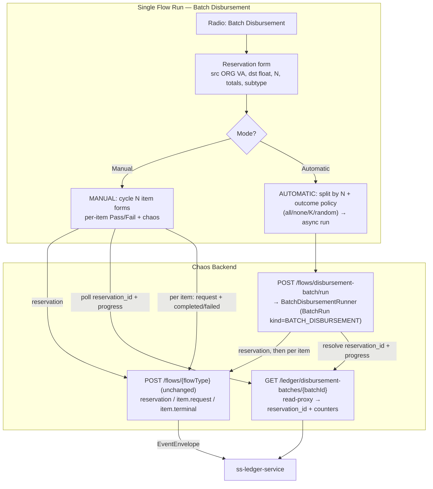
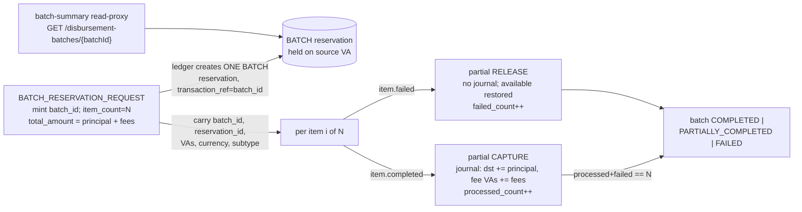

# Phase 16 - Batch Disbursement

## Summary
Adds **Batch Disbursement** to the Single Flow Run console — a real ledger **fan-out
lifecycle** (one batch reservation → N items, each item a request → completed | failed),
**distinct from the CSV upload flow** and from the single-disbursement lifecycle of
Phase 014. A first form creates the **batch reservation** (source ORG VA, destination
platform-float SYSTEM VA, totals, and a number **N** of items); from there the operator
either **manually cycles through N item forms** deciding pass/fail per item (an interactive
client wizard), or runs it **automatically** — the totals are split evenly across N and the
operator picks an **outcome policy** (all pass / all fail / exactly K pass / random),
executed unattended on a run-tracked server runner. Four new `FlowType`s + builders carry
the authoritative ledger batch contracts; the `reservation_id` and live batch progress come
from a thin batch-summary read-proxy. Backed by
[ADR-022](../../decisions/022-batch-disbursement-fan-out-flow-and-dual-mode-orchestration.md)
and [ADR-023](../../decisions/023-batch-reservation-id-and-progress-via-batch-summary-read-proxy.md).

## Motivation
Idea `011_batch_disbursement.md` asks for batch disbursements **on a single run**,
explicitly **"different from [the] csv upload flow"**. Verified against `ss-ledger-service`
source + `bin/kafka-payload-samples.md`, batch disbursement is a genuine ledger feature with
its own event family: a single **BATCH reservation** is held against the merchant VA for the
batch total, then each item **partially captures** (on completed) or **partially releases**
(on failed) its slice, and the ledger **derives** the batch status from completed/failed
counters until `processed + failed == item_count`. None of the existing chaos surfaces can
drive this: the single-disbursement lifecycle (Phase 014) emits the wrong events and has no
shared reservation; the CSV runner has no reservation gate, per-item pass/fail decisions, or
auto-split. This phase makes the harness emit the real batch contracts and gives the operator
two faithful ways to drive — and deliberately break — the batch lifecycle.

## User-Facing Changes
- **Single Flow Run radio** gains **Batch Disbursement** (driven by the catalog's
  `runnerVisible` flag on the reservation entry).
- **Reservation form (step 1):** source VA (ORGANIZATION), destination VA (platform-float
  SYSTEM), **item count N**, `total_principal_amount` (default `1000.0000`), `total_fees`
  (default `10`), auto-computed `total_amount = principal + fees`, `disbursement_subtype`
  (SELECT, `DOMESTIC` default), autogen `batch_id`/`batch_correlation_id`/`merchant_batch_ref`;
  advanced/inferred: merchant_id, currency, correlation_id, callback_url, authorised_principal.
  All chaos strategies apply.
- **A Mode selector — Manual or Automatic:**
  - **Manual:** publish the reservation, resolve `reservation_id` (poll → manual fallback),
    then **cycle through N item forms**. Each item shows a **Pass / Fail** toggle, is
    prepopulated by even split + carry-over, is fully editable, carries its own chaos panel,
    and on confirm publishes `item.request` then `item.completed | item.failed`. A progress
    panel shows item *k of N* and the **ledger's** live batch status/counters.
  - **Automatic:** pick an **outcome policy** — **All Pass**, **All Fail**, **K Pass**
    (operator sets how many pass; the rest fail), or **Random** — with an even-split preview;
    submit → one async **run** that fires the reservation + N items unattended and hands off
    to the existing run-results view (now also surfacing the ledger batch summary).
- **API (additive):**
  - `POST /api/v0/flows/{flowType}` unchanged — used per batch phase (reservation, each
    item.request, each item.completed/failed) in Manual mode.
  - `GET /api/v0/flows/catalog` entries gain `batchGroup` metadata + the four new flows'
    descriptors.
  - `POST /api/v0/flows/disbursement-batch/run` → `202` run handle (Automatic).
  - `GET /api/v0/ledger/disbursement-batches/{batchId}` → batch-summary read-proxy.

## Architecture Impact
Touches `com.softspark.chaos.flow` (four new flow types + builders + v1 models + the
`BatchDisbursementGroup` catalog grouping + the automatic runner/service), reuses
`com.softspark.chaos.batch` (`BatchRunner`/`BatchRun`/`BatchRow`) behind a new
`RunKind.BATCH_DISBURSEMENT`, and extends `com.softspark.chaos.ledgerproxy` (batch-summary
proxy + `BatchReservationLookup`, mirroring the Phase 012/014 pattern). One additive Flyway
migration (`V11` — `BATCH_DISBURSEMENT` run kind usage + optional nullable
`external_batch_id`/`reservation_id` columns on `batch_run` for deep-linking). On the
frontend, `features/chaos` gains the batch reservation form, the interactive per-item wizard,
the automatic outcome-policy panel, and the batch progress panel. **No new inbound Kafka
surface** (`reservation_id`/progress come via the HTTP read-proxy —
[ADR-023](../../decisions/023-batch-reservation-id-and-progress-via-batch-summary-read-proxy.md)).
See [ADR-022](../../decisions/022-batch-disbursement-fan-out-flow-and-dual-mode-orchestration.md).

Batch identity, reservation hold, and per-item capture/release (what the ledger does):

## Edge Cases
- **New flow family, not the single-disbursement reuse.** The four batch events have their
  own field sets, topics, and an `operation` discriminator; they must **not** reuse
  `DISBURSEMENT_INITIATED/COMPLETED/FAILED` or the `FlowLifecycle` wizard (ADR-022 §1).
- **Structured idempotency keys.** Builders emit the ledger's batch/item keys
  (`disbursement-batch-initiated:{batch_id}[:{item_id}]`,
  `disbursement-batch-item-{completed,failed}:{batch_id}:{item_id}`) rather than the default
  `event-type:eventId`, or the ledger's dedupe (and the chaos duplicate/replay strategies)
  would misbehave.
- **Amount invariant.** `total_amount == total_principal + total_fees` (exact, ledger-
  enforced — violation persists the batch `FAILED`). Even split absorbs the rounding
  remainder into the **last** item so `Σ item principal/fee == totals`. The ledger does
  **not** enforce item-sum == batch-total, so manual edits / an "unbalanced" toggle can
  leave the reservation over-/under-drawn — an intended, observable chaos condition.
- **`processed + failed > item_count` throws at the ledger.** The runner/wizard publish
  **exactly N** terminals; sending more is a deliberate (ledger-rejected) chaos action, not
  an accident.
- **Ordering.** The reservation must be consumed before any item terminal; the runner/wizard
  publish the reservation first and only proceed once it is sent (and, by default, once the
  `reservation_id` resolves). Item terminals may arrive in any order.
- **`item.request` is inert** at the ledger (recorded for idempotency, no side-effects);
  published by default for fidelity, optionally skippable.
- **`reservation_id` not resolved before timeout** — manual: show manual-entry; automatic:
  autogen placeholder (ledger ignores it; record the fallback).
- **Insufficient funds / non-ORG source VA** → the ledger persists the batch `FAILED`
  (counters never advance); the read-proxy surfaces this status so the operator sees why no
  items captured. A valid chaos scenario (e.g. reserve more than the VA holds).
- **Abandoned manual batch** (reservation sent, not all items) leaves the ledger batch
  `IN_PROGRESS` with a partially-held reservation — acceptable/observable for a harness.
- **Caps.** `N > maxBatchItems` → `400`; `passCount ∉ [0, N]` → `400`; missing/unresolved
  slots → `400` before publish. Automatic runs are ASYNC-only.
- **Cross-border subtype** makes `source_country`/`destination_country`/`corridor` (items)
  and `applied_fx_rate` (completed) relevant; defaults target `DOMESTIC` with `corridor`
  derived `GH-GH`.

## Testing Strategy
- **Backend unit:** each builder emits the exact ledger field set + topic + `operation`
  discriminator + **structured idempotency key** + `transactionReference`
  (reservation→`batch_id`, items→`item_id`); `fees[]` → `TransactionFeeLine` incl.
  `fee_code`; reservation `total_amount = total_principal + total_fees`; even-split with
  remainder absorption sums back to the totals; `BatchOutcomePolicy` → expected pass/fail
  pattern (ALL_PASS/ALL_FAIL/COUNT/RANDOM via the deterministic `OutcomeDecider`); catalog
  `BatchDisbursementGroup` grouping + carry-over; exactly the reservation entry is
  `runnerVisible`.
- **Backend bootstrap/slot:** a slot row exists for every `VA_REF.slotName` of the new
  flows (reservation source/destination; item terminal source/destination + fee VAs).
- **Backend integration (Testcontainers Kafka):** publish a full batch with required-only
  inputs — assert one reservation + N×(request + terminal) envelopes, correct topics, shared
  `correlation_id`/`batch_correlation_id`, distinct `item_id`s; the automatic runner produces
  a run with `total = N`, run-tracked to a terminal status; the batch-summary read-proxy
  returns `reservation_id` + counters (WireMock/stub ledger), incl. the timeout/placeholder
  path.
- **Frontend (MSW):** reservation form computes `total_amount` + even-split preview; manual
  wizard cycles N items with per-item Pass/Fail + carry-over + chaos and publishes the right
  events in order; reservation poll found/timeout/manual; automatic outcome-policy → async
  run handoff; progress panel renders ledger counters; assembled payloads match the contracts.
- Folds into the Phase 006 suites; Phase 011/013/014 flows and the CSV path are regression-
  checked as unaffected.

## Deployment Strategy
One additive Flyway migration (`V11` — nullable/defaulted columns + the new run-kind usage),
additive endpoints, and additive catalog fields — no feature flag. Old clients that never
select Batch Disbursement are unaffected. Auth and the target-cluster safety label are
inherited from the existing runner. The batch-summary read-proxy depends on the ledger
exposing `GET /api/v0/disbursement-batches/{batchId}` — confirm path/params/shape before
release. Ships as a normal backend + frontend deploy; `maxBatchItems` and the reservation
poll timeout default conservatively via `chaos.limits.*` / `chaos.ledger.reservation.poll.*`.

## Tasks
- [001 - Batch event models, builders, flow types & topics (backend)](./001-batch-event-models-builders-flow-types.md) — four `FlowType`s + v1 models + builders (reservation, item.request, item.completed, item.failed), `operation` discriminator, structured idempotency keys, `fees[]`, topic catalog, slot seeding.
- [002 - Batch catalog descriptors & fan-out grouping metadata (backend)](./002-batch-catalog-descriptors-and-fan-out-grouping.md) — `BatchDisbursementGroup` + carry-over, rich field descriptors per phase, `runnerVisible` on the reservation entry, `INTEGER` field kind, failure-code/subtype SELECTs.
- [003 - Batch reservation & progress read-proxy (backend)](./003-batch-reservation-and-progress-read-proxy.md) — `GET /ledger/disbursement-batches/{batchId}` proxy + `DisbursementBatchSummaryDto` + `BatchReservationLookup` (poll-until-present-or-timeout), shared by both modes.
- [004 - Unattended batch-disbursement runner & endpoint (automatic mode, backend)](./004-unattended-batch-disbursement-runner.md) — `RunKind.BATCH_DISBURSEMENT`, even-split, `BatchOutcomePolicy`, `BatchDisbursementRunner`/`RunService`, `POST /flows/disbursement-batch/run`, reuse `BatchRunner`.
- [005 - Frontend: batch reservation form + interactive per-item wizard (manual mode)](./005-frontend-batch-reservation-and-interactive-item-wizard.md) — reservation form, even-split prefill, reservation poll, per-item Pass/Fail wizard + per-event chaos, live progress panel.
- [006 - Frontend: automatic mode (split + outcome policy) + run handoff](./006-frontend-automatic-mode-and-run-handoff.md) — Mode toggle, outcome-policy selector, even-split preview, `disbursement-batch/run` call → run-results handoff with ledger batch summary.

## Parallel Tasks
- **001 is the unblocker** — the models/builders + flow types + slot seeding underpin
  everything; do the **model/builder + slot seeding first** (correctness-critical),
  descriptor work (002) alongside.
- **002 depends on 001** (it describes the new fields) and unblocks all frontend tasks (the
  descriptor + group contract they render).
- **003 is independent** of 001/002 (a self-contained read-proxy) and can start immediately;
  it unblocks the reservation step in 004/005/006.
- **004 depends on 001 (+002 carry-over, +003 reservation)** and unblocks 006.
- **005 depends on 001+002+003.** **006 depends on 002+003+004.**
- Dependency chain: `001 ─→ 002 ─→ (005 ‖ 006)`, with `003 ─→ (004, 005, 006)` and
  `004 ─→ 006`. 003 can start immediately in parallel with 001/002.
