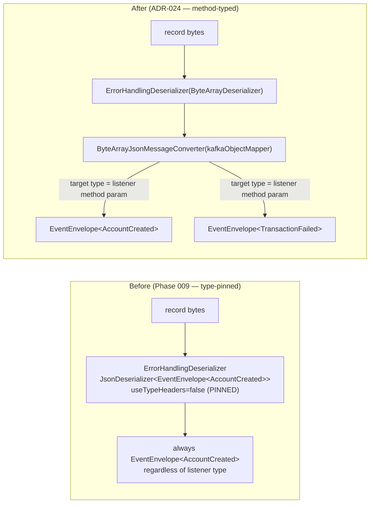

# Task 001 - Generalize the ledger-outbound Kafka consumer (method-typed, multi-event)

> Java 25 · Spring Boot 4 / Spring Kafka · package `com.softspark.chaos.kafka`
> Implements [ADR-024](../../decisions/024-multi-event-ledger-outbound-consumer.md). Extends
> the Phase 009 consumer ([ADR-011](../../decisions/011-ledger-owned-virtual-accounts-via-kafka-consumer.md)).

## Functional Requirements

1. A **single** Spring Kafka listener container factory deserializes **every** ledger
   outbound event by resolving the target type from each `@KafkaListener` method's
   `EventEnvelope<T>` parameter — no payload type is pinned on the factory.
2. The existing `ledger.account.created` listener is migrated onto this mechanism with
   **no change** to its externally observable behaviour (same projection, same DLT).
3. A new ledger-outbound topic, `ledger.transaction.failed`, is configurable via
   `chaos.topics.ledger-transaction-failed` (default `ledger.transaction.failed`); its DLT
   is **derived** as `<topic>.dlt`, not separately configured.
4. Malformed/poison payloads (bytes that cannot be converted to the declared type)
   dead-letter **immediately** to `<topic>.dlt` (non-retryable), matching today's
   `DeserializationException` behaviour.
5. The `chaos.kafka.consumer.enabled` toggle, configurable `group-id`, retry/back-off
   (`maxAttempts`, `backoffInitialMs`, `backoffMultiplier`) and concurrency continue to
   apply to all listeners.

## Acceptance Criteria

- [ ] `ConsumerConfiguration` exposes one `ledgerEventListenerContainerFactory` whose value
      deserializer is `ErrorHandlingDeserializer(ByteArrayDeserializer)` and which carries a
      `ByteArrayJsonMessageConverter` built from the shared `kafkaObjectMapper`.
- [ ] No `JsonDeserializer` default type is pinned and `trustedPackages("*")` is removed; the
      only types instantiated are the listener methods' declared `EventEnvelope<T>`.
- [ ] `onLedgerAccountCreated(EventEnvelope<LedgerAccountCreatedEventData>)` still receives a
      correctly-typed envelope and projects the VA; its existing Phase 006/009 Testcontainers
      tests pass unchanged.
- [ ] A `ByteArrayJsonMessageConverter`/`ErrorHandlingDeserializer` round-trips a snake_case
      ledger envelope (no JSON type headers) into the method-declared generic type.
- [ ] `MessageConversionException` (and Jackson `ConversionException`) are in the
      `DefaultErrorHandler` non-retryable set; a poison `ledger.account.created` payload still
      lands on `ledger.account.created.dlt` without exhausting retries.
- [ ] `TopicCatalog` resolves `ledger-transaction-failed` and the DLT-derivation helper yields
      `ledger.transaction.failed.dlt`.

## Technical Design

### Before → After (value path)



### Wiring sketch (`ConsumerConfiguration`)

```java
// value deserializer: raw bytes — JSON→object moves to the converter
ConsumerFactory<String, byte[]> ledgerEventConsumerFactory(...) {
  return new DefaultKafkaConsumerFactory<>(props,
      new ErrorHandlingDeserializer<>(new StringDeserializer()),
      new ErrorHandlingDeserializer<>(new ByteArrayDeserializer()));
}

ConcurrentKafkaListenerContainerFactory<String, byte[]> ledgerEventListenerContainerFactory(...) {
  var f = new ConcurrentKafkaListenerContainerFactory<String, byte[]>();
  f.setConsumerFactory(ledgerEventConsumerFactory);
  f.setRecordMessageConverter(new ByteArrayJsonMessageConverter(kafkaObjectMapper)); // <-- key change
  f.setConcurrency(props.concurrency());
  f.setCommonErrorHandler(ledgerEventErrorHandler);                                  // reused
  return f;
}

DefaultErrorHandler ledgerEventErrorHandler(...) {
  var backOff = new ExponentialBackOff(props.backoffInitialMs(), props.backoffMultiplier());
  backOff.setMaxAttempts(props.maxAttempts() - 1);
  var h = new DefaultErrorHandler(deadLetterPublishingRecoverer, backOff);
  h.addNotRetryableExceptions(
      DeserializationException.class,
      org.springframework.messaging.converter.MessageConversionException.class,
      org.springframework.kafka.support.converter.ConversionException.class);
  return h;
}
```

The `DeadLetterPublishingRecoverer` is unchanged: it derives `<topic>.dlt` from the failed
record's topic, so it serves every ledger-outbound listener with no per-event config.

> Spring Kafka resolves the conversion target from the listener method's generic parameter
> (`EventEnvelope<T>`). Because the ledger sends **no** JSON type headers, the converter's
> method-driven target type is what makes multiple payload types coexist on one factory.

## Implementation Notes

- **Modify** `chaos-machine/src/main/java/com/softspark/chaos/kafka/ConsumerConfiguration.java`:
  swap the value `JsonDeserializer` for `ByteArrayDeserializer`, add
  `setRecordMessageConverter(new ByteArrayJsonMessageConverter(kafkaObjectMapper))`, extend
  the non-retryable exception set. Keep `LEDGER_EVENT_CONTAINER_FACTORY` constant name so
  existing/new `@KafkaListener`s reference it unchanged.
- **Reuse** the existing `kafkaObjectMapper` (SnakeCase + JavaTime). If the consumer mapper
  is not currently a shared bean, extract it so producer and consumer share one config.
- **Modify** `chaos-machine/src/main/java/com/softspark/chaos/kafka/TopicCatalog.java`: add the
  `ledgerTransactionFailed` topic (config `chaos.topics.ledger-transaction-failed`, default
  `ledger.transaction.failed`) and a small `dltFor(String topic)` helper (`topic + ".dlt"`)
  if not already present in the recoverer.
- **Modify** `chaos-machine/src/main/java/com/softspark/chaos/account/consumer/LedgerAccountCreatedConsumer.java`
  only if needed (the method signature already declares
  `EventEnvelope<LedgerAccountCreatedEventData>`; likely no change).
- **Config:** add `chaos.topics.ledger-transaction-failed` to `application.yml`/properties.
- Library: `spring-kafka` already on the classpath provides `ByteArrayJsonMessageConverter`;
  no new dependency.

## Non-Functional Requirements

- **Security:** dropping `trustedPackages("*")` narrows deserialization to the declared
  method types — strictly safer.
- **Resilience:** bounded retry + DLT preserved; poison payloads can never block the
  partition (immediate dead-letter on conversion failure).
- **Performance:** one byte→object conversion per record; negligible.

## Dependencies

- Foundation for Task 002 (the `transaction.failed` listener rides this factory).
- External: the ledger publishes `ledger.transaction.failed` (+ `.dlt`), verified in
  `ss-ledger-service` (`ledger.kafka.transaction.topics`).

## Risks & Mitigations

- **Regressing the Phase 009 consumer.** → Its Testcontainers tests (projection, redelivery
  idempotency, poison→DLT) are the migration gate; run them green before merging.
- **Conversion-failure path differs from deserialization-failure path.** → Explicitly add
  `MessageConversionException`/`ConversionException` to the non-retryable set; add a poison
  payload test that asserts immediate DLT (no retry storm).
- **Generic-type resolution quirks** with `EventEnvelope<T>` on the listener method. →
  Covered by a round-trip test per declared type; if a raw generic ever fails to resolve,
  fall back to an explicit `JavaType` hint on the converter per listener.

## Testing Strategy

- **Unit:** `TopicCatalog` returns the configured topic and derived DLT; error-handler
  non-retryable set includes the conversion exceptions.
- **Integration (Testcontainers Kafka):** publish a headerless snake_case
  `ledger.account.created` envelope → VA projected (regression); publish a poison body →
  lands on `ledger.account.created.dlt` after no successful retry; (with Task 002) a
  `transaction.failed` envelope deserializes to its own type on the same factory.
- Folds into [Phase 006](../006-testing-and-verification/DESIGN.md).

## Deployment Strategy

- Pure wiring change; no migration. Safe to ship ahead of Task 002 (the new topic simply has
  no listener yet). Gated by the existing `chaos.kafka.consumer.enabled` toggle.
