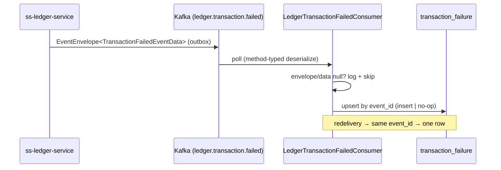

# Task 002 - `ledger.transaction.failed` projection: consumer, mirror record, table, idempotent upsert

> Java 25 · Spring Boot 4 / Spring Kafka · new package `com.softspark.chaos.transaction`
> Implements [ADR-025](../../decisions/025-transaction-failure-projection-and-request-id-correlation.md) (persistence half).
> Depends on Task 001 (the multi-event container factory).

## Functional Requirements

1. A `LedgerTransactionFailedConsumer` consumes `ledger.transaction.failed` on the shared
   `LEDGER_EVENT_CONTAINER_FACTORY` and persists each event into a new `transaction_failure`
   table.
2. Consumption is **idempotent**: a redelivered event (same envelope `event_id`) results in
   exactly one row.
3. The projection stores the full failure contract faithfully (raw payload retained for the
   detail view); `transaction_request_id` is indexed as the correlation key.
4. The consumer is gated by `chaos.kafka.consumer.enabled` and tolerates empty/partial
   envelopes (logs + skips, never throws on a null payload — that would needlessly DLT).

## Acceptance Criteria

- [ ] `LedgerTransactionFailedEventData` is a snake_case record mirroring the ledger contract:
      `(UUID transactionId, String transactionRequestId, String transactionType, String failureCode, String failureReason)`.
- [ ] `@KafkaListener(topics = "${chaos.topics.ledger-transaction-failed}", groupId = …, containerFactory = LEDGER_EVENT_CONTAINER_FACTORY)`
      receives `EventEnvelope<LedgerTransactionFailedEventData>`.
- [ ] Flyway `V12` creates `transaction_failure` with a UNIQUE constraint on `event_id` and
      indexes on `transaction_request_id`, `ledger_transaction_id`, `transaction_type`, `occurred_at`.
- [ ] Publishing one failure event creates one row with every field mapped
      (envelope + data + metadata); publishing it twice leaves exactly one row.
- [ ] An envelope with null `data` is logged and skipped (no row, no exception, no DLT).
- [ ] A malformed payload dead-letters to `ledger.transaction.failed.dlt` (via Task 001's
      handler), not an infinite retry.

## Technical Design

### Field mapping (envelope → row)

| Row column | Source |
|---|---|
| `id` | `Ids.generate()` (UUID) |
| `event_id` | envelope `event_id` *(unique)* |
| `transaction_request_id` | `data.transaction_request_id` **(correlation key)** |
| `ledger_transaction_id` | `data.transaction_id` (ledger recording id) |
| `transaction_type` | `data.transaction_type` |
| `failure_code` | `data.failure_code` |
| `failure_reason` | `data.failure_reason` |
| `ledger_correlation_id` | `metadata.correlation_id` (= recording id) |
| `idempotency_key` | `metadata.idempotency_key` (`"{request_id}:failed"`) |
| `tenant_id` | `metadata.tenant_id` |
| `occurred_at` | envelope `timestamp` |
| `received_at` | `Instant.now()` at consume |
| `payload_json` | serialized raw envelope |

> **Do not confuse the two ids.** `ledger_transaction_id` (= `data.transaction_id`) is the
> ledger's own recording UUID; `transaction_request_id` is the chaos-supplied id that
> correlation matches on. See [ADR-025](../../decisions/025-transaction-failure-projection-and-request-id-correlation.md).



### Persistence

- `TransactionFailure` JPA entity, table `transaction_failure`, TEXT id + ISO-8601 TEXT
  timestamps via `InstantStringConverter` (matches `PublishRecord` conventions — immutable,
  no `AuditableEntity`/`updated_at`).
- Idempotent upsert: try-insert and swallow the unique-constraint violation on `event_id`,
  or `existsByEventId` guard before insert. (Mirror the Phase 009 projection's
  upsert-by-key approach.)

### Flyway `V12__transaction_failure.sql`

```sql
CREATE TABLE IF NOT EXISTS transaction_failure (
    id                     TEXT PRIMARY KEY,
    event_id               TEXT NOT NULL UNIQUE,
    transaction_request_id TEXT NOT NULL,
    ledger_transaction_id  TEXT NOT NULL,
    transaction_type       TEXT NOT NULL,
    failure_code           TEXT,
    failure_reason         TEXT,
    ledger_correlation_id  TEXT,
    idempotency_key        TEXT,
    tenant_id              TEXT,
    occurred_at            TEXT NOT NULL,
    received_at            TEXT NOT NULL,
    payload_json           TEXT
);
CREATE INDEX IF NOT EXISTS idx_tf_request_id      ON transaction_failure (transaction_request_id);
CREATE INDEX IF NOT EXISTS idx_tf_ledger_txn_id   ON transaction_failure (ledger_transaction_id);
CREATE INDEX IF NOT EXISTS idx_tf_txn_type        ON transaction_failure (transaction_type);
CREATE INDEX IF NOT EXISTS idx_tf_occurred_at     ON transaction_failure (occurred_at);
```

## Implementation Notes

- **New package** `com.softspark.chaos.transaction` (feature-first, mirrors the ledger's own
  `transaction` naming and the Phase 009 `account/consumer` shape):
  - `consumer/LedgerTransactionFailedConsumer.java` — `@KafkaListener` + `@ConditionalOnProperty(prefix="chaos.kafka.consumer", name="enabled", havingValue="true", matchIfMissing=true)`.
  - `consumer/LedgerTransactionFailedEventData.java` — `@JsonNaming(SnakeCaseStrategy.class)` mirror record.
  - `model/TransactionFailure.java` — JPA entity.
  - `repository/TransactionFailureRepository.java` — `JpaRepository<TransactionFailure, String>` + `boolean existsByEventId(String)`; query methods land in Task 004.
  - `service/TransactionFailureProjectionService.java` — maps envelope → entity, idempotent upsert.
- **New migration** `chaos-machine/src/main/resources/db/migration/V12__transaction_failure.sql`
  (next free version; on-disk highest is `V11__batch_disbursement_runs`).
- The consumer **only persists**; correlation to publishes is query-time (Task 004), so this
  task has **no** dependency on the flow engine or `publish_record`.

## Non-Functional Requirements

- **Resilience:** at-least-once safe (upsert by `event_id`); a null/partial envelope never
  DLTs (defensive skip) — only genuinely unparseable bytes DLT.
- **Observability:** debug-log each consumed failure (`transaction_request_id`,
  `failure_code`); a counter for projected failures aids the consumer-lag view.
- **Storage:** unbounded growth is acceptable for a test harness; note a future retention/
  pruning job as out of scope.

## Dependencies

- **Task 001** (container factory + topic config) — hard prerequisite.
- External ledger contract (verified): `TransactionFailedEventData` +
  `EventEnvelope`/`EventMetadata`, snake_case, no type headers.

## Risks & Mitigations

- **Contract drift** if the ledger adds/renames a failure field. → Jackson
  `fail-on-unknown-properties=false` (already the project default) tolerates additive
  changes; a contract test asserts the exact field set the ledger emits today.
- **Idempotency race** on concurrent redelivery. → UNIQUE(`event_id`) makes the second
  insert fail at the DB; catch and treat as no-op. Keep consumer `concurrency=1` (current
  default) to avoid intra-instance races.

## Testing Strategy

- **Unit:** envelope→entity mapping (all columns, both ids correctly assigned);
  null-data skip; idempotent upsert (existsByEventId path).
- **Integration (Testcontainers Kafka):** publish a `transaction.failed` envelope → one row
  with correct mapping; republish → still one row; poison payload → `…​.failed.dlt`.
- **Contract:** `LedgerTransactionFailedEventData` round-trips the ledger's exact JSON
  (snake_case sample from `ss-ledger-service` / `bin/kafka-payload-samples.md`).
- Folds into [Phase 006](../006-testing-and-verification/DESIGN.md).

## Deployment Strategy

- Additive Flyway `V12`; no backfill. Consumer gated by `chaos.kafka.consumer.enabled`;
  group id configurable. Shippable independently — the table simply fills as failures arrive.
