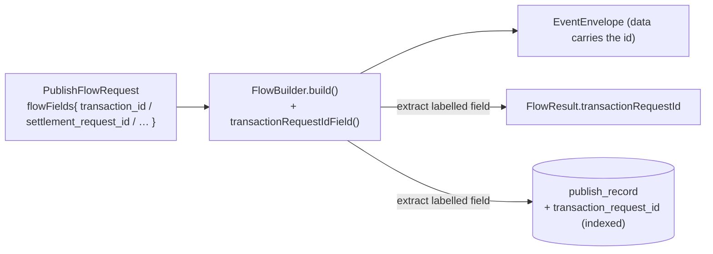

# Task 003 - Capture the transaction request id on publish (catalog label, publish_record column, publish-response field)

> Java 25 · Spring Boot 4 · packages `com.softspark.chaos.flow`, `…​.history`
> Implements [ADR-025](../../decisions/025-transaction-failure-projection-and-request-id-correlation.md) (publish-side half).
> No new Kafka surface; no change to any outbound wire contract.

## Functional Requirements

1. Each flow that mints a transaction declares **which** of its payload fields is the
   canonical `transaction_request_id` (the value the ledger files under `transactionRequestId`).
2. At publish time, that value is persisted in a new `publish_record.transaction_request_id`
   column (indexed), enabling a single-lookup join from a failure back to its publish.
3. The publish responses expose the emitted request id(s): `FlowResult.transactionRequestId`
   and `NTimesSyncResult.transactionRequestIds`.
4. Flows that mint **no** transaction (e.g. `organization.onboarded`,
   `organization.va.updated`) set the column null and the response field null/empty — and
   must not arm any downstream failure polling.

## Acceptance Criteria

- [ ] The flow catalog/descriptor carries a per-flow designation of the request-id field
      (a `transactionRequestId: true` field-descriptor flag **or** a
      `FlowBuilder.transactionRequestIdField()` accessor). The mapping matches the verified
      ledger fields: `transaction_id` (collection, disbursement *), `settlement_request_id`
      (settlement *), `transfer_request_id`, `topup_request_id`,
      `{prefund,sweep,transfer}_request_id`, `batch_id`, `item_id`.
- [ ] `publish_record` gains a nullable, indexed `transaction_request_id` column (Flyway,
      additive); `AsyncHistoryWriter` populates it from the labelled field when present.
- [ ] `FlowResult` gains `transactionRequestId` (nullable); `NTimesSyncResult` gains
      `transactionRequestIds` (the per-iteration ids minted by `NTimesExpander`). Their
      TypeScript mirrors in `api.ts` are updated.
- [ ] Publishing a collection returns the same UUID it placed in `data.transaction_id`;
      publishing a settlement returns the `settlement_request_id`; a non-transactional flow
      returns null.
- [ ] An N-Times sync run returns N distinct request ids matching the N emitted payloads.
- [ ] No outbound payload bytes change versus today (the values were already in the payload;
      this task only *labels, stores, and echoes* them).

## Technical Design



- **Labelling.** Builders already read the field by name (e.g.
  `f.getRequired("settlement_request_id")`). Add `transactionRequestIdField()` to the
  `FlowBuilder` SPI (default `Optional.empty()` for non-transactional builders), returning
  the field name. The `FlowEngine` resolves the value =
  `request.flowFields().get(builder.transactionRequestIdField())` after building, and threads
  it to both the response and the history writer.
- **N-Times.** `NTimesExpander` already re-mints autogen fields per iteration; collect the
  labelled field's value from each expanded `FlowRequest` into the
  `NTimesSyncResult.transactionRequestIds` list (order-aligned with `eventIds`/`historyIds`).
- **History.** `HistoryWriter.record(...)`/`recordBatch(...)`/`recordFailure(...)` accept the
  resolved request id (or extract it from the already-passed `FlowRequest` + the builder's
  field name); `AsyncHistoryWriter.persistEvent` writes the new column.

### Flyway `V13__publish_record_transaction_request_id.sql`

```sql
ALTER TABLE publish_record ADD COLUMN transaction_request_id TEXT;
CREATE INDEX IF NOT EXISTS idx_pr_transaction_request_id
    ON publish_record (transaction_request_id);
```

## Implementation Notes

- **Modify** `flow/builder/FlowBuilder.java` (SPI): add
  `default Optional<String> transactionRequestIdField() { return Optional.empty(); }`;
  override in the transaction-bearing builders (collection, disbursement
  initiated/completed/failed, settlement initiated/completed/failed, transfer, topup,
  treasury ×3, batch-reservation, batch-item). Source the field name from
  `FlowCatalogProvider` so it stays single-sourced with the descriptors.
- **Modify** `flow/FlowEngine.java`: after `builder.build(...)`, resolve the request id and
  set it on `FlowResult` and pass to the `HistoryWriter`.
- **Modify** `flow/FlowResult.java` (+ builder), `flow/NTimesSyncResult.java`,
  `flow/chaos/NTimesExpander.java` (surface the per-iteration ids),
  and the N-Times runner that assembles `NTimesSyncResult`.
- **Modify** `history/model/PublishRecord.java` (+ field/column),
  `history/service/AsyncHistoryWriter.java` (populate), `history/dto/PublishRecordResponse.java`
  (expose `transactionRequestId` — needed by Task 006).
- **Modify** `chaos-admin/src/lib/api.ts`: add `transactionRequestId` to the `FlowResult`
  type and `PublishRecordResponse` type, `transactionRequestIds` to `NTimesSyncResult`.
- **New migration** `V13__publish_record_transaction_request_id.sql` (after Task 002's `V12`).
- Prefer routing the field name through `FlowCatalogProvider` so the label, the autogen
  descriptor, and the extraction all reference one definition (avoid a second hard-coded map).

## Non-Functional Requirements

- **Backward compatibility:** additive column + additive response fields; existing consumers
  of `FlowResult`/history ignore unknown/new fields. Historical rows keep null.
- **No contract drift:** outbound payloads are byte-identical to today; this is purely
  capture + echo of values already present.

## Dependencies

- **Task 002** provides the failure side this key joins against (but 003 itself only needs
  the publish path; can be built in parallel with 004).
- Relies on the Phase 011/014 catalog (autogen request-id descriptors) being present.

## Risks & Mitigations

- **Field-name drift between chaos and ledger.** The two are aligned *today* (see ADR-025
  table). → A unit test asserts, per transaction-bearing flow, that
  `transactionRequestIdField()` equals the documented ledger source field; if the ledger
  contract changes, this test fails loudly.
- **Batch flows** key on `batch_id`/`item_id`, not a `*_request_id`. → The label handles
  this since it names the field explicitly; confirm against Phase 016 builders.
- **Double-sourcing the field name** (descriptor vs builder override). → Single-source via
  `FlowCatalogProvider`.

## Testing Strategy

- **Unit:** per flow, `transactionRequestIdField()` returns the expected name; `FlowEngine`
  resolves the value and sets it on `FlowResult`; `AsyncHistoryWriter` persists it;
  non-transactional flows yield null.
- **Unit:** `NTimesExpander` produces N distinct request ids surfaced in
  `NTimesSyncResult.transactionRequestIds`.
- **Integration:** publish via `POST /flows/{type}` → response carries the id and the
  `publish_record` row has it indexed; a later matching `transaction_failure` row joins by it.
- Folds into [Phase 006](../006-testing-and-verification/DESIGN.md).

## Deployment Strategy

- Additive Flyway `V13`; ship after `V12`. No backfill; outcome correlation applies to
  publishes made after rollout.
