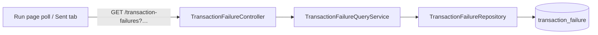

# Task 004 - Transaction-failures query API

> Java 25 · Spring Boot 4 · package `com.softspark.chaos.transaction` (controller/dto/service)
> Implements the query surface of [ADR-025](../../decisions/025-transaction-failure-projection-and-request-id-correlation.md).
> Depends on Task 002 (the `transaction_failure` table).

## Functional Requirements

1. Expose a read API over the `transaction_failure` projection under
   `GET /api/v0/transaction-failures`, filterable and paginated, following the `/history`
   conventions (same `PageResponse<T>`, zero-based `page`, `size` capped at 100).
2. Support the two access shapes the UI needs:
   - **single** `?transactionRequestId={id}` — the run-page poll (returns the one match or empty);
   - **batch** `?transactionRequestIds={a,b,c}` — one call per "Sent" history page (Task 006).
3. Support operator browsing filters: `transactionType`, `failureCode`, `ledgerTransactionId`,
   `from`/`to` (ISO-8601 on `occurred_at`), plus `GET /api/v0/transaction-failures/{id}`.
4. Default ordering `occurred_at` DESC.

## Acceptance Criteria

- [ ] `GET /api/v0/transaction-failures?transactionRequestId=…` returns a
      `PageResponse<TransactionFailureResponse>` with the matching failure, or empty content.
- [ ] `GET /api/v0/transaction-failures?transactionRequestIds=a,b,c` returns all failures whose
      `transaction_request_id` is in the set (bounded `IN (…)`), for one-call-per-page outcome
      resolution.
- [ ] Filters `transactionType`, `failureCode`, `ledgerTransactionId`, `from`, `to` work and
      compose; results page and sort `occurred_at` DESC.
- [ ] `GET /api/v0/transaction-failures/{id}` returns one record (404 if absent) including
      `payloadJson` for the detail view.
- [ ] All endpoints require a verified AUTH SERVICE token (same security as `/history`).
- [ ] `size` is clamped to ≤ 100; `transactionRequestIds` cardinality is bounded (e.g. ≤ 200)
      with a clear error beyond it.

## Technical Design

### Endpoints

| Method · Path | Query | Returns |
|---|---|---|
| `GET /api/v0/transaction-failures` | `transactionRequestId?`, `transactionRequestIds?` (CSV), `transactionType?`, `failureCode?`, `ledgerTransactionId?`, `from?`, `to?`, `page=0`, `size=20` | `PageResponse<TransactionFailureResponse>` |
| `GET /api/v0/transaction-failures/{id}` | — | `TransactionFailureResponse` (404 if absent) |

`TransactionFailureResponse` (record + `@RecordBuilder`, mirrors `PublishRecordResponse` style):

```
id, eventId, transactionRequestId, ledgerTransactionId, transactionType,
failureCode, failureReason, ledgerCorrelationId, idempotencyKey, tenantId,
occurredAt (Instant), receivedAt (Instant), payloadJson (nullable)
```

### Repository

Extend `TransactionFailureRepository` with derived queries mirroring
`PublishRecordRepository`:

```java
Page<TransactionFailure> findByTransactionRequestId(String id, Pageable p);
List<TransactionFailure> findByTransactionRequestIdIn(Collection<String> ids);  // batch
Page<TransactionFailure> findByTransactionType(String type, Pageable p);
Page<TransactionFailure> findByFailureCode(String code, Pageable p);
Page<TransactionFailure> findByLedgerTransactionId(String id, Pageable p);
Page<TransactionFailure> findByOccurredAtBetween(Instant from, Instant to, Pageable p);
```

A small `TransactionFailureQueryService` chooses the query by which filters are present
(same dispatch style as `HistoryController`/its service), defaulting to `findAll` sorted by
`occurred_at` DESC.



## Implementation Notes

- **New** `transaction/controller/TransactionFailureController.java`,
  `transaction/dto/TransactionFailureResponse.java`,
  `transaction/service/TransactionFailureQueryService.java`.
- **Extend** `transaction/repository/TransactionFailureRepository.java` (Task 002 created it).
- Reuse the shared `PageResponse<T>` and pagination/sort helpers from `base`/`history`.
- Parse `transactionRequestIds` as a CSV `@RequestParam List<String>` (Spring binds CSV),
  reject empty and over-cardinality with the standard `ApiError` envelope.
- springdoc annotations consistent with the rest of `/api/v0`.
- **Add** the matching client functions in `chaos-admin/src/lib/api.ts`:
  `getTransactionFailureByRequestId(token, id)` and
  `listTransactionFailuresByRequestIds(token, ids[])`, plus the `TransactionFailureResponse`
  type (used by Tasks 005/006).

## Non-Functional Requirements

- **Performance:** all filters hit indexed columns (`transaction_request_id`,
  `ledger_transaction_id`, `transaction_type`, `occurred_at`); the batch `IN (…)` is bounded.
- **Security:** AUTH-gated like every `/api/v0/**` route; failures may carry tenant ids.
- **Consistency:** error envelope, paging, and sort semantics identical to `/history` so the
  frontend reuses its patterns.

## Dependencies

- **Task 002** (table + repository + entity).
- Consumed by **Task 005** (single poll) and **Task 006** (batch per-page lookup).

## Risks & Mitigations

- **Unbounded `transactionRequestIds`** could build a huge `IN` clause. → Cap cardinality
  (≤ 200) and document; the "Sent" page size (≤ 100) sits under it.
- **CSV binding edge cases** (encoding, empty tokens). → Trim/blank-filter; unit-test the
  binder.

## Testing Strategy

- **Unit/slice (`@WebMvcTest` + `@DataJpaTest`):** each filter and the batch `IN`; paging and
  `occurred_at` DESC sort; 404 on missing id; `size` clamp; cardinality guard.
- **Integration:** seed failures → assert single, batch, and browse queries; AUTH required.
- Folds into [Phase 006](../006-testing-and-verification/DESIGN.md).

## Deployment Strategy

- Pure read API over the Task 002 table; no migration of its own. Shippable as soon as 002
  lands.
