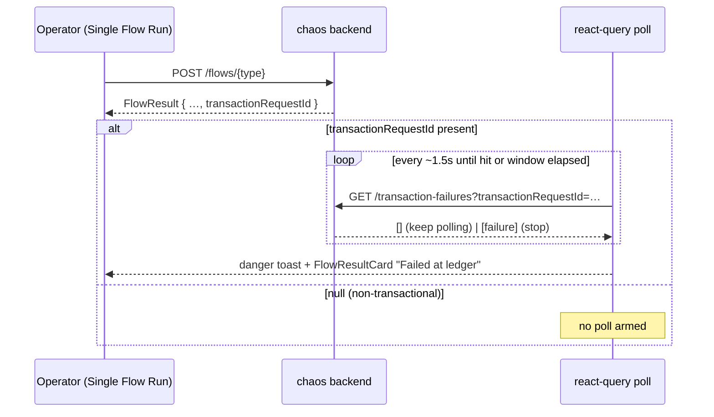

# Task 005 - Frontend: run-page failure polling + toast

> React 19 · Vite · react-query 5 · shadcn/ui · `chaos-admin/src/features/chaos`
> Implements [ADR-026](../../decisions/026-run-page-failure-surfacing-via-bounded-polling.md).
> Depends on Task 004 (failures API) and Task 003 (publish response returns the request id).

## Functional Requirements

1. After a successful publish of a **transaction-bearing** flow on Single Flow Run, the page
   polls the failures API scoped to the just-emitted `transaction_request_id`(s) within a
   bounded window and shows a **toast** if the ledger reports a failure.
2. The single-flow result card reflects the ledger outcome ("Failed at ledger" with code) on
   a hit; the N-Times sync result card shows a "k of N failed at ledger" summary.
3. Non-transactional flows (onboarding, va-updated, …) never arm the poll.
4. The UI never represents a clean poll window as "succeeded" — only "no failure observed".

## Acceptance Criteria

- [ ] `sonner` is installed and a single `<Toaster/>` is mounted in the app shell.
- [ ] On a single-flow publish that returns a non-null `transactionRequestId`, a react-query
      poll runs `GET /transaction-failures?transactionRequestId={id}` at ≈1500 ms while the
      page is mounted, stopping on the first hit or after the window (default ≈25 s).
- [ ] On a hit: a **danger toast** shows `failure_code` + `failure_reason` and deep-links to
      the failure detail; `FlowResultCard` switches to a failed/ledger-rejected state.
- [ ] On an N-Times sync run, the poll uses `?transactionRequestIds=…` over the returned id
      list and toasts a summary; it stops when all ids resolve or the window elapses.
- [ ] A publish whose `transactionRequestId` is null (non-transactional flow) arms no poll.
- [ ] Interval, window, and a master enable flag are front-end constants/config (no redeploy
      of the API to retune).
- [ ] Copy for the "no failure within window" state reads as inconclusive, not success.

## Technical Design

- **Poll hook** `useTransactionFailureWatch(requestIds: string[])` wrapping `useQuery` with
  `refetchInterval` returning `false` once a failure is found or a `pollUntil` deadline
  passes (mirror `lifecycle-wizard` reservation poll and `virtual-accounts-page`'s
  `Date.now() < pollUntil` guard). `enabled` only when `requestIds.length > 0`.
- **Single vs N-Times:** single passes `[transactionRequestId]`; N-Times passes the returned
  `transactionRequestIds`. The hook dispatches to the single or batch endpoint accordingly.
- **Toast:** `toast.error(...)` from `sonner`, fired once per resolved failure (dedupe by
  `transaction_request_id` to avoid repeats across refetches).
- **Result cards:** extend `FlowResultCard` / `NTimesSyncResultCard` to render the
  ledger-outcome state from the watch result.

## Implementation Notes

- **Add dependency** `sonner` to `chaos-admin/package.json`; mount `<Toaster richColors />`
  in `components/layout/app-shell.tsx` (so toasts show across the protected routes).
- **New** `chaos-admin/src/features/chaos/use-transaction-failure-watch.ts` (the poll hook).
- **Modify** `chaos-admin/src/features/chaos/single-flow-page.tsx`: after `runFlow` /
  `publishNTimes` resolves, feed the returned request id(s) into the watch hook; render
  outcome on the result cards.
- **Constants:** `FAILURE_POLL_INTERVAL_MS = 1500`, `FAILURE_POLL_WINDOW_MS = 25_000`
  (mirroring the reservation-poll constants), plus a `failureWatchEnabled` flag in
  `lib/env.ts`/`appConfig`.
- Reuse the `getTransactionFailureByRequestId` / `listTransactionFailuresByRequestIds`
  client functions added in Task 004.

## Non-Functional Requirements

- **Server load:** scoped (single/few request ids), indexed query, bounded window, mounted-
  only — negligible (see ADR-026). No global or unbounded polling.
- **UX:** toast is non-blocking and stacks; does not hijack the form; deep-link lets the
  operator inspect the failure.
- **Correctness of meaning:** absence of a failure ≠ success (asynchronous; window-bounded).

## Dependencies

- **Task 004** (failures endpoints), **Task 003** (`transactionRequestId` in publish
  responses; null for non-transactional flows gates the poll).

## Risks & Mitigations

- **Operator navigates away mid-window** → poll unmounts and stops (react-query); failure is
  still visible later on the "Sent" tab (Task 006). Acceptable.
- **Late failure (after window)** → not toasted; surfaced on the "Sent" tab. Window is
  tunable if operators want longer.
- **Toast spam on refetch** → dedupe fired toasts by request id.
- **No toast lib today** → `sonner` is small and shadcn-standard; single `<Toaster/>` mount.

## Testing Strategy

- **Component (Vitest + Testing Library):** publish→failure-found fires one danger toast and
  flips the card; publish with null request id arms no poll; window-elapsed stops polling
  with inconclusive copy; N-Times summary toast counts correctly; toast dedupe.
- **Manual/e2e:** drive a deliberately-failing flow (e.g. insufficient funds) and confirm the
  toast appears on the run page within the window (ties into Phase 006 e2e).

## Deployment Strategy

- Frontend-only; ships after Tasks 003/004. The watch is behind `failureWatchEnabled`
  (default on) so it can be disabled without a rebuild of the backend.
