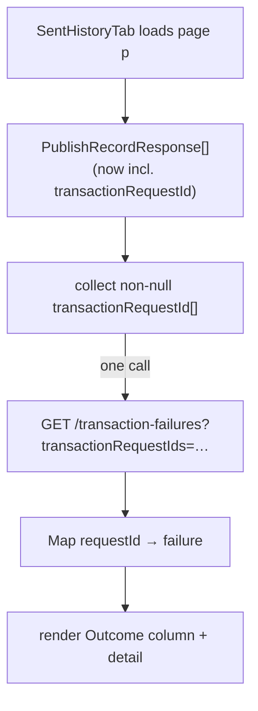

# Task 006 - Frontend: correlate failures into the "Sent" history tab

> React 19 · Vite · react-query 5 · `chaos-admin/src/features/transactions`
> Implements the history-correlation surface of
> [ADR-025](../../decisions/025-transaction-failure-projection-and-request-id-correlation.md).
> Depends on Task 004 (batch failures lookup) and Task 003 (`transactionRequestId` on `PublishRecordResponse`).

## Functional Requirements

1. The "Sent (Chaos History)" tab — which today shows only that an event was **published** —
   gains a **ledger outcome** signal: whether the published transaction was later rejected by
   the ledger.
2. Outcome is resolved with **one** batch call per page (the Phase 015 batch-balance pattern),
   keyed by the page rows' `transaction_request_id`s — not N calls.
3. A failed row exposes the `failure_code`/`failure_reason` (in a column badge and the row
   detail dialog), and links to the failure detail.
4. Rows for non-transactional flows (null `transaction_request_id`) show a neutral "—"
   outcome, not a false "OK".

## Acceptance Criteria

- [ ] After a history page loads, the tab collects the non-null `transactionRequestId`s and
      issues one `GET /transaction-failures?transactionRequestIds=…` call, building a
      `requestId → failure` map.
- [ ] A new **Outcome** column renders: `Published` (no failure observed), `Failed @ ledger`
      (danger badge with `failure_code`) when a failure exists, or `—` when the row has no
      `transaction_request_id`.
- [ ] The existing **Status** column (publish outcome `PUBLISHED`/`FAILED`) is retained and
      visually distinct from the new ledger **Outcome** (publish-to-Kafka vs ledger-accepted
      are different things — label them so).
- [ ] The row detail dialog shows the correlated failure (`failure_reason`, ledger recording
      id, `occurred_at`) when present.
- [ ] Outcome copy frames "no failure" as *not observed*, never an affirmative success.
- [ ] The batch lookup is gated to the visible page and re-runs on page change/filter.

## Technical Design

- **Query:** a second `useQuery` keyed `["transaction-failures","by-request-ids", ids]`,
  `enabled: ids.length > 0`, returning the failure map; depends on the history page query.
- **Outcome cell:** pure function of `(record.transactionRequestId, failureMap)` →
  `none | published | failed`.
- **Status vs Outcome:** keep both columns; tooltip/legend clarifies "Status = published to
  Kafka", "Outcome = ledger acceptance".

## Implementation Notes

- **Modify** `chaos-admin/src/features/transactions/transactions-page.tsx`
  (`SentHistoryTab`, ~lines 170–305): add the failures batch query, the Outcome column, and
  the detail-dialog failure section.
- Reuse `listTransactionFailuresByRequestIds` + the `TransactionFailureResponse` type from
  Task 004; reuse existing shadcn `Badge`/`Dialog`.
- Optionally extract a tiny `OutcomeBadge` component for reuse by the run-page result cards
  (Task 005).
- No backend change beyond Tasks 003/004 (the `transactionRequestId` field and the batch
  endpoint already exist).

## Non-Functional Requirements

- **Performance:** exactly one extra request per rendered page (bounded `IN (…)`), matching
  the Phase 015 list-column approach; no per-row fan-out.
- **Clarity:** the two distinct "did it work?" axes (publish vs ledger acceptance) must not be
  conflated in the UI.
- **Honesty:** "Published / no failure observed" is not a success claim (failures are async).

## Dependencies

- **Task 004** (batch endpoint), **Task 003** (`transactionRequestId` on `PublishRecordResponse`).
- Complements **Task 005** (same data, different surface — run-page toast vs history column).

## Risks & Mitigations

- **Eventual consistency:** a just-published row may show `Published` momentarily before its
  failure is consumed; the tab's normal refresh/refetch reconciles. Document the async nature
  in a column tooltip.
- **Mixing publish-status with ledger-outcome** confuses operators. → Distinct columns +
  legend; never collapse them into one badge.
- **Large pages** → cardinality stays within the Task 004 cap (page size ≤ 100 < 200).

## Testing Strategy

- **Component (Vitest + Testing Library):** a page with a mix of failed / not-failed /
  non-transactional rows renders the correct Outcome cells from a mocked failures map; exactly
  one batch call per page; detail dialog shows the failure; page change re-queries.
- Folds into [Phase 006](../006-testing-and-verification/DESIGN.md).

## Deployment Strategy

- Frontend-only; ships after Tasks 003/004. Purely additive to the existing tab.
