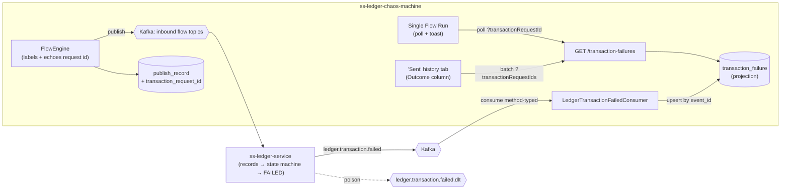

# Phase 17 - Ledger Transaction-Failure Events & Correlation

## Summary
Adds the chaos machine's **second inbound Kafka consumer**: it consumes the ledger's
`ledger.transaction.failed` event, projects each failure into a new `transaction_failure`
table, and **correlates** every failure back to the publish that caused it via the
`transaction_request_id` the chaos machine itself emitted. The correlation surfaces in two
places: a **toast on the Single Flow Run page** when a just-published transaction is later
rejected by the ledger, and a **ledger-outcome column** on the "Sent (Chaos History)" tab
(which until now showed only that an event was *published*, never whether the ledger
*accepted* it). Underneath, it **generalizes the Phase 009 consumer** from a single pinned
payload type to method-typed, multi-event deserialization so the rest of the series can be
added with just a listener + a mirror record.

This is **Part 1 of a four-part series** ("testing ledger Kafka events") that consumes the
ledger's outbound event surface — idea `012_transaction_failure.md`. The siblings are
`013_balance_history.md` (`ledger.balance.updated`), `015_reservation_created.md`
(`ledger.reservation.created`), and `014_dlt_views.md` (the `.dlt` topics). This phase
deliberately builds the reusable consumer foundation they will share.

See [ADR-024](../../decisions/024-multi-event-ledger-outbound-consumer.md),
[ADR-025](../../decisions/025-transaction-failure-projection-and-request-id-correlation.md),
[ADR-026](../../decisions/026-run-page-failure-surfacing-via-bounded-polling.md).

## Motivation
A transaction the operator publishes can pass the publish call (`200 OK`, event on Kafka)
yet be **rejected by the ledger** moments later — insufficient funds, counterparty mismatch,
validation failure — with the rejection travelling back as `ledger.transaction.failed`.
Today the chaos machine is blind to this: the run page shows green, and the "Sent" tab only
ever says "published". For a resilience-testing harness whose whole job is to provoke and
observe ledger behaviour, **not seeing the failures is a hole in the instrument.** This
phase closes it and lays the consumer groundwork for the balance/reservation/DLT parts.

## User-Facing Changes
- **Single Flow Run:** after publishing a transaction-bearing flow, a bounded background poll
  watches for a ledger failure of that exact transaction and raises a **danger toast**
  (failure code + reason, link to detail) if one arrives; the result card reflects "Failed at
  ledger". (A clean window means *no failure observed*, not a success guarantee.)
- **Transactions → "Sent (Chaos History)" tab:** a new **Outcome** column distinguishes
  *published to Kafka* (existing Status) from *accepted/rejected by the ledger* (new), with a
  failure badge and detail when rejected. One batch call per page.
- **New API:** `GET /api/v0/transaction-failures` (filter by request id / batch of request
  ids / type / failure code / time) + `/{id}`.
- **New operational surface:** consumer lag / DLT for `ledger.transaction.failed`.
- No change to any outbound flow contract; publish responses gain a `transactionRequestId`
  (and `transactionRequestIds` for N-Times).

## Architecture Impact
Second inbound consumer, riding a **generalized** container factory. The Phase 009 type-
pinned `JsonDeserializer` is replaced by a `ByteArrayJsonMessageConverter` whose target type
comes from each `@KafkaListener` method's `EventEnvelope<T>` — one factory, one error
handler, one topic-derived DLT rule for the whole ledger-outbound surface (ADR-024). A new
feature package `com.softspark.chaos.transaction` holds the consumer, the
`transaction_failure` projection (Flyway `V12`), and the query API. Correlation is **query-
time by `transaction_request_id`** — the publish side is taught to label, persist (Flyway
`V13` on `publish_record`), and echo that id (ADR-025). Run-page surfacing is bounded scoped
polling + a `sonner` toast (ADR-026). No new outbound Kafka surface; two additive migrations.

**The correlation key (verified against `ss-ledger-service`).** The failure's
`metadata.correlation_id` is the ledger's *recording id*, not the chaos correlation id — so
the **only** link back to a publish is `transaction_request_id`, a payload field the ledger
stores `unique, non-null`. Its source field per inbound event matches **exactly** the field
the chaos catalog autogenerates: `transaction_id` (collection/disbursement),
`settlement_request_id` (settlement), `transfer_request_id`, `topup_request_id`,
`batch_id`/`item_id` (batch). So the chaos machine already knows, at publish time, the value
the ledger will file as `transactionRequestId`. **Naming trap:** in the failure event
`data.transaction_id` is the ledger's recording UUID, while `data.transaction_request_id` is
the chaos-supplied id — correlation matches the latter.

## Edge Cases
- **At-least-once redelivery** of a failure → upsert by envelope `event_id` (UNIQUE) → one
  row. (`transaction_request_id` is unique per recording at the ledger, so a transaction
  fails at most once.)
- **Malformed/poison failure payload** → immediate dead-letter to
  `ledger.transaction.failed.dlt` (conversion exceptions are non-retryable); the partition
  keeps moving.
- **Null/partial envelope** → logged and skipped (no row, no DLT).
- **Publish/failure ordering race** (ledger outbox emits the failure before the chaos
  `AsyncHistoryWriter` flushes the publish row) → no problem: correlation is query-time by an
  intrinsic key, not a consume-time lookup.
- **Clean poll window** → reported as *no failure observed*, never success (failures are
  asynchronous and the window is finite; a definitive success signal is Part 2's
  `ledger.balance.updated`).
- **Late failure** (after the run-page window) → not toasted but visible on the "Sent" tab.
- **Non-transactional flows** (onboarding, va-updated) → null request id; no poll armed,
  Outcome shows "—".
- **N-Times** server-re-minted request ids → returned in the response so the client can poll
  the whole set.
- **Historical publish rows** (pre-`V13`) → null `transaction_request_id`; outcome unavailable
  (forward-looking; no backfill).
- **Regressing Phase 009** during the consumer generalization → its Testcontainers tests are
  the migration gate.

## Testing Strategy
- **Unit:** envelope→`transaction_failure` mapping (both ids correct); idempotent upsert;
  per-flow `transactionRequestIdField()` equals the documented ledger source field;
  `FlowEngine`/`AsyncHistoryWriter` capture; query-service filter dispatch.
- **Integration (Testcontainers Kafka):** publish a `transaction.failed` → one row; redeliver
  → one row; poison → `…​.failed.dlt`; account-created regression on the generalized factory.
- **Slice (`@WebMvcTest`/`@DataJpaTest`):** failures API filters, batch `IN`, paging/sort,
  404, AUTH.
- **Frontend (Vitest + Testing Library):** run-page poll → single danger toast + card flip;
  null request id arms no poll; window-elapsed inconclusive copy; "Sent" Outcome column from a
  mocked failures map with one batch call/page.
- **e2e:** drive a deliberately-failing flow (insufficient funds) end-to-end → toast on run
  page + failure row on the "Sent" tab.
- All consolidated into [Phase 006](../006-testing-and-verification/DESIGN.md).

## Deployment Strategy
- Two additive Flyway migrations: `V12` (`transaction_failure`), `V13`
  (`publish_record.transaction_request_id`) — on-disk highest is `V11`. No backfill.
- Consumer gated by `chaos.kafka.consumer.enabled`; topic + group id configurable; DLT
  derived. The new topic can exist without a listener (Task 001 shippable first).
- Frontend `sonner` toaster + a `failureWatchEnabled` flag (default on) to disable run-page
  watching without a rebuild.
- Backward compatible: additive columns, additive response fields, additive API; existing
  contracts unchanged.

## Tasks
- [001 - Generalize the ledger-outbound consumer (method-typed, multi-event)](./001-generalize-ledger-outbound-consumer.md) — one container factory via `ByteArrayJsonMessageConverter`; migrate the account-created listener; add the `ledger.transaction.failed` topic + derived DLT. *(ADR-024)*
- [002 - `transaction_failure` projection consumer](./002-transaction-failure-projection-consumer.md) — mirror record, `LedgerTransactionFailedConsumer`, entity/repo/service, Flyway `V12`, idempotent upsert. *(ADR-025)*
- [003 - Capture the transaction request id on publish](./003-capture-transaction-request-id-on-publish.md) — catalog request-id label, `publish_record.transaction_request_id` (Flyway `V13`), `transactionRequestId` in publish responses. *(ADR-025)*
- [004 - Transaction-failures query API](./004-transaction-failures-query-api.md) — `GET /api/v0/transaction-failures` (single + batch + browse filters) and `/{id}`. *(ADR-025)*
- [005 - Run-page failure polling + toast](./005-run-page-failure-polling-and-toast.md) — `sonner` toaster, bounded scoped poll keyed to the emitted request id(s), outcome on the result cards. *(ADR-026)*
- [006 - "Sent" tab failure correlation](./006-sent-tab-failure-correlation.md) — ledger Outcome column via one batch failures lookup per page + failure detail. *(ADR-025/026)*

## Parallel Tasks
- **001** is the foundation and blocks **002**.
- **002** (table + consumer) blocks **004** (query API).
- **003** (publish-side capture) is independent of **002/004** — it only touches the flow
  engine + history; build it in parallel with **002/004**.
- **005** depends on **004** (endpoints) + **003** (request id in the publish response).
- **006** depends on **004** (batch endpoint) + **003** (`transactionRequestId` on the history
  DTO).

Recommended order: **001 → 002 → (003 ‖ 004) → (005 ‖ 006)**.

Sets up the rest of the series: Part 2 (`013_balance_history`, `ledger.balance.updated`),
Part 3 (`015_reservation_created`, `ledger.reservation.created`/`.released`), and Part 4
(`014_dlt_views`, the `.dlt` topics) each add a listener + mirror record on the ADR-024
factory, with the DLT-views part reading the `<topic>.dlt` streams this phase already routes to.
