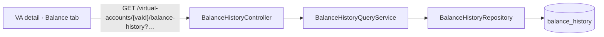

# Task 002 - Balance-history query API

> Java 25 · Spring Boot 4 · package `com.softspark.chaos.balance` (controller/dto/service)
> Implements the query surface of [ADR-027](../../decisions/027-balance-history-projection-from-ledger-balance-updated.md).
> Depends on Task 001 (the `balance_history` table).

## Functional Requirements

1. Expose a read API for **a virtual account's** balance history:
   `GET /api/v0/virtual-accounts/{vaId}/balance-history`, paginated and time-ordered
   (newest first), following `/history` conventions (`PageResponse<T>`, zero-based `page`,
   `size` capped at 100).
2. Support optional `from`/`to` filters on `occurred_at`.
3. Expose a **flat/batch** sibling `GET /api/v0/balance-history?accountId=…(repeatable)&from=&to=`
   spanning one *or several* accounts in one call — for the run-page balance-update watch
   (Task 004), which must cover a flow's source/destination/fee accounts in a single poll
   (mirrors the Phase 015 batch-balance and Phase 017 batch-failures shapes).
4. Return a self-contained DTO mirroring the ledger balance field names (so the frontend
   reuses its existing `LedgerBalanceDto` vocabulary).

## Acceptance Criteria

- [ ] `GET /api/v0/virtual-accounts/{vaId}/balance-history` returns
      `PageResponse<BalanceHistoryResponse>` for `account_id = vaId`, ordered
      `(occurred_at DESC, last_entry_sequence DESC)`.
- [ ] `from`/`to` (ISO-8601 `Instant` on `occurred_at`) filter and compose; `page`/`size`
      page; `size` clamped to ≤ 100.
- [ ] An unknown `vaId` returns an empty page (not 404 — absence of history is valid).
- [ ] `GET /api/v0/balance-history?accountId=a&accountId=b&from=…` returns a
      `PageResponse<BalanceHistoryResponse>` across the given accounts (bounded `IN (…)`),
      newest-first, filtered by `occurred_at >= from`; account-id cardinality is capped (e.g. ≤ 50).
- [ ] `BalanceHistoryResponse` exposes `eventId, accountId, available, pending, reserved, total,
      totalDebits, totalCredits, lastEntrySequence, balanceAsOf, currency, occurredAt, idempotencyKey`
      (+ `payloadJson` on the single-item path if a detail endpoint is added).
- [ ] AUTH-gated like every `/api/v0/**` route.

## Technical Design

### Endpoint

| Method · Path | Query | Returns |
|---|---|---|
| `GET /api/v0/virtual-accounts/{vaId}/balance-history` | `from?`, `to?`, `page=0`, `size=20` | `PageResponse<BalanceHistoryResponse>` |
| `GET /api/v0/balance-history` (flat/batch) | `accountId` (repeatable, 1..50), `from?`, `to?`, `page=0`, `size=20` | `PageResponse<BalanceHistoryResponse>` |

`BalanceHistoryResponse` (record + `@RecordBuilder`) — field names aligned to Phase 015's
`LedgerBalanceDto` (`available`/`total`/`pending`/`reserved`, `lastEntrySequence`,
`balanceAsOf`) so the UI maps them with no new vocabulary:

```
eventId, accountId, available, pending, reserved, total,
totalDebits, totalCredits, lastEntrySequence, balanceAsOf (LocalDateTime),
currency (nullable), occurredAt (Instant), idempotencyKey (nullable)
```

### Repository / service

```java
Page<BalanceHistory> findByAccountId(String accountId, Pageable p);                  // sort applied by Pageable
Page<BalanceHistory> findByAccountIdAndOccurredAtBetween(String accountId, Instant from, Instant to, Pageable p);
Page<BalanceHistory> findByAccountIdIn(Collection<String> accountIds, Pageable p);                       // batch
Page<BalanceHistory> findByAccountIdInAndOccurredAtGreaterThanEqual(Collection<String> ids, Instant from, Pageable p);
```

A `BalanceHistoryQueryService` picks the query by presence of `from`/`to` and applies the
`(occurredAt DESC, lastEntrySequence DESC)` `Sort` (same dispatch style as
`HistoryController`/its service).



## Implementation Notes

- **New** `balance/controller/BalanceHistoryController.java` mapping **both** the nested
  `/virtual-accounts/{vaId}/balance-history` and the flat `/balance-history` paths (a controller
  may map any path; keeping it in the `balance` package avoids coupling the `account` controller
  to this feature), `balance/dto/BalanceHistoryResponse.java`,
  `balance/service/BalanceHistoryQueryService.java`. The flat endpoint binds `accountId` as a
  repeatable `@RequestParam List<String>` (reject empty / over-cardinality with `ApiError`).
- **Extend** `balance/repository/BalanceHistoryRepository.java` (Task 001 created it).
- Reuse the shared `PageResponse<T>` and pagination helpers from `base`/`history`; standard
  `ApiError` envelope; springdoc annotations consistent with `/api/v0`.
- **Add** the client functions in `chaos-admin/src/lib/api.ts`:
  `getBalanceHistory(token, vaId, { from?, to?, page?, size? })` (nested, for the Balance tab —
  Task 003) and `listBalanceHistoryByAccounts(token, accountIds[], { from?, page?, size? })`
  (flat/batch, for the run-page watch — Task 004), both returning
  `PageResponse<BalanceHistoryResponse>`, plus the `BalanceHistoryResponse` type.

## Non-Functional Requirements

- **Performance:** queries hit `(account_id, occurred_at)` index; bounded page size.
- **Security:** AUTH-gated; balance data may be tenant-sensitive.
- **Consistency:** paging/sort/error semantics identical to `/history` so the frontend reuses
  its patterns.

## Dependencies

- **Task 001** (table + entity + repository).
- Consumed by **Task 003** (Balance tab, nested endpoint) and **Task 004** (run-page balance
  toast, flat/batch endpoint).

## Risks & Mitigations

- **Large histories** for a hot account. → Indexed + paged; default `size=20`, cap 100.
- **`vaId` that is a real VA but has no history yet** → empty page (correct, not an error).

## Testing Strategy

- **Slice (`@WebMvcTest` + `@DataJpaTest`):** ordering `(occurredAt DESC, lastEntrySequence
  DESC)`; `from`/`to` filtering; paging + `size` clamp; empty page for unknown account; AUTH
  required. **Flat endpoint:** multi-`accountId` `IN` + `from` filter; cardinality cap; empty
  set rejected.
- **Integration:** seed `balance_history` → assert ordered, filtered, paged results.
- Folds into [Phase 006](../006-testing-and-verification/DESIGN.md).

## Deployment Strategy

- Pure read API over the Task 001 table; no migration of its own. Shippable as soon as 001
  lands; inert until the Balance tab calls it.
