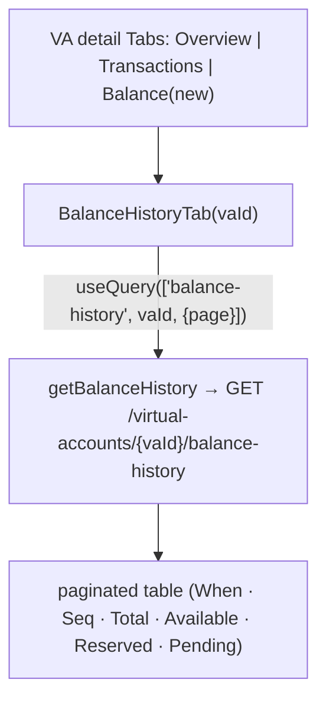

# Task 003 - Frontend: Balance tab on the VA detail page

> React 19 · Vite · react-query 5 · shadcn/ui · `chaos-admin/src/features/virtual-accounts`
> Implements the UI of [ADR-027](../../decisions/027-balance-history-projection-from-ledger-balance-updated.md).
> Depends on Task 002 (the balance-history endpoint).

## Functional Requirements

1. The VA detail page gains a **Balance** tab (alongside Overview and Transactions) listing
   the account's balance-update history, newest first, paginated.
2. Each row shows the timestamp (`balanceAsOf` / `occurredAt`), `lastEntrySequence`, and the
   four buckets (Total, Available, Reserved, Pending); Total Debits/Credits available in a
   row detail or secondary columns.
3. The tab frames itself as an **event log of balance changes** (observational), distinct
   from the authoritative live Ledger Balance panel on the Overview tab (Phase 015).

## Acceptance Criteria

- [ ] A `<TabsTrigger value="balance">Balance</TabsTrigger>` + `<TabsContent>` is added to the
      VA detail `Tabs`, persisted via the existing `usePersistedTabs` hook.
- [ ] The tab calls `getBalanceHistory(token, vaId, { page, size })` and renders a paginated
      table ordered newest-first; pagination uses the existing offset pagination control.
- [ ] Columns: When (`balanceAsOf`), Seq (`lastEntrySequence`), Total, Available, Reserved,
      Pending — money via the existing `formatMoney`; currency from the row (`currency`) or
      falling back to the VA's currency.
- [ ] Empty/loading/error states render gracefully (no white-screen if the backend/circuit is
      down), consistent with the other tabs.
- [ ] (Nice-to-have) a per-bucket **delta vs the previous (older) row** is shown when adjacent
      rows are on the same page, computed client-side; omitted at page boundaries.
- [ ] Copy clarifies this is the stream of `ledger.balance.updated` events (per account), not
      a per-transaction view.

## Technical Design

- **Tab component** `BalanceHistoryTab({ vaId })` in
  `features/virtual-accounts/balance-history-tab.tsx`, structurally similar to the existing
  per-account transactions tab but using **offset** pagination (`PageResponse`) rather than
  cursors.
- **Query** `useQuery({ queryKey: ["balance-history", vaId, { page }], queryFn: () => getBalanceHistory(token, vaId, { page, size: PER_PAGE }), placeholderData: keepPreviousData })`.
- Reuse shadcn `Table`, the page/empty/error primitives, and `formatMoney`. Currency display
  prefers the row's `currency`, falling back to the VA's currency from the detail context.

## Implementation Notes

- **Modify** `chaos-admin/src/features/virtual-accounts/virtual-account-detail-page.tsx`: add
  the third tab trigger + content (`{vaId ? <BalanceHistoryTab vaId={vaId} /> : null}`).
- **New** `chaos-admin/src/features/virtual-accounts/balance-history-tab.tsx`.
- Reuse the `getBalanceHistory` client fn + `BalanceHistoryResponse` type from Task 002, and
  the existing offset-pagination control used by the list pages.
- No new nav item (it's a tab on an existing route).

## Non-Functional Requirements

- **Performance:** one paged query per view; `PER_PAGE` ≤ the backend cap (e.g. 20).
- **Resilience:** degrades to empty/error state under ledger/consumer lag — never white-screens.
- **Clarity:** the tab is labelled as an event log; it must not be confused with the live
  Ledger Balance panel (which remains the authority for "current balance").

## Dependencies

- **Task 002** (endpoint + client fn + type).
- The VA detail page (Phase 015 tab scaffold).

## Risks & Mitigations

- **Operator conflates the log with current balance.** → Distinct tab + a one-line caption;
  the Overview Ledger Balance panel stays the authoritative "now" view.
- **`lastEntrySequence == 0`** rows. → Display sequence as-is; ordering already falls back to
  `occurredAt`. Deltas computed from adjacent rows, not from sequence.
- **Sparse currency** (null on a row before the VA projected). → Fall back to the VA currency.

## Testing Strategy

- **Component (Vitest + Testing Library + MSW):** tab renders paginated rows newest-first;
  bucket columns + money formatting; empty/loading/error states; page navigation refetches;
  currency fallback; (if built) delta computation within a page and omission at boundaries.
- Folds into [Phase 006](../006-testing-and-verification/DESIGN.md).

## Deployment Strategy

- Frontend-only; ships after Task 002. Purely additive — a new tab on an existing page; the
  rest of the detail page is unaffected if the endpoint isn't deployed (tab shows an error/
  empty state).
