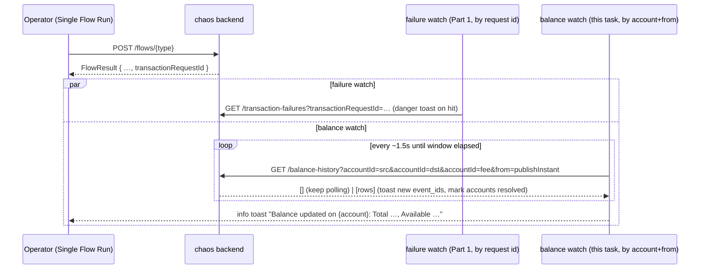

# Task 004 - Frontend: run-page balance-update toast

> React 19 · Vite · react-query 5 · shadcn/ui (`sonner`) · `chaos-admin/src/features/chaos`
> Implements the run-page balance-update toast of
> [ADR-027](../../decisions/027-balance-history-projection-from-ledger-balance-updated.md).
> Reuses the Phase 017 toaster + bounded-poll mechanism
> ([ADR-026](../../decisions/026-run-page-failure-surfacing-via-bounded-polling.md)).
> Depends on Task 002 (the flat/batch balance-history endpoint).

## Functional Requirements

1. After a successful publish on Single Flow Run, in addition to the Part 1 **failure** watch,
   a **balance** watch polls for `ledger.balance.updated`-derived rows on the **accounts the
   flow targeted** and raises an **info/success toast** when a balance moves.
2. Scope is heuristic (contract-forced — balance events carry no `transaction_request_id`):
   **involved account id(s)** (resolved source/destination/fee VAs the client already knows)
   **+ a time watermark** (`from` = publish instant minus a small skew slack).
3. Toast copy is honest: **"Balance updated on {account}"** with the new buckets — never "your
   transaction succeeded" / "caused by your transaction".
4. Only flows that resolve to ledger accounts arm the balance watch; non-transactional flows
   (onboarding, va-updated) do not.

## Acceptance Criteria

- [ ] On a successful publish of a flow with ≥1 resolved account, a react-query poll calls
      `listBalanceHistoryByAccounts(token, involvedAccountIds, { from: publishInstant })` on the
      ADR-026 interval (~1500 ms) within the bounded window (~25 s), `enabled` while mounted.
- [ ] When a new balance-history row appears for an involved account, an **info/success toast**
      fires showing the account (id/name) and the new Total/Available (+ currency from the row
      or the resolved VA), then that account is considered resolved.
- [ ] Toasts are **deduped by balance-history `event_id`** and **capped** (e.g. ≤ involved
      account count, or a small max) so a fan-out (transfer → 3 accounts) doesn't spam.
- [ ] A flow with no resolved accounts arms **no** balance watch.
- [ ] The window elapsing stops the poll silently; a balance update arriving later is still
      visible on the VA detail **Balance** tab (Task 003).
- [ ] Copy never implies per-transaction causation/success (see ADR-027).
- [ ] The failure watch (Part 1, Task 017-005) and this balance watch run **side by side** off
      the same publish, sharing the one `<Toaster/>`.

## Technical Design

- **Involved accounts** are derived client-side from the flow's resolved slots
  (`slotOverrides` / the resolved VA pickers already shown on the form) — the same values that
  went into the published payload. No server round-trip to discover them.
- **Watermark:** `from = publishInstant - SLACK_MS` to absorb client/ledger clock skew; dedupe
  by row `event_id` so re-fetches don't re-toast.
- **Hook:** a new `use-balance-update-watch(accountIds: string[], since: string)` mirroring the
  Phase 017 `use-transaction-failure-watch` (`refetchInterval` returns `false` past the
  `pollUntil` deadline or once all involved accounts have toasted; `enabled` when
  `accountIds.length > 0`).
- **Toaster:** reuse the `sonner` `<Toaster/>` mounted in the app shell (Phase 017 Task 005);
  fire `toast.success`/`toast` (info tone) — distinct from the failure `toast.error`.

## Implementation Notes

- **New** `chaos-admin/src/features/chaos/use-balance-update-watch.ts`.
- **Modify** `chaos-admin/src/features/chaos/single-flow-page.tsx`: after a successful
  `runFlow`/`publishNTimes`, compute `involvedAccountIds` from the resolved slots and feed them
  (+ publish instant) to the balance watch, alongside the existing failure watch.
- Reuse `listBalanceHistoryByAccounts` + `BalanceHistoryResponse` (Task 002).
- **Constants** (mirror Phase 017): reuse `FAILURE_POLL_INTERVAL_MS`/`_WINDOW_MS` or add
  `BALANCE_POLL_*`; a `BALANCE_SKEW_MS` slack; a `balanceWatchEnabled` flag in `appConfig`.
- If the dedupe set should survive minor refetch races, key it on `event_id` in a `useRef`.
- N-Times note: the run page already polls failures over the returned request ids; the balance
  watch keys on accounts (shared across iterations), so it works unchanged for N-Times — the
  same involved accounts simply emit more updates within the window.

## Non-Functional Requirements

- **Server load:** one batch call per interval over an indexed `(account_id, occurred_at)`
  query, bounded window, mounted-only — negligible (same posture as the failure watch).
- **UX:** non-blocking, stacking toasts; the failure (danger) and balance (info) toasts are
  visually distinct.
- **Honesty:** an account+time match is *not* proof your specific transaction caused it; copy
  reflects that.

## Dependencies

- **Task 002** (flat/batch `GET /api/v0/balance-history?accountId=…&from=…`).
- **Phase 017 Task 005** (the `sonner` `<Toaster/>` + the watch-hook pattern this mirrors).
- The flow form's resolved account slots (Phase 011/014) to derive `involvedAccountIds`.

## Risks & Mitigations

- **Over-fire** (unrelated concurrent update on an involved account) → acceptable for a
  single-operator harness; honest copy avoids implying causation; dedupe + cap limit noise.
- **Under-fire** (update after the window) → still on the Balance tab; window is tunable.
- **Fan-out spam** (transfer → 3 accounts) → cap + per-account resolve so each account toasts at
  most once.
- **Clock skew** dropping the first update → `from` slack absorbs it.
- **Conflating with the failure toast** → distinct tone/icon (info vs danger) and copy.

## Testing Strategy

- **Component (Vitest + Testing Library + MSW):** publish → balance row for an involved account
  → one info toast with buckets; multi-account fan-out → one toast per account, deduped by
  `event_id`, capped; flow with no resolved accounts arms no watch; window-elapsed stops
  silently; failure + balance watches coexist off one publish; copy assertions (no
  success/causation wording).
- **Manual/e2e:** drive a succeeding collection and confirm a balance toast appears on the run
  page within the window (ties into Phase 006 e2e).

## Deployment Strategy

- Frontend-only; ships after Task 002 and the Phase 017 toaster. Behind `balanceWatchEnabled`
  (default on) so it can be disabled without a backend rebuild. Purely additive to the run page.
