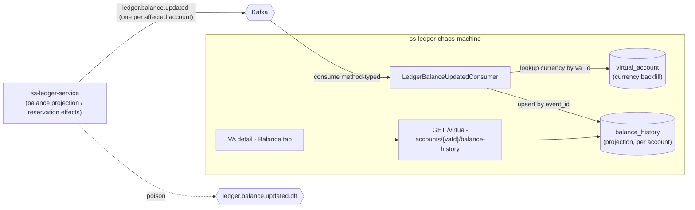

# Phase 18 - Balance History

## Summary
Adds the chaos machine's **third inbound consumer** (after `ledger.account.created` and
`ledger.transaction.failed`): it consumes `ledger.balance.updated` and projects each event
into a new **`balance_history`** table — a per-account, append-only, event-sourced log of
balance mutations. A read endpoint serves a VA's history, the VA detail page gains a
**Balance tab** that lists it, and — reusing the Part 1 run-page toaster — the **Single Flow
Run page raises a toast when a balance moves on an account the operator just published to**.
This is **Part 2 of the four-part series** ("testing ledger Kafka events"; idea
`013_balance_history.md`) and rides the multi-event consumer foundation built in Part 1
([ADR-024](../../decisions/024-multi-event-ledger-outbound-consumer.md)) — so the backend
addition is essentially *a listener + a mirror record + one migration + one query API*. See
[ADR-027](../../decisions/027-balance-history-projection-from-ledger-balance-updated.md).

## Motivation
The ledger emits `ledger.balance.updated` whenever an account's balance moves — the
post-mutation snapshot of that account. For a resilience harness, *observing the stream of
balance side effects* a chaos run produces is exactly the point: "during that malformed
burst, what balance-update events fired on the float account, and in what order?" Phase 015
already shows the **current / point-in-time** balance (a live ledger read-through, storing
nothing), but it cannot show the **discrete stream of update events** over time. This phase
captures that stream so it is queryable per account and survives past the run — without
hammering the ledger for each row.

## User-Facing Changes
- **VA detail page:** a new **Balance** tab (alongside Overview and Transactions) listing the
  account's balance-update history newest-first — timestamp, sequence, and the four buckets
  (Total / Available / Reserved / Pending), paginated.
- **Single Flow Run page:** after a publish, an **info toast** fires when a balance moves on an
  account the flow targeted ("Balance updated on {account}") — the effect counterpart to Part
  1's failure toast. Scope is heuristic (involved account id(s) + a time watermark), since the
  event carries no `transaction_request_id`; copy never implies per-transaction causation.
- **New API:** `GET /api/v0/virtual-accounts/{vaId}/balance-history` (`from`/`to`/`page`/`size`)
  + a flat/batch `GET /api/v0/balance-history?accountId=…&from=…` for the run-page watch.
- **New operational surface:** consumer lag / DLT for `ledger.balance.updated`.
- The live **Ledger Balance** panel (Phase 015) is unchanged and remains the authority for
  "current balance".

## Architecture Impact
Third inbound consumer on the **already-generalized** ADR-024 factory — a new
`com.softspark.chaos.balance` feature package (`consumer` + mirror record + `balance_history`
entity/repo/service + query controller/dto with nested **and** flat/batch endpoints), one
additive Flyway migration, and on the frontend a Balance tab + a run-page balance-update watch
that reuses the Part 1 `sonner` toaster. This phase **introduces stored balance data** — a reversal of
Phase 015's "chaos stores nothing about balances" stance — justified because a *historical
event log* is a different artifact from *on-demand current balance*, and the idea requires
persistence. It **complements, not supersedes**, ADR-020/021: live/PIT balance stays a
read-through ([ADR-027](../../decisions/027-balance-history-projection-from-ledger-balance-updated.md)).

**Contract notes (verified against `ss-ledger-service`).**
`AccountBalanceUpdatedEventData(accountId, availableBalance, pendingBalance, reservedBalance,
totalBalance, totalDebits, totalCredits, lastEntrySequence, balanceAsOf)`, snake_case,
`addTypeInfo(false)`. Three properties drive the design:
- **One event per affected account** — a transfer touching source + destination + fee
  produces multiple events; per account this is naturally a history stream. Reservation
  RELEASE/EXPIRY also emit (CAPTURE is balance-neutral, skipped).
- **No transaction linkage** — there is **no** `transaction_id`/`transaction_request_id` in
  the payload, and `metadata.correlation_id` is a fresh random UUID; the only causal hint is
  `metadata.idempotency_key` (`{journalEntryId}:{accountId}` / `{reservationId}:…`). So this
  history is **per-account, not correlatable to a chaos publish** by `transaction_request_id`
  (unlike Part 1's failures). This **corrects** Part 1's optimistic note that called
  `ledger.balance.updated` a "definitive per-transaction success signal".
- **No currency** in the event — backfilled best-effort from the VA registry (`account_id` =
  `va_id`); ordering by per-account `last_entry_sequence` (may be `0`), dedup by envelope
  `event_id`.

## Edge Cases
- **At-least-once redelivery** → upsert by `event_id` → one row.
- **Multiple legitimate events for one account in one transaction** (funding entry +
  reservation release) → distinct `event_id`s → separate rows (correct, not duplicates).
- **`last_entry_sequence == 0`** (ledger JPA-timing quirk) → ordering falls back to
  `occurred_at DESC`; dedup never relies on sequence.
- **Currency null** (VA not yet projected) → stored null; UI falls back to the VA's currency.
- **Malformed/poison payload** → `ledger.balance.updated.dlt` (ADR-024 handler); partition
  keeps moving. Null/partial envelope → logged + skipped (no row, no DLT).
- **`vaId` with no history yet** → empty page, not 404.
- **High burst volume** → indexed single-row inserts; consumer `concurrency=1` default.
- **Stored vs live divergence** → the tab is an eventually-consistent event log, explicitly
  *not* the current-balance authority (that's the Phase 015 panel).
- **Run-page toast scope is heuristic** (account + time watermark, not request id) → it can
  over-fire (unrelated concurrent update on an involved account; a transfer fans out one toast
  per account — deduped by `event_id`, capped) or under-fire (update after the window — still on
  the Balance tab). Copy says "balance updated on {account}", never "transaction succeeded".

## Testing Strategy
- **Unit:** envelope→`balance_history` mapping (all buckets, sequence, as-of); BigDecimal↔
  String round-trip; idempotent upsert; currency backfill present/absent; null-data skip;
  query-service ordering + filter dispatch.
- **Integration (Testcontainers Kafka):** one event → one row; redeliver → one row; 3
  per-account events → 3 rows; poison → `…​.updated.dlt`.
- **Slice (`@WebMvcTest`/`@DataJpaTest`):** nested + flat/batch endpoint ordering `(occurredAt
  DESC, sequence DESC)`, `from`/`to`, multi-`accountId` `IN`, cardinality cap, paging/clamp,
  empty page, AUTH.
- **Frontend (Vitest + Testing Library + MSW):** Balance tab renders paginated rows
  newest-first; bucket columns + money formatting; empty/loading/error; page navigation;
  currency fallback; delta-within-page (if built). **Run-page toast:** publish → balance row on
  an involved account → one info toast; fan-out deduped/capped; no-account flow arms no watch;
  window-elapsed stops; coexists with the failure watch; honest copy.
- **Contract:** `LedgerBalanceUpdatedEventData` round-trips the ledger's exact snake_case JSON.
- Consolidated into [Phase 006](../006-testing-and-verification/DESIGN.md).

## Deployment Strategy
- One additive Flyway migration (`balance_history`); no backfill (history accrues from
  rollout). Numbered **`V14`** assuming Phase 017's `V12`+`V13` land first (build order 017 →
  018); otherwise the next free version.
- Consumer gated by `chaos.kafka.consumer.enabled`; topic + group id configurable; DLT
  derived. Backend and frontend ship independently and additively.

## Tasks
- [001 - `ledger.balance.updated` consumer + `balance_history` projection](./001-balance-updated-consumer-projection.md) — listener on the ADR-024 factory, mirror record, entity/repo/service, Flyway `V14`, idempotent upsert, currency backfill, `BigDecimalStringConverter`. *(ADR-027)*
- [002 - Balance-history query API](./002-balance-history-query-api.md) — nested `GET /api/v0/virtual-accounts/{vaId}/balance-history` + flat/batch `GET /api/v0/balance-history?accountId=…&from=…`, newest-first. *(ADR-027)*
- [003 - VA detail: Balance tab](./003-va-detail-balance-tab.md) — new tab listing the per-account balance-update history (four buckets, sequence, timestamp, paging). *(ADR-027)*
- [004 - Run-page balance-update toast](./004-run-page-balance-update-toast.md) — after publish, a bounded poll on the flow's involved accounts (+ time watermark) raises an info toast on a balance move; reuses the Part 1 toaster. *(ADR-027)*

## Parallel Tasks
- **001** is the foundation and blocks **002** (table) and ultimately **003**/**004**.
- **002** depends on 001; **003** (nested endpoint) and **004** (flat/batch endpoint) both
  depend on 002 and are independent of each other — both can be built against MSW fixtures in
  parallel and wired live once 002 lands.
- Cross-phase: **001 depends on Phase 017 Task 001** (the ADR-024 generalized consumer
  factory); **004 depends on Phase 017 Task 005** (the `sonner` toaster + watch-hook pattern it
  mirrors). If Phase 017 has not landed, pull those in first.

Recommended order: **(Phase 017 consumer generalization + toaster) → 001 → 002 → (003 ‖ 004)**.

Part 3 (`015_reservation_created` → `ledger.reservation.created`/`.released`) and Part 4
(`014_dlt_views` → the `.dlt` topics) follow the same shape on the same factory.
