# Task 001 - Reservation lifecycle consumer + `reservation` projection

> Java 25 · Spring Boot 4 / Spring Kafka · new package `com.softspark.chaos.reservation`
> Implements the persistence half of [ADR-028](../../decisions/028-reservation-lifecycle-projection.md).
> **Depends on Phase 017 Task 001** (the ADR-024 method-typed multi-event container factory).

## Functional Requirements

1. A `LedgerReservationConsumer` consumes **both** `ledger.reservation.created` and
   `ledger.reservation.released` on the shared `LEDGER_EVENT_CONTAINER_FACTORY` and projects
   them into a single stateful `reservation` table (one row per `reservation_id`).
2. The row tracks the reservation's **current state** across its lifecycle
   (`ACTIVE` → `PARTIALLY_RESOLVED` → `CAPTURED` | `RELEASED` | `EXPIRED`), upserted as events
   arrive; **batch** reservations are tracked (type + `disbursement_batch_id`) and accumulate
   multiple `released` events.
3. Application is **idempotent** (envelope `event_id` dedupe) and **monotonic** (status never
   regresses; terminal is sticky), tolerating redelivery and rare reorder.
4. `currency` is backfilled best-effort from the `virtual_account` registry (`account_id` =
   `va_id`); null when the VA isn't projected yet.
5. Gated by `chaos.kafka.consumer.enabled`; empty/partial envelopes are logged and skipped.

## Acceptance Criteria

- [ ] `LedgerReservationLifecycleEventData` is a snake_case mirror record:
      `(UUID reservationId, UUID accountId, String transactionId, String reservationType, BigDecimal amount, String status, String disbursementBatchId)`.
- [ ] One `@KafkaListener(topics = {"${chaos.topics.ledger-reservation-created}", "${chaos.topics.ledger-reservation-released}"}, groupId = …, containerFactory = LEDGER_EVENT_CONTAINER_FACTORY)`
      receives `EventEnvelope<LedgerReservationLifecycleEventData>`; the create-vs-transition
      semantics are derived from `status` (and the received-topic header).
- [ ] `chaos.topics.ledger-reservation-created` / `-released` (defaults
      `ledger.reservation.created` / `ledger.reservation.released`) are configured; DLTs derive
      as `<topic>.dlt` (ADR-024 recoverer).
- [ ] Flyway `V15` creates `reservation` keyed by `reservation_id` with indexes on
      `transaction_id`, `account_id`, `disbursement_batch_id`, `status`.
- [ ] A `created` event inserts an `ACTIVE` row with all fields mapped; a subsequent `released`
      (`CAPTURED`/`RELEASED`/`EXPIRED`) advances `status` and sets `terminal_at`.
- [ ] A **batch** `created` (`reservation_type=BATCH`, `disbursement_batch_id` set) followed by
      several `released` events (`PARTIALLY_RESOLVED` … `CAPTURED`) ends at the terminal status
      with `release_event_count` reflecting the applied releases.
- [ ] Redelivery of any event (same `event_id`) is a no-op; a reordered older event never
      regresses a terminal status.
- [ ] `amount` round-trips as an exact decimal string; `currency` is populated from the VA
      registry when present, else null.

## Technical Design

### Field mapping (envelope → row)

| Column | Source |
|---|---|
| `reservation_id` (PK) | `data.reservation_id` |
| `account_id` | `data.account_id` (= `va_id`) |
| `transaction_id` | `data.transaction_id` (inbound transactionRef = chaos request id) |
| `reservation_type` | `data.reservation_type` (SINGLE \| BATCH) |
| `disbursement_batch_id` | `data.disbursement_batch_id` (nullable) |
| `amount` | `data.amount` (BigDecimal→TEXT) |
| `currency` | `virtual_account.currency` where `va_id = account_id` (best-effort) |
| `status` | `data.status` (advanced monotonically) |
| `created_event_id` | envelope `event_id` of the ACTIVE event |
| `last_event_id` | envelope `event_id` of the latest applied event (dedupe) |
| `release_event_count` | count of applied release-topic events |
| `tenant_id` | `metadata.tenant_id` |
| `created_at` / `updated_at` / `terminal_at` | envelope `timestamp` (created / latest / first-terminal) |
| `payload_json` | latest raw envelope |

```mermaid
stateDiagram-v2
  [*] --> ACTIVE: reservation.created
  ACTIVE --> PARTIALLY_RESOLVED: released (partial, batch)
  ACTIVE --> CAPTURED: released (capture)
  ACTIVE --> RELEASED: released (release)
  ACTIVE --> EXPIRED: released (expiry)
  PARTIALLY_RESOLVED --> PARTIALLY_RESOLVED: released (next item)
  PARTIALLY_RESOLVED --> CAPTURED: released (final)
  PARTIALLY_RESOLVED --> RELEASED: released (final)
  CAPTURED --> [*]
  RELEASED --> [*]
  EXPIRED --> [*]
  note right of ACTIVE : upsert by reservation_id;\nstatus advances by ordinal,\nnever regresses; dedupe by event_id
```



### Flyway `V15__reservation.sql`

```sql
CREATE TABLE IF NOT EXISTS reservation (
    reservation_id        TEXT PRIMARY KEY,
    account_id            TEXT NOT NULL,
    transaction_id        TEXT NOT NULL,
    reservation_type      TEXT NOT NULL,
    disbursement_batch_id TEXT,
    amount                TEXT NOT NULL,
    currency              TEXT,
    status                TEXT NOT NULL,
    created_event_id      TEXT,
    last_event_id         TEXT NOT NULL,
    release_event_count   INTEGER NOT NULL DEFAULT 0,
    tenant_id             TEXT,
    created_at            TEXT,
    updated_at            TEXT NOT NULL,
    terminal_at           TEXT,
    payload_json          TEXT
);
CREATE INDEX IF NOT EXISTS idx_resv_txn    ON reservation (transaction_id);
CREATE INDEX IF NOT EXISTS idx_resv_acct   ON reservation (account_id);
CREATE INDEX IF NOT EXISTS idx_resv_batch  ON reservation (disbursement_batch_id);
CREATE INDEX IF NOT EXISTS idx_resv_status ON reservation (status);
```

> **Migration number.** On-disk highest is `V11`; Part 1 adds `V12`/`V13`, Part 2 adds `V14`.
> This phase is `V15` **assuming Parts 1–2 land first** (build order 017 → 018 → 019). If built
> independently, use the next free version.

## Implementation Notes

- **New package** `com.softspark.chaos.reservation` (feature-first, mirrors `transaction` /
  `balance`):
  - `consumer/LedgerReservationConsumer.java` — one `@KafkaListener` on both topics +
    `@ConditionalOnProperty(prefix="chaos.kafka.consumer", name="enabled", havingValue="true", matchIfMissing=true)`.
  - `consumer/LedgerReservationLifecycleEventData.java` — `@JsonNaming(SnakeCaseStrategy.class)` mirror record.
  - `model/Reservation.java` — JPA entity keyed by `reservation_id` (mutable status; explicit
    event-timestamp columns, not `AuditableEntity`).
  - `repository/ReservationRepository.java` — `JpaRepository<Reservation, String>`; query
    methods land in Task 002.
  - `service/ReservationProjectionService.java` — `@Transactional` upsert with the
    monotonic-status state machine + dedupe + currency backfill.
- Reuse the Part 2 `base/BigDecimalStringConverter`.
- **Modify** `kafka/TopicCatalog.java`: add the two reservation topics.
- **New migration** `chaos-machine/src/main/resources/db/migration/V15__reservation.sql`.
- Reuse `VirtualAccountRepository` (by `va_id`) for the currency backfill; tolerate a missing VA.
- **Naming care:** a `ReservationResponse` DTO already exists in `ledgerproxy` (the read-proxy);
  keep this feature's types under `reservation.*` and name the query DTO distinctly (Task 002).

## Non-Functional Requirements

- **Resilience:** at-least-once safe (event-id dedupe + monotonic status); null/partial
  envelopes never DLT; only unparseable bytes DLT.
- **Precision:** `amount` persisted as exact decimal string.
- **Observability:** debug-log each applied transition (`reservation_id`, old→new `status`); a
  counter per status feeds the consumer-lag view.

## Dependencies

- **Phase 017 Task 001** (generalized factory + topic-config + DLT derivation). If Phase 017
  hasn't landed, pull that generalization in first.
- **Part 2** for `BigDecimalStringConverter`; the `virtual_account` projection (Phase 009) for
  currency backfill.
- External contract (verified): `ReservationLifecycleEventData` + envelope/metadata.

## Risks & Mitigations

- **Out-of-order created/released** (reorder/redelivery) → keyed-by-reservation ordering makes
  this rare; the monotonic-status guard + event-id dedupe + created-fills-base-fields-only
  handle it.
- **Batch partial resolutions** lack a per-event remaining amount → track `status` +
  `release_event_count` (best-effort); authoritative per-item progress stays in the Phase 016
  batch summary read-proxy.
- **Contract drift** (new field / new status) → `fail-on-unknown-properties=false`; map
  unknown status defensively (log + store raw); a contract test pins today's fields/enums.

## Testing Strategy

- **Unit:** envelope→entity mapping; monotonic-status state machine (advance, never regress,
  terminal sticky); event-id dedupe; created-after-released reorder; batch multi-release
  accumulation; BigDecimal round-trip; currency backfill present/absent; null-data skip.
- **Integration (Testcontainers Kafka):** created → ACTIVE row; created+released → terminal;
  batch created + N releases → terminal + count; redelivery → no-op; poison →
  `ledger.reservation.{created,released}.dlt`.
- **Contract:** mirror record round-trips the ledger's exact snake_case JSON for both events.
- Folds into [Phase 006](../006-testing-and-verification/DESIGN.md).

## Deployment Strategy

- Additive Flyway `V15`; no backfill. Consumer gated by `chaos.kafka.consumer.enabled`; topics +
  group id configurable; DLTs derived. Shippable once Phase 017's consumer generalization is in.
