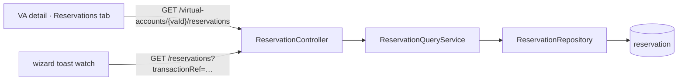

# Task 002 - Reservation query API

> Java 25 · Spring Boot 4 · package `com.softspark.chaos.reservation` (controller/dto/service)
> Implements the query surface of [ADR-028](../../decisions/028-reservation-lifecycle-projection.md).
> Depends on Task 001 (the `reservation` table).

## Functional Requirements

1. Expose a per-VA read API: `GET /api/v0/virtual-accounts/{vaId}/reservations`, paginated and
   ordered newest-first, for the Reservations tab (Task 004).
2. Expose a flat/batch sibling `GET /api/v0/reservations` filterable by `transactionRef`,
   `batchId`, `accountId` (repeatable), and `status` — for the run-page toast watch (Task 003)
   and general tracking.
3. Return a self-contained DTO over the projection's event-faithful fields (distinct from the
   `ledgerproxy` read-proxy `ReservationResponse`).

## Acceptance Criteria

- [ ] `GET /api/v0/virtual-accounts/{vaId}/reservations` returns
      `PageResponse<ReservationStateResponse>` for `account_id = vaId`, newest-first
      (`updated_at DESC`); `status`/`from`/`to` optional filters; `size` ≤ 100.
- [ ] `GET /api/v0/reservations?transactionRef=…` returns the reservation(s) for that
      `transaction_id` (the toast watch's primary query); `?batchId=…` filters by
      `disbursement_batch_id`; `?accountId=a&accountId=b` batches (cardinality cap, e.g. ≤ 50);
      `?status=…` filters by state. Filters compose.
- [ ] `GET /api/v0/reservations/{reservationId}` returns one record (404 if absent) incl.
      `payloadJson`.
- [ ] `ReservationStateResponse` exposes `reservationId, accountId, transactionId,
      reservationType, disbursementBatchId, amount, currency, status, releaseEventCount,
      createdAt, updatedAt, terminalAt`.
- [ ] An unknown `vaId`/`transactionRef` returns an empty page (not 404).
- [ ] AUTH-gated like every `/api/v0/**` route.

## Technical Design

### Endpoints

| Method · Path | Query | Returns |
|---|---|---|
| `GET /api/v0/virtual-accounts/{vaId}/reservations` | `status?`, `from?`, `to?`, `page=0`, `size=20` | `PageResponse<ReservationStateResponse>` |
| `GET /api/v0/reservations` (flat/batch) | `transactionRef?`, `batchId?`, `accountId?` (repeatable, ≤50), `status?`, `from?`, `to?`, `page`, `size` | `PageResponse<ReservationStateResponse>` |
| `GET /api/v0/reservations/{reservationId}` | — | `ReservationStateResponse` (404 if absent) |

### Repository / service

```java
Page<Reservation> findByAccountId(String accountId, Pageable p);
List<Reservation> findByTransactionId(String transactionId);                 // toast watch (usually 1)
Page<Reservation> findByDisbursementBatchId(String batchId, Pageable p);
Page<Reservation> findByAccountIdIn(Collection<String> accountIds, Pageable p);
Page<Reservation> findByStatus(String status, Pageable p);
```

A `ReservationQueryService` dispatches by which filters are present (same style as
`HistoryController`/its service), defaulting to `updated_at DESC`.



## Implementation Notes

- **New** `reservation/controller/ReservationController.java` mapping **both** the nested
  `/virtual-accounts/{vaId}/reservations` and the flat `/reservations` (+ `/{reservationId}`)
  paths (a controller may map any path; keeps it out of the `account` controller),
  `reservation/dto/ReservationStateResponse.java`,
  `reservation/service/ReservationQueryService.java`.
- **Extend** `reservation/repository/ReservationRepository.java` (Task 001 created it).
- Bind `accountId` as a repeatable `@RequestParam List<String>` (reject empty / over-cap with
  `ApiError`). Reuse `PageResponse<T>` + pagination helpers; springdoc annotations.
- **Name the DTO `ReservationStateResponse`** (NOT `ReservationResponse`, which already exists
  in `ledgerproxy` for the read-proxy) to avoid collision/confusion. Document that
  `/api/v0/reservations` (projection) is distinct from `/api/v0/ledger/accounts/{id}/reservations`
  (read-proxy): the projection is push-fed and event-faithful; the read-proxy is on-demand and
  richer (captured/released amounts, expiry).
- **Add** client functions in `chaos-admin/src/lib/api.ts`:
  `getVaReservations(token, vaId, {status?,page?,size?})` (tab — Task 004) and
  `listReservations(token, {transactionRef?,batchId?,accountId?[],status?})` (toast watch —
  Task 003), plus the `ReservationStateResponse` type.

## Non-Functional Requirements

- **Performance:** filters hit indexed columns (`transaction_id`, `account_id`,
  `disbursement_batch_id`, `status`); bounded page size + accountId cardinality cap.
- **Security:** AUTH-gated; reservations may be tenant-sensitive.
- **Consistency:** paging/sort/error semantics identical to `/history`.

## Dependencies

- **Task 001** (table + entity + repository).
- Consumed by **Task 003** (toast watch — flat endpoint) and **Task 004** (Reservations tab —
  nested endpoint).

## Risks & Mitigations

- **DTO name clash** with the read-proxy `ReservationResponse` → distinct `ReservationStateResponse`
  + documented endpoint distinction.
- **`transactionRef` matching multiple reservations** (shouldn't normally happen — one
  reservation per transactionRef) → return all; the watch toasts each.

## Testing Strategy

- **Slice (`@WebMvcTest` + `@DataJpaTest`):** per-VA + flat filters (`transactionRef`,
  `batchId`, multi-`accountId` `IN`, `status`), ordering `updated_at DESC`, paging/clamp,
  cardinality cap, empty page, 404 on missing id, AUTH.
- **Integration:** seed reservations → assert each query shape.
- Folds into [Phase 006](../006-testing-and-verification/DESIGN.md).

## Deployment Strategy

- Pure read API over the Task 001 table; no migration of its own. Shippable once 001 lands.
