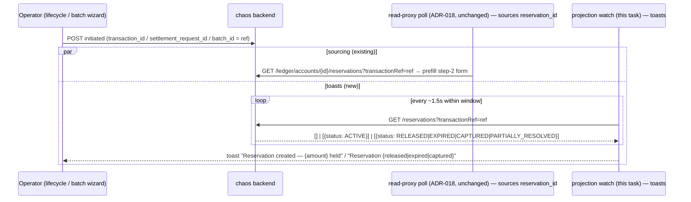

# Task 003 - Frontend: reservation create/release toasts in the settlement & disbursement flows

> React 19 · Vite · react-query 5 · shadcn/ui (`sonner`) · `chaos-admin/src/features/chaos`
> Implements the toast surface of [ADR-028](../../decisions/028-reservation-lifecycle-projection.md).
> Reuses the Phase 017 toaster + bounded-poll pattern
> ([ADR-026](026-run-page-failure-surfacing-via-bounded-polling.md)).
> Depends on Task 002 (the flat `/reservations` endpoint).

## Functional Requirements

1. In the settlement and disbursement flows (the lifecycle wizard) and the batch-disbursement
   wizard, after publishing a reservation-creating *initiated* event, a bounded watch polls the
   reservation projection scoped by that flow's request id and toasts when the reservation is
   **created** and when it is **released/expired/captured**.
2. Scope is **precise** (request-id-keyed, since the event carries the publisher's
   `transactionRef` = the value the client generated) — `transaction_id` for disbursement,
   `settlement_request_id` for settlement, `batch_id` for batch.
3. Toast copy is accurate to the observed status ("Reservation created — {amount} held",
   "Reservation released/expired/captured"); batch release toasts are deduped/capped.
4. Only flows that create a reservation arm the watch; the RANDOM unattended runner (server-side)
   is not toasted.

## Acceptance Criteria

- [ ] After publishing `disbursement.initiated` / `settlement.initiated` / the batch reservation
      request, a react-query poll calls
      `listReservations(token, { transactionRef })` (or `{ batchId }` for batch) on the ADR-026
      interval (~1500 ms) within the bounded window, `enabled` while mounted.
- [ ] On first observation of the reservation (status `ACTIVE`) → an **info/success toast**
      ("Reservation created — {amount} held", showing `reservation_id`).
- [ ] On a status transition to `RELEASED` / `EXPIRED` / `CAPTURED` (and, for batch,
      `PARTIALLY_RESOLVED` progress) → a toast reflecting the new state.
- [ ] Toasts are **deduped** (by `reservation_id` + `status`, or by the projection's
      `last_event_id`) and **capped** so batch fan-out doesn't spam.
- [ ] Settlement flows arm the create toast (settlement creates a ledger reservation) even
      though the settlement form has no `reservation_id` field.
- [ ] The window elapsing stops the poll; later transitions remain visible on the VA
      Reservations tab (Task 004).
- [ ] Coexists with the **existing ADR-018/023 reservation_id sourcing poll** (read-proxy) in
      the wizard — the two are independent (sourcing prefill vs lifecycle toasts); this task does
      **not** modify the sourcing poll.

## Technical Design

- **Watch hook** `use-reservation-watch(ref, { kind })` wrapping `useQuery` with
  `refetchInterval` that stops past the `pollUntil` deadline; `enabled` when `ref` is set.
  Tracks the last toasted `(reservationId, status)` in a `useRef` to dedupe.
- **Scope key:** the flow's request-id value, read from the wizard's step-1 values
  (the `transactionRequestId`-labelled field from ADR-025 / the catalog); batch uses `batch_id`.
- **Toaster:** reuse the Phase 017 `sonner` `<Toaster/>`; `toast.success`/`toast` for create,
  a state-appropriate tone for release/expiry.

## Implementation Notes

- **New** `chaos-admin/src/features/chaos/use-reservation-watch.ts`.
- **Modify** `chaos-admin/src/features/chaos/lifecycle-wizard.tsx`: arm the watch after the
  step-1 (initiated) publish for both disbursement and settlement (the existing
  `isDisbursement`-gated reservation_id sourcing poll stays as-is); fire toasts.
- **Modify** `chaos-admin/src/features/chaos/batch-disbursement-wizard.tsx`: arm the watch by
  `batch_id` after the reservation request; toast the batch reservation create + its release
  transitions (deduped/capped against the existing progress panel).
- Reuse `listReservations` + `ReservationStateResponse` (Task 002); constants mirror the
  Phase 017/018 watch (`*_POLL_INTERVAL_MS`, window) + a `reservationWatchEnabled` flag.

## Non-Functional Requirements

- **Server load:** scoped by a single `transactionRef`/`batchId` over an indexed column,
  bounded window, mounted-only — negligible (same posture as Parts 1–2).
- **UX:** non-blocking, stacking toasts; create vs release visually distinct; batch deduped.
- **Accuracy:** because scope is request-id-keyed, the toast is a precise statement about *this*
  flow's reservation (no heuristic caveat, unlike Part 2's balance toast).

## Dependencies

- **Task 002** (flat `/reservations` endpoint + client fn).
- **Phase 017 Task 005** (the `sonner` `<Toaster/>` + watch-hook pattern).
- The lifecycle wizard (Phase 014) + batch wizard (Phase 016) as the hook sites.

## Risks & Mitigations

- **Double signal vs the wizard's existing "reservation found" indicator** (read-proxy sourcing)
  → the toast adds the create confirmation *and* the release/expiry/capture notifications the
  sourcing poll never surfaced; acceptable minor overlap on "created".
- **Batch release spam** (many partial-resolution events) → dedupe by `(reservationId, status)`
  + cap; optionally collapse to a single "batch reservation resolving" + a terminal toast.
- **Late transition** (after window) → on the Reservations tab; window tunable.
- **Settlement scope** → arm by `settlement_request_id`; if no reservation appears (config
  variance), the watch simply times out silently.

## Testing Strategy

- **Component (Vitest + Testing Library + MSW):** initiated publish → ACTIVE → one create toast;
  transition to RELEASED/EXPIRED/CAPTURED → one state toast; batch fan-out deduped/capped;
  settlement arms create toast; window-elapsed stops; coexists with the sourcing poll; copy
  matches observed status.
- **Manual/e2e:** drive a disbursement that fails (reservation released) and a batch → confirm
  toasts on the run page (ties into Phase 006 e2e).

## Deployment Strategy

- Frontend-only; ships after Task 002 + the Phase 017 toaster. Behind `reservationWatchEnabled`
  (default on). Purely additive to the wizards; the sourcing poll is untouched.
