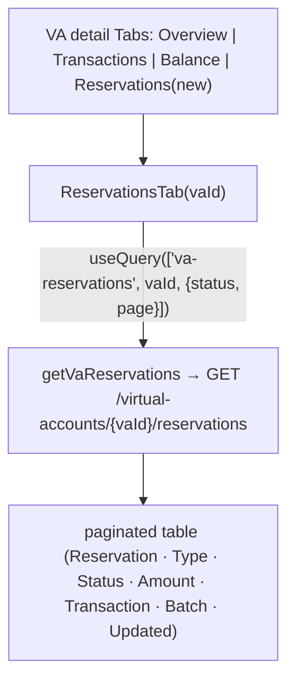

# Task 004 - Frontend: per-VA Reservations tab on the VA detail page

> React 19 · Vite · react-query 5 · shadcn/ui · `chaos-admin/src/features/virtual-accounts`
> Implements the browse UI of [ADR-028](../../decisions/028-reservation-lifecycle-projection.md).
> Depends on Task 002 (the per-VA reservations endpoint).

## Functional Requirements

1. The VA detail page gains a **Reservations** tab (alongside Overview, Transactions, and the
   Part 2 Balance tab) listing the account's reservations and their current states, newest-first,
   paginated.
2. Each row shows: reservation id, type (SINGLE/BATCH), status (badge), amount (+ currency),
   transaction id, batch id (if any), and timestamps (created / last update / terminal).
3. A status filter lets the operator narrow by state (ACTIVE / PARTIALLY_RESOLVED / CAPTURED /
   RELEASED / EXPIRED).

## Acceptance Criteria

- [ ] A `<TabsTrigger value="reservations">Reservations</TabsTrigger>` + `<TabsContent>` is added
      to the VA detail `Tabs`, persisted via the existing `usePersistedTabs` hook.
- [ ] The tab calls `getVaReservations(token, vaId, { status?, page, size })` and renders a
      paginated table ordered newest-first (`updated_at DESC`) with the existing offset
      pagination control.
- [ ] Columns: Reservation, Type, Status (badge), Amount (`formatMoney` + currency fallback to
      the VA's currency), Transaction, Batch (if present), Updated.
- [ ] A status filter control narrows results; clearing it returns all.
- [ ] Empty/loading/error states render gracefully (no white-screen if backend/circuit is down).
- [ ] Batch reservations are visually distinguishable (type badge + batch id) from single ones.
- [ ] Copy frames this as the consumed `ledger.reservation.*` lifecycle state (push-fed),
      distinct from the read-proxy reservation lookups the wizards use.

## Technical Design

- **Tab component** `ReservationsTab({ vaId })` in
  `features/virtual-accounts/reservations-tab.tsx`, structurally like the Part 2 Balance tab
  (offset pagination via `PageResponse`).
- **Query** `useQuery({ queryKey: ["va-reservations", vaId, { status, page }], queryFn: () => getVaReservations(token, vaId, { status, page, size: PER_PAGE }), placeholderData: keepPreviousData })`.
- Reuse shadcn `Table`/`Badge`/`Select`, the page/empty/error primitives, and `formatMoney`.
  Status badge color-codes terminal (CAPTURED/RELEASED/EXPIRED) vs in-flight (ACTIVE/PARTIALLY_RESOLVED).

## Implementation Notes

- **Modify** `chaos-admin/src/features/virtual-accounts/virtual-account-detail-page.tsx`: add the
  Reservations tab trigger + content (`{vaId ? <ReservationsTab vaId={vaId} /> : null}`).
- **New** `chaos-admin/src/features/virtual-accounts/reservations-tab.tsx`.
- Reuse `getVaReservations` + `ReservationStateResponse` (Task 002) and the existing
  offset-pagination control. No new nav item (a tab on an existing route).

## Non-Functional Requirements

- **Performance:** one paged query per view; `PER_PAGE` ≤ backend cap.
- **Resilience:** degrades to empty/error under consumer lag — never white-screens.
- **Clarity:** the tab reflects consumed lifecycle state (event-faithful); captured/released
  amounts + expiry (not in the event) are out of scope here — available via the read-proxy.

## Dependencies

- **Task 002** (per-VA endpoint + client fn + type).
- The VA detail page tab scaffold (Phase 015 / Part 2).

## Risks & Mitigations

- **Operator expects captured/released amounts/expiry** (not in the projection) → the tab shows
  status + total amount; a tooltip notes richer detail is in the ledger read-proxy.
- **Eventual consistency** (a reservation not yet projected) → normal refetch reconciles; empty
  states are graceful.

## Testing Strategy

- **Component (Vitest + Testing Library + MSW):** tab renders paginated rows newest-first;
  type/status badges; amount + currency fallback; status filter; empty/loading/error;
  page navigation refetches; batch vs single distinction.
- Folds into [Phase 006](../006-testing-and-verification/DESIGN.md).

## Deployment Strategy

- Frontend-only; ships after Task 002. Purely additive — a new tab on an existing page.
