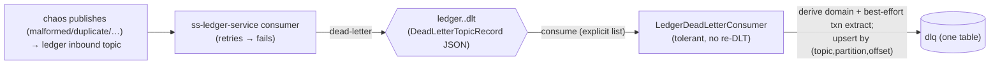

# Task 001 - DLT consumer + `dlq` projection

> Java 25 · Spring Boot 4 / Spring Kafka · new package `com.softspark.chaos.dlq`
> Implements the persistence half of [ADR-029](../../decisions/029-dead-letter-queue-projection.md).
> **Depends on Phase 017 Task 001** (the ADR-024 consumer infrastructure / `kafkaObjectMapper`).

## Functional Requirements

1. A `LedgerDeadLetterConsumer` subscribes to a **configurable explicit list** of the ledger's
   inbound DLT topics (`ledger.<flow-topic>.dlt`, default = the 17 topics) and projects each
   dead-lettered record into a single `dlq` table.
2. The DLT consumer is **terminal and tolerant**: it runs on its own container factory with a
   **log-and-skip** error handler and **never re-dead-letters** (no `DeadLetterPublishingRecoverer`).
3. Projection is **idempotent** by `(dlt_topic, dlt_partition, dlt_offset)`.
4. Each row derives a coarse `domain` from `original_topic` and **best-effort** extracts
   `transaction_id` / `transaction_type` / `event_type` / `event_id` from the original payload;
   nulls are acceptable (esp. for `DESERIALIZATION`-class dead letters).
5. Gated by `chaos.kafka.consumer.enabled`; its own consumer group.

## Acceptance Criteria

- [ ] `LedgerDeadLetterRecord` mirrors the ledger's `DeadLetterTopicRecord` (snake_case):
      `(UUID deadLetterId, Instant deadLetteredAt, String originalTopic, int originalPartition, long originalOffset, String originalKey, Failure failure, JsonNode originalEvent)`,
      `Failure(String classification, String exceptionType, String message, int retryCount)`.
- [ ] A dedicated `DLQ_CONTAINER_FACTORY` deserializes the DLT value into `LedgerDeadLetterRecord`
      (via the shared `kafkaObjectMapper`/converter) and uses a **logging** error handler — **no
      recoverer / no `*.dlt.dlt`**.
- [ ] `@KafkaListener(topics = "#{...the configured list...}", groupId = …, containerFactory = DLQ_CONTAINER_FACTORY)`
      receives `LedgerDeadLetterRecord` + the source topic/partition/offset (via
      `@Header(KafkaHeaders.RECEIVED_TOPIC/RECEIVED_PARTITION/OFFSET)`).
- [ ] `chaos.topics.ledger-dlts` lists the 17 inbound DLTs by default and is overridable.
- [ ] Flyway `V16` creates `dlq` with `UNIQUE(dlt_topic, dlt_partition, dlt_offset)` and indexes
      on `domain`, `transaction_id`, `transaction_type`, `original_topic`, `received_at`.
- [ ] Consuming a dead letter inserts one `dlq` row mapping every field; redelivery (same
      topic/partition/offset) is a no-op.
- [ ] `domain` is derived correctly (e.g. `collection.completed`→`COLLECTION`,
      `disbursement.batch.item.failed`→`BATCH_DISBURSEMENT`,
      `organization.va.settlement.failed`→`SETTLEMENT`, `organization.treasury.sweep.completed`→`TREASURY`).
- [ ] A `DESERIALIZATION`-class dead letter (null `originalEvent`) is still stored, with null
      `transaction_id`/`event_type` and `failure_classification = DESERIALIZATION`.
- [ ] The DLT consumer never produces to any topic.

## Technical Design



### Field mapping (DLT record → row)

| Column | Source |
|---|---|
| `id` | `Ids.generate()` |
| `dlt_topic` / `dlt_partition` / `dlt_offset` | Kafka headers of the consumed `.dlt` record *(dedup key)* |
| `dead_letter_id` | `deadLetterId` |
| `original_topic` | `originalTopic` |
| `domain` | derived from `originalTopic` |
| `source` | `LEDGER_INBOUND` (constant; discriminator for future extension) |
| `event_type` / `event_id` | `originalEvent.event_type` / `.event_id` (best-effort) |
| `transaction_id` | best-effort from `originalEvent.data` (`transaction_id` ▸ `transaction_request_id` ▸ `settlement_request_id` ▸ `transfer_request_id` ▸ `topup_request_id` ▸ `batch_id` ▸ `item_id`) |
| `transaction_type` | `originalEvent.data.transaction_type` else derived from `event_type` |
| `failure_classification` / `error_type` / `error_message` / `retry_count` | `failure.{classification, exceptionType, message, retryCount}` |
| `original_partition` / `original_offset` / `original_key` | `originalPartition` / `originalOffset` / `originalKey` |
| `dead_lettered_at` | `deadLetteredAt` |
| `original_payload_json` | `originalEvent` re-serialized (raw payload → Message tab; null if absent) |
| `raw_dlt_json` | the full DLT record as received |
| `received_at` | `Instant.now()` |

### Flyway `V16__dlq.sql`

```sql
CREATE TABLE IF NOT EXISTS dlq (
    id                     TEXT PRIMARY KEY,
    dlt_topic              TEXT NOT NULL,
    dlt_partition          INTEGER NOT NULL,
    dlt_offset             INTEGER NOT NULL,
    dead_letter_id         TEXT,
    original_topic         TEXT NOT NULL,
    domain                 TEXT NOT NULL,
    source                 TEXT NOT NULL,
    event_type             TEXT,
    event_id               TEXT,
    transaction_id         TEXT,
    transaction_type       TEXT,
    failure_classification TEXT,
    error_type             TEXT,
    error_message          TEXT,
    retry_count            INTEGER,
    original_partition     INTEGER,
    original_offset        INTEGER,
    original_key           TEXT,
    dead_lettered_at       TEXT,
    original_payload_json  TEXT,
    raw_dlt_json           TEXT,
    received_at            TEXT NOT NULL,
    CONSTRAINT uq_dlq_coords UNIQUE (dlt_topic, dlt_partition, dlt_offset)
);
CREATE INDEX IF NOT EXISTS idx_dlq_domain   ON dlq (domain);
CREATE INDEX IF NOT EXISTS idx_dlq_txn      ON dlq (transaction_id);
CREATE INDEX IF NOT EXISTS idx_dlq_txn_type ON dlq (transaction_type);
CREATE INDEX IF NOT EXISTS idx_dlq_orig     ON dlq (original_topic);
CREATE INDEX IF NOT EXISTS idx_dlq_received ON dlq (received_at);
```

> **Migration number.** On-disk highest is `V11`; Parts 1–3 add `V12`–`V15`. This phase is
> `V16` **assuming Parts 1–3 land first** (build order 017 → 018 → 019 → 020). Otherwise the
> next free version.

## Implementation Notes

- **New package** `com.softspark.chaos.dlq`:
  - `consumer/LedgerDeadLetterConsumer.java` (+ `@ConditionalOnProperty` gate),
    `consumer/LedgerDeadLetterRecord.java` (mirror), `model/DeadLetterRecord.java` (entity),
    `repository/DeadLetterRecordRepository.java` (`existsByDltTopicAndDltPartitionAndDltOffset`),
    `service/DeadLetterProjectionService.java` (map + derive domain + best-effort extract + upsert),
    `service/DlqDomain.java` (the original-topic→domain mapping).
- **New** `DLQ_CONTAINER_FACTORY` in `kafka/ConsumerConfiguration.java` (or a small dedicated
  config): same `ByteArrayJsonMessageConverter` approach (ADR-024) but with a **logging**
  `CommonErrorHandler` and **no** `DeadLetterPublishingRecoverer`.
- **Modify** `kafka/TopicCatalog.java` (or config): add `chaos.topics.ledger-dlts` (default the
  17 inbound DLT topic names).
- **New migration** `chaos-machine/src/main/resources/db/migration/V16__dlq.sql`.
- Best-effort extraction works on the `JsonNode` `originalEvent` (tolerate null / missing fields).

## Non-Functional Requirements

- **Resilience:** terminal/tolerant — a projection failure logs + skips (never re-DLTs, never
  blocks the partition indefinitely); at-least-once safe via the coords unique key.
- **Observability:** counter per `domain`/`failure_classification`; debug-log each captured
  dead letter (`original_topic`, `error_type`).
- **Storage:** unbounded growth acceptable; the Kafka DLTs have 14-day retention upstream;
  a retention/prune job is out of scope.

## Dependencies

- **Phase 017 Task 001** (consumer infra / shared `kafkaObjectMapper`).
- External contract (verified): the ledger `DeadLetterTopicRecord` + the 17 inbound DLT topic
  names + the `ledger.<topic>.dlt` convention.

## Risks & Mitigations

- **Accidentally consuming chaos-own outbound DLTs** (different format) → **explicit topic
  list**, not a `ledger\..*\.dlt` pattern; documented.
- **DLT-of-the-DLT loop** → the consumer has no recoverer and never produces; verified by test.
- **Unparseable `originalEvent`** (DESERIALIZATION class) → store the row with null
  payload/txn; `raw_dlt_json` retains everything; filterable by `failure_classification`.
- **Ledger contract drift** (record shape / topic names) → configurable list +
  `fail-on-unknown-properties=false` + a contract test pinning today's `DeadLetterTopicRecord`.

## Testing Strategy

- **Unit:** DLT record → entity mapping; domain derivation table; best-effort txn/type
  extraction (each request-id field; null-payload case); coords dedup; `DlqDomain` mapping.
- **Integration (Testcontainers Kafka):** publish a `DeadLetterTopicRecord` to a
  `ledger.<flow>.dlt` topic → one `dlq` row; redeliver → one row; a null-`originalEvent` record →
  stored with `DESERIALIZATION` class + null txn; assert the consumer produces to no topic.
- **Contract:** `LedgerDeadLetterRecord` round-trips the ledger's exact `DeadLetterTopicRecord` JSON.
- Folds into [Phase 006](../006-testing-and-verification/DESIGN.md).

## Deployment Strategy

- Additive Flyway `V16`; no backfill (the Kafka DLTs retain 14 days, so recent dead letters
  populate on first run from the configured offset reset). Consumer gated by
  `chaos.kafka.consumer.enabled`; topic list + group id configurable.
