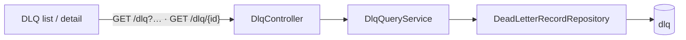

# Task 002 - DLQ query API

> Java 25 · Spring Boot 4 · package `com.softspark.chaos.dlq` (controller/dto/service)
> Implements the query surface of [ADR-029](../../decisions/029-dead-letter-queue-projection.md).
> Depends on Task 001 (the `dlq` table).

## Functional Requirements

1. Expose `GET /api/v0/dlq` over the `dlq` table — paginated, newest-first, filterable by **dlt
   domain**, **transaction id**, and **transaction type** (the idea's filters), plus
   `originalTopic`, `failureClassification`, `from`/`to`.
2. Expose `GET /api/v0/dlq/{id}` returning one record including the original payload + the full
   raw DLT JSON (for the tabbed detail).
3. Follow `/history` conventions (`PageResponse<T>`, zero-based `page`, `size` ≤ 100).

## Acceptance Criteria

- [ ] `GET /api/v0/dlq` returns `PageResponse<DeadLetterRecordResponse>` ordered
      `received_at DESC`; filters `domain`, `transactionId`, `transactionType`, `originalTopic`,
      `failureClassification`, `from`, `to` all optional and composable; `size` clamped ≤ 100.
- [ ] `GET /api/v0/dlq/{id}` returns the record (404 if absent) including `originalPayloadJson`
      and `rawDltJson`.
- [ ] `DeadLetterRecordResponse` exposes `id, dltTopic, originalTopic, domain, source,
      eventType, eventId, transactionId, transactionType, failureClassification, errorType,
      errorMessage, retryCount, originalPartition, originalOffset, deadLetteredAt, receivedAt`
      (+ `originalPayloadJson`, `rawDltJson` on the single-item path).
- [ ] AUTH-gated like every `/api/v0/**` route.
- [ ] An empty result set returns an empty page (never 404 on the list).

## Technical Design

### Endpoints

| Method · Path | Query | Returns |
|---|---|---|
| `GET /api/v0/dlq` | `domain?`, `transactionId?`, `transactionType?`, `originalTopic?`, `failureClassification?`, `from?`, `to?`, `page=0`, `size=20` | `PageResponse<DeadLetterRecordResponse>` |
| `GET /api/v0/dlq/{id}` | — | `DeadLetterRecordResponse` (incl. payload + raw; 404 if absent) |

### Repository / service

```java
Page<DeadLetterRecord> findByDomain(String domain, Pageable p);
Page<DeadLetterRecord> findByTransactionId(String transactionId, Pageable p);
Page<DeadLetterRecord> findByTransactionType(String transactionType, Pageable p);
Page<DeadLetterRecord> findByOriginalTopic(String originalTopic, Pageable p);
Page<DeadLetterRecord> findByReceivedAtBetween(Instant from, Instant to, Pageable p);
```

A `DlqQueryService` composes the present filters (a `Specification` or the same
present-filter dispatch as `HistoryController`/its service), defaulting to `received_at DESC`.
The list DTO **omits** the heavy `originalPayloadJson`/`rawDltJson` (returned only by `/{id}`)
to keep list pages light.



## Implementation Notes

- **New** `dlq/controller/DlqController.java`, `dlq/dto/DeadLetterRecordResponse.java`
  (list + detail variants, or one record with the heavy fields `@Nullable` and populated only on
  the detail path), `dlq/service/DlqQueryService.java`.
- **Extend** `dlq/repository/DeadLetterRecordRepository.java` (Task 001 created it).
- Reuse `PageResponse<T>` + pagination helpers; standard `ApiError`; springdoc annotations.
- **Add** client functions in `chaos-admin/src/lib/api.ts`:
  `listDeadLetters(token, { domain?, transactionId?, transactionType?, originalTopic?, failureClassification?, from?, to?, page?, size? })`
  and `getDeadLetter(token, id)`, plus the `DeadLetterRecordResponse` type (Tasks 003/004).
- Consider a tiny `GET /api/v0/dlq/domains` (distinct domains) to populate the filter dropdown,
  or hard-code the known domain enum client-side — implementer's choice.

## Non-Functional Requirements

- **Performance:** filters hit indexed columns (`domain`, `transaction_id`, `transaction_type`,
  `original_topic`, `received_at`); list omits heavy payload columns; bounded page size.
- **Security:** AUTH-gated; dead letters may contain tenant-identifying payloads.
- **Consistency:** paging/sort/error semantics identical to `/history`.

## Dependencies

- **Task 001** (table + entity + repository).
- Consumed by **Task 003** (list) and **Task 004** (detail).

## Risks & Mitigations

- **Heavy payloads bloating list responses** → exclude `originalPayloadJson`/`rawDltJson` from
  the list projection; return them only on `/{id}`.
- **Free-text `transactionId`/`originalTopic` filters** → exact-match on indexed columns; no
  `LIKE` scans.

## Testing Strategy

- **Slice (`@WebMvcTest` + `@DataJpaTest`):** each filter + composition; `received_at DESC`;
  paging/clamp; list omits heavy fields; `/{id}` includes them; 404 on missing id; empty page;
  AUTH.
- **Integration:** seed `dlq` rows across domains → assert filter results.
- Folds into [Phase 006](../006-testing-and-verification/DESIGN.md).

## Deployment Strategy

- Pure read API over the Task 001 table; no migration of its own. Shippable once 001 lands.
