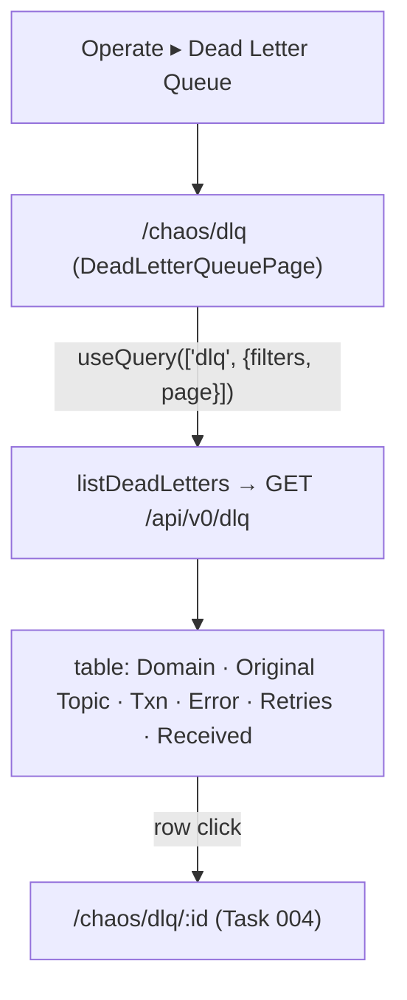

# Task 003 - Frontend: "Dead Letter Queue" nav item + list page

> React 19 · Vite · react-query 5 · react-router 7 · shadcn/ui · new `chaos-admin/src/features/dlq`
> Implements the list surface of [ADR-029](../../decisions/029-dead-letter-queue-projection.md).
> Depends on Task 002 (the `GET /api/v0/dlq` endpoint).

## Functional Requirements

1. A new **"Dead Letter Queue"** item under the **Operate** nav group routes to a DLQ list page.
2. The list shows dead letters newest-first, paginated, with filters for **domain**,
   **transaction id**, and **transaction type** (matching the endpoint).
3. Each row summarizes the dead letter and links to its detail view (Task 004).

## Acceptance Criteria

- [ ] `operateNavigation` gains `{ to: "/chaos/dlq", label: "Dead Letter Queue", icon: <alert icon> }`
      (e.g. `AlertTriangle`/`AlertOctagon` from lucide-react), rendered under Operate.
- [ ] Routes `/chaos/dlq` (list) and `/chaos/dlq/:id` (detail — Task 004) are registered under
      the app shell (lazy-loaded like the other feature pages).
- [ ] The list page calls `listDeadLetters(token, { ...filters, page })` and renders a table:
      Domain, Original Topic, Transaction (id/type), Error (type/message), Retries, Received —
      with loading/empty/error states (`StatePanel`) and the existing `ListPagination`.
- [ ] Filter controls: a **domain** select (known domain enum or `/dlq/domains`), a
      **transaction id** input, a **transaction type** input/select; applying refetches.
- [ ] Clicking a row navigates to `/chaos/dlq/:id`.
- [ ] Error/retry columns surface the failure at a glance (e.g. a danger badge for the error type).

## Technical Design

- **Page** `DeadLetterQueuePage` in `features/dlq/dead-letter-queue-page.tsx`, modeled on
  `transactions-page.tsx` `SentHistoryTab` (filters + table + `ListPagination` + `StatePanel`).
- **Query** `useQuery({ queryKey: ["dlq", { ...applied, page }], queryFn: () => listDeadLetters(token, { ...applied, page, size: PER_PAGE }), placeholderData: keepPreviousData })`.
- Reuse shadcn `Table`/`Badge`/`Select`/`Input` and the page primitives; `formatRelative`/date
  formatting consistent with other lists.

## Implementation Notes

- **Modify** `chaos-admin/src/components/layout/app-shell.tsx`: add the Operate nav item.
- **Modify** `chaos-admin/src/app/router.tsx`: register `/chaos/dlq` and `/chaos/dlq/:id`
  (lazy imports of the page + detail page).
- **New** `chaos-admin/src/features/dlq/dead-letter-queue-page.tsx`.
- Reuse `listDeadLetters` + `DeadLetterRecordResponse` (Task 002). `PER_PAGE` ≤ backend cap.

## Non-Functional Requirements

- **Performance:** one paged query per view; heavy payloads are not in the list response (Task 002).
- **Resilience:** degrades to empty/error states under consumer lag / backend down — never
  white-screens.
- **Clarity:** the list reads as "what the ledger rejected" — domain + error are prominent.

## Dependencies

- **Task 002** (`GET /api/v0/dlq` + client fn + type).
- Pairs with **Task 004** (the detail route this list links to).

## Risks & Mitigations

- **Unknown domain set** for the filter → derive from a small client-side enum or a
  `/dlq/domains` endpoint; tolerate new values.
- **High volume** under heavy chaos runs → pagination + indexed filters; default newest-first.

## Testing Strategy

- **Component (Vitest + Testing Library + MSW):** list renders rows newest-first; filters
  (domain/txn id/txn type) refetch; row click navigates to `/chaos/dlq/:id`; empty/loading/error
  states; pagination.
- Folds into [Phase 006](../006-testing-and-verification/DESIGN.md).

## Deployment Strategy

- Frontend-only; ships after Task 002. Additive nav item + routes; no impact on existing pages.
