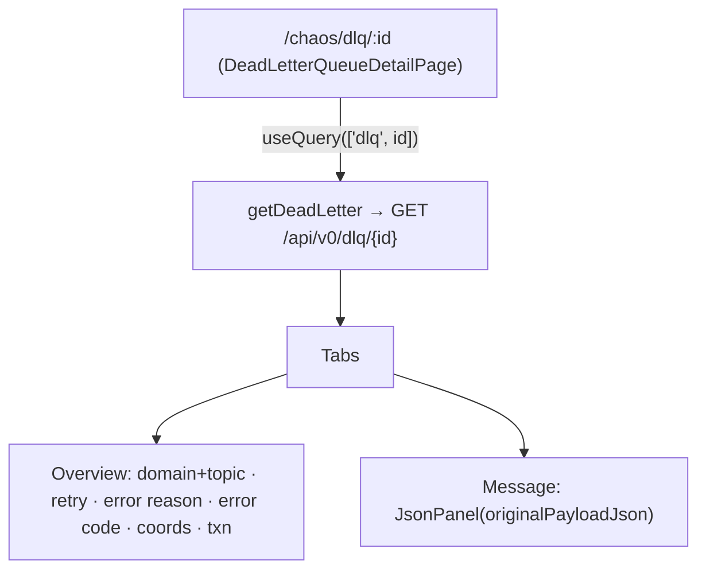

# Task 004 - Frontend: DLQ detail (tabbed Overview + Message)

> React 19 · Vite · react-query 5 · shadcn/ui · `chaos-admin/src/features/dlq`
> Implements the detail surface of [ADR-029](../../decisions/029-dead-letter-queue-projection.md).
> Depends on Task 002 (`GET /api/v0/dlq/{id}`) and Task 003 (the list links here).

## Functional Requirements

1. Clicking a DLQ list item opens a detailed **tabbed** view at `/chaos/dlq/:id`.
2. **Overview tab**: the domain + original topic, retry info, error reason, and error code (plus
   dead-lettered-at and the original Kafka coordinates).
3. **Message tab**: the raw JSON payload that was sent (the original event).

## Acceptance Criteria

- [ ] A `DeadLetterQueueDetailPage` at `/chaos/dlq/:id` fetches `getDeadLetter(token, id)` and
      renders a header + shadcn `Tabs` (Overview, Message).
- [ ] **Overview** shows: Domain + **Original Topic** (`domain` + `originalTopic`), **Retry info**
      (`retryCount` + the configured policy note), **Error reason** (`errorMessage`), **Error code**
      (`errorType` + `failureClassification` badge), Dead-lettered at (`deadLetteredAt`), and the
      original coordinates (`originalPartition`/`originalOffset`/`originalKey`), plus
      transaction id/type when present.
- [ ] **Message** shows the original payload via the existing `JsonPanel` (parsed from
      `originalPayloadJson`; falls back to the raw string if unparseable); when `originalPayloadJson`
      is null (DESERIALIZATION class), it shows `rawDltJson` / an explanatory empty state.
- [ ] 404 / not-found and loading/error states render gracefully; a back link returns to the list.
- [ ] (Optional) a "Headers / Raw" affordance exposes `rawDltJson` for full fidelity.

## Technical Design

- **Page** `DeadLetterQueueDetailPage` in `features/dlq/dead-letter-queue-detail-page.tsx`,
  modeled on the `transactions-page.tsx` detail dialog tabs + `virtual-account-detail-page.tsx`
  tab structure (shadcn `Tabs`/`TabsList`/`TabsTrigger`/`TabsContent`).
- **Query** `useQuery({ queryKey: ["dlq", id], queryFn: () => getDeadLetter(token, id), enabled: Boolean(id) })`.
- **Message** reuses `components/layout/json-panel.tsx` (`JSON.parse` with raw-string fallback —
  the same pattern the history detail dialog uses for `payloadJson`).
- A `/chaos/dlq/:id` deep-link works (the page fetches by id), so list→detail and direct
  navigation both work.

## Implementation Notes

- **New** `chaos-admin/src/features/dlq/dead-letter-queue-detail-page.tsx` (route registered in
  Task 003's router change).
- Reuse `getDeadLetter` + `DeadLetterRecordResponse` (Task 002), `JsonPanel`, shadcn `Tabs`,
  `Badge`, and the page/state primitives.
- Render `failureClassification` as a colored badge (`DESERIALIZATION` vs `PROCESSING` vs
  `VERSION_RESOLUTION`); show the configured retry policy (max-attempts=4, 1s×2 backoff) next to
  `retryCount` so "retry info" is meaningful even though per-attempt timeline isn't available.

## Non-Functional Requirements

- **Performance:** single by-id fetch (heavy payload fields only on this path).
- **Resilience:** graceful 404 / error / empty (esp. null payload for DESERIALIZATION dead
  letters) — never white-screens.
- **Clarity:** Overview answers "what failed and why"; Message answers "what exactly was sent".

## Dependencies

- **Task 002** (`GET /api/v0/dlq/{id}` + client fn + type).
- **Task 003** (nav, list, and the `/chaos/dlq/:id` route registration).

## Risks & Mitigations

- **Null `originalPayloadJson`** (DESERIALIZATION dead letter — the original was unparseable) →
  Message tab falls back to `rawDltJson` + an explanatory note; Overview still fully populated
  from the `Failure` block.
- **Very large payloads** → `JsonPanel` is scrollable/monospace; consider a copy button.

## Testing Strategy

- **Component (Vitest + Testing Library + MSW):** detail renders Overview fields (domain/topic,
  retry, error reason/code badge, coords, txn) + Message JSON; null-payload case shows the
  fallback; 404/loading/error states; back link.
- Folds into [Phase 006](../006-testing-and-verification/DESIGN.md).

## Deployment Strategy

- Frontend-only; ships after Tasks 002 + 003. Additive detail route; no impact on existing pages.
