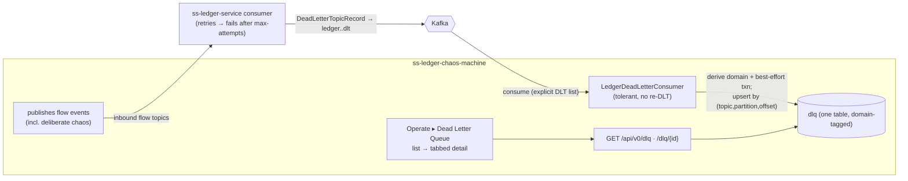

# Phase 20 - Dead Letter Queue Views

## Summary
Adds a **Dead Letter Queue** capability: a consumer that ingests the **ledger's inbound
dead-letter topics** (`ledger.<flow-topic>.dlt`) — the chaos machine's deliberately-malformed
traffic that the ledger rejected — into a **single `dlq` table**, a filterable query API
(`GET /api/v0/dlq`), and a new **"Dead Letter Queue"** nav item under *Operate* with a list →
**tabbed detail** (Overview + Message). This is the **final part (Part 4 of 4)** of the
"testing ledger Kafka events" series (idea `014_dlt_views.md`), riding the Part 1 consumer
infrastructure ([ADR-024](../../decisions/024-multi-event-ledger-outbound-consumer.md)). See
[ADR-029](../../decisions/029-dead-letter-queue-projection.md).

## Motivation
The harness exists to push the ledger with malformed / duplicated / out-of-order traffic and
**watch how it copes**. When the ledger can't process a record after its configured retries, it
dead-letters it — and until now the chaos machine had **no way to see that happen**. The
operator could send a deliberately-broken `collection.completed` and only guess whether it was
rejected, processed, or silently dropped. This phase closes that gap: every dead letter the
ledger emits for the chaos machine's published traffic becomes a queryable, inspectable row with
the failure reason, error class, retry count, and the exact payload that was sent.

## User-Facing Changes
- **New nav item "Dead Letter Queue" under *Operate*** → a list of dead-lettered messages,
  newest-first, filterable by **domain**, **transaction id**, and **transaction type**.
- **Tabbed detail** (`/chaos/dlq/:id`): **Overview** (domain + original topic, retry info, error
  reason, error code/classification, dead-lettered-at, original coordinates, transaction id/type)
  and **Message** (the raw JSON payload that was sent).
- **New API:** `GET /api/v0/dlq` (filters) + `GET /api/v0/dlq/{id}`.
- **New operational surface:** a dedicated DLT consumer group + lag.

## Architecture Impact
A new `com.softspark.chaos.dlq` feature package: a **tolerant, terminal** DLT consumer (its own
container factory with a **log-and-skip** handler and **no recoverer** — a DLT viewer that can't
itself create dead letters), a single `dlq` projection table (Flyway `V16`), a query API, and a
new frontend feature (`features/dlq`) with a nav item, list page, and tabbed detail. The consumer
subscribes to a **configurable explicit list** of the 17 ledger inbound DLT topics (not a
`ledger\..*\.dlt` pattern, which would also catch the chaos-machine's own outbound-event DLTs —
a different format). The `dlq` table is **domain-tagged and format-agnostic**, so the chaos-own
consumer DLTs can be folded in later behind a `source` discriminator without a migration
([ADR-029](../../decisions/029-dead-letter-queue-projection.md)).

**Contract notes (verified against `ss-ledger-service`).** The ledger dead-letters inbound
consumers to `ledger.<original-topic>.dlt` (17 topics), with a structured JSON value:
`DeadLetterTopicRecord(deadLetterId, deadLetteredAt, originalTopic, originalPartition,
originalOffset, originalKey, Failure{classification, exceptionType, message, retryCount},
originalEvent: EventEnvelope<JsonNode>)`. Retry policy: max-attempts=4 (3 retries), exponential
1s×2 → DLT. The wrapper is always valid JSON even when `originalEvent` is null (the *original*
payload was unparseable — a `DESERIALIZATION`-class failure). The chaos-machine's **own**
outbound-event DLTs (`ledger.account.created.dlt`, …) are a different, Spring-standard format and
are **deliberately out of scope** here (folded in later behind `source`).

## Edge Cases
- **At-least-once redelivery** → upsert by `(dlt_topic, dlt_partition, dlt_offset)` (always
  present) → one row.
- **`DESERIALIZATION`-class dead letter** (null `originalEvent`) → still stored; `transaction_id`/
  `event_type` null; `raw_dlt_json` retains everything; filterable by `failure_classification`;
  the Message tab falls back to the raw DLT JSON.
- **Best-effort transaction extraction** — the request-id field differs per event type
  (`transaction_id`/`settlement_request_id`/`batch_id`/…); null when unparseable.
- **DLT-of-the-DLT** — impossible: the consumer has no recoverer and produces to no topic.
- **Accidentally ingesting chaos-own DLTs** (wrong format) → prevented by the explicit topic
  list (not a wildcard).
- **Consumer lag / ledger contract drift** → eventually-consistent mirror; configurable topic
  list + a contract test pin the `DeadLetterTopicRecord` shape and topic names.
- **Kafka DLT retention (14 days upstream)** → on first run the consumer picks up recent dead
  letters per its offset reset; older ones beyond retention are gone (the chaos `dlq` retains
  what it captured).

## Testing Strategy
- **Unit:** DLT record→entity mapping; domain derivation; best-effort txn/type extraction (incl.
  null-payload); coords dedup.
- **Integration (Testcontainers Kafka):** publish a `DeadLetterTopicRecord` to a `ledger.<flow>.dlt`
  topic → one `dlq` row; redeliver → one row; null-`originalEvent` → stored with
  `DESERIALIZATION` + null txn; assert the consumer produces to no topic.
- **Slice (`@WebMvcTest`/`@DataJpaTest`):** `/dlq` filters (domain/txn id/txn type/originalTopic/
  classification/time), ordering, paging/clamp, list omits heavy payload, `/{id}` includes it,
  404, AUTH.
- **Frontend (Vitest + Testing Library + MSW):** nav item + routes; list (filters, rows,
  pagination, row→detail); detail tabs (Overview fields + Message JSON; null-payload fallback;
  404/empty/error).
- **Contract:** mirror record round-trips the ledger's exact `DeadLetterTopicRecord` JSON.
- Consolidated into [Phase 006](../006-testing-and-verification/DESIGN.md).

## Deployment Strategy
- One additive Flyway migration (`dlq`), numbered **`V16`** assuming Parts 1–3's `V12`–`V15`
  land first (build order 017 → 018 → 019 → 020); otherwise the next free version. No backfill.
- Consumer gated by `chaos.kafka.consumer.enabled`; the DLT topic list + group id configurable.
  Backend and frontend ship independently and additively.

## Tasks
- [001 - DLT consumer + `dlq` projection](./001-dlt-consumer-dlq-projection.md) — tolerant consumer (own factory, log-and-skip, no recoverer) on the configurable inbound-DLT list, `DeadLetterTopicRecord` mirror, `dlq` entity/repo/service, domain derivation + best-effort txn extraction, Flyway `V16`, dedup by coords. *(ADR-029)*
- [002 - DLQ query API](./002-dlq-query-api.md) — `GET /api/v0/dlq` (domain/transactionId/transactionType + originalTopic/classification/time) + `/{id}` (payload + raw). *(ADR-029)*
- [003 - "Dead Letter Queue" nav + list page](./003-dlq-nav-and-list-page.md) — Operate nav item, `/chaos/dlq` list with filters, row→detail link. *(ADR-029)*
- [004 - DLQ detail (tabbed Overview + Message)](./004-dlq-detail-tabbed-view.md) — `/chaos/dlq/:id` tabbed view: Overview (domain/topic, retry, error reason/code, coords, txn) + Message (raw payload via `JsonPanel`). *(ADR-029)*

## Parallel Tasks
- **001** is the foundation and blocks **002** (table) and ultimately the frontend.
- **002** depends on 001; **003** (list) and **004** (detail) both depend on 002 — buildable
  against MSW fixtures in parallel, wired live once 002 lands. 004 reuses the route registered in
  003.
- Cross-phase: **001 depends on Phase 017 Task 001** (the ADR-024 consumer infra / shared
  `kafkaObjectMapper`). If Phase 017 hasn't landed, pull that in first.

Recommended order: **(Phase 017 consumer infra) → 001 → 002 → (003 → 004)**.

This completes the four-part "testing ledger Kafka events" series (Parts 1–3 =
[017](../017-ledger-transaction-failure-events/DESIGN.md) /
[018](../018-balance-history/DESIGN.md) / [019](../019-reservation-lifecycle-tracking/DESIGN.md)):
the chaos machine now consumes the ledger's failure, balance, and reservation outbound events and
observes the dead letters of its own inbound traffic.
