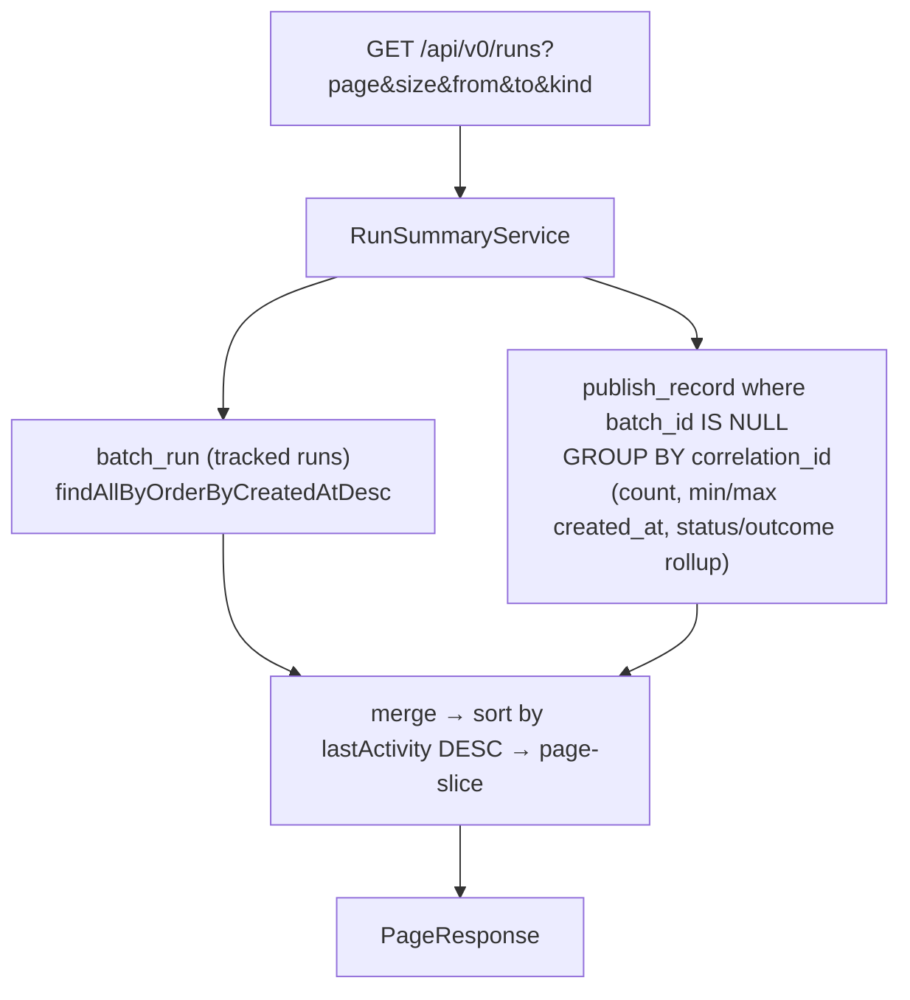

# Task 001 - Run-grouped history API (`GET /api/v0/runs`)

## Functional Requirements
- Expose a read-only, paginated **run-grouped** feed of published activity that powers the
  Scenario Runner's *Run History* tab. Each entry is a **run**; the feed is ordered newest-first.
- A **run** is either:
  - a **tracked run** — a `batch_run` row (N-Times-async, lifecycle-random, batch-disbursement, or
    a historical CSV run), or
  - an **untracked run** — a group of `publish_record` rows with `batch_id IS NULL`, grouped by
    `correlation_id` (single publish, N-Times-SYNC, interactive wizard sequence).
- Each run row carries a summary sufficient to render a Run History accordion header **without**
  fetching its children: run id/key, kind, flow type(s), event count, status rollup, ledger-outcome
  rollup, intentional-failure flag, first/last activity timestamps, and (for tracked runs) the
  `batch_run` progress counters + `external_batch_id`.
- Drilling into a run (expanding it) is served by the **existing** `GET /api/v0/history` with
  `batchId` (tracked) or `correlationId` (untracked) — this task adds **no** child endpoint.

## Acceptance Criteria
- [ ] `GET /api/v0/runs` returns a `PageResponse<RunSummaryResponse>` ordered by last activity
      (`created_at`) DESC, with the standard chaos pagination contract (`page`, `size` default 20,
      max 100).
- [ ] A `batch_run` row yields exactly one run entry with `runKey = batch_run.id`, `tracked = true`,
      `kind` from `batch_run.kind`, and counters/status taken from `batch_run`.
- [ ] `publish_record` rows with `batch_id IS NULL` are grouped by `correlation_id` into one run
      entry each (`tracked = false`, `runKey = correlation_id`), with `eventCount`, distinct
      `eventType`s, min/max `created_at`, a `status` rollup, and `intentionalFailure = any`.
- [ ] A correlation group of size 1 is returned as a singleton run with `kind = SINGLE`.
- [ ] `publish_record` rows **with** a `batch_id` are **not** double-counted as untracked runs
      (they belong to their tracked run).
- [ ] Optional filters mirror the history filters that make sense at run granularity (at least
      `from`/`to` on last activity, and `kind`); unknown/blank filters are ignored.
- [ ] Endpoint requires a verified AUTH SERVICE token (same posture as `/history`).
- [ ] No new table and no Flyway migration are introduced.

## Technical Design
A new `RunSummaryService` composes two queries and merges them in a deterministic, paginated order.



`RunSummaryResponse` (record, `@RecordBuilder`):

```text
RunSummaryResponse(
  String runKey,            // batch_run.id (tracked) | correlation_id (untracked)
  boolean tracked,
  String kind,              // RunKind name | "SINGLE" | "MANUAL_SEQUENCE"
  List<String> flowTypes,   // distinct event types in the run
  int eventCount,
  RunStatusRollup status,   // e.g. ALL_PUBLISHED | HAS_FAILURES | RUNNING (tracked only)
  int publishedCount, int failedCount,   // from batch_run counters (tracked) or publish_record status tally (untracked)
  boolean intentionalFailure,
  Instant firstActivityAt, Instant lastActivityAt,
  String externalBatchId,   // tracked batch-disbursement only; else null
  String correlationId,     // for the untracked drill-down link; tracked → null or representative
  String batchId            // for the tracked drill-down link; untracked → null
)
```

**Grouping key** = `COALESCE(batch_id, correlation_id)` (ADR-031). Tracked runs come from
`batch_run` (authoritative counters/status); untracked from a `GROUP BY correlation_id` over
`publish_record WHERE batch_id IS NULL`.

**Pagination of a union.** Because two sources merge, paginate by computing both result sets in a
bounded window and slicing the merged, time-sorted list. Acceptable approaches (pick one,
documented in code):
1. **DB-side count + windowed fetch** — `COUNT` each source for the total, then fetch enough of each
   (a JPQL `GROUP BY` projection for untracked, `Pageable` for tracked) to cover the requested page
   after merge. Preferred for correctness at scale.
2. **In-memory merge with a bound** — fetch both ordered streams up to `(page+1)*size` and merge;
   simplest, fine for the single-operator harness's data volumes. If chosen, **`log`/document the
   bound** so it is not mistaken for unbounded.

The untracked aggregation is a single JPQL/`@Query` projection:
`SELECT new ...RunGroupProjection(p.correlationId, COUNT(p), MIN(p.createdAt), MAX(p.createdAt),
SUM(CASE WHEN p.status='FAILED' THEN 1 ELSE 0 END), MAX(CASE WHEN p.intentionalFailure THEN 1 ELSE 0
END)) FROM PublishRecord p WHERE p.batchId IS NULL AND p.correlationId IS NOT NULL GROUP BY
p.correlationId`. Rows with a null `correlation_id` and null `batch_id` are emitted as singleton
runs keyed by their own `id` (defensive; should be rare).

## Implementation Notes
- New package `com.softspark.chaos.run` (or extend `history`): `controller/RunController`
  (`@RequestMapping("/api/v0/runs")`), `service/RunSummaryService`, `dto/RunSummaryResponse`,
  `dto/RunStatusRollup` (enum), `dto/RunGroupProjection` (the JPQL projection record).
- Reuse `BatchRunRepository` (tracked) and add aggregate query methods to `PublishRecordRepository`
  (untracked group projection + a count). Do **not** add columns.
- DTOs are records built with **`@RecordBuilder`** + the generated builder (never positional
  `new`), per the project convention; avoid reserved-word identifiers (use `row` not `record`).
- Map `batch_run` → `RunSummaryResponse` reusing `BatchRunResponse`'s field semantics
  (kind/pacing/mode/counters/status/externalBatchId) so the tracked summary matches the run-detail
  page.
- The ledger-outcome rollup (published-to-Kafka vs ledger-accepted/rejected) may reuse the Phase 017
  `transaction_failure` batch lookup keyed by the run's `transaction_request_id`s **only if cheap**;
  otherwise expose the publish-status rollup now and let the frontend resolve ledger outcome per
  expanded page (as the Sent tab already does). Prefer the latter to keep `/runs` a single read.
- Indexes already present on `publish_record(correlation_id, batch_id, created_at)` (Phase 003/017)
  cover the grouping/order; confirm and add none unless a query plan demands it.

## Non-Functional Requirements
- Read-only; p95 < 150ms on a typical local SQLite DB for the first page.
- Single-statement aggregation for the untracked side (no N+1); bounded merge window.
- Respects SQLite single-writer posture — this is a pure reader, no contention added.

## Dependencies
- Phase 003 Task 005 (`publish_record`, `batch_run`, history query service).
- Phase 013/014/016 (the `kind` discriminator + the three run producers) — read-only here.
- Unblocks Task 006 (Run History tab).

## Risks & Mitigations
- *Union pagination correctness* (a run could appear/skip across pages if totals are miscomputed) →
  compute a single authoritative total = (tracked count) + (distinct untracked `correlation_id`
  count); cover with a mixed-page test.
- *Interactive wizard events not sharing `correlation_id`* → would fragment a run into singletons;
  mitigated by Task 006 making the wizards emit a stable correlation id; documented fallback is
  grouping by `transaction_request_id`.
- *Large untracked history* → in-memory merge bound documented; switch to DB-windowed fetch if data
  volume grows.

## Testing Strategy
- **Unit (`@DataJpaTest`):** seed mixed `publish_record` (with/without `batch_id`, multiple
  correlation groups) + `batch_run` rows; assert run count, grouping, rollups, ordering, singleton
  kind, no double-counting, pagination totals.
- **Slice (`@WebMvcTest`):** paging/clamp, filters, AUTH 401, empty feed.
- **Repository:** the untracked group projection returns expected aggregates incl. null-correlation
  defensive path.
- Frameworks: JUnit 5, AssertJ, Mockito, Spring Boot test slices (mirrors existing suites).

## Deployment Strategy
Additive endpoint; no migration, no flag. Ships with the backend; the frontend (Task 006) consumes
it once deployed. Removal of `GET /batches` (list) happens in Task 002 — sequence 001 before 002 so
`/runs` exists before the old list is withdrawn.
