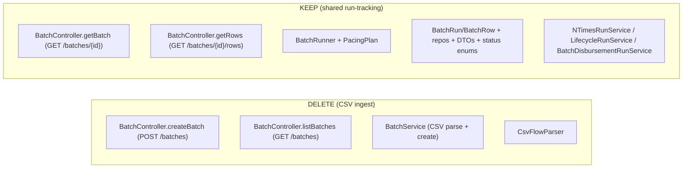

# Task 002 - Retire CSV-batch ingest (backend)

## Functional Requirements
- Remove the **CSV ingest path** from the backend: CSV file upload, CSV parsing, and the run
  **list** endpoint that the (now-retired) *Batches* page consumed.
- **Preserve** the shared run-tracking infrastructure that the N-Times-async, lifecycle-random, and
  batch-disbursement-automatic runners depend on, including the tracked-run **detail** endpoints.
- Leave historical CSV runs readable (no destructive schema change).

## Acceptance Criteria
- [ ] `POST /api/v0/batches` (multipart CSV upload) is removed; calling it returns 404.
- [ ] `GET /api/v0/batches` (run **list**) is removed (superseded by `GET /api/v0/runs`, Task 001);
      returns 404.
- [ ] `GET /api/v0/batches/{id}` and `GET /api/v0/batches/{id}/rows` **remain** and behave
      identically (they back the run-detail/progress page for all run kinds).
- [ ] `BatchService` (CSV parse + run creation) and `CsvFlowParser` are deleted; nothing references
      them.
- [ ] `BatchRunner`, `PacingPlan`, `BatchRun`/`BatchRow` entities + repositories,
      `BatchRunResponse`/`BatchRowResponse`, `BatchRunStatus`/`BatchRowStatus`, and the three run
      services (`NTimesRunService`, `LifecycleRunService`, `BatchDisbursementRunService`) are
      **unchanged** and still create + complete runs.
- [ ] `RunKind.CSV` enum value and the `batch_run.filename` column are **kept** (historical runs);
      no Flyway migration is added or altered.
- [ ] The flow catalog's `csvColumns` field is removed **only if** nothing else reads it; otherwise
      it is left in place and documented as vestigial (see Implementation Notes).
- [ ] Backend builds and the full run-infra test suite passes (N-Times/lifecycle/batch-disbursement
      regressions green).

## Technical Design
The `batch` package splits cleanly into CSV-specific (delete) and shared (keep):

`BatchController` is trimmed to the two GET-by-id endpoints. Because `getBatch`/`getRows` currently
delegate to `BatchService.getRunById`/`getRows`, **move those read methods** out of the
CSV-laden `BatchService` into a small `BatchQueryService` (or fold into an existing shared service)
so `BatchService` (CSV) can be deleted without losing the readers. Alternatively, retain a slimmed
`BatchService` containing only the read methods and delete its CSV creation/parse code — pick
whichever keeps the diff smallest and the readers cohesive; document the choice.

## Implementation Notes
- Files to **delete**: `batch/csv/CsvFlowParser.java`, `batch/service/BatchService.java` (CSV
  portions — see above), the `createBatch` + `listBatches` handlers in
  `batch/controller/BatchController.java`, and their tests.
- Files to **keep untouched**: `batch/service/BatchRunner.java`, `batch/service/PacingPlan.java`,
  `batch/model/*`, `batch/repository/*`, `batch/dto/*`, `batch/enumeration/*`,
  `flow/NTimesRunService.java`, `flow/LifecycleRunService.java`,
  `flow/BatchDisbursementRunService.java`.
- Reader relocation: ensure `GET /batches/{id}` + `/{id}/rows` resolve via a service that does **not**
  import any CSV type. Keep `BatchRunResponse.filename` in the DTO (nullable) — it is harmless for
  non-CSV runs and needed for historical CSV rows.
- `csvColumns`: grep `FlowCatalogEntry`/catalog providers and the N-Times/CSV paths. The Phase 011
  catalog still derives legacy `requiredFields`/`optionalFields`/`csvColumns`. If `csvColumns` is now
  unreferenced, remove it from the catalog DTO + provider; if anything still reads it (e.g. a test or
  the descriptor derivation), leave it and add a `// vestigial: CSV retired (Phase 021)` note rather
  than risk a wider change.
- Do **not** drop `batch_run.filename` or remove `RunKind.CSV` — SQLite `ALTER ... DROP COLUMN` is
  limited and the data must stay readable; retirement is about the *ingest path*, not the table.
- Update OpenAPI/Swagger annotations accordingly (the removed endpoints disappear from the spec).

## Non-Functional Requirements
- No behavioural change to surviving run kinds; the async executor and pacing are byte-for-byte the
  same.
- The harness's resilience posture is unaffected (no producer/consumer change).

## Dependencies
- **Task 001** must land first so `GET /api/v0/runs` replaces the removed `GET /api/v0/batches`
  list before it is withdrawn.
- Pairs with **Task 008** (frontend CSV-page deletion) — deploy together so no UI calls a removed
  endpoint.

## Risks & Mitigations
- *Accidentally breaking the shared executor* (the central hazard) → the N-Times/lifecycle/
  batch-disbursement integration tests are the gate; run them before/after; do not touch
  `BatchRunner`/`PacingPlan`/run services.
- *A lingering caller of `GET /batches` (list) or `POST /batches`* → grep the frontend + tests; the
  frontend list page is deleted in Task 008; assert 404 in a slice test.
- *`csvColumns` removal over-reaches* → only remove if provably unreferenced; otherwise annotate.

## Testing Strategy
- **Slice (`@WebMvcTest`):** `POST /batches` and `GET /batches` → 404; `GET /batches/{id}` +
  `/{id}/rows` → 200 for a seeded run; AUTH preserved.
- **Regression (existing Testcontainers/integration suites):** trigger an N-Times-async,
  lifecycle-random, and batch-disbursement-automatic run end-to-end → `batch_run` created, rows
  processed, `finalizeRun` sets terminal status.
- **Compile/static:** no references remain to `CsvFlowParser`/deleted `BatchService` methods.
- Frameworks: JUnit 5, AssertJ, Mockito, Spring slices (mirrors existing batch tests).

## Deployment Strategy
Deletive endpoints; no migration, no flag. Deploy **with** the frontend (Task 008) so the retired UI
and retired endpoints go together. Old `POST /batches`/`GET /batches` callers are only the chaos UI,
which ships in lockstep.
