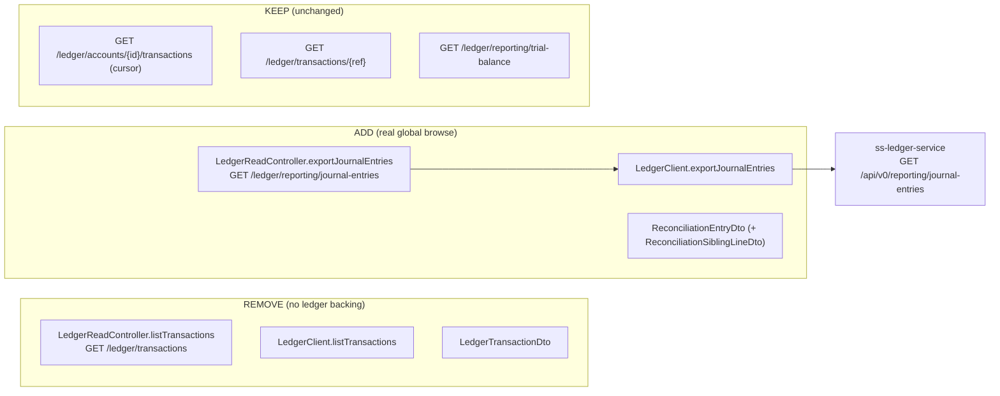

# Task 003 - Replace the phantom ledger-transactions proxy with a journal-entries proxy (backend)

## Functional Requirements
- Remove the chaos backend's `GET /api/v0/ledger/transactions` global-list proxy, which forwards to
  a ledger endpoint (`GET /api/v0/transactions`) that **does not exist** — the cause of the broken
  Ledger view ([ADR-032](../../decisions/032-ledger-transactions-account-scoped-view.md)).
- **Add** a real global proxy of the ledger's reconciliation export so the Transactions Ledger view
  has a genuine cross-account, paged source (operator's "for now" choice):
  `GET /api/v0/ledger/reporting/journal-entries` → the ledger's
  `GET /api/v0/reporting/journal-entries` (paged-JSON mode).
- Keep the two other real ledger read proxies: account-scoped cursor history and by-reference detail.

## Acceptance Criteria
- [ ] `GET /api/v0/ledger/transactions` is removed; calling it returns 404.
- [ ] `LedgerClient.listTransactions(...)` and the `LedgerTransactionDto` record are deleted; nothing
      references them.
- [ ] `GET /api/v0/ledger/reporting/journal-entries` proxies the ledger's reconciliation export and
      returns a `PageResponse<ReconciliationEntryDto>`, passing through: **required** `from`/`to`
      (ISO-8601 instants), optional `accountId` (repeatable), `entryType`, `transactionRef`,
      `sourceService`, and `page`/`size` (default 20, max 100).
- [ ] The ledger's `400` for a missing/too-wide window (span > the ledger's cap, default 7 days) is
      surfaced as the standard chaos 4xx error (not re-validated, not swallowed) — mirroring how
      `/reporting/trial-balance` passes the ledger's period `400` through.
- [ ] Ledger slowness/outage → circuit-breaker open → degraded `503` (consistent with the other
      proxies); no hang.
- [ ] `GET /api/v0/ledger/accounts/{id}/transactions` and `GET /api/v0/ledger/transactions/{ref}`
      are **unchanged**; all other ledger-proxy endpoints unchanged.
- [ ] Backend builds; `LedgerReadControllerTest` / `LedgerClientTest` updated (removed-endpoint
      cases dropped; new journal-entries proxy cases added).

## Technical Design
Verified against `ss-ledger-service`: there is no all-transactions list, but the
`ReportingController` exposes `GET /api/v0/reporting/journal-entries` (RPT-003, paged-JSON) →
`ReconciliationEntryListResponse` (offset-paginated `ApiResponse`: `data`/`page`/`pageSize`/`total`/
`pages`), each element a `ReconciliationEntryRecord` (a journal-entry line + full multi-leg context).

`ReconciliationEntryDto` (chaos mirror, `@JsonIgnoreProperties(ignoreUnknown = true)`, records via
`@RecordBuilder`) mirrors `ReconciliationEntryRecord`'s fields:
`lineId, journalEntryId, postedAt, entrySequence, accountSequence, accountId, accountCode,
organizationId, currency, direction, amount, runningBalance, runningReservedBalance,
runningPendingBalance, totalBalanceBefore, transactionRef, entryType, narrative, memo, sourceService,
sourceEventId, metadata, siblingLines[]` — with `siblingLines` typed as a chaos
`ReconciliationSiblingLineDto` mirroring the per-line shape (or a list of the same DTO, since the
sibling shape equals the line shape minus `siblingLines`). Unknown fields ignored for
forward-compat (as `LedgerTransactionHistoryDto` already does).

## Implementation Notes
- Edit `ledgerproxy/LedgerReadController.java`: delete the `listTransactions` handler
  (`@GetMapping("/transactions")`); add `exportJournalEntries`
  (`@GetMapping("/reporting/journal-entries")`) right beside `getTrialBalance` (same package, same
  token-extraction + `CircuitBreakerOpenException → 503` pattern). Bind `from`/`to` as `Instant`
  (Spring ISO-8601), `accountId` as `List<String>`/`List<UUID>` (repeatable), the rest as optional
  `String`/`int`.
- Edit `ledgerproxy/LedgerClient.java`: delete `listTransactions`; add `exportJournalEntries(token,
  from, to, accountId, entryType, transactionRef, sourceService, page, size)` building the ledger
  URI `/api/v0/reporting/journal-entries` with repeatable `accountId` query params. Reuse the same
  `RestClient`, resilience wrapper, and token propagation as `getTrialBalance`.
- New DTOs: `ledgerproxy/dto/ReconciliationEntryDto.java` (+ `ReconciliationSiblingLineDto.java`).
  Map the ledger's `ApiResponse`-shaped body (`data`/`page`/`pageSize`/`total`/`pages`) into the
  chaos `PageResponse<ReconciliationEntryDto>` (the proxy already has page-mapping helpers — confirm
  whether `LedgerSpringPageDto`/`LedgerPageDto`/`toPageResponse` fit the `ApiResponse` envelope; add
  a small mapper if the field names differ, e.g. `pageSize` vs `size`).
- Delete `ledgerproxy/dto/LedgerTransactionDto.java` (+ its generated `...Builder`). Only delete
  `LedgerSpringPageDto`/`LedgerPageDto` if a reference check proves them unused after this change.
- Add `LedgerProxyProperties` path config for the journal-entries endpoint if the proxy externalizes
  ledger paths (it does for others); remove any config for the phantom endpoint.
- Records use `@RecordBuilder` + the generated builder (no positional `new`); avoid reserved-word
  identifiers (`row`, not `record`).

## Non-Functional Requirements
- The proxy inherits the existing timeouts / retry / circuit-breaker / token propagation; bounded
  page size (max 100, matching the ledger); never hangs while the ledger is stressed.
- The window cap is the ledger's concern; the chaos proxy passes the period through and relays the
  ledger's `400` rather than duplicating validation.

## Dependencies
- Independent of the other backend tasks.
- Unblocks **Task 007** (the frontend Ledger view), which consumes the new journal-entries proxy and
  must not call the removed endpoint.

## Risks & Mitigations
- *A surviving caller of `/ledger/transactions`* → grep the frontend (`listLedgerTransactions`) and
  tests; the frontend caller is replaced in Task 007 — sequence/deploy together; assert 404 in a
  slice test.
- *`ApiResponse` envelope vs chaos `PageResponse` field mismatch* (`pageSize`/`pages` vs
  `size`/`totalPages`) → write a focused mapper + a deserialization test against a recorded ledger
  body.
- *Repeatable `accountId` param encoding* → cover multi-`accountId` in the `LedgerClient` WireMock
  test.
- *Over-deleting a shared page DTO* → only delete `LedgerSpringPageDto`/`LedgerPageDto` if unused.

## Testing Strategy
- **Slice (`@WebMvcTest`):** `GET /ledger/transactions` → 404; `GET /ledger/reporting/journal-entries`
  → 200 (WireMock-backed `LedgerClient`), required-param validation, ledger `400` (too-wide window)
  surfaced as 4xx, `503` on breaker open; account-history + by-reference still 200.
- **`LedgerClientTest` (WireMock):** journal-entries success, multi-`accountId`, optional filters,
  4xx/5xx/timeout → breaker; remove the old list-transactions cases.
- **DTO/deserialization:** the ledger's `ReconciliationEntryListResponse` JSON round-trips into
  `PageResponse<ReconciliationEntryDto>` incl. `siblingLines` and null `metadata`/`memo`.
- Frameworks: JUnit 5, AssertJ, WireMock (mirrors existing `ledgerproxy` tests).

## Deployment Strategy
Additive new endpoint + deletive phantom endpoint; no migration, no flag. Deploy **with** Task 007 so
the UI calls the new proxy and never the removed one. No external consumer depends on either (chaos
UI only).
