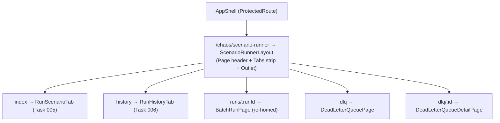

# Task 004 - Operate nav + Scenario Runner tabbed shell (frontend)

## Functional Requirements
- Collapse the **Operate** nav group to a single **"Scenario Runner"** item; remove the *Batches*
  and *Dead Letter Queue* nav items.
- Introduce a **`ScenarioRunnerLayout`** with a three-tab strip (*Run Scenario* / *Run History* /
  *DLQ*) whose active tab is driven by the matched **nested route** (deep-linkable, back-button
  works), per [ADR-030](../../decisions/030-unified-scenario-runner-navigation.md).
- Relocate the DLQ list/detail and the tracked-run detail (`batch-run-page`) under the runner's
  route tree.
- Redirect every old Operate URL to its new home so existing bookmarks keep working.

## Acceptance Criteria
- [ ] `operateNavigation` in `app-shell.tsx` contains exactly one item: `{ to: "/chaos/scenario-runner",
      label: "Scenario Runner", icon: Play }`. *Batches* and *Dead Letter Queue* items are removed.
- [ ] Routes resolve:
      - `/chaos/scenario-runner` → Run Scenario (index)
      - `/chaos/scenario-runner/history` → Run History
      - `/chaos/scenario-runner/runs/:runId` → run detail (re-homed `BatchRunPage`)
      - `/chaos/scenario-runner/dlq` → DLQ list
      - `/chaos/scenario-runner/dlq/:id` → DLQ detail
- [ ] The active tab in `ScenarioRunnerLayout` reflects the current child route; navigating between
      tabs updates the URL and browser history.
- [ ] Redirects (replace): `/chaos/single-flow` → `/chaos/scenario-runner`; `/chaos/batches` →
      `/chaos/scenario-runner/history`; `/chaos/batches/:id` → `/chaos/scenario-runner/runs/:id`;
      `/chaos/dlq` → `/chaos/scenario-runner/dlq`; `/chaos/dlq/:id` → `/chaos/scenario-runner/dlq/:id`.
- [ ] The index redirect `/` → `/chaos/single-flow` is repointed to `/chaos/scenario-runner`.
- [ ] DLQ list and detail render identically under their new routes (no functional change).
- [ ] Lazy-loading (`withSuspense`) and the `AppShell`/`ProtectedRoute` wrappers are preserved.

## Technical Design
A layout route hosts the tab strip and an `<Outlet/>`; child routes render each tab body.

The tab strip uses `NavLink`/`useMatch` (or `react-router`'s `useResolvedPath` + `useMatch`) so the
selected tab derives from the URL, not local state. The run-detail (`runs/:runId`) is **not** a tab
— it is a child page reached by deep-link from Run History; while on it, the *Run History* tab reads
as active.

## Implementation Notes
- Edit `chaos-admin/src/components/layout/app-shell.tsx`: replace the three-item
  `operateNavigation` with the single Scenario Runner item; drop the now-unused `LayersIcon` /
  `AlertTriangle` imports if nothing else uses them.
- Edit `chaos-admin/src/app/router.tsx`:
  - add the `ScenarioRunnerLayout` route with its children (lazy `withSuspense`);
  - move the DLQ routes under it (re-point the imports to `@/features/dlq/*`, unchanged components);
  - move the run-detail route under it (`@/features/chaos/batch-run-page`), renamed path
    `runs/:runId` (the component reads the param — confirm the param name or pass through);
  - add the redirect routes (use `loader: () => redirect(...)` or element `<Navigate to=... replace/>`);
  - repoint the index redirect to `/chaos/scenario-runner`.
- Create `chaos-admin/src/features/chaos/scenario-runner-layout.tsx` (the tabbed shell). Reuse the
  shared `Page` primitive and the `Tabs`/`TabsList`/`TabsTrigger` UI used elsewhere, but drive the
  value from the route (a small `useScenarioRunnerTab()` helper mapping pathname → tab key).
- Keep `/chaos/upload` handling for Task 008 (it is deleted there); if 008 lands later, a temporary
  redirect `/chaos/upload` → `/chaos/scenario-runner/history` avoids a dead link.
- `BatchRunPage` reads `:batchId` today; when its route becomes `runs/:runId`, either rename the
  param to keep it self-descriptive or keep `:batchId` and alias — minimise the diff, but ensure the
  async-run handoffs (Task 005) navigate to the matching path.

## Non-Functional Requirements
- No change to auth, lazy-loading, or the app shell chrome beyond the nav array.
- Tab switching is client-side (no full reload); deep-links cold-load the correct tab.

## Dependencies
- Frontend unblocker for **Task 005** (Run Scenario tab) and **Task 006** (Run History tab); hosts
  the relocated DLQ pages.
- Independent of all backend tasks (skeleton + redirects only).

## Risks & Mitigations
- *Tab-from-route wiring subtle bugs* (wrong tab highlighted on a detail page) → explicit
  pathname→tab mapping with a test for each route incl. `runs/:runId` and `dlq/:id` → *Run History* /
  *DLQ* active respectively.
- *Broken bookmarks* → a redirect table with a test asserting each old path lands on the new one.
- *Param rename breaking the detail page* → cover the run-detail route render in a test.

## Testing Strategy
- **Vitest + Testing Library + MSW + MemoryRouter:** nav renders one Operate item; each route
  renders its tab body and highlights the right tab; redirects resolve (old → new); DLQ list/detail
  render under new routes; run-detail route renders `BatchRunPage`.
- Mirror the app's existing router/nav test conventions.

## Deployment Strategy
Frontend-only; ships in the normal Vite build. Redirects mean no broken links during/after rollout.
No flag.
