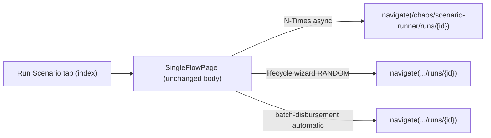

# Task 005 - Run Scenario tab (frontend)

## Functional Requirements
- Host the existing **Single Flow Run** experience as the **Run Scenario** tab (index) of the
  Scenario Runner, with no change to its run behaviour (catalog-driven form, chaos options,
  lifecycle wizard, batch-disbursement wizard, N-Times).
- Re-point every **async-run handoff** that today navigates to `/chaos/batches/:id` to the new
  run-detail route `/chaos/scenario-runner/runs/:id`.
- Remove all links to the retired CSV surfaces (the *Batches* page and `/chaos/upload`).

## Acceptance Criteria
- [ ] `/chaos/scenario-runner` (index) renders the current `SingleFlowPage` content unchanged
      (default/lifecycle/batch-disbursement layouts, results cards).
- [ ] Starting an **N-Times ASYNC** run navigates to `/chaos/scenario-runner/runs/{run.id}`.
- [ ] Starting a **RANDOM lifecycle** run (`runRandomLifecycle`) navigates to
      `/chaos/scenario-runner/runs/{run.id}`.
- [ ] Starting an **automatic batch-disbursement** run (`runDisbursementBatch`) navigates to
      `/chaos/scenario-runner/runs/{run.id}`.
- [ ] No control links to `/chaos/upload` or `/chaos/batches` remain in the Run Scenario surface.
- [ ] The Phase 017/018/019 run-page watches (failure/balance/reservation toasts) continue to work
      unchanged.

## Technical Design
Minimal move + path updates; the page component is reused as the tab's index element.

## Implementation Notes
- Wire `SingleFlowPage` (`features/chaos/single-flow-page.tsx`) as the index element of the
  `ScenarioRunnerLayout` route (Task 004). It can stay where it is; only its handoff paths change.
- Update navigation targets:
  - `single-flow-page.tsx` (N-Times async branch, ~line 281–284): `navigate(`/chaos/scenario-runner/runs/${outcome.run.id}`)`.
  - `lifecycle-wizard.tsx` (~line 250): `onSuccess: run => navigate(`/chaos/scenario-runner/runs/${run.id}`)`.
  - `batch-disbursement-wizard.tsx` (~line 333): `onSuccess: run => navigate(`/chaos/scenario-runner/runs/${run.id}`)`.
- Use a single shared route-path constant/helper (e.g. `runDetailPath(id)`) so the path lives in one
  place and matches Task 004's route.
- Remove any "New Batch" / CSV-upload affordance reachable from this tab (most upload entry was on
  the *Batches* page, removed in Task 008; verify none lingers here).
- Do **not** change the run form, chaos panel, wizards' logic, or the watch hooks.

## Non-Functional Requirements
- No behavioural regression in publishing; identical request payloads.
- Tab is the default landing of the Scenario Runner (and of `/` via the repointed index redirect).

## Dependencies
- **Task 004** (the shell + run-detail route) — provides the route this tab navigates to.
- Backend run producers unchanged.

## Risks & Mitigations
- *Stale handoff path* (navigating to a now-404 `/chaos/batches/:id`) → a route-path constant + a
  test asserting each async handoff resolves to the run-detail route.
- *Accidental change to run behaviour while moving the page* → diff should be paths only; cover the
  three async handoffs and one sync publish in tests.

## Testing Strategy
- **Vitest + Testing Library + MSW:** N-Times async / lifecycle-random / batch-disbursement
  automatic each navigate to `/chaos/scenario-runner/runs/{id}`; a default sync publish still renders
  its result card; no `/chaos/upload` or `/chaos/batches` link present.
- Reuse/relocate the existing single-flow-page tests.

## Deployment Strategy
Frontend-only; ships with Task 004. No flag, no migration.
