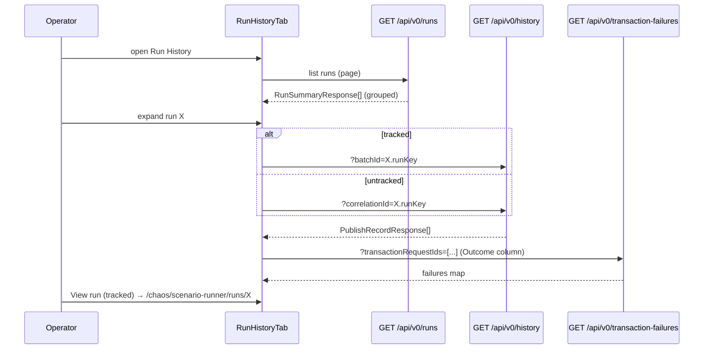

# Task 006 - Run History tab (frontend)

## Functional Requirements
- Build the **Run History** tab: a run-grouped, expandable accordion over `GET /api/v0/runs`
  (Task 001). Each row is a **run**; expanding it lazy-loads that run's individual published events.
- Replace **both** the old *Sent (Chaos History)* tab and the old *Batches* list — this tab is the
  single run-and-event observability surface.
- A **tracked** run (N-Times-async / lifecycle-random / batch-disbursement) deep-links to its live
  run-detail/progress page (`/chaos/scenario-runner/runs/:runId`).
- Ensure interactive multi-event runs **group correctly** by making the lifecycle/batch wizards emit
  a **stable `correlation_id` across a run's steps**.

## Acceptance Criteria
- [ ] `/chaos/scenario-runner/history` lists runs from `GET /api/v0/runs`, newest-first, paginated
      (server pagination via the run feed).
- [ ] Each run row shows: kind (+ pacing/mode where present), flow type(s), event count, status
      rollup, ledger-outcome rollup (published vs failed-at-ledger), intentional-failure badge, and
      last-activity time.
- [ ] Expanding a run lazy-loads its events: tracked → `GET /api/v0/history?batchId={key}`;
      untracked → `GET /api/v0/history?correlationId={key}`; events render with the familiar Sent
      columns including the Phase 017 **Outcome** column (one batch `/transaction-failures` lookup
      per expanded page).
- [ ] A tracked run row offers a **"View run"** action linking to
      `/chaos/scenario-runner/runs/{runKey}` (the live detail/progress page).
- [ ] An **in-progress** tracked run is visibly marked (status `RUNNING`); its counters refresh
      (poll the run feed or the run row) until terminal.
- [ ] A **singleton** untracked run (count = 1) renders as a single expandable row, not hidden.
- [ ] The lifecycle wizard and batch-disbursement wizard emit one stable `correlationId` per run, so
      their initiated/completed(/failed) events group under one run row (verified by a test).
- [ ] Filters appropriate to runs (at least time range + kind) drive the feed; row→event filtering
      uses the existing history endpoint.

## Technical Design

- The accordion is a `useQuery(["runs", filters, page])` list; each expanded row owns its own
  `useQuery(["run-events", runKey, tracked])` so children load on demand and cache independently.
- Reuse the existing Sent-tab event row renderer + `OutcomeCell` (extract from
  `transactions-page.tsx` into a shared component so both this tab and the per-VA view can use it).
- In-progress refresh: give the runs list a `refetchInterval` while any visible run is `RUNNING`
  (mirror `batch-run-page`'s terminal-aware polling), or refetch on expand.

## Implementation Notes
- New: `chaos-admin/src/features/chaos/run-history-tab.tsx` (or `features/runs/`), plus
  `lib/api.ts`: `listRuns(token, { page, size, from, to, kind })` → `PageResponse<RunSummaryResponse>`
  and the `RunSummaryResponse` type (mirroring Task 001's record).
- **Extract** the event-row + `OutcomeCell` rendering currently inside
  `transactions-page.tsx`'s `SentHistoryTab` (lines ~226–396) into a reusable component
  (e.g. `features/transactions/sent-events-table.tsx`) consumed by (a) this Run History accordion and
  (b) the per-VA transactions view; do not duplicate the failure-lookup logic.
- Drill-down reuses `listSentHistory` (`GET /history`) with `batchId` or `correlationId`; add a
  `batchId` field to `HistoryFilters` on the client if not already exposed (the backend already
  accepts it).
- Deep-link uses the shared `runDetailPath(runKey)` helper from Task 005/004.
- **Stable wizard correlation id:** inspect `lifecycle-wizard.tsx` and `batch-disbursement-wizard.tsx`
  — ensure the `correlationId` sent on step 1 (initiated / reservation) is reused on step 2+
  (completed/failed/items). If today each publish mints a fresh correlation id, lift it to wizard
  state created once per run. If reuse is impractical, fall back to grouping by
  `transactionRequestId` (coordinate with Task 001), but **prefer the correlation-id fix** (smaller,
  matches ADR-031).
- Empty/loading/error states use the shared `StatePanel` primitives.

## Non-Functional Requirements
- Server pagination over runs; lazy child loading (no eager fetch of every run's events).
- One batch `/transaction-failures` call per expanded event page (not per row), reusing the Phase
  017 pattern.
- In-progress polling stops at terminal status (no infinite polling).

## Dependencies
- **Task 001** (`GET /api/v0/runs`) and **Task 004** (the shell + run-detail route).
- Reuses Phase 017 `/transaction-failures` + the Sent event renderer.

## Risks & Mitigations
- *Wizard events not sharing a correlation id* → fragmented runs; mitigated by the stable-correlation
  fix here + a grouping test; documented fallback to `transactionRequestId`.
- *Accordion + per-row queries performance* → lazy child queries keyed by runKey; cache; only the
  expanded run fetches events.
- *Double maintenance of the event renderer* → extract the shared component rather than copy.
- *In-progress counters going stale* → terminal-aware `refetchInterval`.

## Testing Strategy
- **Vitest + Testing Library + MSW:** run rows render with summary fields; expand → child events
  (tracked uses `?batchId`, untracked uses `?correlationId`); Outcome column resolves from a mocked
  failures map (one batch call); tracked-run "View run" links to the run-detail route; singleton run
  renders; in-progress run shows RUNNING and refreshes; empty/error states.
- **Wizard correlation test:** lifecycle + batch wizards send the same `correlationId` across steps,
  so a mocked `/runs` groups them as one run.
- Relocate the old SentHistoryTab tests onto the extracted shared event component.

## Deployment Strategy
Frontend-only; ships after Task 001 (backend feed) is deployed. No flag, no migration. This tab must
be proven before Task 008 deletes the *Batches* list page.
