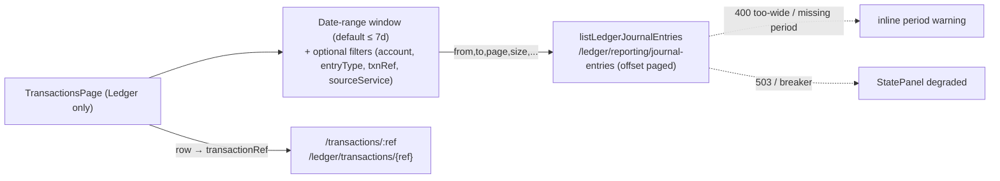

# Task 007 - Transactions Ledger view, global journal-entries browse (frontend + backend)

## Functional Requirements
- Make the **Transactions** page (Ledger nav group) a working, **global** ledger transaction
  browser, and its **main content** — fixing the long-broken Ledger tab
  ([ADR-032](../../decisions/032-ledger-transactions-account-scoped-view.md)).
- Remove the page's *Sent (Chaos History)* tab (it now lives in the Scenario Runner's Run History,
  Task 006).
- Stop calling the removed phantom proxy; read the ledger's **reconciliation journal-entries
  export** (cross-account, time-windowed, paged) via the new chaos proxy from Task 003.

## Acceptance Criteria
- [ ] The Transactions page no longer has a *Sent* tab; the ledger view is the page's primary
      content (no two-tab control).
- [ ] The page lists journal-entry lines across accounts via `listLedgerJournalEntries`
      (`GET /api/v0/ledger/reporting/journal-entries`), **offset-paginated** (page/size, size ≤ 100).
- [ ] A **date-range** filter is the primary control, **defaulting to a window within the ledger's
      cap** (e.g. the last 7 days). The UI **prevents/warns** on a span wider than the cap and, if
      the ledger still returns `400` (too-wide / missing period), shows a clear, actionable message
      (not a generic error).
- [ ] Optional filters are supported: account/VA id (maps to `accountId`), entry type, transaction
      ref, source service.
- [ ] A row click opens the **by-reference** detail at `/transactions/:ref`
      (`GET /api/v0/ledger/transactions/{ref}`), keyed by the row's `transactionRef`, reusing the
      existing transaction detail page.
- [ ] Columns surface the reconciliation record richness: Posted At, Account (code/id), Direction,
      Amount, Currency, Entry Type, Transaction Ref, Source Service (+ a way to see sibling legs,
      e.g. an expand or the detail page).
- [ ] No call to `GET /api/v0/ledger/transactions` remains (`listLedgerTransactions` removed); the
      old `LedgerTransactionsTab` global-list code is deleted.
- [ ] Ledger degraded (503 / breaker open) shows the existing degraded `StatePanel` state; an empty
      window shows a normal empty state.

## Technical Design
The Ledger view becomes a date-range-first, paged table over the new journal-entries proxy.

Because results are journal-entry **lines** (one row per leg, with `siblingLines`), the table reads
naturally as a ledger entry log; the by-reference detail gives the full transaction. The window cap
makes the date-range control mandatory, so seed it with a sensible default on mount.

## Implementation Notes
- `lib/api.ts`: **remove** `listLedgerTransactions`; **add** `listLedgerJournalEntries(token, {
  from, to, accountId?, entryType?, transactionRef?, sourceService?, page?, size? })` →
  `PageResponse<ReconciliationEntryResponse>`, plus the `ReconciliationEntryResponse` type mirroring
  the Task 003 `ReconciliationEntryDto` (incl. `siblingLines`). `from`/`to` are required (ISO
  instants); default them in the caller, not the API client.
- Edit `chaos-admin/src/features/transactions/transactions-page.tsx`:
  - remove the `Tabs` (Sent | Ledger) and the `SentHistoryTab` usage from the **standalone** page;
  - replace `LedgerTransactionsTab` with a global journal-entries table component fed by
    `listLedgerJournalEntries`, with a date-range picker defaulting to a ≤cap window and the optional
    filters above (draft-vs-applied filter pattern already used on this page);
  - offset pagination via the existing `ListPagination` (this endpoint is offset-paged, unlike the
    account-scoped cursor view).
- **Window cap:** define a frontend constant for the default/maximum span (mirror the ledger's
  default 7 days; make it a single constant so it tracks the backend). Disable/clamp the date picker
  beyond it and pre-empt the ledger `400`; still handle a `400` defensively with a clear period
  message.
- Row → detail: link the row's `transactionRef` to `/transactions/:ref` (existing page). Where a
  `transactionRef` is shared by sibling legs, dedupe/link consistently.
- The **per-VA** transactions view on the VA detail page is **unchanged** (it keeps using the
  account-scoped cursor proxy `getAccountTransactionHistory`); do not repoint it to this global
  endpoint.
- The Sent event renderer extracted in Task 006 is **not** used here (this page is ledger-only).

## Non-Functional Requirements
- Offset pagination, bounded page size (≤ 100); the date-range cap keeps each query bounded.
- Honest empty/degraded/period-error states; no hang when the ledger is stressed (the harness may be
  stressing it) — the proxy's breaker yields a fast `503`.

## Dependencies
- **Task 003** (removal of the phantom proxy **and** the new `/ledger/reporting/journal-entries`
  proxy) — deploy together so the UI calls the new proxy and never the removed one.
- Reuses the existing `ListPagination`, filter pattern, and by-reference detail page.

## Risks & Mitigations
- *Operators expecting an unbounded "all transactions" list* → the endpoint is a window-capped
  reconciliation export; default to a useful recent window and label the date-range requirement
  clearly ("ledger history is browsed by date window, max N days").
- *Window-cap `400`s surprising the user* → clamp the picker client-side to the cap + a clear inline
  message if the ledger still rejects; cover with a test.
- *Line-vs-transaction granularity confusion* → group/link by `transactionRef`; the detail page
  shows the full multi-leg transaction; sibling legs available via the record's `siblingLines`.
- *Lingering `listLedgerTransactions` caller* → grep + remove; assert the function is gone.

## Testing Strategy
- **Vitest + Testing Library + MSW:** no *Sent* tab; default date-window loads journal entries;
  changing the window/filters refetches; offset next-page; row → `/transactions/:ref`; a too-wide
  window is prevented client-side and a ledger `400` renders the period message; 503 degraded state;
  empty-window empty state.
- Ensure no MSW handler for `/ledger/transactions` is needed (the call is gone); add one for
  `/ledger/reporting/journal-entries`.

## Deployment Strategy
Deploy **with** Task 003 (backend proxy swap). Frontend-only otherwise; no flag, no migration.
