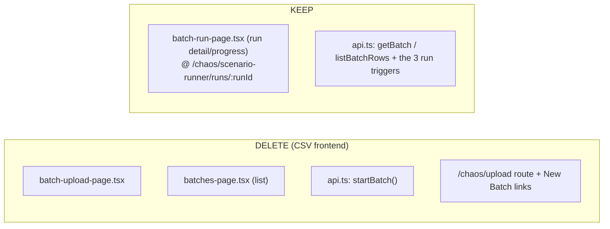

# Task 008 - Retire CSV-batch pages (frontend)

## Functional Requirements
- Delete the CSV-batch frontend surface: the CSV **upload** page and the **Batches list** page
  (superseded by Run History, Task 006), the `startBatch` API client, the `/chaos/upload` route, and
  every link to them.
- Keep the **run-detail/progress** page (`batch-run-page.tsx`) — it is shared, re-homed under
  `/chaos/scenario-runner/runs/:runId` (Task 004), and reached from Run History and the async-run
  handoffs.

## Acceptance Criteria
- [ ] `chaos-admin/src/features/chaos/batch-upload-page.tsx` is deleted; the `/chaos/upload` route is
      removed (a redirect to `/chaos/scenario-runner/history` may remain temporarily for old links).
- [ ] `chaos-admin/src/features/chaos/batches-page.tsx` (the *Batches* list) is deleted; its route is
      removed (replaced by the Run History tab; `/chaos/batches` redirects per Task 004).
- [ ] `startBatch()` is removed from `lib/api.ts`; no caller remains.
- [ ] `batch-run-page.tsx` is **kept**, rendering all run kinds under the new run-detail route, with
      its live polling of `GET /batches/{id}` (+ `/rows`) intact.
- [ ] No "New Batch" / upload affordance remains anywhere in the UI.
- [ ] The app builds with no dangling imports/routes.

## Technical Design

## Implementation Notes
- Delete files: `features/chaos/batch-upload-page.tsx`, `features/chaos/batches-page.tsx`, and their
  tests.
- `app/router.tsx`: remove the `/chaos/upload` and `/chaos/batches` route entries (the redirects are
  added in Task 004); ensure the run-detail route `runs/:runId` points at `batch-run-page.tsx`.
- `lib/api.ts`: remove `startBatch`. **Keep** `getBatch`, `listBatchRows`, `publishNTimes`,
  `runRandomLifecycle`, `runDisbursementBatch`, and the `BatchRunResponse`/`BatchRowResponse`/
  `RunKind`/`BatchRunStatus` types — all still used by the run-detail page and the run triggers.
- Remove the "New Batch" button + any `navigate("/chaos/upload")` / `navigate("/chaos/batches")`
  calls (the *Batches* page held the main one; verify none remain in the wizards or Run Scenario).
- Confirm `isBatchTerminal` and other shared helpers used by `batch-run-page` survive (they live
  outside the deleted files; relocate if any sat inside `batches-page.tsx`).

## Non-Functional Requirements
- No change to surviving run kinds' UX; the run-detail page behaves identically.
- Net reduction in bundle size; no new dependency.

## Dependencies
- **Task 006** (Run History tab) must be live first — it replaces the *Batches* list as the run
  observability surface.
- **Task 004** (shell + redirects + run-detail route).
- Pairs with **Task 002** (backend CSV ingest removal) — deploy together so no UI calls a removed
  endpoint and no removed page calls a surviving one.

## Risks & Mitigations
- *Deleting a helper still used by the run-detail page* → check `isBatchTerminal` / run-kind label
  helpers; relocate any that lived in `batches-page.tsx` before deleting it.
- *Dangling route/import* → build + a router test asserting `/chaos/upload` and `/chaos/batches`
  redirect (not 500) and that no component imports the deleted files.
- *Lost "revisit a run" entry point* → Run History rows deep-link to the run-detail page, replacing
  the *Batches* list's role.

## Testing Strategy
- **Vitest + Testing Library:** the upload + Batches list pages are gone (routes redirect); the
  run-detail page still renders + polls for an N-Times/lifecycle/batch-disbursement run; no upload
  affordance present; build has no dangling imports.
- Remove the deleted pages' tests; keep/relocate `batch-run-page` tests.

## Deployment Strategy
Deploy **with** Task 002 (backend CSV removal) and after Task 006 is live. Frontend-only; no flag, no
migration. Redirects keep old links working.
