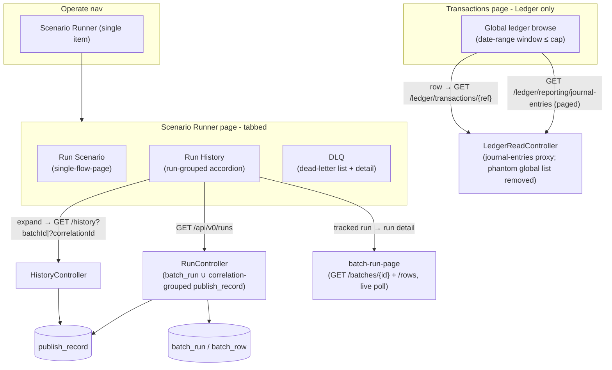

# Phase 21 - Unified Scenario Runner

## Summary
A frontend-led **information-architecture consolidation** (idea `016_unified_scenario_runner.md`)
that collapses the **Operate** nav into a single tabbed **Scenario Runner** page — *Run Scenario*
(today's Single Flow Run), *Run History* (today's *Sent (Chaos History)* tab, now **grouped by
run** in an expandable accordion), and *DLQ* (today's Dead Letter Queue) — backed by a new
**`GET /api/v0/runs`** run-grouped feed. It **retires the CSV-batch capability** end-to-end while
**preserving** the shared run-tracking infrastructure that the N-Times-async, lifecycle-random, and
batch-disbursement-automatic runners depend on. Separately, it **fixes the long-broken Ledger view**
on the *Transactions* page by re-pointing it from a non-existent global ledger endpoint to a new
proxy of the ledger's `reporting/journal-entries` reconciliation export (a real, date-windowed,
cross-account browse), and makes it that page's main content.

See [ADR-030](../../decisions/030-unified-scenario-runner-navigation.md),
[ADR-031](../../decisions/031-run-grouped-history-and-csv-retirement.md),
[ADR-032](../../decisions/032-ledger-transactions-account-scoped-view.md).

## Motivation
The operator's loop is *fire a scenario → watch what was sent → inspect what the ledger rejected*,
but today that is spread across three Operate nav items (*Single Flow Run*, *Batches*, *Dead Letter
Queue*) plus a *Sent* tab buried inside the *Transactions* page (a different nav group). The *Sent*
history is a flat event list with no notion of the run that produced a burst of events, and the
*Batches* page is a parallel, run-level list of the same activity. Meanwhile the *Transactions*
page's *Ledger* tab has never worked — it proxies a ledger endpoint that does not exist
([ADR-032](../../decisions/032-ledger-transactions-account-scoped-view.md)). This phase unifies the
run-and-observe surface into one console, gives history a run-grouped shape, retires a CSV ingest
path the team no longer wants, and finally makes the ledger view real.

## User-Facing Changes
- **Operate nav** shrinks to a **single "Scenario Runner"** item; *Batches* and *Dead Letter
  Queue* nav items are removed.
- **Scenario Runner** is a tabbed page with deep-linkable routes:
  - **Run Scenario** (`/chaos/scenario-runner`) — the existing Single Flow Run experience,
    unchanged in behaviour.
  - **Run History** (`/chaos/scenario-runner/history`) — published events **grouped by run** in an
    accordion: each row is a run (kind, flow type(s), event count, status rollup, ledger-outcome
    rollup, time); expanding lazy-loads the run's individual events (the familiar Sent columns incl.
    the Phase 017 **Outcome** column). A tracked run (N-Times-async / lifecycle-random /
    batch-disbursement) deep-links to its live run-detail/progress page.
  - **DLQ** (`/chaos/scenario-runner/dlq`[`/:id`]) — the existing dead-letter list + tabbed detail.
- **Old URLs redirect**: `/chaos/single-flow`, `/chaos/batches[/:id]`, `/chaos/dlq[/:id]` →
  their new homes; `/chaos/upload` is removed.
- **CSV-batch is retired**: no more CSV upload page, no *Batches* list page, no `POST /api/v0/batches`.
  N-Times / lifecycle-random / batch-disbursement runs are unaffected and now surface in Run History.
- **Transactions page** loses its *Sent* tab (moved to Run History) and becomes a **global Ledger
  browser** that actually works: a date-range window (default ≤ 7 days) lists journal-entry lines
  across accounts (rich multi-leg detail), with optional account/entry-type/transaction-ref filters;
  row → by-reference detail.
- **New API:** `GET /api/v0/runs` (run-grouped feed) and `GET /api/v0/ledger/reporting/journal-entries`
  (global journal-entries proxy). **Removed API:** `POST /api/v0/batches`, `GET /api/v0/batches`
  (list), `GET /api/v0/ledger/transactions` (phantom global list).

## Architecture Impact
No new domain, no new Kafka surface, **no new tables, and no Flyway migration**. The changes are:
(1) a read-only run-grouped query over existing `publish_record` + `batch_run`; (2) deletion of the
CSV ingest path and the phantom ledger proxy; (3) a frontend re-organisation into a tabbed shell
with nested routes; (4) swapping the phantom global ledger proxy for a real
`reporting/journal-entries` reconciliation proxy and re-pointing the ledger view at it.
The shared run-tracking core (`batch_run`/`batch_row`, `BatchRunner`, `PacingPlan`, the three run
services, `GET /batches/{id}` + `/rows`) is **preserved** verbatim.

**Run grouping (ADR-031).** A "run" = a `batch_run` row (tracked: N-Times-async / lifecycle-random /
batch-disbursement) **or** a `correlation_id` group of `publish_record`s with `batch_id IS NULL`
(untracked: single publish, N-Times-SYNC, interactive wizards). Group key =
`COALESCE(batch_id, correlation_id)`; drill-down reuses `GET /api/v0/history`.

**CSV retirement (ADR-031).** Only the CSV **ingest** path is removed (`POST /batches`,
`BatchService`, `CsvFlowParser`, `batch-upload-page`, *Batches* list). The shared infra and the
re-homed run-detail page stay. `RunKind.CSV` + `batch_run.filename` are kept for historical rows —
no destructive migration.

**Ledger view (ADR-032).** The ledger has no all-transactions list, but its
`GET /api/v0/reporting/journal-entries` reconciliation export (paged JSON, required `from`/`to`,
span-capped ~7 days) is a real cross-account browse. A new chaos proxy
`GET /api/v0/ledger/reporting/journal-entries` fronts it (mirroring the trial-balance proxy); the
phantom `/ledger/transactions` global list is removed. The account-scoped cursor proxy is kept for
the per-VA detail view only.

## Edge Cases
- **A run straddling a page boundary** in Run History → solved by grouping **server-side** in
  `/api/v0/runs` (paginate runs, not events); the rejected frontend-only grouping would have
  double-counted it.
- **Interactive multi-event runs (lifecycle/batch wizards)** group **only** if their events share a
  `correlation_id`. The wizards must emit a **stable correlation id across a run's steps** (Task 006
  verifies/aligns this); otherwise initiated/completed appear as separate singleton runs.
  `transaction_request_id` (indexed, Phase 017) is the documented fallback key.
- **Untracked single publish** → a singleton run (count = 1, kind `SINGLE`); must not be hidden.
- **Tracked run still RUNNING** → Run History shows live counters/status from `batch_run`; the row
  deep-links to the polling run-detail page; the accordion's event children may be incomplete until
  the run finishes (honest "in progress" affordance).
- **Historical CSV runs** in a deployed DB → still listed (kind `CSV`) and openable; only *new* CSV
  ingest is gone.
- **Old bookmarks** (`/chaos/single-flow`, `/chaos/batches`, `/chaos/dlq`, `/chaos/upload`) →
  redirect (upload → Run History or a "retired" notice).
- **Ledger view window too wide / missing** → the journal-entries export requires `from`/`to` and
  caps the span (~7 days); the UI defaults to and clamps within the cap, and surfaces the ledger's
  `400` as a clear period message rather than a generic error.
- **Ledger proxy degraded (503 / breaker open)** → the existing degraded `StatePanel` state.
- **Ledger window with no activity** → empty paged result, normal empty state.
- **Line-vs-transaction granularity** → results are journal-entry lines (with sibling legs);
  the table links by `transactionRef` and the by-reference detail shows the full transaction.
- **DLQ detail reached via the relocated route** → must resolve identically to the old
  `/chaos/dlq/:id`.

## Testing Strategy
- **Backend unit:** `/api/v0/runs` grouping — tracked `batch_run` → one run row with correct
  rollups; untracked publishes → grouped by `correlation_id`; singleton run; ordering by
  `created_at` DESC; pagination/clamp; status + ledger-outcome rollup; mixed page of tracked +
  untracked runs.
- **Backend slice (`@WebMvcTest`/`@DataJpaTest`):** `/runs` paging/filters/AUTH; assert
  `POST /batches`, `GET /batches` (list), and `GET /ledger/transactions` are **gone** (404), while
  `GET /batches/{id}` + `/rows` and `/ledger/accounts/{id}/transactions` remain; the new
  `GET /ledger/reporting/journal-entries` proxy returns 200 (and relays the ledger's period `400`).
- **Backend regression (Testcontainers / existing suites):** N-Times-async, lifecycle-random, and
  batch-disbursement-automatic runs still create `batch_run`s and complete — the CSV-retirement
  gate.
- **Frontend (Vitest + Testing Library + MSW):** nav shows one Operate item; tab routing +
  redirects; Run History accordion (group rows, expand → events, tracked-run deep-link, in-progress
  state); Run Scenario async handoff navigates to the new run-detail route; Transactions Ledger view
  (default date window loads journal entries, too-wide window clamp + ledger `400` message, row →
  by-reference detail, 503 degraded); absence of the CSV upload/Batches pages.
- **e2e:** fire an N-Times-async run from Run Scenario → see it as a run in Run History → expand to
  events → open run detail; publish a deliberately-bad flow → see it dead-lettered in the DLQ tab;
  browse ledger journal entries for a recent date window on the Transactions page → row → detail.
- Consolidated into [Phase 006](../006-testing-and-verification/DESIGN.md).

## Deployment Strategy
- **No Flyway migration, no data backfill** — `/runs` reads existing tables; CSV retirement keeps
  the `kind`/`filename` columns; the ledger fix deletes dead code.
- Ships as a normal frontend + backend deploy. The removed endpoints (`POST /batches`,
  `GET /batches`, `GET /ledger/transactions`) are breaking only for the chaos UI itself, which ships
  in lockstep; no external consumer depends on them. Redirects cover old bookmarks.
- No feature flag required; the change is a UI re-org plus additive/deletive endpoints. (An optional
  `chaos.ui.scenario-runner` toggle is unnecessary given lockstep FE/BE deploy.)

## Tasks
- [001 - Run-grouped history API (`GET /api/v0/runs`)](./001-run-grouped-history-api.md) — unified run feed over `batch_run` ∪ correlation-grouped `publish_record`; drill-down via existing `/history`. *(ADR-031)*
- [002 - Retire CSV-batch ingest (backend)](./002-retire-csv-batch-ingest-backend.md) — remove `POST /batches`, `GET /batches` (list), `BatchService`, `CsvFlowParser`, `csvColumns`; preserve the shared run infra + `/batches/{id}`(+`/rows`). *(ADR-031)*
- [003 - Replace the phantom ledger-transactions proxy with a journal-entries proxy (backend)](./003-remove-phantom-ledger-transactions-proxy.md) — delete `GET /ledger/transactions` + `LedgerClient.listTransactions` + `LedgerTransactionDto`; add `GET /ledger/reporting/journal-entries` (proxy of the ledger reconciliation export) + `ReconciliationEntryDto`. *(ADR-032)*
- [004 - Operate nav + Scenario Runner tabbed shell (frontend)](./004-operate-nav-and-scenario-runner-shell.md) — single nav item, `ScenarioRunnerLayout`, nested deep-linkable tab routes, redirects, relocate DLQ + run-detail pages. *(ADR-030)*
- [005 - Run Scenario tab (frontend)](./005-run-scenario-tab.md) — host Single Flow Run in the tab; repoint async-run handoffs to the new run-detail route; drop CSV/upload links. *(ADR-030/031)*
- [006 - Run History tab (frontend)](./006-run-history-tab.md) — run-grouped accordion over `/api/v0/runs`; expand → events; tracked-run deep-link; stable wizard correlation id. *(ADR-031)*
- [007 - Transactions Ledger view, global journal-entries browse (frontend + backend)](./007-transactions-ledger-account-scoped-view.md) — remove Sent tab; date-windowed global journal-entries browse as main content; row → by-reference detail. *(ADR-032)*
- [008 - Retire CSV-batch pages (frontend)](./008-retire-csv-batch-frontend.md) — delete upload + Batches list pages, `startBatch` client, `/chaos/upload` route + upload links. *(ADR-031)*

## Parallel Tasks
- **Backend 001, 002, 003 are mutually independent** and can proceed in parallel (different
  endpoints/packages). 001 is the unblocker for the Run History tab (006); 003 is the unblocker for
  the Ledger view (007).
- **004 (shell) is the frontend unblocker** — it must land before 005/006 and the DLQ relocation
  render into it; it is independent of all backend tasks (route skeleton + redirects).
- **005** depends on 004; **006** depends on 004 + **001**; **007** depends on **003** (and is
  otherwise an independent slice); **008** depends on 004 + **006** (Run History must exist before
  the *Batches* list is deleted).
- Dependency chain: `(001 ‖ 002 ‖ 003) → 004 → (005 ‖ 006[needs 001] ‖ 007[needs 003]) → 008`.
- Do the CSV-retirement (002 backend, 008 frontend) **after** the Run History tab (006) is proven,
  so the run-observability replacement is in place before the *Batches* surface is removed.
