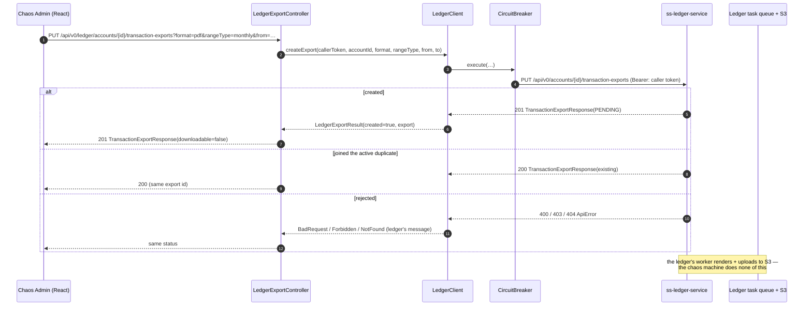
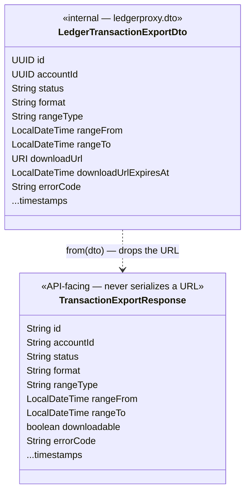

# Task 001 - Ledger Export Command Proxy

## Functional Requirements

Proxy the ledger's four account-statement-export endpoints through the chaos gateway at full parity
([ADR-033](../../decisions/033-account-statements-via-ledger-export-proxy.md)), so the operator can
create, poll, list, and cancel statement exports without the UI ever leaving the chaos backend
([ADR-003](../../decisions/003-backend-as-single-api-gateway.md)).

| Chaos endpoint | Ledger endpoint | Notes |
|---|---|---|
| `PUT /api/v0/ledger/accounts/{accountId}/transaction-exports?format=&rangeType=&from=&to=` | `PUT /api/v0/accounts/{accountId}/transaction-exports` | **201** created / **200** joined the active duplicate — the distinction is preserved |
| `GET /api/v0/ledger/accounts/{accountId}/transaction-exports/{exportId}` | same | status; `downloadable` is derived, the presigned URL is **not** exposed |
| `GET /api/v0/ledger/accounts/{accountId}/transaction-exports?status=&format=&page=&pageSize=` | same | offset-paged, newest first |
| `DELETE /api/v0/ledger/accounts/{accountId}/transaction-exports/{exportId}` | same | cancel; **409** once terminal |

- The proxy **re-validates nothing** and **re-implements nothing**. Formats (`CSV`/`PDF`), range
  types (`DAILY`/`WEEKLY`/`MONTHLY`/`YEARLY`/`CUSTOM`), the half-open `[from, to)` UTC window, the
  366-day cap, and the active-window idempotency rule are all the ledger's contract. Parameters are
  forwarded; failures are surfaced.
- Ledger statuses are propagated **faithfully** — 400/401/403/404/409 each keep their meaning, with
  the ledger's own error message carried through
  ([ADR-035](../../decisions/035-faithful-status-propagation-on-ledger-command-proxy.md)).
- The chaos-facing DTO **never carries `downloadUrl` or `downloadUrlExpiresAt`**
  ([ADR-034](../../decisions/034-gateway-proxied-artifact-download.md)).
- The caller's bearer token is forwarded to the ledger exactly as every other proxied call is
  (`ledger.proxy.forward-token`, default `true`). The ledger enforces
  `ledger_account_transactions:export::allow` (or super-user `*:*::allow`) and its org scope.
- No new table, no Flyway migration, no Kafka, no new dependency.

## Acceptance Criteria

- [ ] `PUT` with `format=csv&rangeType=monthly&from=2026-06-01T00:00:00Z` returns **201** and the
      export resource (`status: PENDING`, `downloadable: false`) on first call, and **200** with the
      **same export id** on an immediate repeat while that export is still `PENDING`/`IN_PROGRESS`.
- [ ] `GET /{exportId}` returns the export with `downloadable: true` **only** when
      `status == COMPLETED`; `errorCode` is present only when `status == FAILED`.
- [ ] **No response from any endpoint contains `downloadUrl` or `downloadUrlExpiresAt`** — asserted
      directly against the serialized JSON, not just the record shape.
- [ ] `GET` (list) returns a `PageResponse<TransactionExportResponse>` — `items`/`page`/`perPage`/
      `total` — ordered newest-first, with `status` and `format` filters forwarded and `pageSize`
      forwarded unclamped (the ledger caps it at 100 and 400s beyond).
- [ ] `DELETE` on a `PENDING`/`IN_PROGRESS` export returns **200** with the `CANCELLED` export;
      `DELETE` on a terminal export returns **409** with the ledger's message.
- [ ] Status fidelity, end to end: ledger 400 → chaos **400** with the ledger's field message; 401 →
      **401**; 403 → **403**; 404 → **404**; 409 → **409**; 5xx → **500**. A ledger 4xx no longer
      arrives as a blanket 404 on these routes.
- [ ] An unparseable or absent ledger error body still yields the correct **status** with a generic
      message — a parsing failure never becomes a 500.
- [ ] An open circuit breaker yields the existing "Ledger service temporarily unavailable" treatment,
      as on every other proxied route.
- [ ] All five routes (four here + Task 002's download) require a verified bearer token, per the
      existing `SecurityConfiguration` catch-all — none are added to the permit-all list.

## Technical Design

Target: **Java 25**, Spring Boot 4, Spring MVC. Records as DTOs, `@RecordBuilder` where the existing
`ledgerproxy` DTOs use it. No new dependencies.

The proxy extends the existing `ledgerproxy` package
([ADR-033](../../decisions/033-account-statements-via-ledger-export-proxy.md), following the
[ADR-015](../../decisions/015-trial-balance-via-ledger-read-proxy.md) trial-balance precedent — no
new package for a read-through). Because these are the proxy's **first commands** (`PUT`/`DELETE`),
they get a **new `LedgerExportController`**; `LedgerReadController` stays read-only and honestly
named.

**The two-DTO split is load-bearing** ([ADR-034](../../decisions/034-gateway-proxied-artifact-download.md)):

`LedgerTransactionExportDto` is what `LedgerClient` deserializes (it *must* see `downloadUrl` —
Task 002 needs it). `TransactionExportResponse` is what the controller returns; it has no URL field
to leak, so the omission is structural rather than a discipline the next edit can quietly undo.

**Status propagation** ([ADR-035](../../decisions/035-faithful-status-propagation-on-ledger-command-proxy.md)):
a shared `LedgerStatusPropagation` helper replaces the collapse-everything-to-404 `onStatus` pair on
the **export methods only**. It maps status → chaos `HttpException` and best-effort-parses the
ledger's `ApiError` body for its `message`.

## Implementation Notes

Files to create (`chaos-machine/src/main/java/com/softspark/chaos/ledgerproxy/`):

- `LedgerExportController.java` — `@RestController`,
  `@RequestMapping("/api/v0/ledger/accounts/{accountId}/transaction-exports")`,
  `@Tag(name = "Ledger Statement Exports")`, `@SecurityRequirement(name = "bearerAuth")` at class
  level (matching `LedgerReadController`). Extracts the bearer with the same private
  `extractToken(HttpServletRequest)` idiom, wraps each call in the existing
  `catch (CircuitBreakerOpenException e) -> InternalServerErrorException("Ledger service temporarily
  unavailable")`, and maps `LedgerPageDto` → `PageResponse` with the controller's existing
  `toPageResponse` helper shape.
- `LedgerStatusPropagation.java` — package-private-ish helper with a single
  `static RuntimeException toChaosException(HttpRequest req, ClientHttpResponse resp)`; used as the
  `onStatus` handler for `HttpStatusCode::isError` on the export calls. Reads the body **once**,
  attempts `ApiError` deserialization, falls back to a per-status generic message on any parse
  failure. Never throws from the parse path.
- `dto/LedgerTransactionExportDto.java` — `@JsonIgnoreProperties(ignoreUnknown = true)` record
  mirroring the ledger's `TransactionExportResponse` **verbatim**, including `downloadUrl` (`URI`)
  and `downloadUrlExpiresAt`.
- `dto/TransactionExportResponse.java` — the API-facing record + a
  `public static TransactionExportResponse from(LedgerTransactionExportDto)` mapper (the codebase's
  universal static-`from` convention), deriving
  `downloadable = "COMPLETED".equals(dto.status())`.
- `dto/LedgerExportResult.java` — `record LedgerExportResult(boolean created,
  LedgerTransactionExportDto export)`, so the controller can choose `201` vs `200`. `LedgerClient`
  reads the ledger's actual status via `.exchange(...)` (or `toEntity(...)`, checking
  `getStatusCode()`), rather than assuming.

Files to modify:

- `LedgerClient.java` — add `createExport`, `getExport`, `listExports`, `cancelExport`. Each takes
  `String callerToken` as its **first parameter** and calls `resolveToken(callerToken)`, exactly like
  every existing method; each is wrapped in `circuitBreaker.execute(...)`.
- `application.yml` — nothing required for this task. (Task 002 adds `chaos.statements.*`.)

Guidance and traps:

- **Do not add `@JsonNaming(SnakeCaseStrategy)` to the export DTOs.** The ledger's **REST** DTOs are
  **camelCase**; only its Kafka payloads are snake_case. `LedgerBalanceDto`'s javadoc records exactly
  this mistake — a snake_case strategy silently nulled `accountId`/`balanceAsOf`. The one existing
  exception (`LedgerTransactionDto`) is not a precedent to copy.
- Ledger **response** timestamps are `LocalDateTime` (zoneless, UTC by convention); the `PUT`
  **request** params `from`/`to` are `Instant`. Bind them that way on both sides — don't unify them.
- Forward `page`/`pageSize` **as the ledger names them**. Note the ledger list uses `pageSize`, while
  the chaos `PageResponse` field is `perPage` and `VirtualAccountController` uses `perPage` as a
  *query param*. Keep the chaos query param `pageSize` here to mirror the ledger 1:1, and let the
  `PageResponse` mapping handle the field-name difference — the alternative (renaming to `perPage`)
  buys nothing and adds a translation step.
- The ledger list envelope is `data`/`page`/`pageSize`/`total`/`pages`, which the existing
  `LedgerPageDto<T>` already deserializes — reuse it, don't write a new wrapper.
- `format`/`rangeType`/`status` are forwarded as **strings**, lowercase or uppercase; the ledger
  parses them case-insensitively. Do not mirror the ledger's enums into chaos — a new ledger format
  would then require a chaos release to be *rejected* rather than passed through.
- The `PUT` has **no request body**; every parameter is a query param. That is the ledger's contract
  (an unusual but deliberate shape) — mirror it rather than "improving" it into a POST body, or the
  paths stop corresponding.

## Non-Functional Requirements

- `PUT`/`GET`/`DELETE` add one ledger round trip each; the ledger's own budget is p95 < 100 ms, so
  the proxy's overhead should stay well inside the existing 30 s read timeout with room to spare. No
  new timeout configuration needed.
- The chaos machine stores nothing: no export state, no URL, no artifact. Memory and disk footprint
  are unchanged.
- **Security:** every route sits behind the existing authenticated catch-all. The presigned URL is
  structurally unable to reach a response body (the API DTO has no field for it). The proxy adds no
  new authorization logic of its own — the ledger is the authority, and its 403s are surfaced, not
  swallowed.
- The circuit breaker already protects the chaos machine from a slow/dead ledger; these routes ride
  it unchanged.

## Dependencies

- **Blocking, external:** a running `ss-ledger-service` **that has the export API** — currently the
  unmerged `feature/account-statement-exports` branch — with `ledger.tasks.worker.enabled=true` and
  its `aws.s3.*` configuration live. Against any other ledger build these routes 404. See the phase
  DESIGN's deployment section.
- **Blocking, external:** the operator's token must carry `ledger_account_transactions:export::allow`
  (or `*:*::allow`). Chaos forwards the token; it cannot grant the authority.
- Existing chaos machinery: `LedgerClient`, `CircuitBreaker`, `LedgerProxyProperties`,
  `PageResponse`, `GlobalExceptionHandler`, `AccessTokenFilter`.
- Task 002 depends on this task's `LedgerTransactionExportDto` + `getExport`.

## Risks & Mitigations

- **Risk:** the ledger's export API is on an **unmerged branch** and its contract could still move
  before merge. **Mitigation:** the DTO is `@JsonIgnoreProperties(ignoreUnknown = true)` and enums
  are forwarded as strings, so additive changes are absorbed silently; the phase DESIGN pins the
  verified contract (field names, statuses, error codes) so a *breaking* change is caught by a diff
  rather than by a null at runtime. Re-verify against the ledger before implementing.
- **Risk:** two error-translation conventions now coexist in `ledgerproxy`
  ([ADR-035](../../decisions/035-faithful-status-propagation-on-ledger-command-proxy.md)), and a
  later editor "helpfully" applies the old collapse-to-404 pattern to a new export method.
  **Mitigation:** the helper is a single named class, the export methods use it uniformly, and the
  status-matrix test fails loudly if a 403 or 409 arrives as a 404.
- **Risk:** `downloadUrl` leaks into a response after a future edit adds a field or a mapper
  shortcut. **Mitigation:** the API record has no such field, and a serialization test asserts the
  string `downloadUrl` never appears in the JSON of any export response.

## Testing Strategy

- **Unit (JUnit 5 + AssertJ + Mockito):**
  - `TransactionExportResponse.from(...)` — `downloadable` true only for `COMPLETED`; every ledger
    field mapped; **no URL field exists to map**.
  - `LedgerStatusPropagation` — the full status matrix (400/401/403/404/409/418/500) → the expected
    chaos exception type; `ApiError` body message carried through; absent/garbage/HTML body → correct
    status with the generic message and **no** thrown parse error.
  - JSON round-trip of `LedgerTransactionExportDto` against a **captured real ledger payload**
    (camelCase; `downloadUrl` populated; nulls for a `PENDING` export), pinning the casing trap the
    way `TrialBalanceDtoTest` pins `isBalanced`.
- **Web layer (`@WebMvcTest(LedgerExportController.class)` + `@Import({GlobalExceptionHandler.class,
  SecurityConfiguration.class})` + `@MockitoBean LedgerClient`, `@WithMockUser`)** — the codebase's
  standard controller-test shape:
  - `201` vs `200` on `PUT` driven by `LedgerExportResult.created`.
  - Serialized JSON of every endpoint asserted to **not contain** `downloadUrl`/`downloadUrlExpiresAt`.
  - `409` from cancel; `403`, `400`, `404` pass-through with the ledger's message.
  - `CircuitBreakerOpenException` → the existing unavailable response.
  - Unauthenticated request → 401 (no permit-all leak).
- **Client (`MockRestServiceServer` against the `ledgerProxyRestClient` builder):** request URI +
  query params + `Authorization` header are exactly what the ledger expects; the `201`/`200`
  distinction survives; `LedgerPageDto` deserializes the ledger's list envelope.
- Frontend tests: N/A here (Task 004).

## Deployment Strategy

Additive and inert. New routes on an existing controller-layer surface; no migration, no config, no
Kafka, no behavior change to any existing endpoint (the status-propagation change is scoped to the
new methods — [ADR-035](../../decisions/035-faithful-status-propagation-on-ledger-command-proxy.md)).

Ship with the phase. The feature is **only usable against a ledger that has the export API and a
running task worker** — until then the routes proxy an honest 404. There is no chaos-side feature
flag: a flag nobody flips is not a safety mechanism, and the UI (Task 004) degrades explicitly when
the ledger has no export surface. Rollback is a redeploy; nothing persists.
