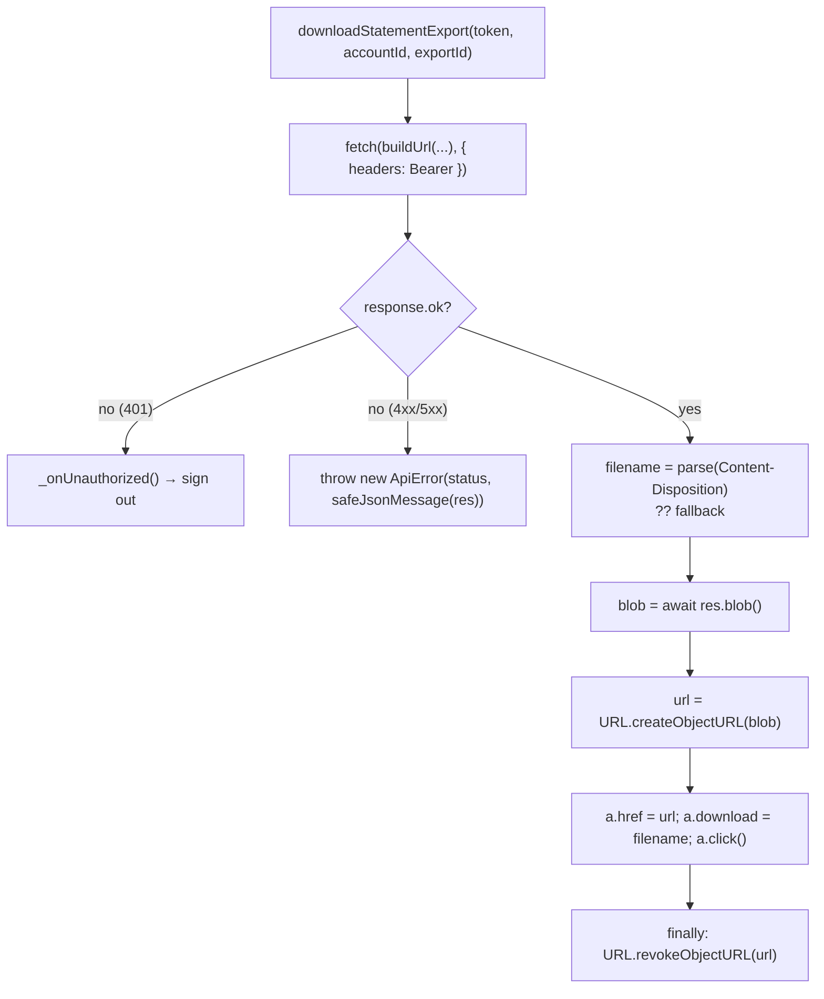

# Task 003 - Frontend Export API Client & Blob Download Plumbing

## Functional Requirements

Give the frontend the API surface the Statements tab (Task 004) needs — including the one genuinely
new capability this repo has never had: **downloading a file the server produced.**

- Add typed API functions for the five chaos export endpoints: create, get, list, cancel, download.
- Add **blob-capable fetch plumbing**: `lib/api.ts`'s `request()` always calls `response.text()` and
  never reads `Content-Disposition`, so it **cannot** return a file. A statement download needs a
  raw-`fetch` path that reads the body as a `Blob`, parses the server's filename, and saves it —
  while reusing the existing auth, error, and 401-sign-out behavior.
- Add the export TypeScript types mirroring the chaos DTOs (which, per
  [ADR-034](../../decisions/034-gateway-proxied-artifact-download.md), carry **no** `downloadUrl`).

## Acceptance Criteria

- [ ] `createStatementExport(token, accountId, { format, rangeType, from, to? })` issues
      `PUT /ledger/accounts/{accountId}/transaction-exports` with query params and resolves to
      `{ created: boolean; export: TransactionExport }` — `created` distinguishing the ledger's
      **201** (new) from **200** (joined the export already active for that window).
- [ ] `getStatementExport`, `listStatementExports` (with `status`/`format`/`page`/`pageSize`), and
      `cancelStatementExport` are typed and reuse the standard `request()` wrapper.
- [ ] `downloadStatementExport(token, accountId, exportId)` fetches the artifact, **reads the
      filename from the response's `Content-Disposition`**, and saves it via the
      Blob → `createObjectURL` → `<a download>` → `revokeObjectURL` idiom. It falls back to a
      sensible filename when the header is absent or unparseable.
- [ ] The download path reuses `buildUrl`, `safeJsonMessage`, `ApiError`, and the `_onUnauthorized`
      hook — a 401 during a download signs the operator out exactly as any other call does, and a
      non-2xx yields an `ApiError` with the backend's message (**not** a corrupt file saved to disk).
- [ ] The object URL is revoked in a `finally`, so a failed save cannot leak it.
- [ ] `TransactionExport` has **no** `downloadUrl` field — the type mirrors the backend DTO, so a
      presigned URL is not merely unused on the client, it is unrepresentable.
- [ ] `npm run typecheck` passes.

## Technical Design

Target: **TypeScript 5.8** / React 19 / react-query 5. No new dependencies (the repo has no PDF, CSV,
or date library, and this task adds none — the backend produces the bytes).

**The precedent to follow is `publishNTimes`** (`src/lib/api.ts`), which already hand-rolls a raw
`fetch` — with `Authorization`, `safeJsonMessage`, `_onUnauthorized?.()`, and `ApiError` — because it
needs something the shared `request()` wrapper cannot express (there, the raw status code). A blob
download is the same situation, so it gets the same treatment rather than a speculative
`responseType` option bolted onto `request()`.



The anchor/objectURL idiom already exists in `src/features/chaos/batch-upload-page.tsx`
(`downloadTemplate`) — but that builds a CSV **client-side**. This is the first time the frontend
saves bytes that came **from the server**, which is why `Content-Disposition` parsing is new ground.
Same-origin here (the chaos backend), so the `download` attribute is honored — precisely the property
[ADR-034](../../decisions/034-gateway-proxied-artifact-download.md) bought by refusing to hand the
browser a cross-origin S3 link.

## Implementation Notes

Modify `chaos-admin/src/lib/api.ts` (the repo's one flat module holding every DTO + API function —
follow that convention rather than introducing a feature-local api module):

```ts
export type ExportFormat = "CSV" | "PDF";
export type ExportRangeType = "DAILY" | "WEEKLY" | "MONTHLY" | "YEARLY" | "CUSTOM";
export type ExportStatus = "PENDING" | "IN_PROGRESS" | "COMPLETED" | "FAILED" | "CANCELLED";
export type ExportErrorCode = "GENERATION_FAILED" | "UPLOAD_FAILED" | "STALE";

export interface TransactionExport {
  id: string;
  accountId: string;
  status: ExportStatus;
  format: ExportFormat;
  rangeType: ExportRangeType;
  rangeFrom: string;
  rangeTo: string;
  downloadable: boolean;      // derived server-side; there is NO downloadUrl by design
  errorCode: ExportErrorCode | null;
  initiatedBy: string | null;
  initiatedAt: string;
  completedAt: string | null;
  cancelledAt: string | null;
  erroredAt: string | null;
  createdAt: string;
}
```

Functions to add (all under `/ledger/accounts/${accountId}/transaction-exports`):

- `createStatementExport(token, accountId, params)` — needs the **status code**, not just the body,
  to populate `created`. Like `publishNTimes`, use a raw `fetch` and read `res.status === 201`.
- `getStatementExport(token, accountId, exportId)` → `request<TransactionExport>(...)`.
- `listStatementExports(token, accountId, params)` → `request<PageResponse<TransactionExport>>(...)`
  — reuse the existing `PageResponse<T>` type (`items`/`page`/`perPage`/`total`).
- `cancelStatementExport(token, accountId, exportId)` →
  `request<TransactionExport>(..., { method: "DELETE" })`.
- `downloadStatementExport(token, accountId, exportId)` — the raw-fetch blob path above.

Filename parsing helper (module-private):

```ts
function filenameFromContentDisposition(header: string | null): string | null {
  if (!header) return null;
  const utf8 = /filename\*=UTF-8''([^;]+)/i.exec(header);
  if (utf8?.[1]) return decodeURIComponent(utf8[1]);
  const plain = /filename="?([^";]+)"?/i.exec(header);
  return plain?.[1] ?? null;
}
```

Traps:

- **Do not set `Content-Type` on the download request.** The shared `request()` sets it only when
  there's a body; the raw fetch must not add one either.
- `buildUrl`, `safeJsonMessage`, and `_onUnauthorized` are module-private in `api.ts` — which is
  exactly why these functions belong **in that file**, not in a feature folder.
- Date → instant conversion for `from`/`to` is the **caller's** job (Task 004), because the semantics
  are a UI decision (see Task 004's note on the exclusive `to`). Keep these functions dumb: they take
  ISO strings and forward them.
- Do **not** add a `responseType: "blob"` branch to the shared `request()` generic. It would make the
  return type a lie for every other call site (`Promise<T>` where `T` is silently a `Blob`), for one
  consumer. A dedicated function is honest.

## Non-Functional Requirements

- No new npm dependency. Bundle size impact ≈ nil.
- The blob is held in memory only for the moment between `res.blob()` and `revokeObjectURL` — bounded
  by the backend's `max-artifact-bytes` (50 MiB default), which is the real ceiling.
- **Security:** the `Authorization` header is attached to the download request like every other call;
  the artifact URL is same-origin, so no token or capability leaves the app's origin. There is no
  presigned URL on the client to leak
  ([ADR-034](../../decisions/034-gateway-proxied-artifact-download.md)).
- A failed download raises `ApiError` and saves **nothing** — the operator never ends up with a file
  containing a JSON error body, which is the classic bug in this shape of code.

## Dependencies

- **Tasks 001 + 002** — blocking. These functions call those endpoints and depend on the
  `Content-Disposition` header Task 002 sets.
- Existing `lib/api.ts` internals: `buildUrl`, `safeJsonMessage`, `ApiError`, `_onUnauthorized`,
  `PageResponse<T>`, `appConfig.apiBaseUrl`.

## Risks & Mitigations

- **Risk:** a non-2xx response is saved as a file (the operator opens `statement.pdf` and finds a JSON
  error). **Mitigation:** the `res.ok` check precedes `res.blob()` unconditionally; covered by the
  acceptance criteria.
- **Risk:** object-URL leak on a throw. **Mitigation:** `revokeObjectURL` in a `finally`.
- **Risk:** `Content-Disposition` parsing drifts from what the backend emits. **Mitigation:** the
  parser handles both the plain and RFC 5987 (`filename*=UTF-8''…`) forms and **falls back** to a
  locally-composed name — a header the client cannot parse degrades the filename, never the download.
- **Risk:** someone later "unifies" this into `request()` and breaks its typing.
  **Mitigation:** the rationale is stated in the code comment and in this task; the ADR is linked.

## Testing Strategy

**The frontend has no test runner and no linter** (`package.json` has `dev`, `build`, `preview`,
`typecheck` only). Adding a test framework is out of scope for this phase, so verification is:

- `npm run typecheck` — the primary automated gate; the types above make an absent `downloadUrl` a
  **compile-time** guarantee rather than a convention.
- Manual verification against a live ledger (recorded in the phase DESIGN's deployment steps):
  download a CSV and a PDF, confirm the saved filename matches the `Content-Disposition` the backend
  sent, confirm a PDF **saves** rather than opening in a tab, and confirm a forced 401 (expired token)
  signs the operator out instead of writing a broken file.
- The backend side of this contract **is** covered automatically (Task 002's header + log-capture +
  byte-identity tests), so the untested surface is confined to the browser save step.

## Deployment Strategy

Ships with the frontend bundle in the phase's deploy. Purely additive to `lib/api.ts`; no existing
call site changes behavior, no runtime config, no new dependency. Rollback is the previous bundle.
