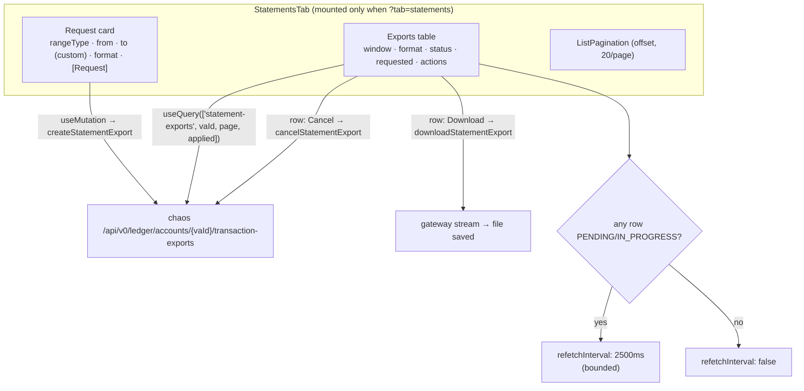

# Task 004 - Virtual Account "Statements" Tab

## Functional Requirements

Add a fifth tab — **Statements** — to the virtual-account detail page, beside Overview, Transactions,
Balance, and Reservations. It is the operator's whole interface to statement exports: request one,
watch it run, download it, cancel it, and see the account's export history.

- **Request form:** range type (`Daily`/`Weekly`/`Monthly`/`Yearly`/`Custom`), a `from` date, a `to`
  date (only for `Custom`), and a format (`CSV`/`PDF`). Submitting issues the `PUT`.
- **Feedback on submit:** a `201` toasts "Statement export queued"; a `200` toasts that an export for
  **the same window and format is already running** and the view has joined it (the ledger's
  idempotency window — [ADR-033](../../decisions/033-account-statements-via-ledger-export-proxy.md)).
- **Export table:** the account's exports, newest first, offset-paginated — window, format, status,
  requested-at, and per-row actions.
- **Live status:** while any export on the page is `PENDING`/`IN_PROGRESS`, poll the list so the row
  advances to `COMPLETED`/`FAILED` on its own. Toast when an export the operator is watching
  completes or fails. Polling is **bounded** — it stops rather than spinning forever.
- **Download:** a `COMPLETED` export downloads via the gateway (Task 003 → Task 002). No presigned
  URL is ever handled by the browser.
- **Cancel:** a `PENDING`/`IN_PROGRESS` export can be cancelled; a terminal one returns 409 and the
  UI says so rather than showing "not found".
- **Honest degradation:** when the connected ledger has no export API (404 on list) or the operator's
  token lacks the export authority (403), the tab says exactly that — it never renders an empty table
  that implies "no statements yet".

## Acceptance Criteria

- [ ] `Statements` appears as the fifth `TabsTrigger` on `virtual-account-detail-page.tsx`; the tab is
      URL-persisted (`?tab=statements`) by the existing `usePersistedTabs` hook, and its content does
      not mount — and therefore **does not poll** — while another tab is active (the custom `Tabs`
      returns `null` for inactive `TabsContent`).
- [ ] Submitting the form with `rangeType=MONTHLY` and a `from` date creates an export; the table
      shows it as `PENDING` without a manual refresh.
- [ ] A duplicate submit while that export is active shows the "already running" toast and creates
      **no** second row.
- [ ] `Custom` reveals the `to` input and requires it; every other range type hides it (the ledger
      derives the end from the calendar period containing `from`).
- [ ] A `PENDING` export transitions to `COMPLETED` in the table **without operator action**, and
      raises a success toast; a `FAILED` export shows its `errorCode` and raises a danger toast.
- [ ] Polling stops when no export on the page is active, and also stops after a bounded ceiling
      (see below) — the tab never polls indefinitely.
- [ ] `Download` on a `COMPLETED` row saves a file named `statement-<account>-<from>-<to>.<ext>`; a
      PDF **saves** rather than opening in a browser tab.
- [ ] `Cancel` on an active row flips it to `CANCELLED`; on a terminal row the 409 surfaces as a
      legible message, not a "not found".
- [ ] **403** renders a `StatePanel` explaining the missing `ledger_account_transactions:export::allow`
      authority — and, for a **SYSTEM** account, that statements there need a super-user token.
- [ ] **404 on list** (ledger without the export API) renders a `StatePanel`: statement exports are
      unavailable on the connected ledger.
- [ ] An export stuck `PENDING` past the poll ceiling shows an inline hint that the ledger's task
      worker may be disabled (`ledger.tasks.worker.enabled`) — the one failure mode that otherwise
      looks like nothing at all.
- [ ] `npm run typecheck` passes.

## Technical Design

Target: React 19, react-query 5, existing shadcn-ish primitives. **No new dependencies** — no date
library, no PDF library (the repo has neither, and this tab needs neither).

Component: `chaos-admin/src/features/virtual-accounts/statements-tab.tsx`, exporting
`StatementsTab({ vaId, accountCode })`. It follows the **`BalanceHistoryTab` / `ReservationsTab`**
shape — the two sibling tabs on the same page — for its query, pagination, and empty/error states, and
the **`trial-balance-page`** shape for its filter card.



**Polling.** react-query's `refetchInterval` as a **function of the data** — active rows → `2500`,
otherwise `false`. The ledger's own OpenAPI advises a poll interval of **≥ 2 s**, so 2.5 s respects
it. This is the same bounded-poll posture as
[Phase 017](../017-ledger-transaction-failure-events/DESIGN.md)'s
`use-transaction-failure-watch` — with the important difference that here the resource is a real
status the operator is entitled to poll, so it converges rather than guessing. A **ceiling** (e.g.
120 polls ≈ 5 minutes of continuous activity) stops the interval and surfaces the "worker may be
disabled" hint; the operator can always refetch manually.

**Toasts.** Reuse the global `sonner` `<Toaster/>` already mounted in `components/layout/app-shell`
(Phases 017–019). Track the previous poll's statuses and toast on the transition
`PENDING|IN_PROGRESS → COMPLETED` (success) or `→ FAILED` (danger). Toast only for exports created in
this session, so opening the tab on a page of old completed exports does not fire a burst of them.

**The `to` semantics.** The ledger's window is half-open `[from, to)`. The trial-balance page already
labels its `to` as **exclusive**; this tab does the same ("To (exclusive)") rather than inventing an
inclusive-end convention that would silently disagree with the neighbouring report page. Dates are
native `<Input type="date">` (this repo has no date picker and no date library) converted with the
existing `${date}T00:00:00.000Z` idiom.

## Implementation Notes

Files to create:

- `chaos-admin/src/features/virtual-accounts/statements-tab.tsx`

Files to modify:

- `chaos-admin/src/features/virtual-accounts/virtual-account-detail-page.tsx` — add the trigger and
  content:

  ```tsx
  <TabsTrigger value="statements">Statements</TabsTrigger>
  ...
  <TabsContent value="statements" className="flex-1 overflow-y-auto p-6 md:p-8">
    <StatementsTab vaId={vaId} accountCode={va?.accountCode ?? ledger?.accountCode} />
  </TabsContent>
  ```

  Use the **padded** `TabsContent` variant (as Balance/Reservations do), not the full-bleed variant
  the Transactions tab uses for its sticky filter bar.

Primitives to reuse (all already exist — check `src/components/ui` before writing anything new):

- `Card`/`CardContent` for the request form, `flex flex-wrap items-end gap-3 p-4` — the
  `trial-balance-page` filter-bar shape.
- `Select` for rangeType/format, `Input type="date"` for the dates, `Button` to submit.
- `TableContainer`/`Table`/`THead`/`TBody`/`TR`/`TH`/`TD` for the list; `EnumBadge` for status;
  `ListPagination` (offset, `PER_PAGE = 20`, `keepPreviousData`) exactly as `BalanceHistoryTab` uses it.
- `StatePanel` (empty/error, with `tone` + `icon` + `action`), `InlineNotice`, `TableLoadingRows` from
  `components/layout/state-panel.tsx`.
- `toast` from `sonner`; `formatDate`/`formatMoney` from `src/lib/utils.ts`.
- The `draft` → `applyFilters()` → `applied` state split used by every filterable view here.

Error handling: mirror the existing `getErrorMessage(err)` + `isLedgerProxyUnavailable(error)` helpers
that `trial-balance-page` / `virtual-account-detail-page` already carry, and branch on
`ApiError.status` for the 403 / 404 / 409 states the backend now propagates faithfully
([ADR-035](../../decisions/035-faithful-status-propagation-on-ledger-command-proxy.md)) — this tab is
the **reason** that ADR exists, so a generic "something went wrong" here would waste it.

Traps:

- Don't render a `downloadUrl` — there isn't one. The row's Download button calls the gateway
  ([ADR-034](../../decisions/034-gateway-proxied-artifact-download.md)); `downloadable` is the only
  signal, and it is server-derived.
- Don't clamp or pre-validate the window (366-day cap, `from < to`, `to` required for `CUSTOM`) beyond
  the `to`-is-required-for-custom form affordance. The ledger validates and now returns a **legible
  400** — duplicating its rules in the client is how the two drift apart.
- Invalidate the list query after create/cancel (`queryClient.invalidateQueries`), and reset to page 0
  on create so the operator sees the new row.

## Non-Functional Requirements

- Polling costs one list request per 2.5 s **only while an export is active and the tab is open** —
  the inactive-tab unmount (custom `Tabs` renders `null`) guarantees no background polling from the
  other four tabs, and the interval collapses to `false` the moment everything is terminal.
- No new bundle dependency.
- **Accessibility:** the request form is a real `<form>` with labelled controls; status is conveyed by
  text as well as badge colour; the download action is a `<button>`, not a bare anchor.
- **Security:** nothing sensitive is rendered — no presigned URL, no token. `initiatedBy` is a subject
  id, already shown elsewhere in this app.

## Dependencies

- **Task 003** — blocking (the API functions and types).
- **Tasks 001 + 002** — transitively blocking (the endpoints).
- Existing UI: `usePersistedTabs`, `ListPagination`, `StatePanel`, `EnumBadge`, `Select`, `Card`,
  `Table*`, the `sonner` `<Toaster/>` in `app-shell`.

## Risks & Mitigations

- **Risk:** an export stuck `PENDING` forever (the ledger's task worker is off by default —
  `ledger.tasks.worker.enabled=false`) reads to the operator as a broken chaos machine. This is the
  most likely support question the feature will generate. **Mitigation:** the bounded poll ceiling
  surfaces an explicit hint naming the ledger worker flag; the phase DESIGN lists it as a deployment
  prerequisite.
- **Risk:** a poll storm if the interval is left on after terminal states. **Mitigation:**
  `refetchInterval` is a function of the data and returns `false` when nothing is active; the ceiling
  is a second backstop.
- **Risk:** duplicate toasts across polls. **Mitigation:** toast on **status transitions** observed
  against the previous snapshot, for session-created exports only — not on every poll that sees a
  `COMPLETED` row.
- **Risk:** the operator exports a SYSTEM account (the entire chart of accounts) and gets an opaque
  403. **Mitigation:** the 403 `StatePanel` names the super-user requirement explicitly, because on a
  chaos machine SYSTEM accounts are *exactly* the ones an operator will try first.

## Testing Strategy

The frontend has **no test runner** (see Task 003), so:

- `npm run typecheck` is the automated gate.
- Manual scenarios, run against a live export-capable ledger and recorded in the phase DESIGN's
  verification step: create → poll → complete → download (CSV **and** PDF); duplicate submit → 200
  toast, no second row; cancel a `PENDING` export; cancel a terminal export → 409 message; a token
  without the export authority → 403 panel; a SYSTEM account → 403 panel with the super-user copy; a
  ledger without the export API → 404 panel; the worker disabled → `PENDING` + the worker hint.
- The **backend** halves of each of those paths are covered by the automated tests in Tasks 001/002,
  so what is manually verified here is strictly the rendering and the browser save.

## Deployment Strategy

Ships in the frontend bundle with the phase. Additive: one tab on one page, no route, no nav change,
no runtime config. If the connected ledger lacks the export API the tab still renders and explains
itself, so the frontend can safely ship **ahead of** the ledger's merge — which is likely, given the
export API is still on an unmerged branch. Rollback is the previous bundle.
