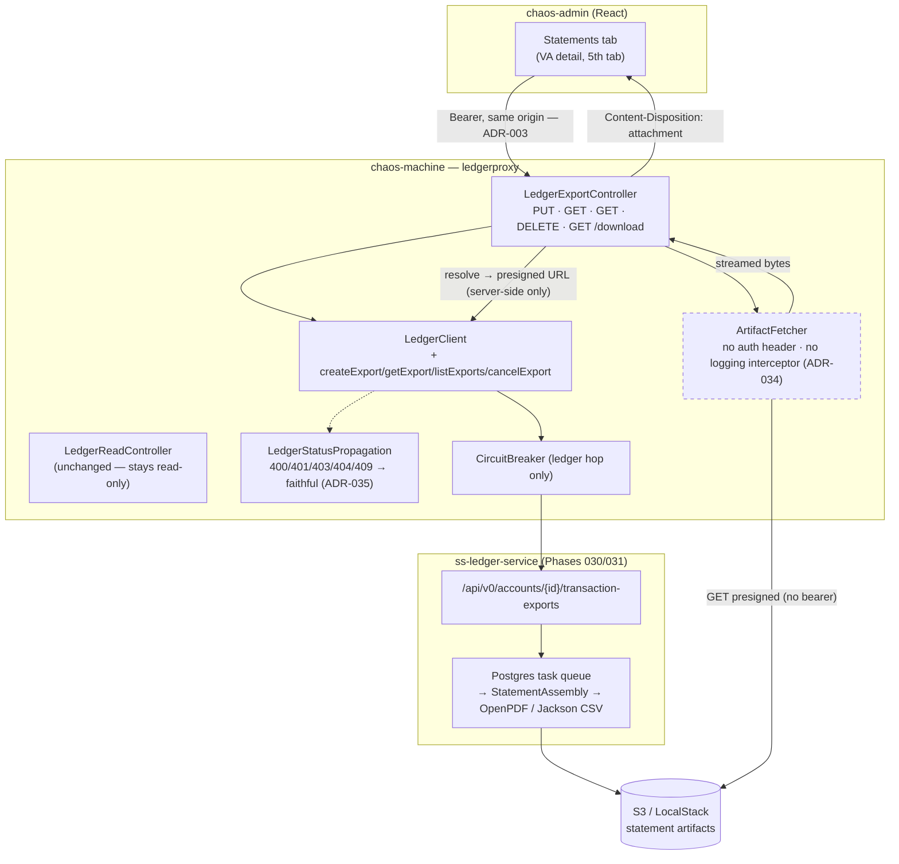

# Phase 022 - Account Statement Downloads

## Summary

Gives the chaos operator **downloadable account statements** (CSV / PDF) for any virtual account over
a date range — by proxying the ledger's own statement-export API, not by building one.

Idea source: [`.spec/ideas/010_account_statements.md`](../../ideas/010_account_statements.md) (an
empty file — requirements were settled directly with the user and are recorded here).

The decisive finding: **`ss-ledger-service` already implements account statement exports** (its
Phases 030 / 031, branch `feature/account-statement-exports`). A `PUT` creates an export job; a
Postgres-backed task queue renders the statement (OpenPDF / Jackson CSV) from the journal history and
stream-uploads it to S3; a `GET` returns the status and a freshly-presigned 15-minute download URL;
`DELETE` cancels. So the chaos machine **renders nothing, stores nothing, and adds no dependency** —
it is the gateway that lets its UI reach that capability
([ADR-033](../../decisions/033-account-statements-via-ledger-export-proxy.md)), exactly as
[ADR-015](../../decisions/015-trial-balance-via-ledger-read-proxy.md) did for the trial balance.

Two things make it more than a copy of the trial-balance proxy:

1. It is the proxy's **first command surface** (`PUT`/`DELETE`), so it gets its own controller and —
   because the ledger's 400/401/403/404/409 all mean different things here — **faithful status
   propagation** instead of the existing collapse-every-4xx-to-404
   ([ADR-035](../../decisions/035-faithful-status-propagation-on-ledger-command-proxy.md)).
2. The artifact **streams through the gateway**: the chaos backend fetches the object from S3 itself
   and serves it with `Content-Disposition: attachment`, so the presigned URL — an unauthenticated
   bearer capability — never reaches the browser
   ([ADR-034](../../decisions/034-gateway-proxied-artifact-download.md)).

Target runtime: **Java 25** / Spring Boot 4.0.6 (unchanged) · React 19 / Vite 6 (unchanged). **No new
backend or frontend dependency. No Flyway migration. No Kafka. No new table.**

## Motivation

The chaos machine can drive the ledger with hostile traffic and observe the consequences four ways
(failures, balances, reservations, dead letters — Phases 017–020). What it cannot do is answer the
question an operator asks *after* a run: **"show me what actually landed on this account, as a
document."**

The ledger can. Its export path is also, itself, a surface worth exercising: asking for a statement
over the window a chaos run just polluted drives the ledger's journal reads, its
balance-brought-forward witnesses, its renderers, its task queue, and its S3 upload — with exactly
the traffic the harness injected. Building a *second*, chaos-owned statement renderer would not only
duplicate that work, it would risk producing statements that quietly disagree with the ledger's —
the one class of bug a ledger test harness must never introduce.

## User-Facing Changes

**A new "Statements" tab** on the virtual-account detail page (fifth, beside Overview / Transactions /
Balance / Reservations):

- Request an export: range type (`Daily`/`Weekly`/`Monthly`/`Yearly`/`Custom`), `from`, `to` (custom
  only, **exclusive** — matching the trial-balance page's convention), format (`CSV`/`PDF`).
- A table of that account's exports, newest first, offset-paginated, with live status while any is
  running (bounded 2.5 s poll, respecting the ledger's ≥ 2 s guidance), and toasts on completion or
  failure.
- **Download** a completed export (the file saves with a real name — `statement-<account>-<from>-<to>.pdf`).
- **Cancel** a pending or in-progress export.

**Five new backend routes** under the existing proxy prefix, all bearer-authenticated by the existing
catch-all:

| Method | Path | Purpose |
|---|---|---|
| `PUT` | `/api/v0/ledger/accounts/{accountId}/transaction-exports?format=&rangeType=&from=&to=` | Create — **201**, or **200** joining the export already active for that window+format |
| `GET` | `/api/v0/ledger/accounts/{accountId}/transaction-exports/{exportId}` | Poll status |
| `GET` | `/api/v0/ledger/accounts/{accountId}/transaction-exports` | List (`status`/`format` filters, offset-paged) |
| `DELETE` | `/api/v0/ledger/accounts/{accountId}/transaction-exports/{exportId}` | Cancel (**409** once terminal) |
| `GET` | `/api/v0/ledger/accounts/{accountId}/transaction-exports/{exportId}/download` | **Chaos-only** — streams the artifact with `Content-Disposition: attachment` |

**Operator-facing:** one new config block, `chaos.statements.*` (artifact fetch timeouts and a
maximum artifact size). Nothing else changes.

**Not exposed, deliberately:** `downloadUrl` / `downloadUrlExpiresAt`. The chaos DTO has no such
field ([ADR-034](../../decisions/034-gateway-proxied-artifact-download.md)).

## Architecture Impact

No new package, table, migration, consumer, or event. The whole backend delta lives inside
`ledgerproxy`.



Key decisions:

| ADR | Decision |
|---|---|
| **030 (NEW)** | Statements are a **proxy over the ledger's export API**. The chaos machine renders nothing, persists nothing, adds no PDF/CSV dependency. Full parity (create/poll/list/cancel) in `ledgerproxy`, in a **new `LedgerExportController`** (the proxy's first commands — `LedgerReadController` stays read-only). |
| **031 (NEW)** | The artifact **streams through the gateway**; the presigned S3 URL never crosses the chaos API boundary, is never logged, and is structurally absent from the API DTO. Upholds [ADR-003](../../decisions/003-backend-as-single-api-gateway.md); costs bytes-through-the-gateway, which is right for a single-operator harness. |
| **032 (NEW)** | **Faithful status propagation** on the export methods — 400/401/403/404/409 keep their meaning, with the ledger's message. Scoped to the new methods; the existing read methods keep their documented collapse-to-404 behavior (a retrofit is a follow-up, not this phase). |
| 003 | The UI talks **only** to the chaos backend — the reason ADR-034 exists. |
| 015 | The precedent this phase follows: a ledger capability reached through a thin read-proxy, no new package, no persistence. |

**What this phase does *not* touch:** Kafka (in or out), the flow engine, the batch runner, any
projection, any table. It is the first feature since Phase 012 with **zero** persistence footprint.

## Edge Cases

- **The ledger's task worker is disabled** (`ledger.tasks.worker.enabled=false` — its default). The
  `PUT` succeeds and the export sits `PENDING` **forever**: no error, no timeout, no failure event.
  This is the single most confusing failure mode in the phase. The tab's bounded poll ceiling
  surfaces an explicit hint naming the flag, and it is a deployment prerequisite below.
- **The connected ledger has no export API at all** (the API is on an unmerged branch). Every call
  404s; the tab renders a "statement exports are unavailable on the connected ledger" panel rather
  than an empty table implying "no statements yet".
- **SYSTEM accounts.** The entire chart of accounts (`PLATFORM_FLOAT`, `SETTLEMENT_ACCOUNT`, …) is
  SYSTEM-owned, and the ledger's org-scope seam resolves SYSTEM accounts to **super-user only**. An
  org-scoped operator token gets a **403** on exactly the accounts a chaos operator reaches for first.
  Nothing the chaos machine can fix — it names the requirement in the 403 panel.
- **Missing export authority.** The token must carry `ledger_account_transactions:export::allow` (or
  `*:*::allow`). Chaos forwards the token; it cannot grant the authority. 403, named explicitly.
- **Duplicate request.** A repeat `PUT` for the same resolved window + format while an export is
  active returns **200 with the existing export** (the ledger's idempotency window). The UI toasts
  "already running" and creates no second row. A `DAILY` request and a `CUSTOM` request naming the
  same day dedupe **identically** — the ledger keys on the *resolved* window.
- **Cancel races.** Cancel-after-complete is a **409**, not a silent no-op; the row is visibly
  terminal, so a "not found" here would be a lie (this is a founding example for
  [ADR-035](../../decisions/035-faithful-status-propagation-on-ledger-command-proxy.md)).
- **Download of a non-`COMPLETED` export** → **409**, naming the actual status. There is no artifact.
- **Presigned URL expiry** is a non-issue: the URL is minted **fresh on every download** and never
  cached or persisted. A transfer that somehow outlives its TTL fails as a 502 and the operator
  retries cleanly.
- **S3 unreachable from the chaos backend.** Create/poll/list/cancel keep working; only `/download`
  fails, with a **502** that blames the artifact store rather than the ledger. It does **not** trip
  the ledger circuit breaker (a different dependency — deliberate blast-radius containment).
- **Oversized artifact** (> `chaos.statements.max-artifact-bytes`, default 50 MiB) → 502, stream
  abandoned, never buffered whole.
- **Empty window** — a well-formed empty statement (CSV header only / PDF "no activity"). The ledger's
  behavior; nothing special here.
- **Window > 366 days / `from >= to` / missing `to` on `CUSTOM`** → the ledger's **400**, with its
  field-level message now reaching the operator intact. Chaos re-validates none of it
  ([ADR-033](../../decisions/033-account-statements-via-ledger-export-proxy.md)).

## Testing Strategy

Backend carries the weight, because the frontend has no test runner (`package.json` has `dev`,
`build`, `preview`, `typecheck` only — adding one is out of scope).

- **Unit (JUnit 5 + AssertJ + Mockito):** DTO mapping (`downloadable` derived; **no URL field
  exists**); the full status-propagation matrix incl. malformed error bodies; filename derivation and
  **sanitization** (the response-header-injection surface); `ArtifactFetcher` size bound and
  no-`Authorization`-header guarantee.
- **Web (`@WebMvcTest` + `@MockitoBean LedgerClient`, the codebase's standard controller-test shape):**
  201-vs-200 on create; 409 on cancel-terminal and on download-not-completed; 403/404 pass-through;
  circuit-breaker-open behavior; and a **serialization assertion that `downloadUrl` never appears in
  any response JSON**.
- **Log-capture test** (the ADR-034 rule asserted, not assumed): a full download plus every failure
  path emits **no** log line containing the presigned URL's host, path, or signature.
- **Integration** (`src/integration-test`, `MockRestServiceServer` / stub servers — no Testcontainers
  needed, there is no Kafka or DB in this phase): stub ledger + stub artifact store → end-to-end
  `/download` returns **byte-identical** content with the right headers, streamed rather than buffered.
- **Frontend:** `npm run typecheck` (which makes the absent `downloadUrl` a *compile-time*
  guarantee), plus the manual matrix in the verification step below.
- **Coverage:** the new `ledgerproxy` service-ish classes (`LedgerStatusPropagation`,
  `ArtifactFetcher`, `StatementFilenameFactory`) are the gated ones; controllers and DTOs fall under
  the existing excludes.

## Deployment Strategy

Strictly additive: five routes, one config block, no migration, no table, no Kafka topic, no new
dependency, and **no behavior change to any existing endpoint** (the status-propagation change is
scoped to the new methods).

**Prerequisites — this is the phase's real risk, and none of it is under the chaos machine's control:**

1. **The ledger must run a build that has the export API.** It is currently on the **unmerged**
   `feature/account-statement-exports` branch. Until that merges and deploys, every statement call
   404s and the tab says so.
2. **`ledger.tasks.worker.enabled=true`** on that ledger — otherwise exports queue as `PENDING`
   forever (the ledger's own release checklist calls this out; it is off by default).
3. **The ledger's `aws.s3.*` configuration must be live** (bucket + credentials + the
   `AbortIncompleteMultipartUpload` lifecycle rule), and its S3/LocalStack endpoint must be reachable
   **from the chaos backend** (not from the browser — that is the point of
   [ADR-034](../../decisions/034-gateway-proxied-artifact-download.md)).
4. **The operator's token must carry `ledger_account_transactions:export::allow`** — and
   **`*:*::allow`** if statements on SYSTEM accounts (the chart of accounts) are wanted.

**Rollout.** The frontend and backend can ship **ahead of** the ledger's merge — both degrade
honestly (404 → "unavailable on the connected ledger"), so there is no ordering constraint and no
feature flag. A flag nobody flips is not a safety mechanism; explicit degradation is.

**Verify** (against an export-capable ledger): request a CSV and a PDF over a window a chaos run just
polluted; watch `PENDING → IN_PROGRESS → COMPLETED` without touching anything; download both and open
them; submit a duplicate and confirm the 200/"already running" toast and no second row; cancel a
pending export; cancel a terminal one and confirm a **409**, not a 404; try a SYSTEM account with an
org-scoped token and confirm the 403 panel names the super-user requirement.

**Rollback:** redeploy the previous build. Nothing persists — no rows, no files, no topics.

## Tasks

| # | Task | Outcome |
|---|---|---|
| 001 | [Ledger export command proxy](./001-ledger-export-command-proxy.md) | `LedgerExportController` + `LedgerClient` methods + the two-DTO split + `LedgerStatusPropagation`. The four ledger endpoints at full parity. |
| 002 | [Artifact download proxy](./002-artifact-download-proxy.md) | `GET …/{exportId}/download` — server-side S3 fetch, streamed, `Content-Disposition: attachment`, presigned URL never logged or leaked. |
| 003 | [Frontend export API client](./003-frontend-export-api-client.md) | Typed export API functions + the repo's **first blob/`Content-Disposition` download path** in `lib/api.ts`. |
| 004 | [Virtual account Statements tab](./004-virtual-account-statements-tab.md) | The fifth VA-detail tab: request form, live-polling export table, download, cancel, honest 403/404 states. |

## Parallel Tasks

The dependency chain is a straight line with one fork:

```
001 ──┬── 002 ──┐
      │         ├── 003 ── 004
      └─────────┘
```

- **001 blocks everything.** It defines the DTOs (`LedgerTransactionExportDto` carrying the URL;
  `TransactionExportResponse` structurally without it), the client methods, the controller, and the
  status-propagation helper.
- **002 depends on 001** (it needs `getExport` and the URL-carrying internal DTO).
- **003 depends on 001 + 002** — its download function depends on the `Content-Disposition` header
  Task 002 emits.
- **004 depends on 003.**

Useful overlap: **003's types and non-download API functions can be written against 001 alone**, in
parallel with 002 — only `downloadStatementExport` needs 002 finished. A backend engineer on 001 → 002
and a frontend engineer starting 003's types right behind 001 is the natural two-track split.
