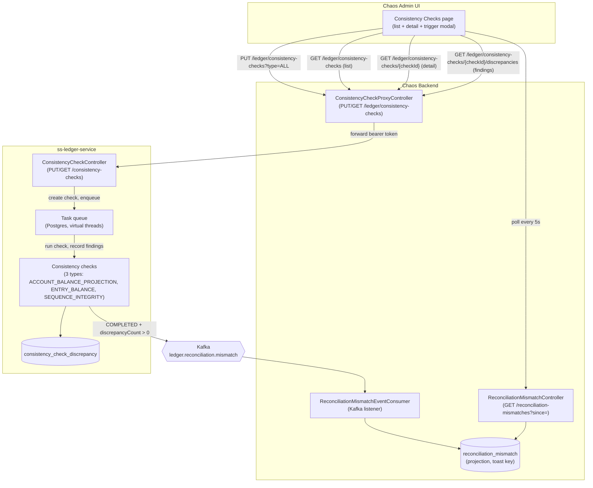

# Phase 023 - Consistency Checks

## Summary

Surfaces the ledger's **internal consistency-check API** through the chaos machine gateway so
operators can trigger checks on demand, inspect findings, and be immediately notified when a check
detects integrity violations — by proxying the ledger's four-endpoint consistency-check surface and
consuming the `ledger.reconciliation.mismatch` Kafka event for instant toast feedback, following the
exact pattern that Phases 015 (trial balance), 022 (statement exports), and 021 (journal entries)
established.

Idea source: [`.spec/ideas/017_consistency_checks.md`](../../ideas/017_consistency_checks.md).

The ledger owns consistency checks across its reporting Phase (under development): three invariant
controls (**ACCOUNT_BALANCE_PROJECTION**, **ENTRY_BALANCE**, **SEQUENCE_INTEGRITY**) that verify
ledger integrity, executed asynchronously on a Postgres-backed task queue, with findings persisted to
`consistency_check_discrepancy`. The chaos machine **owns no check logic, stores no findings, and
computes no invariants** — it is a thin proxy + event projection
([ADR-036](../../decisions/036-consistency-checks-via-ledger-proxy.md)), exactly as
[ADR-033](../../decisions/033-account-statements-via-ledger-export-proxy.md) did for statement
exports.

The chaos use case is straightforward: **"Run a check after this hostile scenario and show me what
broke."** The operator triggers all checks (`PUT /ledger/consistency-checks?type=ALL`) immediately
after a high-volume chaos run, and the UI toasts within seconds if the ledger's balance projections,
entry sums, or sequence numbers are now corrupt. The check API is also, itself, a surface worth
exercising — asking the ledger to verify integrity after the harness has filled its journals with
deliberately hostile traffic drives the ledger's task queue, invariant verifiers, and discrepancy
recorders with exactly the pollution the harness injected.

Target runtime: **Java 25** / Spring Boot 4.0.6 (unchanged) · React 19 / Vite 6 (unchanged). **No
new backend dependency. One Flyway migration (the `reconciliation_mismatch` projection table). No
new Kafka producer; one new consumer.**

## Motivation

The chaos machine can pollute the ledger four ways (hostile events, lifecycle failures, batch
fan-outs, CSV injections) and observe the consequences three ways (failures, balances, dead letters —
Phases 017–020). What it cannot do is answer the deeper question an operator asks after a run:
**"Did the ledger's internal state stay consistent, or did I break its invariants?"**

The ledger can. Its consistency checks are the authoritative answer to that question. Building a
second, chaos-owned verifier would not only duplicate the ledger's own logic, it would risk producing
findings that quietly disagree with the ledger's — the one class of bug a ledger test harness must
never introduce. Proxying the ledger's API instead means the chaos machine surfaces the truth the
ledger already knows, with zero risk of drift.

The mismatch event (`ledger.reconciliation.mismatch`) is the trigger that wakes the operator: when a
check completes with findings, the chaos UI toasts immediately rather than relying on client-side
poll. The event is not displayed directly — it is a projection key that prompts a fetch of the full
check detail via the proxy.

## User-Facing Changes

**A new "Consistency Checks" nav item** in the Ledger nav group (after *Transactions* and *Trial
Balance*), pointing to `/ledger/consistency-checks`. The page is a **list + detail** layout,
following the exact pattern of Phase 020 (DLQ), Phase 019 (Reservations), and Phase 022 (Statements):

- **List view**: All checks, paged (newest-first), with optional filters for **type**, **status**,
  **initiator type**. A **"Trigger Check"** button opens a modal; the operator selects a type (ALL /
  ACCOUNT_BALANCE_PROJECTION / ENTRY_BALANCE / SEQUENCE_INTEGRITY) and triggers
  `PUT /api/v0/ledger/consistency-checks?type={type}`. Three rows appear (one per check type when
  `type=ALL`), each initially `PENDING`. The UI polls `GET /api/v0/reconciliation-mismatches` every
  5s and toasts immediately when a check completes with findings.
- **Detail view**: Single check metadata (type, status, initiatorType, initiatedBy, asOf,
  initiatedAt, completedAt, errorCode, discrepancyCount) in a card, plus a **"Discrepancies"** tab
  that pages findings via `GET /api/v0/ledger/consistency-checks/{checkId}/discrepancies?code=`.
  Each discrepancy row shows: code, accountId (clickable → VA detail if present), entryId (display
  only), detectedAt, details (expandable JSON panel).
- **Toast on mismatch**: When the mismatch event is consumed, the UI toasts **"Consistency check
  {type} found {discrepancyCount} issue(s)"** (red, clickable → detail). The toast is immediate (no
  poll lag) and dismissible.
- **Degraded states**: When the ledger returns **404**, a dismissible banner says "Consistency checks
  are unavailable on the connected ledger." When **503** (circuit breaker open), a banner says
  "Ledger is temporarily unavailable (under load)." When a check is `PENDING` for > 30s, a warning
  badge says "Task worker may not be running."

**New API:** Four proxied endpoints (`PUT/GET /ledger/consistency-checks`, `GET /{checkId}`, `GET
/{checkId}/discrepancies`) + one chaos-native endpoint (`GET /reconciliation-mismatches?since=`).

## Architecture Impact

No new domain logic, no local check computation, **one new table, one new consumer, no producer**. The
changes are: (1) a thin proxy controller that forwards four ledger endpoints; (2) a Kafka consumer
that projects `ledger.reconciliation.mismatch` events to a local `reconciliation_mismatch` table for
toast notification; (3) a polling endpoint that the UI calls every 5s to fetch newly consumed
mismatches; (4) a frontend page that triggers checks, lists checks, and pages findings.

**Proxy pattern (ADR-036).** The four ledger endpoints are proxied at full parity:
`PUT /ledger/consistency-checks?type=` triggers, `GET /ledger/consistency-checks?type=&status=&initiatorType=` lists,
`GET /ledger/consistency-checks/{checkId}` retrieves a single check, `GET /ledger/consistency-checks/{checkId}/discrepancies?code=` pages findings. All four forward the operator's bearer token; all four faithfully propagate ledger HTTP statuses (200/201/400/401/403/404/503); none validate or recompute anything locally. The proxy is the chaos machine's sixth ledger-proxy domain (after accounts, transactions, balances, exports, journal entries).

**Event projection (new consumer).** `ReconciliationMismatchEventConsumer` is the chaos machine's
**fifth ledger-outbound consumer** (after `ledger.account.created`, `ledger.transaction.failed`,
`ledger.balance.updated`, `ledger.reservation.{created,released}`). It projects
`ledger.reconciliation.mismatch` events to a local `reconciliation_mismatch` table (UUID id, UUID
checkId UNIQUE, type, initiatorType, asOf, initiatedAt, completedAt, discrepancyCount,
consumedAt). The table is **append-only, toast-notification only** — it is not a full check history
(the ledger owns that). The consumer is at-least-once; replayed events are deduplicated by the
`check_id UNIQUE` constraint (SQLite `INSERT OR IGNORE`).

**Polling endpoint (new).** `GET /api/v0/reconciliation-mismatches?since={timestamp}` returns rows
from the projection table where `consumed_at > since`, paged, ordered ascending. The UI polls every
5s when the consistency checks page is open or within 60s of triggering a check. Each polled mismatch
is toasted once; the `nextSince` cursor ensures no duplicate toasts.

## Edge Cases

- **Ledger does not have the consistency-check API** (currently under development). All four proxy
  calls 404; the UI shows a dismissible banner "Consistency checks are unavailable on the connected
  ledger." No crash, no confusion.
- **Ledger's task worker is disabled** (`ledger.tasks.worker.enabled=false`, the default). A
  triggered check sits `PENDING` forever (no error, no timeout). The UI shows a warning after 30s:
  "Task worker may not be running. [Help]".
- **Circuit breaker open** (ledger is under load). All proxy calls return **503**; the UI shows a
  dismissible banner "Ledger is temporarily unavailable (under load)." The operator can retry in a
  few moments.
- **Ledger reset** (DB wipe, schema drop). The chaos `reconciliation_mismatch` table still has rows,
  but the ledger's check table is empty. When the UI fetches check detail via the proxy and gets
  **404**, it shows "Check not found (ledger may have been reset)". No cleanup job is implemented in
  this phase; the operator can manually `DELETE FROM reconciliation_mismatch` if needed.
- **Check completes with zero findings** (`COMPLETED`, `discrepancyCount = 0`). No event is
  published; the check stays in the list with a green badge and "0 discrepancies". The Discrepancies
  tab is disabled (no findings to page).
- **Check fails** (`FAILED`, `errorCode` present). No event is published; the check stays in the list
  with a red badge and the error code. The Discrepancies tab is disabled (no findings).
- **Mismatch event arrives but UI is not polling** (page is closed). The event is projected to the
  table; the next time the operator opens the page and polling starts, the toast appears (up to 5s
  lag). If the operator never opens the page, the toast never appears, but the check is still visible
  in the list.

## Testing Strategy

**Unit tests (backend):**
- `ConsistencyCheckProxyControllerTest`: Mock `LedgerClient`, verify each handler calls the correct
  client method with the correct parameters, verify DTO mapping, verify circuit-breaker-open path
  returns **503**.
- `ReconciliationMismatchEventConsumerTest`: Mock `ReconciliationMismatchRepository`, create a valid
  `EventEnvelope<ReconciliationMismatchEventData>`, call `consume()`, verify the repository's `save`
  method was called with the correct entity.
- `ReconciliationMismatchServiceTest`: Mock `ReconciliationMismatchRepository`, create a page of
  entities, call `pollMismatches(since, size)`, verify the returned `PageResponse` has the correct
  items, verify `nextSince` is the last row's `consumedAt`.

**Integration tests (backend):**
- `LedgerClientConsistencyCheckIntegrationTest`: Use `MockRestServiceServer` to stub the ledger's
  four endpoints, verify `LedgerClient` sends the correct HTTP requests (method, path, query params,
  Authorization header), verify response mapping, verify 404/400/401/403 propagation, verify
  circuit-breaker trip on repeated 5xx.
- `ReconciliationMismatchEventConsumerIntegrationTest` (Testcontainers Kafka): Publish a
  `ledger.reconciliation.mismatch` event to the topic, verify the consumer projects it to the
  `reconciliation_mismatch` table, verify replay deduplication (publish the same event twice, verify
  only one row).
- `ReconciliationMismatchControllerIntegrationTest` (Spring Boot Test, in-memory SQLite): Insert 3
  rows with `consumedAt = T1, T2, T3`, call `GET /reconciliation-mismatches?since=T0`, verify 3 rows
  returned, call `GET ?since={nextSince}`, verify 0 rows returned (no new rows).

**Integration tests (frontend):**
- `consistency-checks-page.test.tsx`: Mock `useConsistencyChecks`, verify table renders 20 rows,
  verify filter dropdowns change query params, verify "Trigger Check" button opens modal.
- `consistency-check-detail-page.test.tsx`: Mock `useConsistencyCheck`, verify metadata card shows
  all fields, verify Discrepancies tab is disabled when `discrepancyCount === 0`, verify PENDING
  warning appears when `status === "PENDING"` and `(now - initiatedAt) > 30s`.

**Manual verification:**
- Deploy against a ledger that has the consistency-check API (branch to be determined).
- Trigger a check via `PUT /ledger/consistency-checks?type=ALL`, verify **201** response with three
  check ids (one per type).
- Verify the ledger's task worker is running, wait for the checks to complete, verify statuses update
  to `COMPLETED` or `FAILED`.
- If a check finds a mismatch, verify the mismatch event is consumed, verify a toast appears in the
  UI, verify the toast is clickable and navigates to the detail page.
- Deploy against a ledger without the API, verify all four endpoints return **404**, verify UI shows
  "not available".
- Stop the ledger, verify circuit breaker opens after repeated failures, verify **503** on next call,
  verify circuit recovers after ledger restarts.
- Trigger a check with the ledger's task worker disabled, verify the check stays `PENDING` forever,
  verify the warning appears after 30s.

## Deployment Strategy

**Backend:** Deploy Flyway migration (`V023__create_reconciliation_mismatch_table.sql`) first.
Deploy backend with the new proxy controller, consumer, and polling endpoint. Verify the consumer is
registered in Spring's Kafka listener registry (log line: `partitions assigned`). Verify the four
proxy endpoints are visible in Swagger UI under a new "Consistency Checks (Ledger Proxy)" tag.

**Frontend:** Deploy the new page + nav item. Verify the nav item appears in the Ledger group. Verify
the list page loads. Verify the "Trigger Check" button works (against a ledger with the API). Verify
the toast appears when a mismatch is consumed.

**Order:** Backend first, then frontend (frontend cannot function without the backend endpoints).

**Rollback:** If the frontend breaks, roll back frontend only. The backend is passive (no side
effects beyond projection). If the backend breaks, roll back backend + frontend together (the
frontend depends on all four proxy endpoints).

## Tasks

All tasks are **independent within their layer** (backend or frontend), but frontend (Task 004)
depends on backend (Tasks 001–003).

1. **Task 001 - Ledger consistency check proxy (backend client & controller).** Create
   `ConsistencyCheckProxyController`, extend `LedgerClient` with four new methods (trigger, list,
   get, list discrepancies), map ledger DTOs to chaos DTOs, forward bearer token, propagate statuses
   faithfully, guard with circuit breaker.
2. **Task 002 - Reconciliation mismatch event consumer (Kafka projection).** Create
   `ReconciliationMismatchEventConsumer`, create `ReconciliationMismatch` entity +
   `ReconciliationMismatchRepository`, add Flyway migration (`V023__`), consume
   `ledger.reconciliation.mismatch` events, project to `reconciliation_mismatch` table, deduplicate
   via `INSERT OR IGNORE`.
3. **Task 003 - Reconciliation mismatch polling endpoint (backend API for UI toasts).** Create
   `ReconciliationMismatchController` with `GET /reconciliation-mismatches?since=` endpoint, create
   `ReconciliationMismatchService`, add `findAllByConsumedAtAfter` query to repository, return
   `PageResponse<ReconciliationMismatchDto>` with `nextSince` cursor.
4. **Task 004 - Consistency checks UI (frontend list, detail, and trigger).** Add "Consistency Checks"
   nav item to Ledger group, create `consistency-checks-page.tsx` (list + filters + trigger modal),
   create `consistency-check-detail-page.tsx` (detail + discrepancies tab), create mismatch poller
   hook, toast on mismatch, handle 404/503 gracefully, show PENDING warning.

## Parallel Tasks

None. All tasks are sequential: Task 001 (proxy) → Task 002 (consumer) → Task 003 (polling) → Task
004 (frontend). Task 002 and Task 003 can technically run in parallel (they are independent backend
features), but Task 003 is small enough that parallelizing adds no value.
